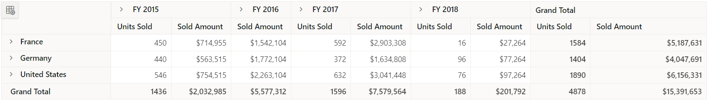

# How to Hide Specific Columns in ASP.NET MVC Pivot Table

By using the [`ColumnRender`](https://help.syncfusion.com/cr/aspnetmvc-js2/Syncfusion.EJ2.PivotView.PivotViewGridSettings.html#Syncfusion_EJ2_PivotView_PivotViewGridSettings_ColumnRender)event in the [`PivotViewGridSettings`](https://help.syncfusion.com/cr/aspnetmvc-js2/Syncfusion.EJ2.PivotView.PivotViewGridSettings.html), you can hide specific column(s) in the pivot table. In the example below, the **"Units Sold"** column under **"FY 2016"** is hidden by setting its **visible** property to **false** via the [`ColumnRender`](https://help.syncfusion.com/cr/aspnetmvc-js2/Syncfusion.EJ2.PivotView.PivotViewGridSettings.html#Syncfusion_EJ2_PivotView_PivotViewGridSettings_ColumnRender)event.

N> The **dot(.)** character in **FY 2016.Units Sold** is used by default to identify the header levels in the pivot table's row and column. It can be changed by setting the [`HeaderDelimiter`](https://help.syncfusion.com/cr/aspnetmvc-js2/Syncfusion.EJ2.PivotView.PivotViewValueSortSettings.html#Syncfusion_EJ2_PivotView_PivotViewValueSortSettings_HeaderDelimiter) in the [`PivotViewValueSortSettings`](https://help.syncfusion.com/cr/aspnetmvc-js2/Syncfusion.EJ2.PivotView.PivotViewValueSortSettings.html) property to any other delimiter instead of the default separator.










