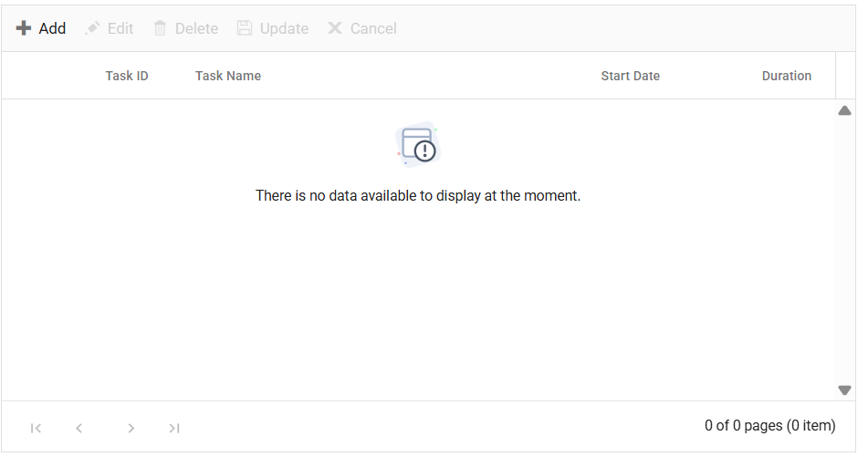

# Empty Record Template in ASP.NET MVC TreeGrid

The empty record template feature in the TreeGrid allows you to use custom content such as images, text, or other components, when the TreeGrid doesn't contain any records to display. This feature replaces the default message of **No records to display** typically shown in the TreeGrid.

To activate this feature, set the `EmptyRecordTemplate` property of the TreeGrid. The `EmptyRecordTemplate` property expects the HTML element or a function that returns the HTML element.

In the following example, an image and text have been rendered as a template to indicate that the TreeGrid has no data to display.










