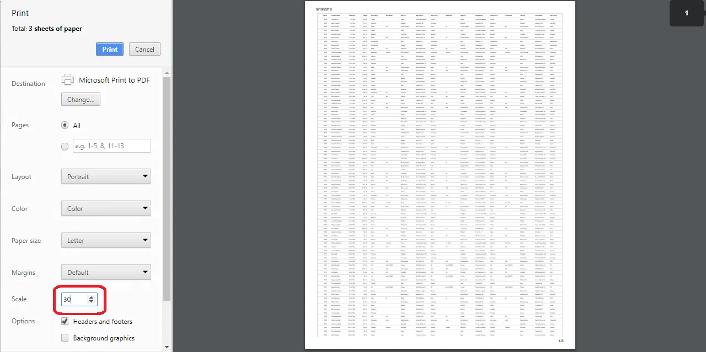

<!-- markdownlint-disable MD033 -->

# Print in Blazor Data Grid

The **Print** feature in the [Blazor Data Grid](https://www.syncfusion.com/blazor-components/blazor-datagrid) generates a print-ready view of its content for offline access and documentation. Initiate printing through the built-in toolbar option or programmatically using the [PrintAsync](https://help.syncfusion.com/cr/blazor/Syncfusion.Blazor.Grids.SfGrid-1.html#Syncfusion_Blazor_Grids_SfGrid_1_PrintAsync) method. The output reflects the Blazor Data Grid current state, including visible columns, sorting, and filtering, and opens the browser’s print dialog.

To enable printing from the toolbar, add the **"Print"** item to the [Toolbar](https://help.syncfusion.com/cr/blazor/Syncfusion.Blazor.Grids.SfGrid-1.html#Syncfusion_Blazor_Grids_SfGrid_1_Toolbar) property.



@using Syncfusion.Blazor.Grids

<SfGrid DataSource="@Orders" Height="315" Toolbar="@(new List<string>() { "Print" })">
    <GridColumns>
        <GridColumn Field=@nameof(OrderData.OrderID) HeaderText="Order ID" TextAlign="TextAlign.Right" Width="140"></GridColumn>
        <GridColumn Field=@nameof(OrderData.CustomerID) HeaderText="Customer ID" Width="120"></GridColumn>
        <GridColumn Field=@nameof(OrderData.ShipCity) HeaderText="Ship City" Width="100"></GridColumn>
        <GridColumn Field=@nameof(OrderData.ShipName) HeaderText="Ship Name" Width="100"></GridColumn>
    </GridColumns>
</SfGrid>

@code {
    private List<OrderData> Orders { get; set; }

    protected override void OnInitialized()
    {
        Orders = OrderData.GetAllRecords();
    }   
}




internal sealed class OrderData
{
    private static readonly List<OrderData> Data = new();

    public OrderData(int orderID, string customerID, string shipCity, string shipName)
    {
        OrderID = orderID;
        CustomerID = customerID;
        ShipCity = shipCity;
        ShipName = shipName;
    }

    internal static List<OrderData> GetAllRecords()
    {
        if (Data.Count == 0)
        {
            Data.Add(new OrderData(10248, "VINET", "Reims", "Vins et alcools Cheval"));
            Data.Add(new OrderData(10249, "TOMSP", "Münster", "Toms Spezialitäten"));
            Data.Add(new OrderData(10250, "HANAR", "Rio de Janeiro", "Hanari Carnes"));
            Data.Add(new OrderData(10251, "VICTE", "Lyon", "Victuailles en stock"));
            Data.Add(new OrderData(10252, "SUPRD", "Charleroi", "Suprêmes délices"));
            Data.Add(new OrderData(10253, "HANAR", "Rio de Janeiro", "Hanari Carnes"));
            Data.Add(new OrderData(10254, "CHOPS", "Bern", "Chop-suey Chinese"));
            Data.Add(new OrderData(10255, "RICSU", "Genève", "Richter Supermarkt"));
            Data.Add(new OrderData(10256, "WELLI", "Resende", "Wellington Importado"));
        }
        return Data;
    }

    public int OrderID { get; set; }
    public string CustomerID { get; set; }
    public string ShipCity { get; set; }
    public string ShipName { get; set; }
}






## Page Setup for Printing

Print layout options such as **paper size**, **margins**, **headers** and **footers**, and **scaling** are controlled by the browser’s print dialog. These settings cannot be configured through **application code**. Refer to browser-specific setup guides:

* [Chrome](https://support.google.com/chrome/answer/1069693?hl=en)
* [Firefox](https://support.mozilla.org/en-US/kb/how-print-web-pages-firefox)
* [Safari](https://www.mintprintables.com/print-tips/adjust-margins-osx/)
* [Internet Explorer](https://www.helpteaching.com/blog/) (legacy)

> Review the settings in the browser print dialog before confirming the print operation. Adjusting paper size, orientation, margins, and scaling at this stage ensures the printed output matches the expected layout.

## Print programmatically

Printing can be triggered from external UI elements by calling the [PrintAsync](https://help.syncfusion.com/cr/blazor/Syncfusion.Blazor.Grids.SfGrid-1.html#Syncfusion_Blazor_Grids_SfGrid_1_PrintAsync) method programmatically. This opens the browser’s print dialog and reflects the current state of the Blazor Data Grid, including visible columns, sorting, and filtering.

This approach provides flexibility to integrate printing into custom workflows or toolbar actions beyond the built-in options.



@using Syncfusion.Blazor.Grids
@using Syncfusion.Blazor.Buttons

<SfButton Content="Print" OnClick="PrintContent"></SfButton>
<SfGrid @ref="DefaultGrid" DataSource="@Orders">
    <GridColumns>
        <GridColumn Field=@nameof(OrderData.OrderID) HeaderText="Order ID" Width="120"></GridColumn>
        <GridColumn Field=@nameof(OrderData.CustomerID) HeaderText="Customer ID" Width="120"></GridColumn>
        <GridColumn Field=@nameof(OrderData.ShipCity) HeaderText="Ship City" Width="130"></GridColumn>
        <GridColumn Field=@nameof(OrderData.ShipName) HeaderText="Ship Name" Width="120"></GridColumn>
    </GridColumns>
</SfGrid>

@code {
    private SfGrid<OrderData> DefaultGrid;
    private List<OrderData> Orders { get; set; }

    protected override void OnInitialized()
    {
        Orders = OrderData.GetAllRecords();
    }

    private async Task PrintContent()
    {
        await DefaultGrid.PrintAsync();
    }
}




internal sealed class OrderData
{
    private static readonly List<OrderData> Data = new();

    public OrderData(int orderID, string customerID, string shipCity, string shipName)
    {
        OrderID = orderID;
        CustomerID = customerID;
        ShipCity = shipCity;
        ShipName = shipName;
    }

    internal static List<OrderData> GetAllRecords()
    {
        if (Data.Count == 0)
        {
            Data.Add(new OrderData(10248, "VINET", "Reims", "Vins et alcools Cheval"));
            Data.Add(new OrderData(10249, "TOMSP", "Münster", "Toms Spezialitäten"));
            Data.Add(new OrderData(10250, "HANAR", "Rio de Janeiro", "Hanari Carnes"));
            Data.Add(new OrderData(10251, "VICTE", "Lyon", "Victuailles en stock"));
            Data.Add(new OrderData(10252, "SUPRD", "Charleroi", "Suprêmes délices"));
            Data.Add(new OrderData(10253, "HANAR", "Rio de Janeiro", "Hanari Carnes"));
            Data.Add(new OrderData(10254, "CHOPS", "Bern", "Chop-suey Chinese"));
            Data.Add(new OrderData(10255, "RICSU", "Genève", "Richter Supermarkt"));
            Data.Add(new OrderData(10256, "WELLI", "Resende", "Wellington Importado"));
        }
        return Data;
    }

    public int OrderID { get; set; }
    public string CustomerID { get; set; }
    public string ShipCity { get; set; }
    public string ShipName { get; set; }
}






## Print only the visible page

The Blazor Data Grid prints all pages in the dataset by default. To print only the currently visible page, set the `SfGrid` [PrintMode](https://help.syncfusion.com/cr/blazor/Syncfusion.Blazor.Grids.PrintMode.html) property to **CurrentPage**. This configuration applies when printing is triggered using the built-in toolbar or programmatically through the [PrintAsync](https://help.syncfusion.com/cr/blazor/Syncfusion.Blazor.Grids.SfGrid-1.html#Syncfusion_Blazor_Grids_SfGrid_1_PrintAsync) method.

**Available print modes**

- **PrintMode.AllPages**: Prints the entire dataset across all pages. This is the default behavior.
- **PrintMode.CurrentPage**: Prints only the data displayed on the current page.



@using Syncfusion.Blazor.Grids
@using Syncfusion.Blazor.DropDowns

<label>Select Print Mode: </label>
<SfDropDownList TValue="PrintMode" TItem="DropDownOrder" @bind-Value="@PrintMode" DataSource="@DropDownValue" Width="130px">
    <DropDownListFieldSettings Text="Text" Value="Value"></DropDownListFieldSettings>
    <DropDownListEvents ValueChange="OnValueChange" TValue="PrintMode" TItem="DropDownOrder"></DropDownListEvents>
</SfDropDownList>

<SfGrid @ref="Grid" DataSource="@Orders" Toolbar="@(new List<string>() { "Print" })" PrintMode="@PrintMode" AllowPaging="true">
    <GridPageSettings PageSize="6"></GridPageSettings>
    <GridColumns>
        <GridColumn Field=@nameof(OrderData.OrderID) HeaderText="Order ID" TextAlign="TextAlign.Right" Width="120"></GridColumn>
        <GridColumn Field=@nameof(OrderData.CustomerID) HeaderText="Customer ID" Width="120"></GridColumn>
        <GridColumn Field=@nameof(OrderData.ShipCity) HeaderText="Ship City" Width="130"></GridColumn>
        <GridColumn Field=@nameof(OrderData.ShipName) HeaderText="Ship Name" Width="120"></GridColumn>
    </GridColumns>
</SfGrid>

@code {
    private SfGrid<OrderData> Grid;
    private List<OrderData> Orders { get; set; }
    private PrintMode PrintMode { get; set; } = PrintMode.AllPages;
   
    protected override void OnInitialized()
    {
        Orders = OrderData.GetAllRecords();
    }

    private sealed class DropDownOrder
    {
        public string Text { get; set; }
        public PrintMode Value { get; set; }
    }

    private List<DropDownOrder> DropDownValue = new()
    {
        new DropDownOrder { Text = "All Pages", Value = PrintMode.AllPages },
        new DropDownOrder { Text = "Current Page", Value = PrintMode.CurrentPage },
    };

    private void OnValueChange(ChangeEventArgs<PrintMode, DropDownOrder> Args)
    {
        PrintMode = Args.Value;
        Grid.Refresh();
    }
}




internal sealed class OrderData
{
    private static readonly List<OrderData> Data = new();

    public OrderData(int orderID, string customerID, string shipCity, string shipName)
    {
        OrderID = orderID;
        CustomerID = customerID;
        ShipCity = shipCity;
        ShipName = shipName;
    }

    internal static List<OrderData> GetAllRecords()
    {
        if (Data.Count == 0)
        {
            Data.Add(new OrderData(10248, "VINET", "Reims", "Vins et alcools Cheval"));
            Data.Add(new OrderData(10249, "TOMSP", "Münster", "Toms Spezialitäten"));
            Data.Add(new OrderData(10250, "HANAR", "Rio de Janeiro", "Hanari Carnes"));
            Data.Add(new OrderData(10251, "VICTE", "Lyon", "Victuailles en stock"));
            Data.Add(new OrderData(10252, "SUPRD", "Charleroi", "Suprêmes délices"));
            Data.Add(new OrderData(10253, "HANAR", "Lyon", "Hanari Carnes"));
            Data.Add(new OrderData(10254, "CHOPS", "Bern", "Chop-suey Chinese"));
            Data.Add(new OrderData(10255, "RICSU", "Genève", "Richter Supermarkt"));
            Data.Add(new OrderData(10256, "WELLI", "Resende", "Wellington Importado"));
        }
        return Data;
    }

    public int OrderID { get; set; }
    public string CustomerID { get; set; }
    public string ShipCity { get; set; }
    public string ShipName { get; set; }
}






## Print a large number of columns

When printing a Blazor Data Grid that contains many columns, the default page size used by the browser (such as A4) may not have enough space to display all columns. As a result, some columns may be hidden in the print preview or printed output.
To include more columns in the printable area:

- Switch to **landscape orientation** in the browser’s print dialog.
- Adjust the **scale setting** to reduce content size, fitting more columns on the page.

These adjustments ensure visibility of all columns for wide Data Grids.

## Limitations of printing large data

Printing a large volume of data in a single page may cause performance issues in the browser. Rendering many rows and columns at once can slow down the page or make it unresponsive.

The Blazor Data Grid uses `virtualization` to improve performance during on-screen rendering. However, virtualization for rows and columns is not feasible during printing. All data is rendered at once, which increases the load on the browser.

To avoid performance issues when printing large datasets, consider exporting the data to a supported format:

- [Excel](https://blazor.syncfusion.com/documentation/datagrid/excel-exporting)
- [CSV (via Excel exporting)](https://blazor.syncfusion.com/documentation/datagrid/excel-exporting)
- [PDF](https://blazor.syncfusion.com/documentation/datagrid/pdf-export)

These formats can be printed using desktop applications, which offer better control over layout and performance.

## Printing events

The Blazor Data Grid provides events triggered during print operations, such as [Printing](https://help.syncfusion.com/cr/blazor/Syncfusion.Blazor.Grids.GridEvents-1.html#Syncfusion_Blazor_Grids_GridEvents_1_Printing) and [Printed](https://help.syncfusion.com/cr/blazor/Syncfusion.Blazor.Grids.GridEvents-1.html#Syncfusion_Blazor_Grids_GridEvents_1_Printed). These events allow custom actions before and after the Blazor Data Grid content is printed, supporting validation, customization, and response handling.

1. `Printing`: Triggered before the Blazor Data Grid is printed.

2. `Printed`: Triggered after the Blazor Data Grid has been printed.

### Printing

The `Printing` event is triggered before the print operation begins. The event allows inspecting, modifying, or canceling the printing process based on custom logic or validation requirements.

**Event Arguments**

The event uses the [PrintingEventArgs](https://help.syncfusion.com/cr/blazor/Syncfusion.Blazor.Grids.PrintingEventArgs.html) class, which includes the following properties:

| Event Argument    | Description |
|-------------------|-------------|
| Cancel            | Specifies whether the print operation should be cancelled. Set to `true` to cancel printing. |
| PrintDataSource   | Defines the records to include in the printed output. If not set, the current data source is used. |
| HeaderTemplate    | Defines the header content rendered in the printed document, such as titles or logos. |
| FooterTemplate    | Defines the footer content rendered in the printed document, such as page numbers or notes. |



@using Syncfusion.Blazor.Grids
@using System.Linq

<SfGrid DataSource="@GridData" Toolbar="@(new List<string>() { "Print" })" Height="315">
    <GridEvents Printing="Printing" TValue="OrderData"></GridEvents>
    <GridColumns>
        <GridColumn Field="@nameof(OrderData.OrderID)" HeaderText="Order ID" Width="90" TextAlign="TextAlign.Right"></GridColumn>
        <GridColumn Field="@nameof(OrderData.CustomerID)" HeaderText="Customer ID" Width="100"></GridColumn>
        <GridColumn Field="@nameof(OrderData.ShipCity)" HeaderText="Ship City" Width="100"></GridColumn>
        <GridColumn Field="@nameof(OrderData.ShipName)" HeaderText="Ship Name" Width="120"></GridColumn>
    </GridColumns>
</SfGrid>

@code {
    private List<OrderData> GridData { get; set; } = new List<OrderData>();

    protected override void OnInitialized()
    {
        GridData = OrderData.GetAllRecords();
    }

    private Task Printing(PrintingEventArgs args)
    {
        // Prevent printing when there are no records
        if (GridData.Count == 0)
        {
            args.Cancel = true;
        }
        // Customize the records included in the printed output using PrintDataSource
        else
        {
            args.PrintDataSource = GridData.Where(order => order.OrderID < 10252).ToList();
        }

        return Task.CompletedTask;
    }
}




internal sealed class OrderData
{
    private static readonly List<OrderData> Data = new();

    public OrderData(int orderID, string customerID, string shipCity, string shipName)
    {
        OrderID = orderID;
        CustomerID = customerID;
        ShipCity = shipCity;
        ShipName = shipName;
    }

    internal static List<OrderData> GetAllRecords()
    {
        if (Data.Count == 0)
        {
            Data.Add(new OrderData(10248, "VINET", "Reims", "Vins et alcools Cheval"));
            Data.Add(new OrderData(10249, "TOMSP", "Münster", "Toms Spezialitäten"));
            Data.Add(new OrderData(10250, "HANAR", "Rio de Janeiro", "Hanari Carnes"));
            Data.Add(new OrderData(10251, "VICTE", "Lyon", "Victuailles en stock"));
            Data.Add(new OrderData(10252, "SUPRD", "Charleroi", "Suprêmes délices"));
            Data.Add(new OrderData(10253, "HANAR", "Lyon", "Hanari Carnes"));
            Data.Add(new OrderData(10254, "CHOPS", "Rio de Janeiro", "Chop-suey Chinese"));
            Data.Add(new OrderData(10255, "RICSU", "Münster", "Richter Supermarkt"));
            Data.Add(new OrderData(10256, "WELLI", "Reims", "Wellington Import"));
        }

        return Data;
    }

    public int OrderID { get; set; }
    public string CustomerID { get; set; }
    public string ShipCity { get; set; }
    public string ShipName { get; set; }
}





### Printed

The `Printed` event is triggered after the print operation has completed. This event can be used to restore the original Blazor Data Grid state, log the print operation, or show a notification once printing is done.




@using Syncfusion.Blazor.Grids

<SfGrid @ref="DefaultGrid" DataSource="@Orders" Toolbar="@(new List<string>() { "Print" })" Height="315">
    <GridEvents Printed="OnPrintCompleted" TValue="OrderData"></GridEvents>
    <GridColumns>
        <GridColumn Field=@nameof(OrderData.OrderID) HeaderText="Order ID" Width="120"></GridColumn>
        <GridColumn Field=@nameof(OrderData.CustomerID) HeaderText="Customer ID" Width="120" Visible="@IsVisible"></GridColumn>
        <GridColumn Field=@nameof(OrderData.ShipCity) HeaderText="Ship City" Width="130"></GridColumn>
        <GridColumn Field=@nameof(OrderData.Freight) HeaderText="Freight" Width="120"></GridColumn>
    </GridColumns>
</SfGrid>

@code {
    private SfGrid<OrderData> DefaultGrid;
    private List<OrderData> Orders { get; set; }
    private bool IsVisible = true;

    protected override void OnInitialized()
    {
        Orders = OrderData.GetAllRecords();
    }

    private void OnPrintCompleted()
    {
        IsVisible = false;
    }
}




internal sealed class OrderData
{
    private static readonly List<OrderData> Data = new();

    public OrderData(int orderID, string customerID, string shipCity, double freight)
    {
        OrderID = orderID;
        CustomerID = customerID;
        ShipCity = shipCity;
        Freight = freight;
    }

    internal static List<OrderData> GetAllRecords()
    {
        if (Data.Count == 0)
        {
            Data.Add(new OrderData(10248, "VINET", "Reims", 32.38));
            Data.Add(new OrderData(10249, "TOMSP", "Münster", 11.61));
            Data.Add(new OrderData(10250, "HANAR", "Rio de Janeiro", 65.83));
            Data.Add(new OrderData(10251, "VICTE", "Lyon", 41.34));
            Data.Add(new OrderData(10252, "SUPRD", "Charleroi", 51.30));
            Data.Add(new OrderData(10253, "HANAR", "Rio de Janeiro", 58.17));
            Data.Add(new OrderData(10254, "CHOPS", "Bern", 22.98));
            Data.Add(new OrderData(10255, "RICSU", "Genève", 148.33));
            Data.Add(new OrderData(10256, "WELLI", "Resende", 13.97));
        }
        return Data;
    }

    public int OrderID { get; set; }
    public string CustomerID { get; set; }
    public string ShipCity { get; set; }
    public double Freight { get; set; }
}






> The printed output reflects the current state of the Blazor Data Grid, including visible columns, sorting, and filtering at the time printing is initiated.

N> Refer to the [Blazor Data Grid](https://www.syncfusion.com/blazor-components/blazor-datagrid) feature tour for a broad overview. Explore the [Blazor Data Grid example](https://blazor.syncfusion.com/demos/datagrid/overview?theme=bootstrap5) to understand data presentation and manipulation.