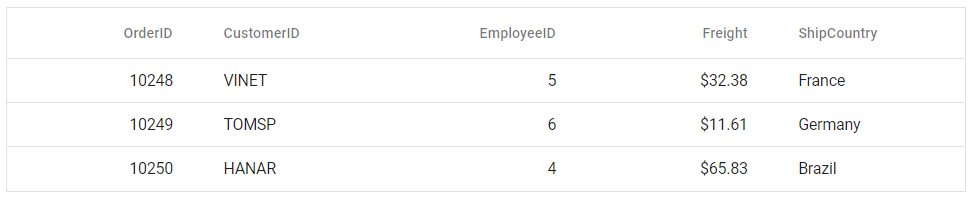

# Getting Started with React Data Grid in Preact Framework

This article provides a step-by-step guide for setting up a [Preact](https://preactjs.com) project and integrating the React Data Grid component.

`Preact` is a fast and lightweight JavaScript library for building user interfaces. It's often used as an alternative to larger frameworks like React. The key difference is that Preact is designed to be smaller in size and faster in performance, making it a good choice for projects where file size and load times are critical factors. 

## Prerequisites

- **React:** Use React version 15.5.4 or higher.
- **Node.js:** Use Node.js version 14.0.0 or above.
- **Yarn (optional):** If using Yarn, ensure Yarn version >= 0.25.

## Set up the Preact project

Create a new Preact project using the initialization command:

```bash
npm init preact
```

or

```bash
yarn init preact
```

Using one of the above commands will lead you to set up additional configurations for the project, as below:

**Project name**

Specify the project name as `my-project`.

```bash
T  Preact - Fast 3kB alternative to React with the same modern API
|
*  Project directory:
|  my-project
—      
```

**Project language**

Choose `JavaScript` as the framework variant to build this Preact project using JavaScript and React.

```bash
T  Preact - Fast 3kB alternative to React with the same modern API
|
*  Project language:
|  > JavaScript
|    TypeScript
—
```
**Configuration options**

Respond to the following prompts with the default selections:

```bash
T  Preact - Fast 3kB alternative to React with the same modern API
|
*  Use router?
|    Yes / > No
—
|
*  Prerender app (SSG)?
|    Yes / > No
—
|
*  Use ESLint?
|    Yes / > No
—
```

**Navigate to project**

Once setup is complete, navigate to your project directory:

```bash
cd my-project
```

Now that `my-project` is ready to run with default settings, let's add Syncfusion<sup style="font-size:70%">&reg;</sup> components to the project.

## Adding React Data Grid packages

Syncfusion<sup style="font-size:70%">&reg;</sup> React component packages are available on [npmjs.com](https://www.npmjs.com/search?q=ej2-react). This article uses the [React DataGrid component](https://www.syncfusion.com/react-components/react-data-grid) as an example. To use the React DataGrid component in the project, the `@syncfusion/ej2-react-grids` package needs to be installed using the following command:

```bash
npm install @syncfusion/ej2-react-grids --save
```

or

```bash
yarn add @syncfusion/ej2-react-grids
```

>Before including Syncfusion styles, make sure to remove the default styles defined in **index.css**. This helps prevent unintended style overrides and ensures that Syncfusion components render correctly.

## Adding CSS reference

Themes for Syncfusion<sup style="font-size:70%">&reg;</sup> Data Grid component can be applied using CSS files provided through [npm theme packages](https://www.npmjs.com/package/@syncfusion/ej2-material3-theme). For available themes, refer to the [Themes](https://ej2.syncfusion.com/react/documentation/appearance/theme) documentation.

Install the **Material 3** theme package using the following command:




npm install @syncfusion/ej2-material3-theme --save




Then add the following CSS reference to the **src/style.css** file:




@import "../node_modules/@syncfusion/ej2-material3-theme/styles/grid/index.css";




## Adding DataGrid component

The DataGrid code should be added to the **src/index.jsx** file.




import { render } from 'preact';
import { ColumnDirective, ColumnsDirective, GridComponent } from '@syncfusion/ej2-react-grids';
import './style.css';

export function App() {
  // Defines the data to be displayed in the DataGrid.
  const data = [
    { OrderID: 10248, CustomerID: 'VINET', EmployeeID: 5, ShipCountry: 'France', Freight: 32.38 },
    { OrderID: 10249, CustomerID: 'TOMSP', EmployeeID: 6, ShipCountry: 'Germany', Freight: 11.61 },
    { OrderID: 10250, CustomerID: 'HANAR', EmployeeID: 4, ShipCountry: 'Brazil', Freight: 65.83 }
  ];

  return (
    {/* Assigns the dataset to the DataGrid component */}
    <GridComponent dataSource={data}>
      {/* Define the columns to be displayed */}
      <ColumnsDirective>
        <ColumnDirective field='OrderID' width='100' textAlign="Right" />
        <ColumnDirective field='CustomerID' width='100' />
        <ColumnDirective field='EmployeeID' width='100' textAlign="Right" />
        <ColumnDirective field='Freight' width='100' format="C2" textAlign="Right" />
        <ColumnDirective field='ShipCountry' width='100' />
      </ColumnsDirective>
    </GridComponent>
  );
}

render(<App />, document.getElementById('app'));




## Run the project

```bash
npm run dev
```

or

```bash
yarn run dev
```

The output will appear as follows:



## See also

* [DataGrid Feature Modules](./module)
