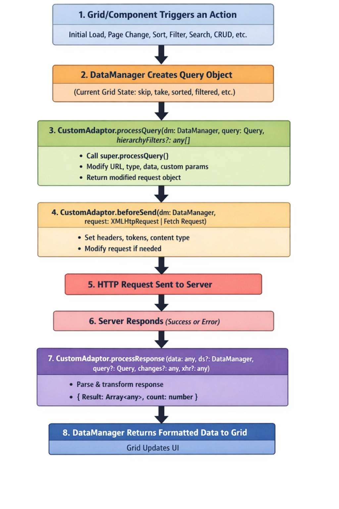

# Custom adaptor in React Pivot Table

The Custom Adaptor is a powerful extension mechanism that **customizes any existing adaptors** ([UrlAdaptor](./url-adaptor), [WebApiAdaptor](./webapi-adaptor), [ODataV4Adaptor](./odatav4-adaptor), [GraphQLAdaptor](./graphql-adaptor)) to meet specific application requirements. Instead of creating an entirely new adaptor from scratch, the Custom Adaptor extends and modifies the behavior of existing adaptors by intercepting and customizing HTTP requests and responses.

**What is the DataManager?**

The [DataManager](https://ej2.syncfusion.com/react/documentation/data/getting-started) is a data source manager used by Syncfusion<sup style="font-size:70%">&reg;</sup> React components to handle data operations. It acts as a bridge between the Pivot Table and the data source (local array, REST API, OData, GraphQL, etc.). The [DataManager](https://ej2.syncfusion.com/react/documentation/data/getting-started) is responsible for fetching data and performing CRUD operations, while communicating with the appropriate endpoint using the configured adaptor.

**What is Custom Adaptor?**

The Custom Adaptor is not a standalone adaptor. It is a way to extend and customize existing Syncfusion<sup style="font-size:70%">&reg;</sup> adaptors (`UrlAdaptor`, `ODataV4Adaptor`, `WebApiAdaptor`, `GraphQLAdaptor`) by overriding their default behavior. 

The Custom Adaptor acts as a middleware layer between Syncfusion<sup style="font-size:70%">&reg;</sup> React components and the chosen adaptor (such as `UrlAdaptor`, `ODataV4Adaptor`, `WebApiAdaptor`, or `GraphQLAdaptor`). Its purpose is to customize the default HTTP request and response handling with custom logic. By intercepting the data flow, it allows you to override, adjust, or extend behavior at specific points. This design makes it possible to control how data is fetched, processed, and returned while still letting you use the built‑in features of existing adaptors and avoiding the need to create a new adaptor from scratch.



For detailed guidance, refer to the [DataManager CustomAdaptor documentation](https://ej2.syncfusion.com/react/documentation/data/adaptors/custom-adaptor), which explains the usage of custom adaptors in depth.

## Prerequisites

Ensure the following software and packages are installed before proceeding:

| Software/Package | Version | Purpose |
| ------------------ | -------- | --------- |
| Node.js | 18.x or later | Runtime for React development |
| React | 18.x or later | Create and run React applications |
| .NET SDK | 8.0 or later | Build and run ASP.NET Core Web API |
| Visual Studio or Visual Studio Code | Latest | Configure the backend API service |
| @syncfusion/ej2-react-pivotview | 34.1.29 or later | React Pivot Table component |
| Microsoft.AspNetCore.OData | 8.0.x or later | OData V4 services, routing, and query support for the backend API |
| Microsoft.AspNetCore.Mvc.NewtonsoftJson | 8.0.x or later | Preserves original property casing during JSON serialization |

## Setting up the ASP.NET Core Backend API

As explained earlier, the Custom Adaptor **customizes any existing adaptors** ([UrlAdaptor](./url-adaptor), [WebApiAdaptor](./webapi-adaptor), [ODataV4Adaptor](./odatav4-adaptor), [GraphQLAdaptor](./graphql-adaptor)) to meet specific application requirements. Rather than building a new adaptor from scratch, the Custom Adaptor extends an existing adaptor and overrides only the parts of its behavior that need to be customized.

In this guide, the Custom Adaptor is created by extending the [ODataV4Adaptor](./odatav4-adaptor). Because the Custom Adaptor relies on the base adaptor's data flow, it uses the same backend service as the ODataV4Adaptor to serve data requests from the React Pivot Table. To set up the **ASP.NET Core Backend API**, refer to the [Setting up the ASP.NET Core Backend API](./odatav4-adaptor#setting-up-the-aspnet-core-backend-api) section in the [ODataV4Adaptor](./odatav4-adaptor) document, which provides step-by-step instructions for creating the backend service. Complete that setup (including the model, controller `Get()` method, and `Program.cs` configuration for OData V4 services, JSON serialization, and CORS) before continuing with the Custom Adaptor implementation.

## Setting up the React Pivot Table client

With the backend API configured and running, the next step is to connect the React Pivot Table to it on the client side. This section explains how to integrate the Pivot Table with the backend using a [CustomAdaptor](https://ej2.syncfusion.com/react/documentation/data/adaptors/custom-adaptor).

### Step 1: Set up a React project with Pivot Table

Set up a React project with the Pivot Table by following the [Getting Started](../getting-started) documentation. Ensure that all necessary Syncfusion<sup style="font-size:70%">&reg;</sup> EJ2 Pivot Table dependencies are installed in the React project:

```bash
npm install @syncfusion/ej2-react-pivotview
```

### Step 2: Configure the Pivot Table with CustomAdaptor

Integrating a `CustomAdaptor` with the React Pivot Table requires configuring the `DataManager` as the communication bridge between the Pivot Table component and the backend data source. The `CustomAdaptor` serves as a powerful customization layer that provides complete control over how data operations—such as filtering, sorting, paging, and querying—are processed and transmitted to the server.

#### Step 2.1: Creating an Extended ODataV4Adaptor

The first step involves creating a custom adaptor by extending the existing `ODataV4Adaptor` class. This extension allows modification of the default behavior to meet specific application requirements. 

Begin by creating a new TypeScript file named **CustomAdaptor.ts** in the project's source directory. This file will house the custom adaptor class definition.

**Understanding the CustomAdaptor implementation:**

The example below demonstrates a `CustomAdaptor` class that extends `ODataV4Adaptor` to dynamically add serial numbers to each record after receiving the response from the server. This is particularly useful when the server data does not include sequential numbering but the Pivot Table needs to display row numbers.

The implementation requires importing specific modules from Syncfusion packages:
- `setValue` and `Fetch` from `@syncfusion/ej2-base` – A utility function for safely setting property values on objects, and the Fetch wrapper type used by the HTTP layer.
- `DataManager`, `ODataV4Adaptor`, and `Query` from `@syncfusion/ej2-data` – Core data management classes.
- `DataOptions`, `DataResult`, and `CrudOptions` types from `@syncfusion/ej2-data` – TypeScript types that describe the data source options, processed result, and CRUD operation payloads.

The Syncfusion<sup style="font-size:70%">&reg;</sup> DataManager provides built‑in extensibility points that allow custom logic to be applied both before a request is sent to the server and after a response is received. This is achieved by overriding adaptor methods, ensuring that request customization and response transformation are handled in a consistent and centralized manner. The following table explains the overridden methods in a Custom Adaptor and their execution phases:

| Method            | Execution Phase                          | Purpose & Key Actions                                                                 |
|-------------------|------------------------------------------|---------------------------------------------------------------------------------------|
| `processResponse` | After receiving server response, before Pivot Table rendering | Adds sequential `SNo` (serial number) to each record by iterating through `response.result` → displays row numbers when the server does not provide them |
| `processQuery`    | Before sending request to server (read, insert, update, delete)         | Overrides the `DataManager` URL and appends extra query parameters → enables dynamic endpoint targeting and request identification. Because `processQuery` runs for every operation, mutating `dm.dataSource.url` here affects all requests; prefer setting the `url` once on the `DataManager` configuration (as shown in Step 2.2) and use `processQuery` only for request-specific parameter injection. |
| `beforeSend`      | Immediately before HTTP request is sent  | Adds a custom `Authorization` header to the HTTP request → authenticates or tags every API request sent to the server. In production, send a real bearer token (for example, `Bearer <token>`) instead of a placeholder value. |
| *Inherited CRUD methods* | During insert/update/delete operations | The Custom Adaptor extends `ODataV4Adaptor`, which resolves CRUD routes (`POST`, `PATCH`, `DELETE`) from the entity set URL automatically. No `insertUrl`/`updateUrl`/`removeUrl` configuration is required on the client unless you override `insertRecord`/`update`/`remove` to customize CRUD behavior. |






import { Fetch, setValue } from '@syncfusion/ej2-base';
import { DataManager, ODataV4Adaptor, Query, type DataOptions, type DataResult, type CrudOptions } from '@syncfusion/ej2-data';

export class CustomAdaptor extends ODataV4Adaptor {
    public processQuery(dm: DataManager, query: Query): Object {
        dm.dataSource.url = 'https://localhost:<port>/odata/Orders'; // Replace <port> with your backend port (for example, 5001 or 7001).
        query.addParams('Syncfusion Pivot Table', 'true'); // Add the additional parameter.
        return super.processQuery(dm, query);
    }

    public beforeSend(dm: DataManager, request: Request, settings?: Fetch): void {
        // Replace the placeholder below with a real token (for example, `Bearer <token>`).
        request.headers.set('Authorization', `Bearer <token>`);
        super.beforeSend(dm, request, settings as Fetch);
    }

    public processResponse(data: DataResult, ds?: DataOptions, query?: Query, xhr?: Request, request?: Fetch, changes?: CrudOptions): Object {
        let i: number = 0;
        const original: DataResult = super.processResponse(data, ds, query, xhr, request, changes) as DataResult;
        // Adding serial number.
        if (original.result) {
            (original.result as Object[]).forEach((item: Object) => setValue('SNo', ++i, item));
        }
        return original;
    }
}





**TypeScript notes:**

- The method signatures include parameter and return types (for example, `dm: DataManager`, `query: Query`, `: Object`) so the override matches the base `ODataV4Adaptor` contract. Omitting the types still works at runtime, but explicit types give you compile-time safety and editor IntelliSense.
- `type DataOptions`, `type DataResult`, and `type CrudOptions` are imported as **type-only imports** (using the `type` keyword) because `verbatimModuleSyntax` is enabled in the Vite TypeScript template — this strips them from the emitted JavaScript and prevents "X is not a value" errors.
- `super.processResponse(...)` returns `Object`, so it is cast to `DataResult` (`as DataResult`) before accessing `.result`.
- `original.result` is typed as `Object`, so it is cast to `Object[]` before calling `forEach`.

#### Step 2.2: Integrating CustomAdaptor into React Pivot Table

After creating the custom adaptor class, integrate it with the React Pivot Table in the main application file (typically **App.tsx** for a TypeScript project such as the Vite template used here, or **App.jsx** for a plain JavaScript project). This requires importing the necessary modules and configuring the Pivot Table to use the custom adaptor:

- Import `DataManager` from `@syncfusion/ej2-data` to act as the link between the Pivot Table and the OData service.
- Import `PivotViewComponent` from `@syncfusion/ej2-react-pivotview` to render the Pivot Table component.
- Import the `DataSourceSettingsModel` type from `@syncfusion/ej2-pivotview/src/model/datasourcesettings-model` so the `dataSourceSettings` object is strongly typed.
- Import `CustomAdaptor` from the local **./CustomAdaptor** file to apply custom request and response logic.
- Create a `DataManager` instance by setting the service endpoint URL **(e.g., https://localhost:<port>/odata/Orders)** in the `url` property.
- Assign `CustomAdaptor` to the `adaptor` property so that all operations (filtering, sorting, paging, querying) use the customized pipeline.
- Bind the `DataManager` instance to the Pivot Table's `dataSource` property within `dataSourceSettings`, enabling the Pivot Table to automatically apply the custom logic during data communication.






import * as React from 'react';
import { PivotViewComponent } from '@syncfusion/ej2-react-pivotview';
import { DataManager } from '@syncfusion/ej2-data';
import type { DataSourceSettingsModel } from '@syncfusion/ej2-pivotview/src/model/datasourcesettings-model';
import { CustomAdaptor } from './CustomAdaptor';
import './App.css';

function App(): React.ReactElement {
    // Configure DataManager with CustomAdaptor.
    const data: DataManager = new DataManager({
        url: 'https://localhost:<port>/odata/Orders',
        adaptor: new CustomAdaptor(),
    });

    const dataSourceSettings: DataSourceSettingsModel = {
        dataSource: data,
        expandAll: false,
        rows: [{ name: 'CustomerID' }],
        columns: [{ name: 'OrderID' }],
        values: [{ name: 'Freight' }],
        formatSettings: [{ name: 'Freight', format: 'N0' }],
    };

    const pivotObj = React.useRef<PivotViewComponent>(null);

    return (
        <div className='control-section' style={{ margin: 100 }}>
            <PivotViewComponent ref={pivotObj} id='PivotView' height={350} width={700} dataSourceSettings={dataSourceSettings}>
            </PivotViewComponent>
        </div>
    );
}

export default App;





**Code Explanation:**

- [DataManager](https://ej2.syncfusion.com/react/documentation/data/getting-started): Creates a data source that targets the ASP.NET Core Web API endpoint at `https://localhost:<port>/odata/Orders`. Replace `<port>` with the port number shown in the `dotnet run` output.
- [CustomAdaptor](https://ej2.syncfusion.com/react/documentation/data/adaptors/custom-adaptor): Extends the `ODataV4Adaptor` and tells the [DataManager](https://ej2.syncfusion.com/react/documentation/data/getting-started) to use the custom pipeline, which automatically handles OData V4-compliant HTTP requests and JSON response parsing along with the custom logic for the Pivot Table.
- [dataSourceSettings](https://ej2.syncfusion.com/react/documentation/api/pivotview/index-default#datasourcesettings): Defines the Pivot Table layout:
  - [rows](https://ej2.syncfusion.com/react/documentation/api/pivotview/datasourcesettingsmodel#rows): Displays **CustomerID** values as row headers.
  - [columns](https://ej2.syncfusion.com/react/documentation/api/pivotview/datasourcesettingsmodel#columns): Displays **OrderID** values as column headers.
  - [values](https://ej2.syncfusion.com/react/documentation/api/pivotview/datasourcesettingsmodel#values): Aggregates the **Freight** field based on the row and column combinations.
  - [formatSettings](https://ej2.syncfusion.com/react/documentation/api/pivotview/datasourcesettingsmodel#formatsettings): Applies a number format (`N0`) so that aggregated values are displayed without decimals.
- [PivotViewComponent](https://ej2.syncfusion.com/react/documentation/api/pivotview/index-default): Renders the Pivot Table with the configured data and layout.

### Step 3: Run and verify the Pivot Table

**Start the ASP.NET Core API server:**

Open a terminal in the backend project folder and run:

```bash
dotnet run
```

The server will start and listen on `https://localhost:<port>` by default. The API endpoint will be available at `https://localhost:<port>/odata/Orders`. Note the `<port>` number from the output (typically 5001 or 7001).

**Start the React application:**

Open a separate terminal in the client application folder and run:

```bash
npm run dev
```

Once both the server and client are running:

- The Pivot Table retrieves data from the backend API through the `CustomAdaptor` (which extends the [ODataV4Adaptor](https://ej2.syncfusion.com/react/documentation/data/adaptors/odatav4-adaptor)) and renders it according to the configured `dataSourceSettings` report layout. The overridden `processQuery`, `beforeSend`, and `processResponse` methods apply the custom request parameters, authentication header, and serial-number logic respectively.
- The resulting Pivot Table appears as shown in the following image:


The Pivot Table is now successfully connected to the backend API and displays the data in the configured layout.

### Verify data binding

To confirm the API is working correctly:
1. Open the browser's **Developer Tools** (F12) → **Network** tab.
2. Load the React application. You should see an OData V4-compliant request to `https://localhost:<port>/odata/Orders` with a 200 status and a JSON response containing `@odata.context` and `value`.
3. If the Pivot Table appears empty, check the Network tab for failed requests or the Console tab for JavaScript errors.

## CRUD operations with Pivot Table

The Syncfusion<sup style="font-size:70%">&reg;</sup> React Pivot Table supports CRUD (Create, Read, Update, Delete) operations. When an edit action (add, update, or delete) is performed through the Pivot Table's built-in editing pop-up, the [DataManager](https://ej2.syncfusion.com/react/documentation/data/getting-started) automatically sends an HTTP request to the corresponding server endpoint. The server processes the operation and returns the updated data, and the Pivot Table refreshes to reflect the changes.

**CRUD flow overview:** The Pivot Table's `ODataV4Adaptor` (which the Custom Adaptor extends) derives CRUD routes from the entity set URL configured on the `DataManager`. Insert, update, and delete operations are triggered from the drill-through (edit) grid that opens when you double-click a pivot cell — the CRUD methods in this section handle those server-side actions. This enables the following operations:

- **Create**: Add new records through the Pivot Table editing pop-up.
- **Read**: Display data from the backend (already configured by the `Get()` method in [Step 4: Create an API controller](./odatav4-adaptor#step-4-create-an-api-controller) of the ODataV4Adaptor document).
- **Update**: Edit existing records in place.
- **Delete**: Remove records from the data source.

### Implement backend CRUD methods

Extend the **OrdersController.cs** file by adding `Post`, `Patch`, and `Delete` methods. These methods are called automatically when data is edited through the Pivot Table. Before editing can be triggered, double-click any pivot cell to open the drill-through (edit) grid — all CRUD operations in the following subsections are performed from that grid.

#### Insert operation

To add a new record, double-click a pivot cell to open the editing pop-up, then click the **Add** button to create a new empty row. Enter the required data in the row fields and click the **Update** button to save the record. Use the `HttpPost` method in the controller for the insert operation. The new record details are passed through the **addRecord** parameter.

```cs

// CREATE: Insert new order
[HttpPost]
[EnableQuery]
// [Route("Insert")]
public IActionResult Post([FromBody] OrdersDetails addRecord)
{
    if (addRecord == null)
    {
        return BadRequest("Order cannot be null");
    }

    // Add to the beginning of the list
    OrdersDetails.GetAllRecords().Insert(0, addRecord);
    // Created() returns an OData-formatted 201 Created response.
    return Created(addRecord);
}

```


#### Update operation

To modify an existing record, double-click a pivot cell to open the editing pop-up, select the row to edit, and click the **Edit** button. After making the required changes, click **Update** to save them. Use the `HttpPatch` method in the controller for the update operation. The updated record details are passed through the **updatedOrder** parameter.

```cs

// UPDATE: Modify existing order
[HttpPatch("{key}")]
public IActionResult Patch(int key, [FromBody] OrdersDetails updatedOrder)
{
    if (updatedOrder == null)
    {
        return BadRequest("Order data cannot be null");
    }

    // The route key is parsed as int; the model's OrderID is nullable (int?) but the OData
    // route segment (/odata/Orders(<key>)) binds to the non-nullable int parameter.
    var existingOrder = OrdersDetails.GetAllRecords().FirstOrDefault(o => o.OrderID == key);
    if (existingOrder == null)
    {
        return NotFound();
    }

    // Update properties (null-coalescing handles partial updates)
    existingOrder.CustomerID = updatedOrder.CustomerID ?? existingOrder.CustomerID;
    existingOrder.EmployeeID = updatedOrder.EmployeeID ?? existingOrder.EmployeeID;
    existingOrder.Freight = updatedOrder.Freight ?? existingOrder.Freight;

    // Returns 200 OK with the updated record. Unlike DELETE, the PATCH response body is
    // parsed by the DataManager to refresh the edited record on the client.
    return Ok(existingOrder);
}

```


**How it works:**

- The `Patch` method locates the existing record by matching the **OrderID** with the primary key sent in the request.
- If a matching record is found, its properties are updated with the new values received from the Pivot Table.

#### Delete operation

To remove a record, double-click a pivot cell to open the editing pop-up, select the row to delete, and click the **Delete** button. Use the `HttpDelete` method in the controller for the delete operation. The primary key value of the record to be removed is passed through the **key** route parameter (for example, `DELETE /odata/Orders(10001)`).

**Response format:** The Remove endpoint should return a 200 OK status (or 204 No Content). The response body is not parsed; only the HTTP status code matters. On success, the Pivot Table automatically refreshes.

```cs
// DELETE: Remove order
[HttpDelete("{key}")]
public IActionResult Delete(int key)
{
    var order = OrdersDetails.GetAllRecords().FirstOrDefault(o => o.OrderID == key);
    if (order == null)
    {
        return NotFound();
    }

    OrdersDetails.GetAllRecords().Remove(order);
    return NoContent(); // 204 No Content is standard for successful DELETE
}
```

**How it works:**

- The `Delete` method extracts the **OrderID** from the `key` route value of the request URL (for example, `/odata/Orders(10001)`).
- It searches the in-memory data collection for a matching record and removes it if found.
- On success, it returns `NoContent()` (HTTP 204), and the Pivot Table automatically refreshes to reflect the deletion.

#### Error handling in CRUD operations

If a CRUD endpoint returns a non-2xx HTTP status code (for example, 400, 404, 500) or returns invalid JSON, the [DataManager](https://ej2.syncfusion.com/react/documentation/data/getting-started) will:
1. Log the error to the browser console for debugging.
2. Close the edit dialog without applying changes.
3. Keep the Pivot Table in its current state.

**Best practice:** Always include try-catch blocks in backend CRUD methods and return appropriate HTTP status codes:
```cs
try {
    // CRUD logic here
    return Ok();  // 200 OK
} catch (Exception ex) {
    return BadRequest(ex.Message);  // 400 Bad Request
}
```

### Configure client-side CRUD endpoints

Update the React **App.tsx** file to enable editing in the Pivot Table. With the Custom Adaptor, CRUD routes are derived automatically from the OData conventions and the single `url` configured on the [DataManager](https://ej2.syncfusion.com/react/documentation/data/getting-started) (for example, `POST /odata/Orders`, `PATCH /odata/Orders(<key>)`, `DELETE /odata/Orders(<key>)`). Do not set `insertUrl`, `updateUrl`, or `removeUrl` on the `DataManager` — the ODataV4Adaptor resolves them from the entity set URL automatically. Enabling client-side CRUD involves two steps: configuring [editSettings](#enable-edit-settings) on the Pivot Table and wiring up the [beginDrillThrough](#configure-primary-key-for-editing) event to set the primary key. The consolidated `App.tsx` incorporating both changes is provided at the end of this section.

#### Enable edit settings

Configure the [editSettings](https://ej2.syncfusion.com/react/documentation/api/pivotview/index-default#editsettings) property to enable CRUD operations in the Pivot Table. The `editSettings` object is defined inside the `App` function so it can be passed to the `PivotViewComponent`. To get compile-time validation of the editing options, type it with `CellEditSettingsModel` imported from `@syncfusion/ej2-pivotview/src/model/celledit-settings-model`:

```typescript
  // Import the editing settings model for type safety.
import { PivotViewComponent, CellEditSettings } from '@syncfusion/ej2-react-pivotview';

  // Enable editing functionality
  const editSettings: CellEditSettings = { 
    allowEditing: true,    // Enables the Edit button and allows users to modify existing records.
    allowAdding: true,     // Enables the Add button and allows users to create new records.
    allowDeleting: true,   // Enables the Delete button and allows users to remove records.
    mode: 'Normal'         // Uses Normal mode (popup dialog) for editing; other options: 'Dialog', 'Batch', 'CommandColumn'.
  };

  return (
    <PivotViewComponent 
      id='PivotView' 
      ref={pivotObj}
      editSettings={editSettings} 
      >
    </PivotViewComponent>
  );
```

The Pivot Table supports different editing modes (Normal, Dialog, Batch, and Command Column) that can be configured using the [mode](https://ej2.syncfusion.com/react/documentation/api/pivotview/celleditsettingsmodel#mode) property. For detailed information about each editing mode and its usage, refer to the [Editing documentation](https://ej2.syncfusion.com/react/documentation/pivotview/editing).

#### Configure primary key for editing

**What is drill-through editing?**

Drill-through editing opens a detailed data grid showing all source records when you click a pivot cell. This grid is where users add, edit, or delete individual records that feed into the pivot summary. The [beginDrillThrough](https://ej2.syncfusion.com/react/documentation/pivotview/drill-through#begindrillthrough) event is triggered just before this edit grid opens. This is where the primary key column is configured.

**Why is the primary key important?**

The primary key (**OrderID**) uniquely identifies each record. When the [DataManager](https://ej2.syncfusion.com/react/documentation/data/getting-started) performs update or delete operations, it uses the primary key to locate the exact record to modify. Without a correctly configured primary key, the [DataManager](https://ej2.syncfusion.com/react/documentation/data/getting-started) cannot identify which record to update or delete, and the request will fail.

Define the following `beginDrillThrough` event handler inside the `App` function in **App.tsx**. To get IntelliSense for the event argument, type `args` as `BeginDrillThroughEventArgs` (imported from `@syncfusion/ej2-pivotview`):

```typescript
  // Import the drill-through event args type for IntelliSense.
  import type { BeginDrillThroughEventArgs } from '@syncfusion/ej2-pivotview';

  // Configure the beginDrillThrough event to set the primary key
  function beginDrillThrough(args: BeginDrillThroughEventArgs): void {
      for (var i = 0; i < args.gridObj.columns.length; i++) {
          if (args.gridObj.columns[i].field === "OrderID") {
              args.gridObj.columns[i].isPrimaryKey = true;
          } else {
              args.gridObj.columns[i].visible = true;
          }
      }
  }

  return (
    <PivotViewComponent 
      id='PivotView' 
      ref={pivotObj}
      beginDrillThrough={beginDrillThrough}
      >
    </PivotViewComponent>
  );
```

**How it works:**

- The event iterates through all columns in the drill-through (edit) grid.
- The column whose `field` matches the primary key name (`OrderID`) is flagged with `isPrimaryKey = true`. This tells the [DataManager](https://ej2.syncfusion.com/react/documentation/data/getting-started) which field uniquely identifies each record.

### Important notes

- **Primary key field**: The primary key field (**OrderID**) cannot be modified during editing. Changing it causes data inconsistency because it uniquely identifies each record.
- **Real-time updates**: After each CRUD operation, the Pivot Table automatically refreshes to display the updated data from the backend.
- **Edit modes**: For an explanation of the available editing modes (Normal, Dialog, Batch, and Command Column) and how to switch between them using the [mode](https://ej2.syncfusion.com/react/documentation/api/pivotview/celleditsettingsmodel#mode) property, see the [Editing documentation](https://ej2.syncfusion.com/react/documentation/pivotview/editing).

## Best practices for extending the CustomAdaptor

### 1. API Design

- **Consistent response shape**: Always return the `{ "@odata.context", value }` structure from data endpoints. The OData V4 middleware generates the `@odata.context` metadata URL automatically, and the Pivot Table uses the `value` array to display the records.

### 2. Property Casing

- **Preserve original casing**: Use `DefaultContractResolver` in **Program.cs** so the API response uses the same casing as your model classes. Mismatched casing leads to empty Pivot Table layouts because field bindings become case-sensitive.

### 3. Security

- **Restrict CORS in production**: The `AllowAnyOrigin` policy is intended for development. In production, restrict allowed origins to the specific domain of your React application by using `policy.WithOrigins("https://yourdomain.com")`. See the CORS configuration in the [Program.cs setup](./odatav4-adaptor#step-5-configure-programcs) section of the ODataV4Adaptor document.
- **Use HTTPS**: Always expose the API over HTTPS in production to protect data in transit.

### 4. Error Handling

- **Wrap operations in try-catch**: Catch database or serialization exceptions in the controller methods and return a meaningful HTTP status code (for example, 400 for bad requests, 500 for server errors). See the inline error-handling guidance in the [CRUD operations](#error-handling-in-crud-operations) section for a code pattern.
- **Log failures**: Use the built-in ASP.NET Core logging to capture request and error details. The logs make it easier to diagnose issues when running the API in a production environment.

### 5. Performance

- **Response payload optimization**: Keep the `value` array focused on the fields the Pivot Table actually binds to. Although `@odata.context` and the `value` array are the only required top-level properties for the basic response, you can add `$count=true` (or the `$count` segment) to the OData query when server-side paging is needed — the middleware then returns an additional `@odata.count` field reflecting the total record count across all pages. For example: `GET /odata/Orders?$count=true&$top=50&$skip=0`.
- **Asynchronous endpoints**: For large data sources, consider making the controller methods `async` and using asynchronous database calls to free up server threads.

## Troubleshooting

The following table lists common issues and their resolutions when working with the [CustomAdaptor](https://ej2.syncfusion.com/react/documentation/data/adaptors/custom-adaptor) and the Pivot Table. Each scenario includes the symptom you might observe and a step-by-step resolution.

| Issue | Symptom | Resolution |
|-------|---------|-----------|
| **Empty Pivot Table** | The Pivot Table loads without errors, but no rows or values are shown. | Verify that `GetAllRecords()` returns data correctly and the response follows the `{ "@odata.context", value }` format. Also confirm that the property names returned by the API match the field names used in `dataSourceSettings`. |
| **404 error** | Network tab shows a 404 response when the Pivot Table tries to load data. | Ensure the controller route is configured as `[Route("[controller]")]` (matching the `/odata/Orders` endpoint registered via `AddRouteComponents("odata", ...)` in **Program.cs**) and the API server is running. Verify the URL in the React [DataManager](https://ej2.syncfusion.com/react/documentation/data/getting-started) matches the actual API port. |
| **500 error** | The Pivot Table fails to load, and the browser shows a server error. | Check the Visual Studio Output window or the terminal for server logs and error details. Common causes include null reference exceptions and serialization errors. |
| **CORS error** | Browser console shows: `Access to XMLHttpRequest at 'http://localhost:5092/odata/Orders' from origin 'https://localhost:3000' has been blocked by CORS policy.` | Verify that CORS is properly configured in **Program.cs** and `app.UseCors()` is called before `app.MapControllers()`. |
| **CRUD operations not saving** | The Pivot Table editing pop-up closes, but the changes are not reflected in the data source. | Ensure the primary key is correctly configured in the `beginDrillThrough` event (so the [DataManager](https://ej2.syncfusion.com/react/documentation/data/getting-started) can target the right record). Confirm that the backend `Post`, `Patch`, and `Delete` methods resolve under the OData route prefix configured in **Program.cs**, and verify that the `beginDrillThrough` event handler flags the `OrderID` column with `isPrimaryKey = true`. |
| **Property casing mismatch** | The Pivot Table appears empty or shows a "field not found" warning, even though the API returns data. | Confirm that `DefaultContractResolver` is added in **Program.cs** to preserve original property casing. Without it, the API returns camelCase property names that do not match the field names configured in the Pivot Table. |
| **Pivot Table loads slowly** | The Pivot Table takes a long time to render or becomes unresponsive. | Ensure the API only returns the fields the Pivot Table needs (keep the `value` array lean) and that the OData V4 middleware is generating the response from a queryable source. For large data sources, consider implementing server-side aggregation to reduce the payload returned to the client. |
| **SSL/TLS certificate error** | Browser console shows: `net::ERR_CERT_AUTHORITY_INVALID` or browser warning about untrusted certificate. | ASP.NET Core uses a self-signed certificate for localhost HTTPS by default. In development, the certificate is usually auto-generated. If the error persists, run `dotnet dev-certs https --clean` followed by `dotnet dev-certs https --trust` to regenerate and trust the certificate. (Windows/macOS only; on Linux, manually trust the certificate or use HTTP for local testing.) |

## Complete sample repository

For a complete working implementation, refer to the [GitHub repository](https://github.com/SyncfusionExamples/custom-adaptor-with-pivot-table).

## See Also

- [**Pivot Table Data Binding**](https://ej2.syncfusion.com/react/documentation/pivotview/data-binding)
- [**DataManager**](https://ej2.syncfusion.com/react/documentation/data/getting-started)
- [**Custom Adaptor**](https://ej2.syncfusion.com/react/documentation/data/adaptors/custom-adaptor)
- [**Pivot Table Editing**](https://ej2.syncfusion.com/react/documentation/pivotview/editing)
