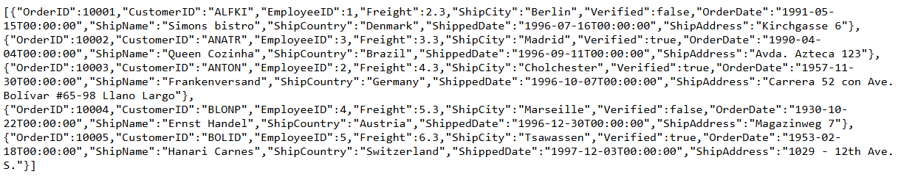
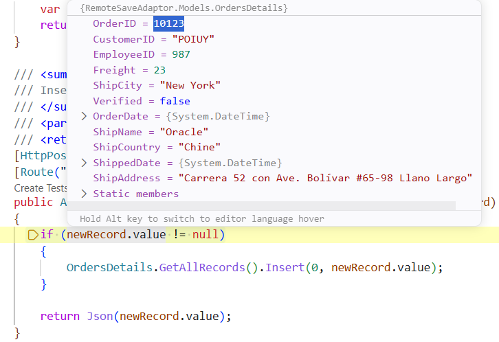
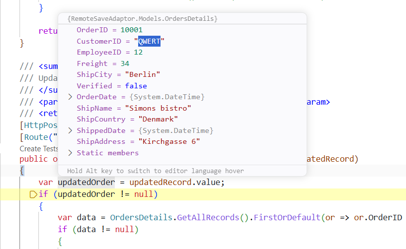
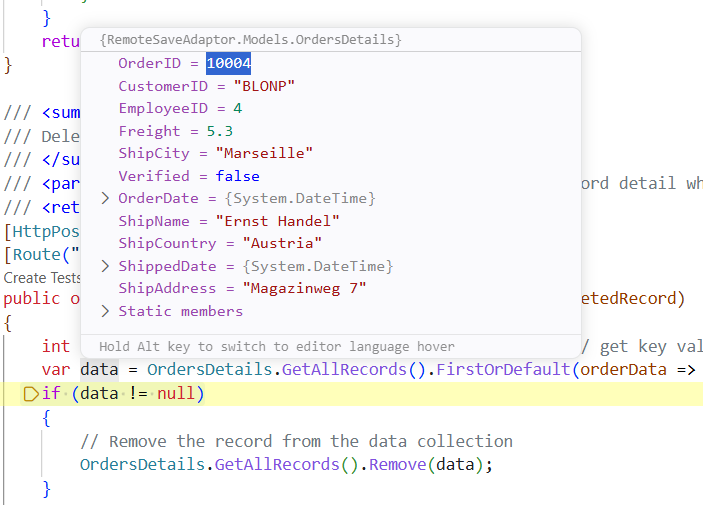

# Remote save adaptor in React Pivot Table

The [RemoteSaveAdaptor](https://ej2.syncfusion.com/react/documentation/data/adaptors/remote-save-adaptor) in the React Pivot Table provides a hybrid approach to data management that combines the best of both client-side and server-side processing. It fetches the complete dataset from the server. CRUD operations (Create, Update, Delete) communicate with the server to persist data changes. It reduces server load and network latency while keeping data persistence secure.

**What is the DataManager?**

The [DataManager](https://ej2.syncfusion.com/react/documentation/data/getting-started) is a data source manager used by Syncfusion<sup style="font-size:70%">&reg;</sup> React components to handle data operations. It acts as a bridge between the Pivot Table and the data source (local array, REST API, OData, GraphQL, etc.). The [DataManager](https://ej2.syncfusion.com/react/documentation/data/getting-started) is responsible for fetching data and performing CRUD operations, while communicating with the appropriate endpoint using the configured RemoteSaveAdaptor.

## Prerequisites

Ensure the following software and packages are installed before proceeding:

| Software/Package | Version | Purpose |
| ------------------ | -------- | --------- |
| Node.js | 18.x or later | Runtime for the React development server (Vite) |
| React | 18.x or later | Build and run the React Pivot Table client (TypeScript/TSX) |
| .NET SDK | 8.0 or later | Build and run ASP.NET Core Web API |
| Visual Studio or Visual Studio Code | Latest | Configure the backend API service |
| @syncfusion/ej2-react-pivotview | 34.1.29 or later | React Pivot Table component |
| Microsoft.AspNetCore.Mvc.NewtonsoftJson | 8.0.x or later | Preserves original property casing during JSON serialization |
| typescript / vite | Latest | TypeScript compilation and the Vite dev/build tooling for the client |

## Setting up the ASP.NET Core Backend API

The ASP.NET Core Web API is the backend service that supplies data to the React Pivot Table. It listens for HTTP requests from the Pivot Table, returns data in the format the component expects, and accepts CRUD operations from the client. Throughout this section, you will create the project, install the required packages, build the model and controller, configure JSON serialization and CORS, and finally run the API locally.

### Step 1: Create the ASP.NET Core Web API project





#### Create a new ASP.NET Core Web API project in Visual Studio

To create a new ASP.NET Core Web API project named **RemoteSaveAdaptor** in Visual Studio, follow these steps:

1. Open **Visual Studio**.
2. Select **Create a new project**.
3. Choose the **ASP.NET Core Web API** project template.
4. Name the project **RemoteSaveAdaptor**.
5. Click **Create**.





#### Create a new ASP.NET Core Web API project in Visual Studio Code

To create the project using Visual Studio Code, open the integrated terminal by pressing <kbd>Ctrl</kbd>+<kbd>`</kbd> and run the following commands:





dotnet new webapi -n RemoteSaveAdaptor --use-controllers
cd RemoteSaveAdaptor





The above command creates a project with a **Controllers** folder. To create a **Models** folder, run the following command:





mkdir Models









### Step 2: Install required NuGet package

The `Microsoft.AspNetCore.Mvc.NewtonsoftJson` package is required for JSON serialization support in the ASP.NET Core application. This package provides the necessary formatters to handle JSON data correctly and to preserve the original property casing of the data source.

#### Installation options

**In Visual Studio:**

Navigate to **Tools** → **NuGet Package Manager** → **Manage NuGet Packages for Solution**. Search for `Microsoft.AspNetCore.Mvc.NewtonsoftJson`, select it, and click **Install**. Ensure the package is installed in the **RemoteSaveAdaptor** project.

**Via package manager console:**

```bash
Install-Package Microsoft.AspNetCore.Mvc.NewtonsoftJson
```

**Via .NET CLI:**

```bash
dotnet add package Microsoft.AspNetCore.Mvc.NewtonsoftJson
```

### Step 3: Create a model class

The model class represents the structure of the data displayed in the Pivot Table. Create a model class named **OrdersDetails.cs** in the **Models** folder to represent the order data structure. This class also contains a static list of sample order data, which simulates a data source for demonstration purposes. In a real application, this data would typically be fetched from a database.




namespace RemoteSaveAdaptor.Models
{
  public class OrdersDetails
  {
    public static List<OrdersDetails> order = new List<OrdersDetails>();
    public OrdersDetails()
    {

    }
    public OrdersDetails(int OrderID, string CustomerId, int EmployeeId, double Freight, bool Verified, DateTime OrderDate, string ShipCity, string ShipName, string ShipCountry, DateTime ShippedDate, string ShipAddress)
    {
      this.OrderID = OrderID;
      this.CustomerID = CustomerId;
      this.EmployeeID = EmployeeId;
      this.Freight = Freight;
      this.ShipCity = ShipCity;
      this.Verified = Verified;
      this.OrderDate = OrderDate;
      this.ShipName = ShipName;
      this.ShipCountry = ShipCountry;
      this.ShippedDate = ShippedDate;
      this.ShipAddress = ShipAddress;
    }

    public static List<OrdersDetails> GetAllRecords()
    {
      if (order.Count() == 0)
      {
        int code = 10000;
        for (int i = 1; i <= 1; i++)
        {
          order.Add(new OrdersDetails(code + 1, "ALFKI", i + 0, 2.3 * i, false, new DateTime(1991, 05, 15), "Berlin", "Simons bistro", "Denmark", new DateTime(1996, 7, 16), "Kirchgasse 6"));
          order.Add(new OrdersDetails(code + 2, "ANATR", i + 2, 3.3 * i, true, new DateTime(1990, 04, 04), "Madrid", "Queen Cozinha", "Brazil", new DateTime(1996, 9, 11), "Avda. Azteca 123"));
          order.Add(new OrdersDetails(code + 3, "ANTON", i + 1, 4.3 * i, true, new DateTime(1957, 11, 30), "Cholchester", "Frankenversand", "Germany", new DateTime(1996, 10, 7), "Carrera 52 con Ave. Bolívar #65-98 Llano Largo"));
          order.Add(new OrdersDetails(code + 4, "BLONP", i + 3, 5.3 * i, false, new DateTime(1930, 10, 22), "Marseille", "Ernst Handel", "Austria", new DateTime(1996, 12, 30), "Magazinweg 7"));
          order.Add(new OrdersDetails(code + 5, "BOLID", i + 4, 6.3 * i, true, new DateTime(1953, 02, 18), "Tsawassen", "Hanari Carnes", "Switzerland", new DateTime(1997, 12, 3), "1029 - 12th Ave. S."));
          code += 5;
        }
      }
      return order;
    }
    [Key]
    public int? OrderID { get; set; }
    public string CustomerID { get; set; }
    public int? EmployeeID { get; set; }
    public double? Freight { get; set; }
    public string ShipCity { get; set; }
    public bool Verified { get; set; }
    public DateTime OrderDate { get; set; }
    public string ShipName { get; set; }
    public string ShipCountry { get; set; }
    public DateTime ShippedDate { get; set; }
    public string ShipAddress { get; set; }
  }
}




**Table Structure Explanation:**

| Column | Data Type | Description |
|--------|-----------|-------------|
| OrderID | int? | Unique identifier for each order (serves as the primary key) |
| CustomerID | string? | Identifier of the customer who placed the order |
| EmployeeID | int? | Identifier of the employee handling the order |
| Freight | double? | Shipping cost for the order |
| ShipCity | string? | City to which the order is shipped |
| Verified | bool? | Indicates whether the order has been verified |
| OrderDate | DateTime | Date when the order was placed |
| ShipName | string? | Name of the shipping recipient |
| ShipCountry | string? | Country to which the order is shipped |
| ShippedDate | DateTime | Date when the order was shipped |
| ShipAddress | string? | Full shipping address of the order |

### Step 4: Create an API controller

Create a file named `OrdersController.cs` under the **Controllers** folder to handle data communication between the Pivot Table and the backend. This controller exposes the HTTP endpoints that the Pivot Table uses to retrieve and modify data. The `GetOrderData()` method returns a list of sample order data, and the `Post` method is invoked by the Pivot Table to fetch data for the configured report.




using Microsoft.AspNetCore.Mvc;
using RemoteSaveAdaptor.Models;

namespace RemoteSaveAdaptor.Controllers
{
    [ApiController]
    public class OrdersController : Controller
    {
        [HttpPost]
        [Route("api/[controller]")]
        public object Post()
        {
            // Retrieve data from the data source (e.g., database)
            IQueryable<OrdersDetails> DataSource = GetOrderData().AsQueryable();

            // Get the total records count
            int totalRecordsCount = DataSource.Count();

            // Return data based on the request
            return new { result = DataSource, count = totalRecordsCount };
        }

        [HttpGet]
        [Route("api/[controller]")]
        public List<OrdersDetails> GetOrderData()
        {
            var data = OrdersDetails.GetAllRecords().ToList();
            return data;
        }
    }
}




**Explanation:**

- **`GetOrderData()`**: Returns the complete list of orders. The Pivot Table can call this endpoint to verify the data via a browser or any HTTP client.
- **`Post()`**: The primary endpoint used by the Pivot Table's [DataManager](https://ej2.syncfusion.com/react/documentation/data/getting-started). It returns the dataset and the total record count, which is required for paging and virtual scrolling.

### Step 5: Configure Program.cs

Update the `Program.cs` file to configure JSON serialization and enable CORS so the React frontend can communicate with the API.

#### Configure JSON serialization

In ASP.NET Core, JSON results are returned in camelCase format by default. To maintain the original property casing of the data source, add `DefaultContractResolver` in **Program.cs**. This is important because the Pivot Table's `dataSourceSettings` are configured with the original property names (for example, `ShipCity`, `OrderID`). If the API returns `shipCity` or `orderID`, the field mapping breaks, and the Pivot Table appears empty.

```cs
using Newtonsoft.Json.Serialization;

var builder = WebApplication.CreateBuilder(args);

// Add services to the container.
...
...
// Configure JSON serialization (preserves property casing).
builder.Services.AddMvc().AddNewtonsoftJson(options =>
{
  options.SerializerSettings.ContractResolver = new DefaultContractResolver();
});

...
...
app.Run();
```

#### Configure CORS

CORS (Cross-Origin Resource Sharing) is a browser security feature that blocks web pages from making requests to a different domain or port. When the React frontend (for example, `https://localhost:3000`) and the ASP.NET Core backend (for example, `https://localhost:5001`) run on different ports, browsers block cross-origin requests by default. Configuring CORS in the backend tells the browser that the API is allowed to accept requests from the frontend origin, enabling the two services to communicate.

```cs
using Newtonsoft.Json.Serialization;

var builder = WebApplication.CreateBuilder(args);

// Add services to the container.
...
...
// Add CORS policy to allow frontend access.
// WARNING: AllowAnyOrigin() is for development only. In production, restrict to your frontend domain.
builder.Services.AddCors(options =>
{
  options.AddDefaultPolicy(policy =>
  {
    policy.AllowAnyOrigin()      // Allow requests from any origin (development only; restrict in production).
          .AllowAnyMethod()       // Allow GET, POST, PUT, DELETE, etc.
          .AllowAnyHeader();      // Allow any request headers.
  });
});
...
...

// Enable CORS middleware (must be before UseRouting).
app.UseCors();

// Map controller endpoints
app.MapControllers();

app.Run();
```

The following error occurs when CORS is not configured:

```
Access to XMLHttpRequest at 'https://localhost:<port>/api/Orders' from origin 
'https://localhost:3000' has been blocked by CORS policy.
```

**Production CORS configuration:** Replace `AllowAnyOrigin()` with a specific frontend URL:
```cs
policy.WithOrigins("https://yourdomain.com")  // Restrict to your frontend domain
```

Additionally, configure the server to serve static files by adding the following lines to `Program.cs`:

```cs
var app = builder.Build();

app.UseDefaultFiles();
app.UseStaticFiles();
```

### Step 6: Run the backend API

Open a terminal in the project folder and run:

```bash
dotnet run
```

The application will be accessible at a URL like `https://localhost:<port>`. To verify that the API returns order data correctly, navigate to `https://localhost:<port>/api/Orders`, where `<port>` is the port number assigned by the CLI output.

### Step 7: Understanding the required response format

When using the [RemoteSaveAdaptor](https://ej2.syncfusion.com/react/documentation/data/adaptors/remote-save-adaptor), every backend API endpoint must return data in a specific JSON structure. This ensures that Syncfusion<sup style="font-size:70%">&reg;</sup> React DataManager can correctly interpret the response and bind it to the component. The expected format is:

```json
[
  { "OrderID": 10001, "CustomerID": "ALFKI", "ShipCity": "Berlin" },
  { "OrderID": 10002, "CustomerID": "ANATR", "ShipCity": "Madrid" }
]
```

- Each item in the array represents a single record to be displayed in the Pivot Table.
- The API should return the records as a JSON array so the DataManager can bind them directly.

## Setting up the React Pivot Table client

With the backend API configured and running, the next step is to connect the React Pivot Table to it on the client side. This section explains how to integrate the Pivot Table with the backend using the [RemoteSaveAdaptor](https://ej2.syncfusion.com/react/documentation/data/adaptors/remote-save-adaptor).

### Step 1: Set up a React project with Pivot Table

Set up a React project with the Pivot Table by following the [Getting Started](../getting-started) documentation. This sample uses a **TypeScript + Vite** React project, so the component is authored in **TSX** (`src/App.tsx`). Ensure that all necessary Syncfusion<sup style="font-size:70%">&reg;</sup> EJ2 Pivot Table dependencies are installed in the React project.

### Step 2: Configure the Pivot Table with RemoteSaveAdaptor

The Pivot Table connects to the backend API through the [RemoteSaveAdaptor](https://ej2.syncfusion.com/react/documentation/data/adaptors/remote-save-adaptor). This RemoteSaveAdaptor handles communication between the Pivot Table and the REST API endpoint. Configure the Pivot Table in the React application as shown in the following code example.





import React, { useState, useEffect } from 'react';
import { PivotViewComponent } from '@syncfusion/ej2-react-pivotview';
import { DataManager, RemoteSaveAdaptor } from '@syncfusion/ej2-data';
import type { DataSourceSettingsModel } from '@syncfusion/ej2-pivotview/src/model/datasourcesettings-model';
import './App.css';

function App(): React.ReactElement {
    const serviceUrl: string = "http://localhost:5211/api/Orders"; // Replace with actual backend URL.

    const [data, setData] = useState<DataManager | null>(null);

    useEffect(() => {
        fetch(serviceUrl)
            .then((response) => response.json())
            .then((result) => {
                // Build the DataManager with the RemoteSaveAdaptor.
                // The full JSON payload is passed in via `json`, so the client
                // can perform filter/sort/page/group locally without further server calls.
                setData(new DataManager({
                    json: result,
                    adaptor: new RemoteSaveAdaptor(),
                    updateUrl: `${serviceUrl}/Update`,
                    insertUrl: `${serviceUrl}/Insert`,
                    removeUrl: `${serviceUrl}/Remove`,
                }));
            })
            .catch((error) => console.error("Error fetching data:", error));
    }, []);

    const dataSourceSettings: DataSourceSettingsModel = {
        dataSource: data as DataManager,
        expandAll: false,
        rows: [{ name: 'CustomerID' }],
        columns: [{ name: 'OrderID' }],
        values: [{ name: 'Freight' }],
        formatSettings: [{ name: 'Freight', format: 'N0' }],
    };

    const pivotObj = React.useRef<PivotViewComponent>(null);

    return (
        <div className='control-section' style={{ margin: 100 }}>
            <PivotViewComponent ref={pivotObj} id='PivotView' height={350} width={700} dataSourceSettings={dataSourceSettings}>
            </PivotViewComponent>
        </div>
    );
}

export default App;





**Code Explanation:**

- [DataManager](https://ej2.syncfusion.com/react/documentation/data/getting-started): Creates a data source that targets the ASP.NET Core Web API endpoint at `https://localhost:<port>/api/Orders`. Replace `<port>` with the port number shown by `dotnet run` output. In this sample, the dataset is fetched once with `fetch` and passed to the `DataManager` via the `json` option so all read operations stay client-side.
- [RemoteSaveAdaptor](https://ej2.syncfusion.com/react/documentation/data/adaptors/remote-save-adaptor): Tells the [DataManager](https://ej2.syncfusion.com/react/documentation/data/getting-started) to use RemoteSaveAdaptor, which automatically handles HTTP POST requests and JSON response parsing for the Pivot Table. CRUD URLs (`insertUrl`, `updateUrl`, `removeUrl`) are wired up here and used in the next section.
- [dataSourceSettings](https://ej2.syncfusion.com/react/documentation/api/pivotview/index-default#datasourcesettings): Defines the Pivot Table layout. It is strongly typed as `DataSourceSettingsModel` so the TypeScript compiler validates the field mappings:
  - [rows](https://ej2.syncfusion.com/react/documentation/api/pivotview/datasourcesettingsmodel#rows): Displays **CustomerID** values as row headers.
  - [columns](https://ej2.syncfusion.com/react/documentation/api/pivotview/datasourcesettingsmodel#columns): Displays **OrderID** values as column headers.
  - [values](https://ej2.syncfusion.com/react/documentation/api/pivotview/datasourcesettingsmodel#values): Aggregates the **Freight** field based on the row and column combinations.
  - [formatSettings](https://ej2.syncfusion.com/react/documentation/api/pivotview/datasourcesettingsmodel#formatsettings): Applies a number format (`N0`) so that aggregated values are displayed without decimals.
- [PivotViewComponent](https://ej2.syncfusion.com/react/documentation/api/pivotview/index-default): Renders the Pivot Table with the configured data and layout. The component reference is strongly typed via `React.useRef<PivotViewComponent>(null)`.

### Step 3: Run and verify the Pivot Table

**Start the ASP.NET Core API server:**

Open a terminal in the backend project folder and run:

```bash
dotnet run
```

The server will start and listen on `https://localhost:<port>` by default. The API endpoint will be available at `https://localhost:<port>/api/Orders`. Note the `<port>` number from the output (typically 5001 or 7001).

**Start the React application:**

Open a separate terminal in the client application folder and run:

```bash
npm run dev
```

Once both the server and client are running:

- The Pivot Table retrieves data from the backend API through the [RemoteSaveAdaptor](https://ej2.syncfusion.com/react/documentation/data/adaptors/remote-save-adaptor) and displays it according to the defined report layout.
- The resulting Pivot Table appears as shown in the following image:



The Pivot Table is now successfully connected to the backend API and displays the data in the configured layout.

### Verify data binding

To confirm the API is working correctly:
1. Open the browser's **Developer Tools** (F12) → **Network** tab.
2. Load the React application. You should see an initial `GET` request to `https://localhost:<port>/api/Orders` with a 200 status and a JSON array response. In this sample the client fetches the data once with `fetch` and feeds it to the `DataManager` through the `json` option, so subsequent filter/sort/page/group operations happen on the client without further requests.
3. If the Pivot Table appears empty, check the Network tab for failed requests or the Console tab for JavaScript errors.

## CRUD operations with Pivot Table

The Syncfusion<sup style="font-size:70%">&reg;</sup> React Pivot Table supports CRUD (Create, Read, Update, Delete) operations. These operations connect to the backend through specific [DataManager](https://ej2.syncfusion.com/react/documentation/data/getting-started) properties such as `insertUrl`, `removeUrl` and `updateUrl`. When an edit action (add, update, or delete) is performed through the Pivot Table's built-in editing pop-up, the [DataManager](https://ej2.syncfusion.com/react/documentation/data/getting-started) automatically sends an HTTP POST request to the corresponding server endpoint. The server processes the operation and returns the updated data. This enables the following operations:

- **Create**: Add new records through the Pivot Table editing pop-up.
- **Read**: Display data from the backend (already configured in the previous section).
- **Update**: Edit existing records in place.
- **Delete**: Remove records from the data source.

This section explains how to wire up the server endpoints and configure the React client so that changes made in the Pivot Table's editing pop-up are persisted to the backend. For more details about editing the Pivot Table, refer to the [Editing documentation](https://ej2.syncfusion.com/react/documentation/pivotview/editing).

### Configure CRUD URL mapping

CRUD operations communicate with the backend through the following [DataManager](https://ej2.syncfusion.com/react/documentation/data/getting-started) properties:

| Property | Purpose |
|----------|---------|
| `insertUrl` | The URL for adding new records. Called when the user adds a row in the Pivot Table editing pop-up. |
| `updateUrl` | The URL for modifying existing records. Called when the user edits and saves a row. |
| `removeUrl` | The URL for removing records. Called when the user deletes a row. |

### Implement backend CRUD methods

Extend the **OrdersController.cs** file by creating a CRUD model class and adding Insert, Update, and Remove methods. These methods are called automatically when data is edited through the Pivot Table.

#### CRUD model class

The `CRUDModel<T>` class defines the data structure sent from the client to the server for CRUD operations. Add this class to the **OrdersController.cs** file:

```csharp
/// <summary>
/// Generic model for handling CRUD operations from the Pivot Table.
/// The Pivot Table uses this structure to send data to Insert, Update, and Remove endpoints.
/// </summary>
/// <typeparam name="T">The data type (e.g., OrdersDetails)</typeparam>
public class CRUDModel<T> where T : class
{
    /// <summary>
    /// Indicates the operation type being performed (e.g., 'Add', 'Edit', 'Delete').
    /// </summary>
    public string? action { get; set; }

    /// <summary>
    /// The primary key column name (e.g., 'OrderID').
    /// Identifies which column serves as the unique identifier.
    /// </summary>
    public string? keyColumn { get; set; }

    /// <summary>
    /// The primary key value for the record.
    /// Used to locate the specific record being operated on.
    /// </summary>
    public object? key { get; set; }

    /// <summary>
    /// The record data (for Insert or Update operations).
    /// Contains all field values for the record.
    /// </summary>
    public T? value { get; set; }

    /// <summary>
    /// Collection of records that have been added in batch operations.
    /// Used when multiple records are inserted at once.
    /// </summary>
    public List<T>? added { get; set; }

    /// <summary>
    /// Collection of records that have been modified in batch operations.
    /// Used when multiple records are updated at once.
    /// </summary>
    public List<T>? changed { get; set; }

    /// <summary>
    /// Collection of records that have been removed in batch operations.
    /// Used when multiple records are deleted at once.
    /// </summary>
    public List<T>? deleted { get; set; }

    /// <summary>
    /// Additional parameters sent by the client.
    /// May contain extra configuration or metadata such as filter state, custom headers, or application context.
    /// Example: { "userId": "user123", "filterState": "active" }
    /// </summary>
    public IDictionary<string, object>? @params { get; set; }
}
```

**Explanation of properties:**

- **`action`**: Tells the server which CRUD operation is being performed. This is especially useful when using a single `crudUrl` endpoint.
- **`keyColumn`**: The name of the primary key field configured in the Pivot Table (for example, `OrderID`).
- **`key`**: The actual primary key value of the affected record, used by the server to find the row for update or delete operations.
- **`value`**: The full record object for insert and update operations. It contains every field that the Pivot Table binds to the data source.
- **`added`**: Contains the list of newly created records sent during batch insert operations.
- **`changed`**: Contains the list of records modified by the user during batch update operations.
- **`deleted`**: Contains the list of records marked for removal during batch delete operations.
- **`@params`**: A dictionary for any extra information the client wants to send to the server (optional).

#### Insert operation

To add a new record, double-click a pivot cell to open the editing pop-up, then click the **Add** button to create a new empty row. Enter the required data in the row fields and click the **Update** button to save the record. Use the `insertUrl` property to map the controller action for the insert operation. The new record details are passed through the **newRecord** parameter.

**Response format:** The Insert endpoint should return a 200 OK status (or 204 No Content). The response body is not parsed by the DataManager for insert operations; only the HTTP status code matters. On success, the Pivot Table automatically refreshes from the data source.

```cs

        /// <summary>
        /// Inserts a new data item into the data collection.
        /// </summary>
        /// <param name="addRecord">The order to be inserted.</param>
        /// <returns>It returns the newly inserted record detail.</returns>
        [HttpPost]
        [Route("api/Orders/Insert")]
        public ActionResult Insert([FromBody] CRUDModel<OrdersDetails> newRecord)
        {
            if (newRecord.value != null)
            {
                OrdersDetails.GetAllRecords().Insert(0, newRecord.value);
            }

            return Json(newRecord.value);
        }

```



**How it works:**

- The `Insert` method receives the new record through the `CRUDModel`.
- It checks whether the record is valid (not `null`).
- The record is inserted at the beginning of the in-memory data collection. In a real application, you would persist the record to a database here.

#### Update operation

To modify an existing record, double-click a pivot cell to open the editing pop-up, select the row to edit, and click the **Edit** button. After making the required changes, click **Update** to save them. Use the `updateUrl` property to map the controller action for the update operation. The updated record details are passed through the **updatedRecord** parameter.

**Response format:** The Update endpoint should return a 200 OK status (or 204 No Content). Similar to Insert, the response body is not parsed; only the HTTP status code is used. On success, the Pivot Table refreshes automatically.

```cs

        /// <summary>
        /// Updates an existing order.
        /// </summary>
        /// <param name="updateRecord">The updated order details.</param>
        /// <returns>It returns the updated order details.</returns>
        [HttpPost]
        [Route("api/Orders/Update")]
        public object Update([FromBody] CRUDModel<OrdersDetails> updatedRecord)
        {
            var updatedOrder = updatedRecord.value;
            if (updatedOrder != null)
            {
                var data = OrdersDetails.GetAllRecords().FirstOrDefault(or => or.OrderID == updatedOrder.OrderID);
                if (data != null)
                {
                    // Update the existing record
                    data.OrderID = updatedOrder.OrderID;
                    data.CustomerID = updatedOrder.CustomerID;
                    data.Freight = updatedOrder.Freight;
                    data.EmployeeID = updatedOrder.EmployeeID;
                    // Update other properties similarly.
                }
            }
            return updatedRecord;
        }

```



**How it works:**

- The `Update` method locates the existing record by matching the **OrderID** with the primary key sent in the request.
- If a matching record is found, its properties are updated with the new values received from the Pivot Table.

#### Delete operation

To remove a record, double-click a pivot cell to open the editing pop-up, select the row to delete, and click the **Delete** button. Use the `removeUrl` property to map the controller action for the remove operation. The primary key value of the record to be removed is passed through the **deletedRecord** parameter.

**Response format:** The Remove endpoint should return a 200 OK status (or 204 No Content). The response body is not parsed; only the HTTP status code matters. On success, the Pivot Table automatically refreshes.

```cs
        /// <summary>
        /// Deletes an order.
        /// </summary>
        /// <param name="deletedRecord">It contains the specific record detail which is need to be removed.</param>
        /// <returns>It returns the deleted record detail</returns>
        [HttpPost]
        [Route("api/Orders/Remove")]
        public object Remove([FromBody] CRUDModel<OrdersDetails> deletedRecord)
        {
            int orderId = int.Parse(deletedRecord.key.ToString()); // get key value from the deletedRecord
            var data = OrdersDetails.GetAllRecords().FirstOrDefault(orderData => orderData.OrderID == orderId);
            if (data != null)
            {
                // Remove the record from the data collection
                OrdersDetails.GetAllRecords().Remove(data);
            }
            return deletedRecord;
        }
```



**How it works:**

- The `Remove` method extracts the **OrderID** from the `key` property of the request payload.
- It searches the in-memory data collection for a matching record and removes it if found.

#### Error handling in CRUD operations

If a CRUD endpoint returns a non-200 HTTP status code (e.g., 500, 400) or returns invalid JSON, the [DataManager](https://ej2.syncfusion.com/react/documentation/data/getting-started) will:
1. Log the error to the browser console for debugging.
2. Close the edit dialog without applying changes.
3. Keep the Pivot Table in its current state.

**Best practice:** Always include try-catch blocks in backend CRUD methods and return appropriate HTTP status codes:
```cs
try {
    // CRUD logic here
    return Ok();  // 200 OK
} catch (Exception ex) {
    return BadRequest(ex.Message);  // 400 Bad Request
}
```

### Configure client-side CRUD endpoints

Update the React **App.tsx** file to configure the [DataManager](https://ej2.syncfusion.com/react/documentation/data/getting-started) with CRUD endpoints and to enable editing in the Pivot Table. This involves three steps: configuring the [DataManager](https://ej2.syncfusion.com/react/documentation/data/getting-started) with CRUD URLs, enabling edit settings, and configuring the `beginDrillThrough` event to set the primary key.

#### Configure DataManager with CRUD URLs

The [DataManager](https://ej2.syncfusion.com/react/documentation/data/getting-started) communicates with the backend API and sends HTTP POST requests to the specified endpoints when CRUD operations are performed:

```typescript
import React, { useState, useEffect } from 'react';
import { PivotViewComponent } from '@syncfusion/ej2-react-pivotview';
import { DataManager, RemoteSaveAdaptor } from '@syncfusion/ej2-data';
import './App.css';

function App(): React.ReactElement {
    const serviceUrl: string = "http://localhost:5211/api/Orders"; // Replace with actual backend URL.
    const [data, setData] = useState<DataManager | null>(null);
    useEffect(() => {
        fetch(serviceUrl)
            .then((response) => response.json())
            .then((result) => {
                setData(new DataManager({
                    json: result,
                    adaptor: new RemoteSaveAdaptor(),
                    updateUrl: `${serviceUrl}/Update`,
                    insertUrl: `${serviceUrl}/Insert`,
                    removeUrl: `${serviceUrl}/Remove`,
                }));
            })
            .catch((error) => console.error("Error fetching data:", error));
    },
        []);
}
```

**How it works:**

- **`url`**: Endpoint that the Pivot Table uses to fetch data. The [DataManager](https://ej2.syncfusion.com/react/documentation/data/getting-started) sends a POST request to this URL when the Pivot Table is first loaded.
- **`insertUrl`**: Endpoint that receives the new record payload when the user adds a row in the editing pop-up.
- **`updateUrl`**: Endpoint that receives the updated record payload when the user edits an existing row.
- **`removeUrl`**: Endpoint that receives the primary key of the record to be deleted.
- **`adaptor: new RemoteSaveAdaptor`**: Tells the [DataManager](https://ej2.syncfusion.com/react/documentation/data/getting-started) to use the RemoteSaveAdaptor, which handles HTTP communication and JSON parsing automatically.

> ℹ️ In this sample the dataset is fetched once via the browser `fetch` API and passed to the `DataManager` through the `json` option instead of a `url`, so all read operations stay on the client. The `insertUrl`, `updateUrl`, and `removeUrl` properties are what route the CRUD writes to the backend.

#### Enable edit settings

Configure the [editSettings](https://ej2.syncfusion.com/react/documentation/api/pivotview/index-default#editsettings) property to enable CRUD operations in the Pivot Table. Import the `CellEditSettings` type for strong typing:

```typescript
import { PivotViewComponent, CellEditSettings } from '@syncfusion/ej2-react-pivotview';

  // Enable editing functionality
  const editSettings: CellEditSettings = { 
    allowEditing: true,    // Enables the Edit button and allows users to modify existing records.
    allowAdding: true,     // Enables the Add button and allows users to create new records.
    allowDeleting: true,   // Enables the Delete button and allows users to remove records.
    mode: 'Normal'         // Uses Normal mode (popup dialog) for editing; other options: 'Dialog', 'Batch', 'CommandColumn'.
  };

  return (
    <PivotViewComponent 
      id='PivotView' 
      ref={pivotObj}
      editSettings={editSettings} 
      >
    </PivotViewComponent>
  );
```

The Pivot Table supports different editing modes (Normal, Dialog, Batch, and Command Column) that can be configured using the [mode](https://ej2.syncfusion.com/react/documentation/api/pivotview/celleditsettingsmodel#mode) property. For detailed information about each editing mode and its usage, refer to the [Editing documentation](https://ej2.syncfusion.com/react/documentation/pivotview/editing).

#### Configure primary key for editing

**What is drill-through editing?**

Drill-through editing opens a detailed data grid showing all source records when you click a pivot cell. This grid is where users add, edit, or delete individual records that feed into the pivot summary. The [beginDrillThrough](https://ej2.syncfusion.com/react/documentation/pivotview/drill-through#begindrillthrough) event is triggered just before this edit grid opens. This is where the primary key column is configured.

**Why is the primary key important?**

The primary key (**OrderID**) uniquely identifies each record. When the [DataManager](https://ej2.syncfusion.com/react/documentation/data/getting-started) performs update or delete operations, it uses the primary key to locate the exact record to modify. Without a correctly configured primary key, the [DataManager](https://ej2.syncfusion.com/react/documentation/data/getting-started) cannot identify which record to update or delete, and the request will fail.

Import the `BeginDrillThroughEventArgs` type and configure the primary key as follows:

```typescript
import type { BeginDrillThroughEventArgs } from '@syncfusion/ej2-pivotview';

    // Configure the beginDrillThrough event to set the primary key
    function beginDrillThrough(args: BeginDrillThroughEventArgs) {
        for (var i = 0; i < args.gridObj.columns.length; i++) {
            if (args.gridObj.columns[i].field === "OrderID") {
                args.gridObj.columns[i].isPrimaryKey = true;
            } else {
                args.gridObj.columns[i].visible = true;
                if (args.gridObj.columns[i].field === 'OrderDate' || args.gridObj.columns[i].field === 'ShippedDate') {
                    args.gridObj.columns[i].editType = 'datetimepickeredit';
                }
            }
        }
    }

  return (
    <PivotViewComponent 
      id='PivotView' 
      ref={pivotObj}
      beginDrillThrough={beginDrillThrough}
      >
    </PivotViewComponent>
  );
```

**How it works:**

- The event iterates through all columns in the drill-through (edit) grid.
- The column whose `field` matches the primary key name (`OrderID`) is flagged with `isPrimaryKey = true`. This tells the [DataManager](https://ej2.syncfusion.com/react/documentation/data/getting-started) which field uniquely identifies each record.
- Other columns are made visible and any date columns are configured to use a `datetimepickeredit` editor for a better user experience.

### Important notes

- **Primary key field**: The primary key field (**OrderID**) cannot be modified during editing. Changing it causes data inconsistency because it uniquely identifies each record.
- **Real-time updates**: After each CRUD operation, the Pivot Table automatically refreshes to display the updated data from the backend.
- **Edit modes**: The Pivot Table supports different editing modes (Normal, Dialog, Batch, and Command Column) that can be configured using the [mode](https://ej2.syncfusion.com/react/documentation/api/pivotview/celleditsettingsmodel#mode) property. For details, refer to the [Editing documentation](https://ej2.syncfusion.com/react/documentation/pivotview/editing).

### Test CRUD operations

To verify that CRUD operations work end-to-end:

1. **Test Insert**: Click a pivot cell to open drill-through. Click the **Add** button, fill in the fields, and click **Update**. Check the Network tab for a POST to the Insert endpoint. Verify the new row appears in the drill-through grid.

2. **Test Update**: In the drill-through grid, click the **Edit** button on an existing row, modify a field, and click **Update**. Confirm the Network tab shows a POST to the Update endpoint and the change persists.

3. **Test Delete**: In the drill-through grid, click the **Delete** button on a row. Verify the Network tab shows a POST to the Remove endpoint and the row is removed from the grid.

4. **Verify backend state**: If the backend stores data in memory or a database, confirm the changes are persisted on the server side as well.

## Best Practices for RemoteSaveAdaptor Integration

### 1. API Design

- **RESTful routes**: Use descriptive route templates such as `api/Orders/insert`, `api/Orders/update`, and `api/Orders/remove` so that the client-side URLs are easy to read and maintain.
- **Validate payloads**: Always check that `CRUDModel.value` and `CRUDModel.key` are not `null` before performing any operation.

### 2. Property Casing

- **Preserve original casing**: Use `DefaultContractResolver` in **Program.cs** so the API response uses the same casing as your model classes. Mismatched casing leads to empty Pivot Table layouts because field bindings become case-sensitive.

### 3. Security

- **Restrict CORS in production**: The `AllowAnyOrigin` policy is intended for development. In production, restrict allowed origins to the specific domain of your React application by using `policy.WithOrigins("https://yourdomain.com")`.
- **Use HTTPS**: Always expose the API over HTTPS in production to protect data in transit.

### 4. Error Handling

- **Wrap operations in try-catch**: Catch database or serialization exceptions in the controller methods and return a meaningful HTTP status code (for example, 400 for bad requests, 500 for server errors).
- **Log failures**: Use the built-in ASP.NET Core logging to capture request and error details. The logs make it easier to diagnose issues when running the API in a production environment.

### 5. Performance

- **Pagination and virtual scrolling**: Return the complete dataset as a JSON array of records so the Pivot Table can bind and render it correctly. For large datasets, you can still apply server-side pagination and filtering before returning the array.
- **Asynchronous endpoints**: For large data sources, consider making the controller methods `async` and using asynchronous database calls to free up server threads.

## Troubleshooting

The following table lists common issues and their resolutions when working with the [RemoteSaveAdaptor](https://ej2.syncfusion.com/react/documentation/data/adaptors/remote-save-adaptor) and the Pivot Table. Each scenario includes the symptom you might observe and a step-by-step resolution.

| Issue | Symptom | Resolution |
|-------|---------|-----------|
| **Empty Pivot Table** | The Pivot Table loads without errors, but no rows or values are shown. | Verify that `GetAllRecords()` returns data correctly and the response is a JSON array of objects, such as `[{ "OrderID": 10001, "CustomerID": "ALFKI", "ShipCity": "Berlin" }]`. Also confirm that the property names returned by the API match the field names used in `dataSourceSettings`. |
| **404 error** | Network tab shows a 404 response when the Pivot Table tries to load data. | Ensure the controller route is configured as `[Route("api/[controller]")]` and the API server is running. Verify the URL in the React [DataManager](https://ej2.syncfusion.com/react/documentation/data/getting-started) matches the actual API port. |
| **500 error** | The Pivot Table fails to load, and the browser shows a server error. | Check the Visual Studio Output window or the terminal for server logs and error details. Common causes include null reference exceptions and serialization errors. |
| **CORS error** | Browser console shows: `Access to XMLHttpRequest at 'https://localhost:5001/api/Orders' from origin 'https://localhost:3000' has been blocked by CORS policy.` | Verify that CORS is properly configured in **Program.cs** and `app.UseCors()` is called before `app.MapControllers()`. |
| **CRUD operations not saving** | The Pivot Table editing pop-up closes, but the changes are not reflected in the data source. | Ensure the primary key is correctly configured in the `beginDrillThrough` event and the CRUD URLs match the backend routes exactly. |
| **Property casing mismatch** | The Pivot Table appears empty or shows a "field not found" warning, even though the API returns data. | Confirm that `DefaultContractResolver` is added in **Program.cs** to preserve original property casing. Without it, the API returns camelCase property names that do not match the field names configured in the Pivot Table. |
| **Pivot Table loads slowly** | The Pivot Table takes a long time to render or becomes unresponsive. | Ensure the API returns the data as a JSON array of records and, for large data sources, consider implementing server-side pagination and filtering before sending the response. |
| **SSL/TLS certificate error** | Browser console shows: `net::ERR_CERT_AUTHORITY_INVALID` or browser warning about untrusted certificate. | ASP.NET Core uses a self-signed certificate for localhost HTTPS by default. In development, the certificate is usually auto-generated. If the error persists, run `dotnet dev-certs https --clean` followed by `dotnet dev-certs https --trust` to regenerate and trust the certificate. (Windows/macOS only; on Linux, manually trust the certificate or use HTTP for local testing.) |

## Complete sample repository

For a complete working implementation, refer to the [GitHub repository](https://github.com/SyncfusionExamples/remote-save-adaptor-with-pivot-table).

## See Also

- [**PivotTable Data Binding**](https://ej2.syncfusion.com/react/documentation/pivotview/data-binding)
- [**DataManager**](https://ej2.syncfusion.com/react/documentation/data/getting-started)
- [**RemoteSaveAdaptor**](https://ej2.syncfusion.com/react/documentation/grid/connecting-to-adaptors/remote-save-adaptor)
- [**PivotTable Editing**](https://ej2.syncfusion.com/react/documentation/pivotview/editing)