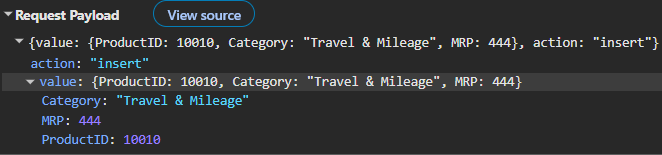
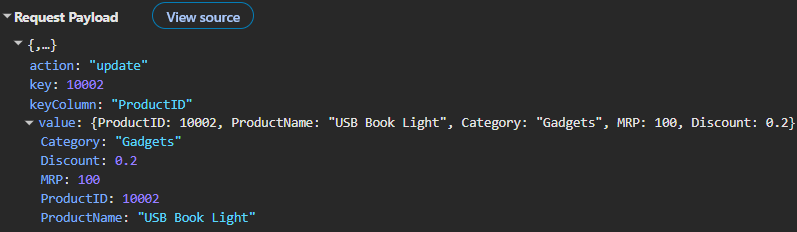
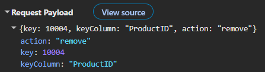

# Express.js Server Integration in React Pivot Table

[Express.js](https://expressjs.com/) is a fast and lightweight web framework for Node.js that helps create REST APIs that handle data requests. It provides a simple way to build server-side applications and connect them with client-side components.

When used with the Syncfusion<sup style="font-size:70%">®</sup> React Pivot Table, [Express.js](https://expressjs.com/) can retrieve and page source records before returning them to the Pivot Table. In this example, the Pivot Table performs aggregation in the browser; the server does not implement a server-side pivot engine, filtering, sorting, or searching.

**Application architecture:**

- **Backend**: [Express.js](https://expressjs.com/) server (Node.js) - Handles REST API requests, applies the documented paging parameters, and returns source records for display.
- **Frontend**: React application - Displays the Syncfusion<sup style="font-size:70%">®</sup> Pivot Table and retrieves data from the [Express.js](https://expressjs.com/) server.
- **Data Source**: Business data stored in a database or other data source that is accessed through the [Express.js](https://expressjs.com/) server.


## Prerequisites

| Software / Package              | Recommended version   | Purpose                                                  |
|---------------------------------|-----------------------|----------------------------------------------------------|
| Node.js                         | 20.19+ or 22.12+      | Runtime versions supported by Vite 7 for the [Express.js](https://expressjs.com/) server and React application |
| npm / yarn / pnpm               | Latest stable version | Package manager                                          |
| Express                         | ^4.18.2               | Framework for building REST API services                 |
| cors                            | ^2.8.5                | Enables cross-origin requests between the React application and [Express.js](https://expressjs.com/) server |
| Vite                            | 7.3.1 or later        | React build tool                                         |
| React                           | 18.x or 19.x          | Client framework supported by the documented Syncfusion release |
| @syncfusion/ej2-react-pivotview | 33.1.45 or later      | React Pivot Table component                              |

The package versions in this table describe the configuration used by the sample. The backend snippets target Express 4; review the [Express 5 migration guide](https://expressjs.com/en/guide/migrating-5.html) before changing major versions. Keep all Syncfusion packages on compatible release versions and confirm that the selected React version is supported by the installed `@syncfusion/ej2-react-pivotview` release. The Pivot Table package is commercially licensed; obtain a paid, trial, or eligible community license and complete the [Syncfusion license registration](https://ej2.syncfusion.com/react/documentation/licensing/license-key-registration) before running the client.


## Setting up the Express.js backend

The [Express.js](https://expressjs.com/) backend acts as the central REST API service, handling HTTP requests and responses that power the Syncfusion<sup style="font-size:70%">&reg;</sup> React Pivot Table.

### Step 1: Create the Express server project

Before configuring the [Express.js](https://expressjs.com/) backend, a proper project structure must be created to host the server. This folder will contain the server configuration, required dependencies, and sample data used for processing API requests.

For this example, the [Express.js](https://expressjs.com/) server uses product sales data that can be analyzed in the Pivot Table. The dataset contains product information such as **ProductID**, **ProductName**, **Category**, **MRP**, and **Discount**. This data is used to demonstrate server-side data retrieval for the Pivot Table.

#### Create the project folder

Open a terminal (for example, an integrated terminal in Visual Studio Code, Windows Command Prompt opened with <kbd>Win+R</kbd>, or macOS Terminal launched with <kbd>Cmd+Space</kbd>) and run the following commands.

```bash
mkdir ExpressServer
cd ExpressServer
mkdir src
cd src
mkdir controllers
mkdir routes
mkdir utils
mkdir types
```

The commands leave the terminal in the **ExpressServer/src** folder. Return to the **ExpressServer** folder before creating **package.json**, installing dependencies, or running npm scripts.

The folder structure after this step should look like:

```text
ExpressServer/
└── src/
    ├── controllers/
    ├── routes/
    ├── utils/
    └── types/
```

### Step 2: Install the required packages

After creating the project structure, the next step is to add the packages required for the [Express.js](https://expressjs.com/) server. These packages help create REST API endpoints, handle cross-origin requests, and support TypeScript development.

Create a **package.json** file in the **ExpressServer** folder and add the following content:

```json
{
  "name": "express-server",
  "version": "1.0.0",
  "description": "Express.js server for React Pivot Table data processing and CRUD operations",
  "main": "server.ts",
  "scripts": {
    "dev": "ts-node server.ts",
    "build": "tsc",
    "start": "node dist/server.js"
  },
  "dependencies": {
    "express": "^4.18.2",
    "cors": "^2.8.5"
  },
  "devDependencies": {
    "@types/express": "^4.17.21",
    "@types/cors": "^2.8.17",
    "@types/node": "^20.10.6",
    "typescript": "^5.3.3",
    "ts-node": "^10.9.2"
  }
}
```

**Package descriptions:**

- **express** - Creates the [Express.js](https://expressjs.com/) server and handles REST API routes.
- **cors** - Allows requests from the React application to the [Express.js](https://expressjs.com/) server.
- **typescript** - Adds TypeScript support to the project.
- **ts-node** - Runs TypeScript files directly without generating JavaScript files first.
- **@types/express**, **@types/cors**, and **@types/node** - Provide TypeScript type definitions for [Express.js](https://expressjs.com/), CORS, and Node.js.

**Script descriptions:**

- **npm run dev** - Starts the [Express.js](https://expressjs.com/) server in development mode using TypeScript.
- **npm run build** - Compiles TypeScript files and generates JavaScript output.
- **npm start** - Runs the compiled server from the generated output folder.

After saving the **package.json** file, install the required packages by running the following command from the **ExpressServer** folder:

```bash
npm install
```

After the installation is complete, the project is ready for configuring TypeScript, creating data models, defining API routes, and implementing request handling logic for the Syncfusion<sup style="font-size:70%">®</sup> React Pivot Table.

**Current folder structure:**

```text
ExpressServer/
├── node_modules/
├── src/
│   ├── controllers/
│   ├── routes/
│   ├── utils/
│   └── types/
├── package.json
└── package-lock.json
```

### Step 3: Configure TypeScript

TypeScript helps build scalable applications by providing type safety during development. The configuration file defines how TypeScript code is compiled into JavaScript.

Create a **tsconfig.json** file in the **ExpressServer** folder and add the following configuration:

```json
{
  "compilerOptions": {
    "target": "ES2020",
    "module": "NodeNext",
    "moduleResolution": "NodeNext",
    "lib": ["ES2020"],
    "resolveJsonModule": true,
    "esModuleInterop": true,
    "forceConsistentCasingInFileNames": true,
    "skipLibCheck": true,
    "strict": true,
    "rootDir": "src",
    "outDir": "dist"
  },
  "include": ["src"]
}
```

### Step 4: Create TypeScript interfaces

The next step is to create TypeScript interfaces for the data used in the [Express.js](https://expressjs.com/) server. Interfaces define the structure of the data and help maintain consistency across the application.

Create a new file named **interface.ts** inside the **src/types** folder (**ExpressServer/src/types/interface.ts**) and add the following code:

```typescript
export interface ProductDetails {
  ProductID?: number;
  ProductName?: string;
  Category?: string;
  MRP?: number;
  Discount?: number;
}

export interface DataManagerRequest {
  skip?: number;
  take?: number;
  requiresCounts?: boolean;
}
```

**ProductDetails interface**

| Property | Type | Optional | Description |
|----------|------|----------|-------------|
| ProductID | number | Yes | Unique positive identifier for a product; generated during creation when omitted. |
| ProductName | string | Yes | Name of the product; required by the intended CRUD contract. |
| Category | string | Yes | Product category; required by the intended CRUD contract. |
| MRP | number | Yes | Non-negative maximum retail price in the application's configured currency. |
| Discount | number | Yes | Non-negative decimal discount value; applications must define whether this represents an amount or rate. |

**DataManagerRequest interface**

| Property | Type | Default | Description |
|----------|------|---------|-------------|
| skip | number | 0 | Non-negative integer specifying the number of records to skip. |
| take | number | Total record count | Non-negative integer specifying the number of records to retrieve. |
| requiresCounts | boolean | false | Indicates whether the total record count is requested in the response. |

This example handles only paging-related request fields. It does not process the filtering, sorting, searching, grouping, or aggregation fields that `UrlAdaptor` can send. Implement and validate those operations on the server before using this pattern for large production datasets.

### Step 5: Create a sample data source

After creating the TypeScript interfaces, the next step is to create a sample data source. This data source will be used by the [Express.js](https://expressjs.com/) server to process requests and return data to the Syncfusion<sup style="font-size:70%">®</sup> React Pivot Table.

Create a new file named **data.ts** inside the **src/utils** folder (**ExpressServer/src/utils/data.ts**). This file contains sample product sales data that is stored in memory.





export const productDetails: object[] = [
  {
    ProductID: 10001,
    ProductName: "Smartwatch",
    Category: "Electronics",
    MRP: 100.0,
    Discount: 1.02
  },
  {
    ProductID: 10002,
    ProductName: "USB Book Light",
    Category: "Accessories",
    MRP: 100.0,
    Discount: 0.20
  },
  {
    ProductID: 10003,
    ProductName: "Split Air Conditioner",
    Category: "Home Appliances",
    MRP: 733.98,
    Discount: 0.15
  },
  . . . .
  . . . .
]





The read endpoint accepts an HTTP POST request with an optional request body containing `skip`, `take`, and `requiresCounts`. Validate `skip` and `take` as non-negative integers before slicing records. For UrlAdaptor compatibility, a production endpoint should consistently return an object containing the selected records in `result` and the total pre-paging record count in `count`. The sample controller conditionally returns an unwrapped array and therefore requires correction before it is used as a general UrlAdaptor backend.

### Step 6: Create a controller to handle data requests

After creating the sample data source, the next step is to create a controller. The controller handles incoming API requests, retrieves data from the data source, and returns the requested records to the client application.

Create a new file named **products.controller.ts** inside the **src/controllers** folder (**ExpressServer/src/controllers/products.controller.ts**) and add the following code:





import { Request, Response } from 'express';
import { DataManagerRequest, ProductDetails } from '../types/interface';
import { productDetails } from '../utils/data';

export const getProducts = (req: Request, res: Response) => {
  try {
    const dm: DataManagerRequest = req.body || {};

    let result = [...productDetails];
    const count = result.length;

    const skip = Number.isFinite(dm.skip as number) ? Number(dm.skip ?? 0) : 0;
    const take = Number.isFinite(dm.take as number) ? Number(dm.take ?? count) : count;

    result = result.slice(skip, skip + take);

    res.json(dm.requiresCounts ? { result, count } : result);
  } catch (error) {
    res.status(500).json({
      error: 'Failed to retrieve products',
      result: [],
      count: 0
    });
  }
};





**Controller descriptions:**

| Item | Description |
|--------|-------------|
| getProducts | Handles requests for retrieving product records from the data source. |
| req.body | Receives request parameters sent from the client application. |
| productDetails | Contains the sample product data stored in memory. |
| skip | Specifies the starting position for retrieving records. |
| take | Specifies the number of records to return. |
| count | Stores the total number of available records. |
| res.json() | Returns the requested data as a JSON response. |
| res.status(500) | Returns an error response with a status of 500 when data processing fails. |

### Step 7: Create API routes

After creating the controller, the next step is to define an API route. A route maps an incoming request to the appropriate controller method. In this example, the route receives requests from the client application and forwards them to the **getProducts** controller method.

Create a new file named **products.routes.ts** inside the **src/routes** folder (**ExpressServer/src/routes/products.routes.ts**) and add the following code:





import { Router } from 'express';
import { getProducts } from '../controllers/products.controller';

const router = Router();

router.post('/', (req, res) => {
    return getProducts(req, res);
});

export default router;






**Route workflow:**

- Creates a router instance using **Router()** to manage API routes.
- Imports the **getProducts** controller method that handles product data requests.
- Defines a **POST** route at **/** to receive requests from the client application.
- Passes the request to the **getProducts** controller method for processing.
- Exports the router so that it can be registered in the [Express.js](https://expressjs.com/) server configuration.

After creating the route, the next step is to register it in the [Express.js](https://expressjs.com/) server so that product data can be accessed through the API endpoint.

### Step 8: Configure the Express.js server

After creating the API route, the next step is to configure the [Express.js](https://expressjs.com/) server. This server acts as the central entry point for the application. It processes incoming requests, applies the required middleware, and registers the API routes that provide product data to the Syncfusion<sup style="font-size:70%">®</sup> React Pivot Table.

Create a new file named **server.ts** in the **ExpressServer** folder (**ExpressServer/server.ts**) and add the following code:





import express, { Application } from 'express';
import cors from 'cors';
import productsRoutes from './src/routes/products.routes';

const app: Application = express();
const PORT = process.env.PORT ? Number(process.env.PORT) : 5000;

// Enable CORS for all origins (configure as needed for production)
// The methods list reflects that the Syncfusion DataManager uses POST
// for all read and CRUD operations when paired with UrlAdaptor.
app.use(cors({
  origin: '*',
  methods: ['POST'],
  allowedHeaders: ['Content-Type', 'Authorization']
}));

// Parse JSON request bodies
app.use(express.json());

// Parse URL-encoded request bodies
app.use(express.urlencoded({ extended: true }));

// Mount product routes
app.use('/api/products', productsRoutes);

app.listen(PORT, () => {
  console.log(`Products endpoint: http://localhost:${PORT}/api/products`);
});

export default app;





**Configuration descriptions:**

| Configuration | Description |
|--------------|-------------|
| express() | Creates and initializes the [Express.js](https://expressjs.com/) application. |
| cors() | Allows requests from the React application to the [Express.js](https://expressjs.com/) server. |
| express.json() | Parses JSON data received in the request body. |
| express.urlencoded() | Parses URL-encoded data received in the request body. |
| /api/products | Defines the API endpoint for accessing product data. |
| app.listen() | Starts the [Express.js](https://expressjs.com/) server and listens for incoming requests on the specified port. |
| process.env.PORT | Optional environment variable that overrides the default port number. |

N> The [Express.js](https://expressjs.com/) server is configured to listen on port **5000** by default. To use a different port, set the `PORT` environment variable before starting the server. Use `PORT=4000 npm run dev` on macOS or Linux, `$env:PORT=4000; npm run dev` in PowerShell, or `set PORT=4000 && npm run dev` in Windows Command Prompt. The value must be a valid available port, and the React `API_BASE_URL` in `App.tsx` must match it.

### Step 9: Run the Express.js server

After completing the server configuration, the next step is to run the [Express.js](https://expressjs.com/) server and verify that the API endpoint is accessible.

Run the following command from the **ExpressServer** folder:

```bash
npm run dev
```

Once the server starts successfully, it will listen on **http://localhost:5000**.

The product API endpoint uses HTTP POST at the following URL:

```text
http://localhost:5000/api/products
```

Do not verify this endpoint by opening it directly in a browser, because that sends a GET request and returns 404. Test it with an API client using the `Content-Type: application/json` header and an empty object or supported paging fields in the JSON request body. A successful UrlAdaptor-compatible response contains a `result` collection and a total `count`.

The [Express.js](https://expressjs.com/) backend is now ready to provide product data to the Syncfusion<sup style="font-size:70%">®</sup> React Pivot Table.

## Setting up the React Pivot Table client

After running the [Express.js](https://expressjs.com/) server successfully, the next step is to create a React application and connect the Syncfusion<sup style="font-size:70%">®</sup> React Pivot Table to the [Express.js](https://expressjs.com/) API. This allows the Pivot Table to retrieve product data from the server and display it in a summarized and interactive report.

### Step 1: Create a React application and add the Pivot Table

Create a Vite React application with the TypeScript template and add the Syncfusion<sup style="font-size:70%">®</sup> React Pivot Table component by following the [React Pivot Table getting started](https://ej2.syncfusion.com/react/documentation/pivotview/getting-started) documentation.

The examples in this section use a Vite-based React application with TypeScript. Before proceeding, install the required Syncfusion<sup style="font-size:70%">®</sup> Pivot Table package in the React project by running the following command:

```bash
npm install @syncfusion/ej2-react-pivotview
```

### Step 2: Configure the Pivot Table with UrlAdaptor

After creating the React application and adding the required Syncfusion<sup style="font-size:70%">®</sup> Pivot Table package, the next step is to connect the Pivot Table to the [Express.js](https://expressjs.com/) API.

To retrieve data from the [Express.js](https://expressjs.com/) server, use the [DataManager](https://ej2.syncfusion.com/react/documentation/data/getting-started) with [UrlAdaptor](https://ej2.syncfusion.com/react/documentation/data/adaptors/url-adaptor). The [UrlAdaptor](https://ej2.syncfusion.com/react/documentation/data/adaptors/url-adaptor) acts as a bridge between the Syncfusion<sup style="font-size:70%">®</sup> React Pivot Table and the [Express.js](https://expressjs.com/) server. It sends data requests from the Pivot Table to the configured API endpoint and receives the response from the server. The returned data is then used by the Pivot Table to generate and display the report.

Replace the existing code in the **App.tsx** file with the following code:

N> Every `<Port>` token in the client examples is a placeholder, not valid configuration. Replace it with the backend port, which is **5000** by default, or read the base URL from the React application's environment configuration.





import * as React from 'react';
import { PivotViewComponent, Inject, FieldList } from '@syncfusion/ej2-react-pivotview';
import { DataManager, UrlAdaptor } from '@syncfusion/ej2-data';
import type { DataSourceSettingsModel } from '@syncfusion/ej2-pivotview/src/model/datasourcesettings-model';
import './App.css';

function App(): React.ReactElement {
    const API_BASE_URL = 'http://localhost:<Port>/api/products';

    const data: DataManager = new DataManager({
        url: API_BASE_URL,
        adaptor: new UrlAdaptor()
    });

    const dataSourceSettings: DataSourceSettingsModel = {
        dataSource: data,
        expandAll: true,
        rows: [{ name: 'ProductID' }],
        columns: [{ name: 'Category' }],
        values: [{ name: 'MRP' }],
        filters: []
    };

    const pivotObj = React.useRef<PivotViewComponent>(null);

    return (
        <div className='control-section' style={{ margin: 100 }}>
            <PivotViewComponent
                ref={pivotObj}
                id='PivotView'
                height={350}
                width={700}
                dataSourceSettings={dataSourceSettings}
                showFieldList={true}
            >
                <Inject services={[FieldList]} />
            </PivotViewComponent>
        </div>
    );
}

export default App;





#### Code explanation

- [DataManager](https://ej2.syncfusion.com/react/documentation/data/getting-started) - Configured with the [Express.js](https://expressjs.com/) API endpoint at `http://localhost:<Port>/api/products` to retrieve product data from the server. Replace `<Port>` with the port number configured for the [Express.js](https://expressjs.com/) server. In this example, the port number is **5000**.

- [UrlAdaptor](https://ej2.syncfusion.com/react/documentation/data/adaptors/url-adaptor) - Connects the Pivot Table to the [Express.js](https://expressjs.com/) REST API. It formats the request, sends it to the configured endpoint, and processes the JSON response returned by the server.

- [dataSourceSettings](https://ej2.syncfusion.com/react/documentation/api/pivotview/index-default#datasourcesettings): Defines the Pivot Table report layout.
  - [rows](https://ej2.syncfusion.com/react/documentation/api/pivotview/datasourcesettingsmodel#rows): Displays **ProductID** values as row headers.
  - [columns](https://ej2.syncfusion.com/react/documentation/api/pivotview/datasourcesettingsmodel#columns): Displays **Category** values as column headers.
  - [values](https://ej2.syncfusion.com/react/documentation/api/pivotview/datasourcesettingsmodel#values): Summarizes the **MRP** field based on the row and column combinations.

- [PivotViewComponent](https://ej2.syncfusion.com/react/documentation/api/pivotview/index-default): Displays the Pivot Table using the data returned from the [Express.js](https://expressjs.com/) server.
- [FieldList](https://ej2.syncfusion.com/react/documentation/pivotview/field-list): Displays the Pivot Table Field List, allowing users to dynamically modify the report layout by moving fields between rows, columns, values, and filters.

### Step 3: Run the Pivot Table

After configuring the React Pivot Table and connecting it to the [Express.js](https://expressjs.com/) API, keep the backend running in its terminal. Open a second terminal for the React application, then run and verify the client.

Open a terminal in the React application folder and run the following command:

```bash
npm run dev
```

Once the application starts successfully, open the URL displayed in the terminal. The Pivot Table sends a request to the configured [Express.js](https://expressjs.com/) API endpoint, retrieves the product data, and generates a report based on the configuration defined in [dataSourceSettings](https://ej2.syncfusion.com/react/documentation/api/pivotview/index-default#datasourcesettings).

The Syncfusion<sup style="font-size:70%">®</sup> React Pivot Table is successfully connected when it displays `ProductID` row headers, `Category` column headers, and aggregated `MRP` values from the Express response.

### Step 4: Verify data binding

After running the React application, verify that the Syncfusion<sup style="font-size:70%">®</sup> React Pivot Table is receiving data from the [Express.js](https://expressjs.com/) server correctly.

1. Open the browser's **Developer Tools** by pressing **F12** and select the **Network** tab.
2. Refresh the application page.
3. Look for a **POST** request sent to the API endpoint (`http://localhost:<Port>/api/products`).
4. Select the request and review the response returned by the server.

A successful response should contain product records in JSON format. Depending on the request, the response may also include the total record count.

If the data is returned successfully, the Pivot Table generates and displays the report based on the configured fields. If data is not displayed, check the **Network** tab for failed requests and the **Console** tab for any application errors.

## CRUD operations with Pivot Table

The Syncfusion<sup style="font-size:70%">®</sup> React Pivot Table supports CRUD (Create, Read, Update, Delete) operations. These operations connect to the backend through specific [DataManager](https://ej2.syncfusion.com/react/documentation/data/getting-started) properties such as `insertUrl`, `removeUrl`, and `updateUrl`. When an add, update, or delete action is performed through the drill-through grid, the [DataManager](https://ej2.syncfusion.com/react/documentation/data/getting-started) automatically sends an HTTP POST request to the [Express.js](https://expressjs.com/) server. The server then processes the operation and returns the updated data. This enables the following operations:

- **Create**: Add new records through the drill-through grid.
- **Read**: Display data from the backend (already configured in the previous section).
- **Update**: Edit underlying records in the drill-through grid.
- **Delete**: Delete records from the data source.

This section explains how to set up the server endpoints and configure the React client so that changes made in the drill-through grid are sent to the backend. Pivot Table editing applies to relational data sources. For more details, refer to the [Editing documentation](https://ej2.syncfusion.com/react/documentation/pivotview/editing).

### Configure server CRUD operations

After verifying data binding between the Syncfusion<sup style="font-size:70%">®</sup> React Pivot Table and the [Express.js](https://expressjs.com/) server, the next step is to add support for Create, Update, and Delete operations. This section explains how to update the backend controller and API routes to process CRUD requests and update the data source.

#### Update the backend controller for CRUD operations

To support CRUD operations, update the backend controller with methods that can create, update, and delete records in the data source. These methods handle requests from the client application and apply the corresponding changes to the product data.

Open the **ExpressServer/src/controllers/products.controller.ts** file and add the following CRUD methods below the existing **getProducts** method.





import { Request, Response } from 'express';
import { DataManagerRequest, ProductDetails } from '../types/interface';
import { productDetails } from '../utils/data';

// Existing Product data fetching code

export const createProduct = (req: Request, res: Response) => {
  try {
    const updatedRecord = req.body.value || req.body;
    const productID = updatedRecord.ProductID ?? updatedRecord.productID;

    const newId = productID ? productID : Math.max(0, ...productDetails.map((p) => p.ProductID ?? 0)) + 1;
    const newProduct: ProductDetails = {
      ProductID: newId,
      ProductName: updatedRecord.ProductName ?? updatedRecord.productName,
      Category: updatedRecord.Category ?? updatedRecord.category,
      MRP: Number(updatedRecord.MRP ?? 0),
      Discount: Number(updatedRecord.Discount ?? 0),
    };

    productDetails.push(newProduct);
    res.status(201).json(newProduct);
  } catch (error) {
    res.status(422).json({
      message: 'Insert failed: ' + (error instanceof Error ? error.message : String(error))
    });
  }
};

export const updateProduct = (req: Request, res: Response) => {
  try {
    const updatedData = req.body.value || req.body;
    const id = req.params.id ?? req.body.key ?? updatedData.ProductID ?? updatedData.productId;
    const productId = Number(id);

    if (!Number.isFinite(productId)) {
      return res.status(422).json({ message: 'Missing ProductID' });
    }

    const index = productDetails.findIndex((p) => p.ProductID === productId);
    if (index === -1) {
      return res.status(404).json({ error: 'Product not found' });
    }

    productDetails[index] = { ...productDetails[index], ...updatedData, ProductID: productId };
    res.json(productDetails[index]);
  } catch (error) {
    res.status(422).json({ message: 'Update failed: ' + (error instanceof Error ? error.message : String(error)) });
  }
};

export const deleteProduct = (req: Request, res: Response) => {
  try {
    const id = req.params.id ?? req.body.key;
    const productId = Number(id);

    if (!Number.isFinite(productId)) {
      return res.status(422).json({
        message: 'Missing ProductID'
      });
    }

    const index = productDetails.findIndex((p) => p.ProductID === productId);
    if (index === -1) {
      return res.status(404).json({ error: 'Product not found' });
    }

    const deleted = productDetails[index];
    productDetails.splice(index, 1);
    res.status(200).json({
      message: 'Product deleted',
      deleted
    });
  } catch (error) {
    res.status(422).json({
      message: 'Delete failed: ' + (error instanceof Error ? error.message : String(error))
    });
  }
};





The sample CRUD handlers use an in-memory array. Changes are lost whenever the Express server restarts. Before production use, validate and normalize every request, reject unknown fields, require non-empty `ProductName` and `Category` values, require non-negative numeric `MRP` and `Discount` values, convert `ProductID` to a number, and reject duplicate or invalid identifiers. Persist records in a database or another durable store.

The intended endpoint contract is:

| Endpoint | Request fields | Success response | Error responses |
|----------|----------------|------------------|-----------------|
| `POST /api/products/create` | A product in `value`, with `ProductID` optional | Created product, status 201 | Status 422 for invalid input or duplicate identifiers |
| `POST /api/products/update` | Updated product in `value`; identifier in `key` or `value.ProductID` | Updated product, status 200 | Status 422 for invalid input; status 404 when absent |
| `POST /api/products/remove` | Identifier in `key` | Deletion confirmation and deleted product, status 200 | Status 422 for an invalid identifier; status 404 when absent |

##### Controller code explanation

The controller includes three methods: **createProduct**, **updateProduct**, and **deleteProduct**. These methods handle requests sent from the client application and perform the corresponding CRUD operation on the product data source.

**createProduct - code breakdown:**

| Step | Purpose | Implementation |
|------|---------|----------------|
| **1. Read request data** | Retrieve the product details submitted by the client. | `const updatedRecord = req.body.value \|\| req.body;` |
| **2. Read ProductID** | Check whether a ProductID is already available in the request. | `const productID = updatedRecord.ProductID ?? updatedRecord.productID;` |
| **3. Generate ProductID** | Create a new ProductID when it is not provided. | `const newId = productID ? productID : Math.max(0, ...productDetails.map((p) => p.ProductID ?? 0)) + 1;` |
| **4. Create product object** | Build a new product record using the received values. | `const newProduct: ProductDetails = { ... };` |
| **5. Add record** | Store the new product in the data source. | `productDetails.push(newProduct);` |
| **6. Return response** | Send the created product back to the client. | `res.status(201).json(newProduct);` |

**updateProduct - code breakdown:**

| Step | Purpose | Implementation |
|------|---------|----------------|
| **1. Read request data** | Retrieve the updated values submitted by the client. | `const updatedData = req.body.value \|\| req.body;` |
| **2. Get ProductID** | Identify the product that needs to be updated. | `const id = req.params.id ?? req.body.key ?? updatedData.ProductID ?? updatedData.productId;` |
| **3. Validate ProductID** | Ensure a valid ProductID is available. | `if (!Number.isFinite(productId)) { return res.status(422).json({ message: 'Missing ProductID' }); }` |
| **4. Find product** | Locate the existing product in the data source. | `const index = productDetails.findIndex((p) => p.ProductID === productId);` |
| **5. Validate record** | Ensure the product exists before updating. | `if (index === -1) { return res.status(404).json({ error: 'Product not found' }); }` |
| **6. Update record** | Apply the new values to the existing product. | `productDetails[index] = { ...productDetails[index], ...updatedData, ProductID: productId };` |
| **7. Return response** | Send the updated product back to the client. | `res.json(productDetails[index]);` |

**deleteProduct - code breakdown:**

| Step | Purpose | Implementation |
|------|---------|----------------|
| **1. Read ProductID** | Identify the product that needs to be removed. | `const id = req.params.id ?? req.body.key;` |
| **2. Validate ProductID** | Ensure a valid ProductID is available. | `if (!Number.isFinite(productId)) { return res.status(422).json({ message: 'Missing ProductID' }); }` |
| **3. Find product** | Locate the matching product in the data source. | `const index = productDetails.findIndex((p) => p.ProductID === productId);` |
| **4. Validate record** | Ensure the product exists before deleting. | `if (index === -1) { return res.status(404).json({ error: 'Product not found' }); }` |
| **5. Delete record** | Remove the product from the data source. | `productDetails.splice(index, 1);` |
| **6. Return response** | Confirm that the record was deleted successfully. | `res.status(200).json({ message: 'Product deleted', deleted });` |

#### Update the backend routing for CRUD requests

After adding the CRUD controller methods, the next step is to create API routes for handling create, update, and delete requests. These routes receive requests from the client application and forward them to the corresponding controller methods.

Open the **ExpressServer/src/routes/products.routes.ts** file and update it with the following code:

```typescript
import { Router } from 'express';
import { getProducts, createProduct, updateProduct, deleteProduct } from '../controllers/products.controller';

const router = Router();

// Existing data retrieval route
router.post('/', (req, res) => {
    return getProducts(req, res);
});

// CRUD routes
router.post('/create', (req, res) => {
    return createProduct(req, res);
});

router.post('/update', (req, res) => {
    return updateProduct(req, res);
});

router.post('/remove', (req, res) => {
    return deleteProduct(req, res);
});

export default router;
```

##### Route code explanation

- The `POST /create` route handles requests for adding new product records and forwards the request to the **createProduct** controller method.
- The `POST /update` route handles requests for modifying existing product records and forwards the request to the **updateProduct** controller method.
- The `POST /remove` route handles requests for deleting product records and forwards the request to the **deleteProduct** controller method.

After updating the routes, the [Express.js](https://expressjs.com/) server can process Create, Read, Update, and Delete requests for the product data source.

> **Important:** Restart the Express server (`Ctrl+C`, then `npm run dev`) so that the new CRUD routes and controller methods are picked up before testing from the React client.

### Configure client-side CRUD endpoints

After configuring the CRUD operations on the [Express.js](https://expressjs.com/) server, the next step is to update the React application. This configuration enables the Syncfusion<sup style="font-size:70%">®</sup> React Pivot Table to send Create, Update, and Delete requests to the corresponding API endpoints.

The client-side configuration includes the following steps:

- Configure [DataManager](https://ej2.syncfusion.com/react/documentation/data/getting-started) with CRUD URLs.
- Enable editing support in the Pivot Table.
- Specify a primary key field to identify records during update and delete operations.

#### Configure DataManager with CRUD URLs

Configure the [DataManager](https://ej2.syncfusion.com/react/documentation/data/getting-started) with the API endpoints required for retrieving, creating, updating, and deleting records. When a CRUD operation is performed, the [DataManager](https://ej2.syncfusion.com/react/documentation/data/getting-started) automatically sends the request to the corresponding [Express.js](https://expressjs.com/) endpoint.

```typescript
import { PivotViewComponent } from '@syncfusion/ej2-react-pivotview';
import { DataManager, UrlAdaptor } from '@syncfusion/ej2-data';
import type { DataSourceSettingsModel } from '@syncfusion/ej2-pivotview/src/model/datasourcesettings-model';
import './App.css';

function App(): React.ReactElement {
    const API_BASE_URL = 'http://localhost:<Port>/api/products';

    const data: DataManager = new DataManager({
        url: API_BASE_URL,
        insertUrl: API_BASE_URL + '/create',
        updateUrl: API_BASE_URL + '/update',
        removeUrl: API_BASE_URL + '/remove',
        adaptor: new UrlAdaptor()
    });
}
```

**Code explanation:**

- **url** retrieves product data from the [Express.js](https://expressjs.com/) server when the Pivot Table is loaded.
- **insertUrl** sends requests to the **/create** endpoint when a new record is added. The request is processed by the **createProduct** controller method.
- **updateUrl** sends requests to the **/update** endpoint when an existing record is modified. The request is processed by the **updateProduct** controller method.
- **removeUrl** sends requests to the **/remove** endpoint when a record is deleted. The request is processed by the **deleteProduct** controller method.
- **UrlAdaptor** manages communication between the Pivot Table and the [Express.js](https://expressjs.com/) server by sending requests and processing responses.

##### Insert details included in the request payload

The following image illustrates the new product record passed from the [DataManager](https://ej2.syncfusion.com/react/documentation/data/getting-started) to the **createProduct** API endpoint.



##### Update details included in the request payload

The following image illustrates the updated product record passed from the [DataManager](https://ej2.syncfusion.com/react/documentation/data/getting-started) to the **updateProduct** API endpoint.



##### Delete details included in the request payload

The following image illustrates the product key passed from the [DataManager](https://ej2.syncfusion.com/react/documentation/data/getting-started) to the **deleteProduct** API endpoint.



#### Enable edit settings

Configure the [editSettings](https://ej2.syncfusion.com/react/documentation/api/pivotview/index-default#editsettings) property to enable CRUD operations in the Pivot Table. Add the `CellEditSettings` type import at the top of `App.tsx`:

```typescript
import { CellEditSettings } from '@syncfusion/ej2-react-pivotview';
```

Then define the settings inside the component and wire them to the `PivotViewComponent`:

```typescript
  // Enable editing functionality
  const editSettings: CellEditSettings = { 
    allowEditing: true,    // Enables the Edit button and allows users to modify existing records.
    allowAdding: true,     // Enables the Add button and allows users to create new records.
    allowDeleting: true,   // Enables the Delete button and allows users to delete records.
    mode: 'Normal'         // Uses Normal mode for editing; other options: 'Dialog', 'Batch', 'CommandColumn'.
  };

  const pivotObj = React.useRef<PivotViewComponent>(null);

  return (
    <PivotViewComponent 
      id='PivotView' 
      ref={pivotObj}
      editSettings={editSettings} 
      >
    </PivotViewComponent>
  );
```

The Pivot Table supports Normal, Dialog, and Batch editing modes, configured using the [mode](https://ej2.syncfusion.com/react/documentation/api/pivotview/celleditsettingsmodel#mode) property. Command-column buttons are configured with [allowCommandColumns](https://ej2.syncfusion.com/react/documentation/api/pivotview/celleditsettingsmodel#allowcommandcolumns). For detailed information, refer to the [Editing documentation](https://ej2.syncfusion.com/react/documentation/pivotview/editing).

#### Configure the primary key for editing

After enabling editing, configure a primary key for the drill-through grid. A primary key is required to identify the correct record during update and delete operations.

**What is drill-through editing?**

Drill-through editing allows users to view and edit the underlying records that contribute to a summarized value in the Pivot Table. When a value cell is double-clicked, a drill-through grid opens and displays the corresponding source records. The [beginDrillThrough](https://ej2.syncfusion.com/react/documentation/pivotview/drill-through#begindrillthrough) event is triggered just before the drill-through grid is displayed. This event can be used to customize the grid and configure the primary key field required for editing operations.

**Why is the primary key important?**

A primary key uniquely identifies each record in the data source. During update and delete operations, the [DataManager](https://ej2.syncfusion.com/react/documentation/data/getting-started) uses this key to determine which record should be modified or deleted. In this example, **ProductID** is used as the primary key.

> **Note:** To enable editing in the drill-through grid, configure the required editing options (`allowEditing`, `allowAdding`, or `allowDeleting`) in the `editSettings` property of the Pivot Table.

Import the required event type at the top of **App.tsx**:

```typescript
import type { BeginDrillThroughEventArgs } from '@syncfusion/ej2-pivotview';
```

Next, define the event handler and assign it to the [beginDrillThrough](https://ej2.syncfusion.com/react/documentation/pivotview/drill-through#begindrillthrough) event:

```typescript
    function beginDrillThrough(args: BeginDrillThroughEventArgs) {
        for (let i = 0; i < args.gridObj.columns.length; i++) {
            if (args.gridObj.columns[i].field === "ProductID") {
                args.gridObj.columns[i].isPrimaryKey = true;
            }
        }
    }

return (
  <PivotViewComponent
    id='PivotView'
    ref={pivotObj}
    beginDrillThrough={beginDrillThrough}
  >
  </PivotViewComponent>
);
```

**How it works:**

- The event iterates through all columns in the drill-through (edit) grid.
- When the `ProductID` column is found, it is marked as the primary key using `isPrimaryKey = true`.
- The configured primary key is used by the [DataManager](https://ej2.syncfusion.com/react/documentation/data/getting-started) during update and delete operations.

After completing these configurations, the Pivot Table is ready to perform Create, Update, and Delete operations through the drill-through editing interface.

#### Combined App.tsx example with CRUD support

The previous sections explained how to:

- Configure **DataManager** with CRUD endpoints.
- Enable editing in the Pivot Table using **editSettings**.
- Configure the primary key using the **beginDrillThrough** event.

The following example combines all these configurations into a single React component. It enables the Syncfusion<sup style="font-size:70%">®</sup> React Pivot Table to retrieve data from the [Express.js](https://expressjs.com/) server and perform create, update, and delete operations through the configured API endpoints.





import * as React from 'react';
import { PivotViewComponent, CellEditSettings, Inject, FieldList } from '@syncfusion/ej2-react-pivotview';
import { DataManager, UrlAdaptor } from '@syncfusion/ej2-data';
import type { DataSourceSettingsModel } from '@syncfusion/ej2-pivotview/src/model/datasourcesettings-model';
import type { BeginDrillThroughEventArgs } from '@syncfusion/ej2-pivotview';
import './App.css';

function App(): React.ReactElement {

    const API_BASE_URL = 'http://localhost:<Port>/api/products';

    const data: DataManager = new DataManager({
        url: API_BASE_URL,
        insertUrl: API_BASE_URL + '/create',
        updateUrl: API_BASE_URL + '/update',
        removeUrl: API_BASE_URL + '/remove',
        adaptor: new UrlAdaptor()
    });

    const dataSourceSettings: DataSourceSettingsModel = {
        dataSource: data,
        expandAll: true,
        rows: [{ name: 'ProductID' }],
        columns: [{ name: 'Category' }],
        values: [{ name: 'MRP' }],
        filters: []
    };

    const editSettings: CellEditSettings = {
        allowEditing: true,
        allowAdding: true,
        allowDeleting: true,
        mode: 'Normal'
    };

    const pivotObj = React.useRef<PivotViewComponent>(null);

    function beginDrillThrough(args: BeginDrillThroughEventArgs) {
        for (let i = 0; i < args.gridObj.columns.length; i++) {
            if (args.gridObj.columns[i].field === 'ProductID') {
                args.gridObj.columns[i].isPrimaryKey = true;
            }
        }
    }

    return (
        <div className='control-section' style={{ margin: 100 }}>
            <PivotViewComponent
                ref={pivotObj}
                id='PivotView'
                height={350}
                width={700}
                dataSourceSettings={dataSourceSettings}
                showFieldList={true}
                editSettings={editSettings}
                beginDrillThrough={beginDrillThrough}
            >
                <Inject services={[FieldList]} />
            </PivotViewComponent>
        </div>
    );
}

export default App;





### Important notes

- **Primary key field**: The primary key field (**ProductID**) cannot be modified during editing. Changing it causes data inconsistency because it uniquely identifies each record.
- **Refresh behavior**: The editing workflow updates aggregated values after a successful operation. If remote changes are not displayed, reload the DataManager-backed source and refresh the Pivot Table through its stored component reference.

### Test CRUD operations

After configuring the CRUD endpoints and enabling editing, verify that the create, update, and delete operations work correctly between the Syncfusion<sup style="font-size:70%">®</sup> React Pivot Table and the [Express.js](https://expressjs.com/) server.

1. **Test create operation**

   - Double-click a value cell in the Pivot Table to open the drill-through grid.
   - Click **Add** and enter the required product details.
   - Click **Update** to save the new record.
   - Verify that a request is sent to the **create** endpoint (`http://localhost:<Port>/api/products/create`).
   - Confirm that the newly added record appears in the drill-through grid and is reflected in the Pivot Table.

2. **Test update operation**

   - In the drill-through grid, select a record and click **Edit**.
   - Modify one or more field values.
   - Click **Update** to save the changes.
   - Verify that a request is sent to the **update** endpoint (`http://localhost:<Port>/api/products/update`).
   - Confirm that the updated values are displayed in both the drill-through grid and the Pivot Table.

3. **Test delete operation**

   - In the drill-through grid, select a record and click **Delete**.
   - Confirm the deletion action.
   - Verify that a request is sent to the **remove** endpoint (`http://localhost:<Port>/api/products/remove`).
   - Confirm that the selected record is removed from the drill-through grid and the Pivot Table.

4. **Verify the updated data**

   - Ensure that all changes made through the drill-through grid are reflected in the Pivot Table.
   - Verify that the updated data is returned correctly from the [Express.js](https://expressjs.com/) server.
   - If the application uses a database or another persistent data store, verify that the changes are saved successfully.

## Best practices for Express.js server integration

The following recommendations help ensure reliable communication between the Syncfusion<sup style="font-size:70%">®</sup> React Pivot Table and the [Express.js](https://expressjs.com/) server while improving application stability, performance, and maintenance.

### 1. API response structure

- **Use a consistent response format**: Return data in a consistent structure so that the [DataManager](https://ej2.syncfusion.com/react/documentation/data/getting-started) can process the response correctly.
- **Return data in JSON format**: Ensure that the API returns data in JSON format. When required, include both the `result` collection and the `count` value so that the [DataManager](https://ej2.syncfusion.com/react/documentation/data/getting-started) can process the response correctly.
- **Use consistent field names**: Ensure that field names in the API response match the field names configured in the Pivot Table data source settings.

### 2. Error handling

The sample handlers demonstrate response status codes but do not implement all of the following production safeguards. Add them before deploying the API:

- **Validate incoming data**: Check the data received from create, update, and delete requests before updating the data source.
- **Return meaningful error messages**: Provide clear error messages when an operation cannot be completed.
- **Log server errors**: Record application errors and request details to simplify troubleshooting.
- **Verify record availability**: Check whether a record exists before performing update or delete operations.
- **Handle invalid requests**: Return appropriate HTTP status codes and messages for invalid or incomplete requests.

### 3. Application maintenance

- **Organize project files**: Keep controllers, routes, utility files, and type definitions in separate folders.
- **Use meaningful names**: Choose clear names for API routes, controller methods, variables, and data models.
- **Reuse common logic**: Move commonly used code into shared utility files whenever possible.
- **Document API endpoints**: Maintain clear documentation for API routes, request formats, and response structures.
- **Keep configuration separate**: Store application settings such as port numbers and API configurations in dedicated configuration files when appropriate.

### 4. Performance considerations

- **Limit unnecessary data retrieval**: Return only the records required for the current request.
- **Use pagination when needed**: Process large datasets in smaller sections to reduce response size.
- **Use appropriate data storage**: For production applications, use a database instead of in-memory data storage.
- **Monitor API performance**: Regularly review response times and server resource usage to maintain smooth application performance.

### 5. Security considerations

- **Restrict CORS origins**: Replace the development-only wildcard origin with the trusted client origins used in each deployed environment.
- **Authenticate and authorize requests**: Protect read and CRUD endpoints before exposing them outside a local development environment.
- **Limit request size and rate**: Configure JSON body limits and rate controls appropriate for the application.

## Troubleshooting

The following table lists common issues that may occur when integrating the Syncfusion<sup style="font-size:70%">®</sup> React Pivot Table with the [Express.js](https://expressjs.com/) server, along with their recommended solutions.

| Issue | Symptom | Resolution |
|---------|---------|---------|
| **Empty Pivot Table** | The Pivot Table loads, but no data is displayed. | Verify that the `getProducts` endpoint returns data and that the JSON response from the [Express.js](https://expressjs.com/) server contains the expected product records. Also ensure that the field names returned by the server match the fields configured in the Pivot Table's [dataSourceSettings](https://ej2.syncfusion.com/react/documentation/api/pivotview/index-default#datasourcesettings). |
| **No Records Returned** | The request completes successfully, but no records appear in the Pivot Table. | Check that the `skip` and `take` values sent by the [DataManager](https://ej2.syncfusion.com/react/documentation/data/getting-started) are valid. Also verify that the `requiresCounts` flag is set so that the total count is returned along with the result. |
| **500 Error on Data Fetch** | The [Express.js](https://expressjs.com/) server returns an internal server error (status 500) when fetching data. | Add server-side error logging, then review the logged exception. The sample response intentionally does not expose internal error details to the client. |
| **422 Error on Create** | Adding a new record returns a 422 status with an insert failed message. | Verify that the record being sent contains valid values for **ProductName**, **Category**, **MRP**, and **Discount**. Also check that the request body is correctly parsed by the [Express.js](https://expressjs.com/) server. |
| **422 Error on Update or Delete** | Editing or deleting a record returns a 422 status with a missing ProductID message. | Ensure that the **ProductID** field is marked as the primary key in the `beginDrillThrough` event. Without this, the [Express.js](https://expressjs.com/) server cannot identify the record to update or delete. |
| **404 Error on Update or Delete** | Editing or deleting a record returns a 404 status with a product not found message. | Confirm that the **ProductID** being sent matches an existing record in the server's data source. Also check that the record was not already removed in a previous request. |
| **201 Response Not Returned on Create** | A new record is added, but a 201 status is not received. | Verify that the `insertUrl` configured in the [DataManager](https://ej2.syncfusion.com/react/documentation/data/getting-started) points to the `/create` route. Also ensure that the [Express.js](https://expressjs.com/) server returns the newly created record with a 201 status on success. |
| **Changes Not Reflected in the Pivot Table** | A create, update, or delete operation completes, but the latest data is not displayed. | Programmatically refresh the Pivot Table from the React client after each operation by calling `pivotObj.current?.refresh();` from the `ref` you stored on the `PivotViewComponent`. Also verify that the [Express.js](https://expressjs.com/) server correctly processes the request and returns the updated data without errors. |
| **Network Request Fails** | The request does not reach the [Express.js](https://expressjs.com/) server. | Verify that the [Express.js](https://expressjs.com/) server is running, the endpoint URL is correct, CORS is enabled on the server, and the `Content-Type: application/json` header is sent so the JSON body is parsed correctly. |

If issues persist, use the browser's **Developer Tools** (**F12**) to inspect the **Network** and **Console** tabs. These tools help identify request failures, response status codes, and JavaScript exceptions.

## Complete sample repository

For a complete working implementation, refer to the [GitHub repository](https://github.com/SyncfusionExamples/syncfusion-react-pivot-with-express-server).

## See also

**Data binding:**

- [**Pivot Table Data Binding**](https://ej2.syncfusion.com/react/documentation/pivotview/data-binding)
- [**DataManager**](https://ej2.syncfusion.com/react/documentation/data/getting-started)
- [**UrlAdaptor**](https://ej2.syncfusion.com/react/documentation/data/adaptors/url-adaptor)

**Editing:**

- [**Pivot Table Editing**](https://ej2.syncfusion.com/react/documentation/pivotview/editing)
