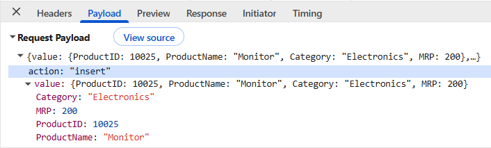
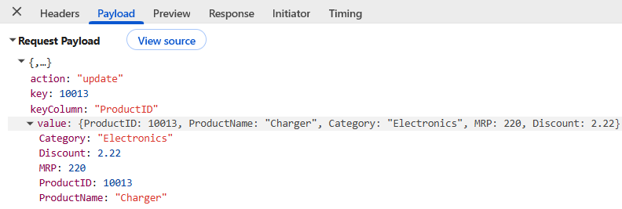
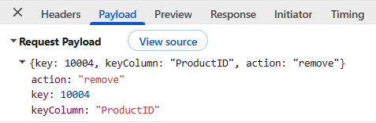

# FastAPI backend integration in React Pivot Table

[FastAPI](https://fastapi.tiangolo.com/) is a modern, high-performance Python web framework for building REST APIs. It provides automatic API documentation and supports validation through Python type hints and Pydantic models. This guide uses dictionary-based request bodies rather than Pydantic models, so product-field validation must be added before using the sample in production. The Syncfusion<sup style="font-size:70%">®</sup> React Pivot Table retrieves raw JSON records from the backend and performs Pivot Table aggregation and report processing in the browser.

**Application architecture:**

- **Backend**: [FastAPI](https://fastapi.tiangolo.com/) backend (Python) — Exposes REST API endpoints, loads raw product records, handles CRUD requests, and returns JSON responses.
- **Frontend**: React application - Displays the Syncfusion<sup style="font-size:70%">®</sup> Pivot Table and communicates with the [FastAPI](https://fastapi.tiangolo.com/) backend to retrieve and display data.
- **Data source**: A JSON file in this sample; replace it with a database or another persistent source in production.

## Prerequisites

| Software / Package | Recommended version | Purpose |
|--------------------|---------------------|---------|
| Python | 3.11+ | Backend runtime |
| venv | Included with Python | Creates an isolated Python environment for the FastAPI server |
| FastAPI | 0.110 or later | REST API framework |
| Uvicorn | 0.29 or later | ASGI server for running the FastAPI application |
| Node.js | 20.19+ or 22.12+ | Runtime required by Vite 7 |
| npm / yarn / pnpm | A version supported by the selected Node.js release | Package manager |
| Vite | 7.3.1 or later | React build tool |
| @syncfusion/ej2-react-pivotview | 33.1.45 or later | React Pivot Table component |
| Syncfusion license | Valid commercial, trial, or community license | Required when using Syncfusion packages from npm |

The listed package versions are the minimum versions targeted by this guide. Use a mutually compatible set of Syncfusion packages from the same release, and record exact versions in the application's lock file.

Before running the React application, generate a license key and register it by following the [Syncfusion license registration guide](https://ej2.syncfusion.com/react/documentation/licensing/license-key-registration).

> This sample is intended for local development. Before deployment, add authentication and authorization, validate all request data, use HTTPS, restrict CORS to trusted origins, add rate limiting, and load the API URL from environment-specific configuration.

## Setting up the FastAPI backend

The [FastAPI](https://fastapi.tiangolo.com/) backend acts as the raw-data and CRUD service for the React Pivot Table. It does not use the Syncfusion server-side Pivot Engine and does not perform Pivot Table aggregation, filtering, sorting, grouping, or paging.

The Syncfusion<sup style="font-size:70%">®</sup> React Pivot Table retrieves the complete product collection from the [FastAPI](https://fastapi.tiangolo.com/) backend and processes the report in the browser. For large datasets that require server-side aggregation, use the Syncfusion server-side Pivot Engine instead of this architecture.

### Step 1: Create the FastAPI server and install required packages

To start, create a workspace for the FastAPI server and install the packages required to run the backend application.


#### Create the project folder

1. Open a terminal and run the following commands to create the project folders:

    ```bash
    mkdir FastAPIServer
    cd FastAPIServer
    mkdir routers
    cd routers
    mkdir services
    cd ..
    type nul > routers\__init__.py && type nul > routers\services\__init__.py
    ```

    The last command uses Windows Command Prompt syntax. In PowerShell or macOS/Linux, create the two empty `__init__.py` files with the platform's standard file-creation command. The directory-creation commands are otherwise platform independent.

    The project structure should look like the following:

    ```text
    FastAPIServer/
    └── routers/
        ├── __init__.py
        └── services/
            └── __init__.py
    ```

2. Create and activate a virtual environment in the `FastAPIServer` folder. This helps keep the packages used by the [FastAPI](https://fastapi.tiangolo.com/) backend separate from other Python projects on the machine.

    ```bash
    python -m venv venv

    # Windows
    .\venv\Scripts\Activate.ps1

    # macOS/Linux
    source venv/bin/activate
    ```

#### Install the required packages

After activating the virtual environment, install [FastAPI](https://fastapi.tiangolo.com/) and [Uvicorn](https://pypi.org/project/uvicorn/). FastAPI is used to create REST API endpoints, and Uvicorn is used to run the FastAPI application.

```bash
pip install fastapi uvicorn
```

### Step 2: Create sample data source

After setting up the [FastAPI](https://fastapi.tiangolo.com/) backend and installing the required packages, create a file named `products_data.json` in the `FastAPIServer` folder. Populate it with the complete dataset from the sample repository or with valid records that follow the abbreviated example and schema below.

This file serves as the data source for the Syncfusion<sup style="font-size:70%">®</sup> React Pivot Table. The FastAPI server reads data from this file and returns the required results for Pivot Table operations.

N>
- The snippet below is abbreviated and is not valid JSON because the ellipsis lines are placeholders. Do not paste it directly into `products_data.json`. Copy the complete 16-record dataset from the [sample repository](https://github.com/SyncfusionExamples/syncfusion-react-pivot-with-fastapi-server), or replace the ellipses with complete comma-separated JSON objects that follow the documented schema.
- The `Discount` field is included in the data source for completeness and can be used as an additional value field in the Pivot Table. The minimal report in this guide summarizes only the `MRP` field, so `Discount` does not appear in [dataSourceSettings](https://ej2.syncfusion.com/react/documentation/api/pivotview/index-default#datasourcesettings).

```json
[
  {
    "ProductID": 10001,
    "ProductName": "Smartwatch",
    "Category": "Electronics",
    "MRP": 100.0,
    "Discount": 1.02
  },
  {
    "ProductID": 10002,
    "ProductName": "Smartwatch",
    "Category": "Accessories",
    "MRP": 110.0,
    "Discount": 1.12
  },
  {
    "ProductID": 10003,
    "ProductName": "Smartwatch",
    "Category": "Home Appliances",
    "MRP": 120.0,
    "Discount": 1.22
  },
  . . .
  . . .
  . . .
]
```

#### Data source structure

| Column | Data type | Description |
|----------|----------|-------------|
| ProductID | Number | Unique identifier for each product. |
| ProductName | String | Name of the product. |
| Category | String | Category to which the product belongs. |
| MRP | Number | Maximum Retail Price of the product. |
| Discount | Number | Discount applied to the product. |

### Step 3: Create the router

After creating the sample data source, the next step is to create a router for the [FastAPI](https://fastapi.tiangolo.com/) backend. The router is responsible for loading the product data and defining the API endpoints used by the Syncfusion<sup style="font-size:70%">®</sup> React Pivot Table.

1. Navigate to the `routers/` folder and create a new file named **products.py**. This file is used to load the product data and define the API endpoints.

2. Add the following code to the **routers/products.py** file:

    ```python
    from typing import Any, Dict, List
    from fastapi import APIRouter
    from fastapi.responses import JSONResponse
    from pathlib import Path
    import json

    router = APIRouter()
    DATA_FILE = Path(__file__).resolve().parent.parent / "products_data.json"

    # Field metadata based on the products_data.json structure.
    FIELDS_META: Dict[str, str] = {
        'ProductID': 'int',
        'ProductName': 'str',
        'Category': 'str',
        'MRP': 'float',
        'Discount': 'float',
    }
    ```

3. Add the `_load_products()` function to read the product data from the JSON file and store it in memory when the application starts.

    ```python
    def _load_products() -> List[Dict[str, Any]]:
        if DATA_FILE.exists():
            try:
                with open(DATA_FILE, 'r', encoding='utf-8') as f:
                    return json.load(f)
            except Exception:
                return []
        return []

    PRODUCTS: List[Dict[str, Any]] = _load_products()
    ```

    This sample treats a missing, unreadable, or malformed JSON file as an empty dataset because `_load_products()` catches every exception. For production use, log the exception and fail application startup so configuration and data errors are visible.

4. Add the following API endpoints to return the product data from the [FastAPI](https://fastapi.tiangolo.com/) backend.

    ```python
    @router.get('/')
    async def list_products_get():
        return JSONResponse({'result': PRODUCTS, 'count': len(PRODUCTS)})

    @router.post('/', response_class=JSONResponse)
    async def list_products_post():
        return JSONResponse({'result': PRODUCTS, 'count': len(PRODUCTS)})
    ```

**Explanation:**

- The router provides a central location for loading product data and defining API endpoints.
- The `DATA_FILE` variable specifies the path of the `products_data.json` file.
- The `_load_products()` function reads the JSON data and stores it in memory when the application starts.
- The route bodies use `Dict[str, Any]` and therefore validate only that a JSON object was received; they do not validate product field types, required fields, ranges, or business rules.
- The `GET` and `POST` endpoints return the available product data in JSON format. The Syncfusion React Pivot Table uses the `UrlAdaptor`, which issues **POST** requests for reads (and later for CRUD actions); the `GET` endpoint is provided for manual verification in a browser or API testing tool.
- The React Pivot Table can use these endpoints to retrieve data from the [FastAPI](https://fastapi.tiangolo.com/) backend.

#### Complete `products.py` file

```python

from typing import Any, Dict, List
from fastapi import APIRouter
from fastapi.responses import JSONResponse
from pathlib import Path
import json

router = APIRouter()
DATA_FILE = Path(__file__).resolve().parent.parent / "products_data.json"

FIELDS_META: Dict[str, str] = {
    'ProductID': 'int',
    'ProductName': 'str',
    'Category': 'str',
    'MRP': 'float',
    'Discount': 'float',
}


def _load_products() -> List[Dict[str, Any]]:
    if DATA_FILE.exists():
        try:
            with open(DATA_FILE, 'r', encoding='utf-8') as f:
                return json.load(f)
        except Exception:
            return []
    return []


PRODUCTS: List[Dict[str, Any]] = _load_products()


@router.get('/')
async def list_products_get():
    return JSONResponse({'result': PRODUCTS, 'count': len(PRODUCTS)})


@router.post('/', response_class=JSONResponse)
async def list_products_post():
    return JSONResponse({'result': PRODUCTS, 'count': len(PRODUCTS)})

```

### Step 4: Configure the application entry point

After creating the router, the next step is to configure the [FastAPI](https://fastapi.tiangolo.com/) application and register the router. This allows the application to expose the product data through API endpoints that can be accessed by the Syncfusion<sup style="font-size:70%">®</sup> React Pivot Table.

Create a file named `main.py` in the `FastAPIServer` folder and add the following code:

```python
from fastapi import FastAPI
from fastapi.middleware.cors import CORSMiddleware

# ✅ Import from routers folder
from routers.products import router as products_router

app = FastAPI(title="Products API")

app.add_middleware(
    CORSMiddleware,
    allow_origins=["*"],
    allow_credentials=True,
    allow_methods=["*"],
    allow_headers=["*"],
)

# ✅ Register router
app.include_router(
    products_router,
    prefix="/products",
    tags=["products"]
)
```

> The CORS settings shown above are development-only. The application does not use credentialed requests, so `allow_credentials` should be disabled when wildcard origins, methods, or headers are used. If cookies or authorization credentials are required, replace every wildcard with explicit trusted origins, methods, and headers. FastAPI does not support combining credentialed CORS with those wildcard settings.

**Explanation:**

- **CORS configuration**: Cross-origin requests are enabled for local development. Use the correction above before running the sample, and restrict the allowed origin to the React application's URL outside local development.
- **Router registration**: The "products" router is mounted under the "/products" prefix, ensuring the API endpoints remain organized and easy to navigate.

After completing this step, the [FastAPI](https://fastapi.tiangolo.com/) application is ready to serve product data through the configured `/products` endpoints.

### Step 5: Run the FastAPI server

After configuring the [FastAPI](https://fastapi.tiangolo.com/) application and registering the router, the next step is to run the server and verify that the API endpoint is accessible.

Run the following command from the `FastAPIServer` folder:

```bash
uvicorn main:app --reload --port 8000
```

Once the server starts successfully, it will be available at:

**http://localhost:8000**

The product API endpoint can be accessed using the following URL:

```text
http://localhost:8000/products/
```

**Explanation:**

- The `uvicorn` command starts the FastAPI application.
- The `--reload` option automatically restarts the server when changes are made to the source files.
- The `--port 8000` option runs the application on port `8000`.

After completing this step, the FastAPI backend is ready to provide data for the Syncfusion<sup style="font-size:70%">®</sup> React Pivot Table.

### Step 6: Understand the required response format

After confirming that the [FastAPI](https://fastapi.tiangolo.com/) backend is running correctly, it is important to understand the response format returned by the API endpoint.

The [FastAPI](https://fastapi.tiangolo.com/) backend returns the product data in JSON format. The response contains the records in the `result` property and the total number of records in the `count` property.

The following abbreviated block illustrates the response shape:

```json
{
  "result": [
    {
      "ProductID": 10001,
      "ProductName": "Smartwatch",
      "Category": "Electronics",
      "MRP": 100.0,
      "Discount": 1.02
    },
    {
      "ProductID": 10002,
      "ProductName": "Smartwatch",
      "Category": "Accessories",
      "MRP": 110.0,
      "Discount": 1.12
    },
    {
      "ProductID": 10003,
      "ProductName": "Smartwatch",
      "Category": "Home Appliances",
      "MRP": 120.0,
      "Discount": 1.22
    },
    {
      "ProductID": 10004,
      "ProductName": "Smartwatch",
      "Category": "Gadgets",
      "MRP": 130.0,
      "Discount": 1.32
    }
    ...
  ],
  "count": 16
}
```

**Explanation:**

- The `result` property contains the data records returned by the FastAPI server.
- Each object in the `result` array represents a product record.
- The `count` property specifies the total number of records in the response.
- This response can be verified by opening the `/products/` endpoint in a browser or an API testing tool.
- The read endpoint always returns the complete collection. This sample does not interpret `UrlAdaptor` filtering, sorting, paging, or grouping parameters.

## Setting up the React Pivot Table client

After running the [FastAPI](https://fastapi.tiangolo.com/) backend successfully, the next step is to create a React application and connect the Syncfusion<sup style="font-size:70%">®</sup> React Pivot Table to the FastAPI backend. This allows the Pivot Table to retrieve data from the server and display it in a summarized report.

### Step 1: Create a React application and add the Pivot Table

Create a React application with TypeScript and add the Syncfusion<sup style="font-size:70%">®</sup> React Pivot Table component by following the [Getting Started](../getting-started) documentation.

The examples in this section use a Vite-based React application with TypeScript. Complete the Vite project creation, dependency installation, theme installation, global stylesheet import, and license registration described in the Getting Started and licensing documentation. For the Tailwind 3 theme used by the current Getting Started guide, install `@syncfusion/ej2-tailwind3-theme`, replace the default contents of `src/index.css` with the PivotView theme import documented there, and confirm that `src/main.tsx` imports `index.css`. Remove Vite's default `App.css` and `index.css` rules if they conflict with the Syncfusion theme.

Before proceeding, install the Syncfusion<sup style="font-size:70%">®</sup> React Pivot Table package in the React project by running the following command:

```bash
npm install @syncfusion/ej2-react-pivotview
```

### Step 2: Configure the Pivot Table with UrlAdaptor

After creating the React application and installing the required Syncfusion<sup style="font-size:70%">®</sup> React Pivot Table package, the next step is to connect the Pivot Table to the [FastAPI](https://fastapi.tiangolo.com/) backend.

To retrieve data from the [FastAPI](https://fastapi.tiangolo.com/) backend, use the [DataManager](https://ej2.syncfusion.com/react/documentation/data/getting-started) with [UrlAdaptor](https://ej2.syncfusion.com/react/documentation/data/adaptors/url-adaptor). The `UrlAdaptor` enables communication between the React Pivot Table and the FastAPI endpoint. It sends requests to the configured endpoint and receives the JSON response returned by the server. The Pivot Table then uses the returned data to generate and display the report.

Replace the existing code in the **App.tsx** file with the following code:





import * as React from 'react';
import { PivotViewComponent, Inject, FieldList } from '@syncfusion/ej2-react-pivotview';
import { DataManager, UrlAdaptor } from '@syncfusion/ej2-data';
import type { DataSourceSettingsModel } from '@syncfusion/ej2-pivotview/src/model/datasourcesettings-model';

function App(): React.ReactElement {

    const data: DataManager = new DataManager({
        url: 'http://localhost:8000/products/',
        adaptor: new UrlAdaptor(),
        crossDomain: true,
    });

    const dataSourceSettings: DataSourceSettingsModel = {
        dataSource: data,
        expandAll: true,
        rows: [{ name: 'ProductName' }],
        columns: [{ name: 'Category' }],
        values: [{ name: 'MRP' }],
        filters: []
    };

    const pivotObj = React.useRef<PivotViewComponent>(null);

    return (
        <div className='control-section' style={{ margin: 100 }}>
            <PivotViewComponent
                ref={pivotObj}
                id='PivotView'
                height={350}
                width={700}
                dataSourceSettings={dataSourceSettings}
                showFieldList={true}
            >
                <Inject services={[FieldList]} />
            </PivotViewComponent>
        </div>
    );
}

export default App;





#### Code explanation

- [DataManager](https://ej2.syncfusion.com/react/documentation/data/getting-started): Configured with the [FastAPI](https://fastapi.tiangolo.com/) endpoint at `http://localhost:8000/products/` to retrieve product data from the FastAPI backend.
- [UrlAdaptor](https://ej2.syncfusion.com/react/documentation/data/adaptors/url-adaptor): Sends requests to the configured endpoint and processes the JSON response returned by the [FastAPI](https://fastapi.tiangolo.com/) backend.
- [dataSourceSettings](https://ej2.syncfusion.com/react/documentation/api/pivotview/index-default#datasourcesettings): Defines the Pivot Table report layout.
  - [rows](https://ej2.syncfusion.com/react/documentation/api/pivotview/datasourcesettingsmodel#rows): Displays **ProductName** values as row headers.
  - [columns](https://ej2.syncfusion.com/react/documentation/api/pivotview/datasourcesettingsmodel#columns): Displays **Category** values as column headers.
  - [values](https://ej2.syncfusion.com/react/documentation/api/pivotview/datasourcesettingsmodel#values): Summarizes the **MRP** field for each row and column combination.
- [PivotViewComponent](https://ej2.syncfusion.com/react/documentation/api/pivotview/index-default): Displays the Pivot Table using the data returned from the [FastAPI](https://fastapi.tiangolo.com/) backend.
- [FieldList](https://ej2.syncfusion.com/react/documentation/pivotview/field-list): Displays the Field List and allows fields to be arranged in rows, columns, values, and filters.

### Step 3: Run and verify the Pivot Table

After configuring the React Pivot Table and connecting it to the [FastAPI](https://fastapi.tiangolo.com/) backend, the next step is to run the React application and verify that data is loaded from the backend.

Open a terminal in the React application folder and run the following command:

```bash
npm run dev
```

After the application starts, open the URL displayed in the terminal. The Pivot Table sends a request to the [FastAPI](https://fastapi.tiangolo.com/) backend, retrieves the product data, and generates a report based on the configuration defined in [dataSourceSettings](https://ej2.syncfusion.com/react/documentation/api/pivotview/index-default#datasourcesettings).

The following image shows the React Pivot Table displaying data retrieved from the FastAPI backend.


The Syncfusion<sup style="font-size:70%">®</sup> React Pivot Table is now successfully connected to the [FastAPI](https://fastapi.tiangolo.com/) backend and displays data from the server.

### Verify data binding

After verifying that the Pivot Table is displayed correctly, the next step is to confirm that data is being retrieved from the [FastAPI](https://fastapi.tiangolo.com/) backend.

1. Open the browser's **Developer Tools** by pressing **F12** and select the **Network** tab.
2. Refresh the application page.
3. Look for a **POST** request sent to the API endpoint (`http://localhost:8000/products/`).
4. Select the request and review the response returned by the server.

A successful response should contain product records in the `result` property and the total number of records in the `count` property.

If the response is returned successfully, the Pivot Table generates and displays the report using the configured fields. If data is not displayed, check the **Network** tab for failed requests and the **Console** tab for any application errors.

## CRUD operations with Pivot Table

After verifying data binding between the React Pivot Table and the [FastAPI](https://fastapi.tiangolo.com/) backend, the next step is to enable CRUD (Create, Read, Update, Delete) operations.

The Syncfusion<sup style="font-size:70%">®</sup> React Pivot Table supports editing operations through its built-in editing features. When a record is added, updated, or deleted, [DataManager](https://ej2.syncfusion.com/react/documentation/data/getting-started) sends the corresponding request to the [FastAPI](https://fastapi.tiangolo.com/) backend. The backend processes the request, updates the data source, and returns the updated result.

The following operations can be performed:

- **Create**: Add a new record through the Pivot Table editing dialog.
- **Read**: Retrieve and display data from the [FastAPI](https://fastapi.tiangolo.com/) backend.
- **Update**: Modify an existing record.
- **Delete**: Remove a record from the data source.

The following sections explain how to configure the [FastAPI](https://fastapi.tiangolo.com/) backend and the React Pivot Table to support these operations.

### Implement backend CRUD methods

This section explains how to implement the create, update, and delete operations in the FastAPI backend. These operations are triggered when records are added, modified, or removed from the Pivot Table.

#### Insert operation

1. Navigate to the `routers/services/` folder and create a file named **insert.py**. This file contains the logic required to add a new record to the data source.

2. Add the following code to the **insert.py** file:

```python
from typing import Any, Callable, Dict, List
from fastapi.responses import JSONResponse


def handle_insert(payload: Dict[str, Any], products: List[Dict[str, Any]], save_products: Callable[[], None], fields_meta: Dict[str, str]) -> JSONResponse:
    record = payload.get('value') or payload

    # Auto-generate ProductID if it is not provided.
    if 'ProductID' not in record or record.get('ProductID') is None:
        new_id = max([o.get('ProductID', 0) for o in products] or [0]) + 1
        record['ProductID'] = new_id

    # Add missing fields to the record.
    for k in fields_meta.keys():
        if k != 'ProductID' and k not in record:
            record[k] = None

    products.append(record)
    save_products()
    return JSONResponse(record)
```

**Insert operation workflow**

| Step | Purpose | Implementation |
|------|---------|----------------|
| **1. Read request data** | Retrieve the record details sent by the Pivot Table. | `record = payload.get('value') or payload` |
| **2. Check ProductID** | Determine whether the request already contains a ProductID value. | `record.get('ProductID')` |
| **3. Generate ProductID** | Create a new ProductID when it is not available in the request. | `new_id = max([o.get('ProductID', 0) for o in products] or [0]) + 1` |
| **4. Validate fields** | Ensure all fields defined in the data source structure are available in the record. | `record[k] = None` |
| **5. Add record** | Add the new record to the product collection (in memory). | `products.append(record)` |
| **6. Persist data** | Save the updated data. Persistence is disabled by default; changes are kept only in memory while the server is running. | `save_products()` |
| **7. Return response** | Return the newly added record to the client. | `return JSONResponse(record)` |

##### Insert request payload

During an insert operation, the DataManager sends the new record details to the FastAPI backend. The `handle_insert()` method receives this data from the request payload and adds it to the data source.

> Missing fields are defaulted to `None`. If you later extend the auto-generated `ProductID` logic to also seed numeric aggregation fields (such as `MRP` or `Discount`), cast `None` values to `0` (or another sensible default) when reading them back. Code that relies on `max()` or arithmetic over these fields will fail if `None` is present.

> The handler accepts a client-supplied `ProductID` without checking uniqueness or type. Add server-side validation before using this pattern with untrusted requests.

The following image shows the request payload sent during an insert operation.



#### Update operation

After configuring the insert operation, the next step is to implement the update operation. This operation is used to modify an existing record in the data source.

1. Navigate to the `routers/services/` folder and create a file named **update.py**. This file contains the logic required to update an existing record in the data source.

2. Add the following code to the **update.py** file:

```python
from typing import Any, Callable, Dict, List
from fastapi import HTTPException
from fastapi.responses import JSONResponse


def handle_update(payload: Dict[str, Any], products: List[Dict[str, Any]], save_products: Callable[[], None]) -> JSONResponse:
    # 'ProductID' is the primary key used to locate the record to update.
    key = (
        payload.get('key')
        or payload.get('ProductID')
        or (payload.get('value') or {}).get('ProductID')
    )
    record = payload.get('value') or payload

    if key is None:
        raise HTTPException(status_code=400, detail='Missing ProductID for update')

    for i, o in enumerate(products):
        if o.get('ProductID') == key:
            updated = {**o, **record, 'ProductID': key}
            products[i] = updated
            save_products()
            return JSONResponse(updated)

    raise HTTPException(status_code=404, detail=f'Record with ProductID {key} not found')
```

**Update operation workflow**

| Step | Purpose | Implementation |
|------|---------|----------------|
| **1. Read request data** | Retrieve the updated record details sent by the Pivot Table. | `record = payload.get('value') or payload` |
| **2. Get ProductID** | Retrieve the `ProductID` used to identify the record. | `payload.get('key') or payload.get('ProductID')` |
| **3. Validate ProductID** | Ensure that a `ProductID` is available before updating the record. | `if key is None:` |
| **4. Find record** | Search for the matching record in the product collection. | `if o.get('ProductID') == key:` |
| **5. Update record** | Merge the existing record with the updated values (in memory). | `updated = {**o, **record, 'ProductID': key}` |
| **6. Persist data** | Save the updated data. Persistence is disabled by default; changes are kept only in memory while the server is running. | `save_products()` |
| **7. Return response** | Return the updated record to the client. | `return JSONResponse(updated)` |

##### Update request payload

During an update operation, the DataManager sends the modified record details to the FastAPI backend. The `handle_update()` method locates the corresponding record using the received `ProductID` and updates its data.

The following image shows the request payload sent during an update operation.



#### Delete operation

After implementing the update operation, the next step is to implement the delete operation. This operation is used to remove a record from the data source.

1. Navigate to the `routers/services/` folder and create a file named **remove.py**. This file contains the logic required to delete an existing record from the data source.

2. Add the following code to the **remove.py** file:

```python
from typing import Any, Callable, Dict, List
from fastapi import HTTPException
from fastapi.responses import JSONResponse


def handle_remove(payload: Dict[str, Any], products: List[Dict[str, Any]], save_products: Callable[[], None]) -> JSONResponse:
    # 'ProductID' is the primary key used to locate the record to delete.
    key = payload.get('key') or payload.get('ProductID') or payload.get('record_id')

    if key is None:
        raise HTTPException(status_code=400, detail='Missing ProductID for delete')

    for i, o in enumerate(products):
        if o.get('ProductID') == key:
            deleted = products.pop(i)
            save_products()
            return JSONResponse(deleted)

    raise HTTPException(status_code=404, detail=f'Record with ProductID {key} not found')
```

**Delete operation workflow**

| Step | Purpose | Implementation |
|------|---------|----------------|
| **1. Read ProductID** | Retrieve the `ProductID` used to identify the record to delete. | `payload.get('key') or payload.get('ProductID') or payload.get('record_id')` |
| **2. Validate ProductID** | Ensure that a `ProductID` is available before deleting the record. | `if key is None:` |
| **3. Find record** | Search for the matching record in the product collection. | `if o.get('ProductID') == key:` |
| **4. Delete record** | Remove the matching record from the collection (in memory). | `deleted = products.pop(i)` |
| **5. Persist data** | Save the updated data. Persistence is disabled by default; changes are kept only in memory while the server is running. | `save_products()` |
| **6. Return response** | Return the deleted record to the client. | `return JSONResponse(deleted)` |

##### Delete request payload

During a delete operation, the DataManager sends the `ProductID` of the selected record to the FastAPI backend. The `handle_remove()` method uses this value to locate and remove the corresponding record from the data source.

The following image shows the request payload sent during a delete operation.



#### Update the backend routing for CRUD requests

After implementing the insert, update, and delete operations, the next step is to update the router to handle CRUD requests from the React Pivot Table. The router identifies the requested action and forwards it to the corresponding service method.

Open the **FastAPIServer/routers/products.py** file and replace its entire contents with the following code. This is the final version of the router and supersedes the read-only `products.py` shown earlier in **Step 3: Create the router**:

```python
from typing import Any, Dict, List
from fastapi import APIRouter, HTTPException
from fastapi.responses import JSONResponse
from pathlib import Path
import json

from .services.insert import handle_insert
from .services.update import handle_update
from .services.remove import handle_remove

router = APIRouter()
DATA_FILE = Path(__file__).resolve().parent.parent / "products_data.json"

# Field metadata based on the products_data.json structure.
# 'ProductID' is the primary key used to identify records during CRUD operations.
FIELDS_META: Dict[str, str] = {
    'ProductID': 'int',
    'ProductName': 'str',
    'Category': 'str',
    'MRP': 'float',
    'Discount': 'float',
}


# Existing data loading code
def _load_products() -> List[Dict[str, Any]]:
    if DATA_FILE.exists():
        try:
            with open(DATA_FILE, 'r', encoding='utf-8') as f:
                return json.load(f)
        except Exception:
            return []
    return []


PRODUCTS: List[Dict[str, Any]] = _load_products()


def save_products() -> None:
    # Persistence is intentionally disabled.
    # The original contents of products_data.json are reloaded on every server
    # start via _load_products(), so any CRUD changes made at runtime are
    # discarded when the server is stopped and restarted.
    return


@router.get('/')
async def list_products_get():
    return JSONResponse({'result': PRODUCTS, 'count': len(PRODUCTS)})


@router.post('/', response_class=JSONResponse)
async def list_or_crud(payload: Dict[str, Any]):
    action = payload.get('action')

    if action == 'insert':
        return handle_insert(payload, PRODUCTS, save_products, FIELDS_META)

    if action == 'update':
        return handle_update(payload, PRODUCTS, save_products)

    if action == 'remove':
        return handle_remove(payload, PRODUCTS, save_products)

    # Default read operation
    return JSONResponse({'result': PRODUCTS, 'count': len(PRODUCTS)})

```

##### Route code explanation

- The service modules are imported to handle insert, update, and delete operations.
- The `POST /products/` endpoint receives requests from the React Pivot Table. The previous read-only `list_products_post` handler is replaced by `list_or_crud`, which now routes requests based on the `action` property.
- The `action` property in the request payload determines which operation should be performed.
- The `insert` action calls the `handle_insert()` method to add a new record.
- The `update` action calls the `handle_update()` method to modify an existing record.
- The `remove` action calls the `handle_remove()` method to delete a record.
- When no action is specified, the endpoint returns the available product data.

After completing this step, the [FastAPI](https://fastapi.tiangolo.com/) backend can process create, read, update, and delete requests for the product data source.

Because Uvicorn was started with `--reload`, saving these new service files and the replacement router should restart the development server automatically. Confirm the restart in the server terminal; if reload is disabled, stop and start Uvicorn manually before testing CRUD operations.

### Configure client-side CRUD settings

After configuring CRUD operations in the [FastAPI](https://fastapi.tiangolo.com/) backend, the next step is to enable editing in the React Pivot Table. This allows records to be added, updated, and deleted through the editing interface.

The client-side configuration includes the following steps:

- Enable editing in the Pivot Table.
- Configure a primary key field to identify records during update and delete operations.

#### Enable edit settings

Configure the [editSettings](https://ej2.syncfusion.com/react/documentation/api/pivotview/index-default#editsettings) property to enable CRUD operations in the Pivot Table. Add the `CellEditSettings` type import at the top of `App.tsx`:

```typescript
import type { CellEditSettings } from '@syncfusion/ej2-react-pivotview';
```

Then define the settings inside the component and wire them to the `PivotViewComponent`:

```typescript
  // Enable editing functionality
  const editSettings: CellEditSettings = { 
    allowEditing: true,    // Enables the Edit button and allows users to modify existing records.
    allowAdding: true,     // Enables the Add button and allows users to create new records.
    allowDeleting: true,   // Enables the Delete button and allows users to delete records.
    mode: 'Normal'         // Uses Normal mode; other options: 'Dialog', 'Batch', 'CommandColumn'.
  };

  const pivotObj = React.useRef<PivotViewComponent>(null);

  return (
    <PivotViewComponent 
      id='PivotView' 
      ref={pivotObj}
      editSettings={editSettings} 
      >
    </PivotViewComponent>
  );
```

For detailed information about each editing mode and its usage, refer to the [Editing documentation](https://ej2.syncfusion.com/react/documentation/pivotview/editing).

#### Configure the primary key for editing

After enabling editing, configure a primary key for the drill-through grid. A primary key is required to identify the correct record during update and delete operations.

**What is drill-through editing?**

Drill-through editing allows users to view and edit the underlying records that contribute to a summarized value in the Pivot Table. When a value cell is double-clicked, a drill-through grid opens and displays the corresponding source records. The [beginDrillThrough](https://ej2.syncfusion.com/react/documentation/pivotview/drill-through#begindrillthrough) event is triggered just before the drill-through grid is displayed. This event can be used to customize the grid and configure the primary key field required for editing operations.

**Why is the primary key important?**

A primary key uniquely identifies each record in the data source. During update and delete operations, the [DataManager](https://ej2.syncfusion.com/react/documentation/data/getting-started) uses this key to determine which record should be modified or deleted. In this example, **ProductID** is used as the primary key.

Import the required event type at the top of **App.tsx**:

```typescript
import type { BeginDrillThroughEventArgs } from '@syncfusion/ej2-pivotview';
```

Next, define the event handler and assign it to the [beginDrillThrough](https://ej2.syncfusion.com/react/documentation/pivotview/drill-through#begindrillthrough) event:

```typescript
    function beginDrillThrough(args: BeginDrillThroughEventArgs) {
        for (let i = 0; i < args.gridObj.columns.length; i++) {
            if (args.gridObj.columns[i].field === "ProductID") {
		        args.gridObj.columns[i].visible = true;
                args.gridObj.columns[i].isPrimaryKey = true;
            }
        }
    }
```

Then, assign the handler to the [beginDrillThrough](https://ej2.syncfusion.com/react/documentation/pivotview/drill-through#begindrillthrough) event on the `PivotViewComponent` (alongside the previously added `editSettings` and other props):

```typescript
return (
  <PivotViewComponent
    id='PivotView'
    ref={pivotObj}
    editSettings={editSettings}
    beginDrillThrough={beginDrillThrough}
  >
    <Inject services={[FieldList]} />
  </PivotViewComponent>
);
```

**How it works:**

- The event iterates through all columns in the drill-through grid.
- When the `ProductID` column is found, it is marked as the primary key using `isPrimaryKey = true`.
- The configured primary key is used by the [DataManager](https://ej2.syncfusion.com/react/documentation/data/getting-started) during update and delete operations.

After completing these configurations, the Pivot Table is ready to perform Create, Update, and Delete operations through the drill-through editing interface.

#### Consolidated App.tsx reference with CRUD support

The previous sections explained how to:

- Enable editing in the Pivot Table using [editSettings](https://ej2.syncfusion.com/react/documentation/api/pivotview/index-default#editsettings).
- Configure the primary key using the [beginDrillThrough](https://ej2.syncfusion.com/react/documentation/pivotview/drill-through#begindrillthrough) event.

The following example combines these configurations into a single React component. It enables the Syncfusion<sup style="font-size:70%">®</sup> React Pivot Table to retrieve data from the [FastAPI](https://fastapi.tiangolo.com/) backend and perform create, update, and delete operations through the drill-through editing interface.





import * as React from 'react';
import { PivotViewComponent, CellEditSettings, Inject, FieldList } from '@syncfusion/ej2-react-pivotview';
import { DataManager, UrlAdaptor } from '@syncfusion/ej2-data';
import type { DataSourceSettingsModel } from '@syncfusion/ej2-pivotview/src/model/datasourcesettings-model';
import type { BeginDrillThroughEventArgs } from '@syncfusion/ej2-pivotview';

function App(): React.ReactElement {
    const data: DataManager = new DataManager({
        url: 'http://localhost:8000/products/',
        adaptor: new UrlAdaptor(),
        crossDomain: true,
    });

    const dataSourceSettings: DataSourceSettingsModel = {
        dataSource: data,
        expandAll: true,
        rows: [{ name: 'ProductName' }],
        columns: [{ name: 'Category' }],
        values: [{ name: 'MRP' }],
        filters: [],
    };

    // Enable editing functionality
    const editSettings: CellEditSettings = {
        allowEditing: true,    // Enables the Edit button and allows users to modify existing records.
        allowAdding: true,     // Enables the Add button and allows users to create new records.
        allowDeleting: true,   // Enables the Delete button and allows users to remove records.
        mode: 'Normal'         // Uses Normal mode; other options: 'Dialog', 'Batch', 'CommandColumn'.
    };


    const pivotObj = React.useRef<PivotViewComponent>(null);

    // Configure beginDrillThrough event to set the primary key for CRUD operations
    function beginDrillThrough(args: BeginDrillThroughEventArgs) {
        // Iterate through all columns in the drill-through grid
        for (let i = 0; i < args.gridObj.columns.length; i++) {
            // Check if the current column is the primary key column
            if (args.gridObj.columns[i].field === "ProductID") {
                args.gridObj.columns[i].visible = true;
                // Mark this column as the primary key
                // This tells DataManager to use this column's value to uniquely identify records
                args.gridObj.columns[i].isPrimaryKey = true;
            }
        }
    }

    return (
        <div className='control-section' style={{ margin: 100 }}>
            <PivotViewComponent ref={pivotObj} id='PivotView' height={350} width={700} dataSourceSettings={dataSourceSettings} showFieldList={true} editSettings={editSettings} beginDrillThrough={beginDrillThrough}>
                <Inject services={[FieldList]} />
            </PivotViewComponent>
        </div>
    );
}

export default App;





### Important notes

- **Primary key field**: The primary key field (**ProductID**) cannot be modified during editing. Changing it causes data inconsistency because it uniquely identifies each record.
- **Real-time updates**: After each CRUD operation, the Pivot Table automatically refreshes to display the updated data from the backend.
- **Persistence**: The sample backend updates only the in-memory `PRODUCTS` list (`save_products()` is a no-op by design). Runtime CRUD changes are discarded when the server is stopped and restarted. To persist changes, replace `save_products()` with logic that writes back to `products_data.json` (or a database).
- **Edit modes**: The [mode](https://ej2.syncfusion.com/react/documentation/api/pivotview/celleditsettingsmodel#mode) property supports Normal, Dialog, and Batch modes. Enable command buttons with `allowCommandColumns`, and enable direct value-cell editing with `allowInlineEditing`. For details, refer to the [Editing documentation](https://ej2.syncfusion.com/react/documentation/pivotview/editing).

### Test CRUD operations

After completing the React Pivot Table configuration with CRUD support, the next step is to verify that create, update, and delete operations work correctly with the [FastAPI](https://fastapi.tiangolo.com/) backend.

> All CRUD operations in the following steps are performed inside the **drill-through grid**. To open it, double-click any value cell in the Pivot Table; the grid displays the underlying source records that contribute to the value and exposes the **Add**, **Edit**, and **Delete** buttons.

#### Test create operation

1. Double-click a value cell in the Pivot Table to open the drill-through grid.
2. Click **Add** and enter the required product details.
3. Click **Update** to save the new record.
4. Verify that a request is sent to the [FastAPI](https://fastapi.tiangolo.com/) endpoint (`http://localhost:8000/products/`).
5. Confirm that the new record appears in the drill-through grid and that the Pivot Table is updated accordingly.

#### Test update operation

1. In the drill-through grid, select a record and click **Edit**.
2. Modify one or more field values.
3. Click **Update** to save the changes.
4. Verify that a request is sent to the [FastAPI](https://fastapi.tiangolo.com/) endpoint (`http://localhost:8000/products/`).
5. Confirm that the updated values are displayed in both the drill-through grid and the Pivot Table.

#### Test delete operation

1. In the drill-through grid, select a record and click **Delete**.
2. Confirm the delete action.
3. Verify that a request is sent to the [FastAPI](https://fastapi.tiangolo.com/) endpoint (`http://localhost:8000/products/`).
4. Confirm that the selected record is removed from both the drill-through grid and the Pivot Table.

#### Verify the updated data

- Verify that the changes made through the drill-through grid are reflected in the Pivot Table.
- Verify that the [FastAPI](https://fastapi.tiangolo.com/) backend returns the updated data after each operation.
- When a database or another persistent data source is used, verify that the changes are saved successfully.

After completing these checks, the CRUD integration between the React Pivot Table and the [FastAPI](https://fastapi.tiangolo.com/) backend is ready for use.

## Best practices for FastAPI backend integration

The following recommendations help ensure reliable communication between the Syncfusion<sup style="font-size:70%">®</sup> React Pivot Table and the [FastAPI](https://fastapi.tiangolo.com/) backend while improving application stability, performance, and maintenance.

### 1. API response structure

- **Use a consistent response format**: Return data in a consistent structure so that [DataManager](https://ej2.syncfusion.com/react/documentation/data/getting-started) can process the response correctly.
- **Return data in JSON format**: Ensure that the [FastAPI](https://fastapi.tiangolo.com/) backend returns data in JSON format and includes both the `result` collection and the `count` value.
- **Use consistent field names**: Ensure that the field names returned by the backend match the field names configured in the Pivot Table data source settings.
- **Use a consistent data structure**: Ensure that all records returned by the backend follow the same structure as the data source.

### 2. Error handling

- **Verify required values**: Check that required values such as `ProductID` are available before performing update or delete operations.
- **Return meaningful error messages**: Provide clear messages when a request cannot be completed.
- **Return clear error responses**: Return appropriate error details when a record is not found or when required values are missing.
- **Verify record availability**: Check whether a record exists before performing update or delete operations.
- **Handle invalid requests**: Return a suitable response when the request contains incomplete or invalid data.

### 3. Application maintenance

- **Organize project files**: Keep routing logic in the `routers` folder, CRUD operations in the `services` folder, and application startup configuration in the `main.py` file.
- **Use meaningful names**: Use clear names for routes, functions, variables, files, and data fields.
- **Keep CRUD logic separate**: Store insert, update, and delete operations in separate service files to keep the code easier to read and maintain.
- **Document API endpoints**: Maintain clear documentation for API endpoints, request formats, and response structures.
- **Keep configuration centralized**: Configure application settings, middleware, and router registration in the `main.py` file to simplify maintenance.

### 4. Performance considerations

- **Process large datasets efficiently**: This sample always downloads every record. For larger datasets, implement the `UrlAdaptor` query contract on the backend or use the Syncfusion server-side Pivot Engine for server-side aggregation and viewport-based responses.
- **Monitor application performance**: Regularly review API response times and resource usage.
- **Reduce unnecessary requests**: Avoid sending repeated requests when the required data is already available.

### 5. Security and deployment

- **Restrict access**: Require authentication and authorize every read and write operation.
- **Restrict CORS**: Allow only known frontend origins and only the methods and headers the application uses.
- **Protect transport and configuration**: Use HTTPS and load API URLs and secrets from environment-specific configuration.
- **Protect the service**: Add rate limiting, request-size limits, security logging, and dependency update monitoring.

Following these practices helps maintain reliable integration between the React Pivot Table and the [FastAPI](https://fastapi.tiangolo.com/) backend while ensuring smooth application performance.

## Troubleshooting

The following table lists common issues that may occur when integrating the Syncfusion<sup style="font-size:70%">®</sup> React Pivot Table with the [FastAPI](https://fastapi.tiangolo.com/) backend, along with recommended solutions.

| Issue | Symptom | Resolution |
|---------|---------|---------|
| **Empty Pivot Table** | The Pivot Table loads, but no data is displayed. | Verify that the [FastAPI](https://fastapi.tiangolo.com/) endpoint returns data and that the response contains both the `result` and `count` properties. Also ensure that the field names returned by the backend match the fields configured in the Pivot Table [dataSourceSettings](https://ej2.syncfusion.com/react/documentation/api/pivotview/index-default#datasourcesettings). |
| **Missing or invalid data file appears as empty data** | The API returns an empty `result` instead of reporting a file error. | The sample suppresses exceptions in `_load_products()`. Verify that `products_data.json` exists and contains valid JSON; for production, replace the broad exception handler with logging and a startup failure. |
| **500 on insert with invalid existing IDs** | Adding a record fails while the collection already contains records. | Ensure every existing `ProductID` is a non-null integer. The empty collection is supported and generates ID `1`, but null or mixed-type IDs can make `max()` fail. |
| **404 Error on Update or Delete** | Updating or deleting a record returns a `404` error. | Verify that the `ProductID` sent in the request matches an existing record in the data source. Also ensure that the record has not already been deleted. |
| **CRUD operation ignored / falls back to read** | A record is added, updated, or deleted, but the backend always returns the full product list. | Verify that the request payload includes the correct `action` value (`insert`, `update`, or `remove`). When `action` is missing or unrecognized, the router returns the default read response. |
| **CRUD operations not working** | A record cannot be added, updated, or deleted from the drill-through grid. | Verify that editing is enabled through `editSettings` and that the `ProductID` column is configured as the primary key in the `beginDrillThrough` event. |
| **Changes lost after server restart** | Records added, updated, or deleted earlier disappear when the [FastAPI](https://fastapi.tiangolo.com/) server is restarted. | This is expected with the sample backend; `save_products()` is a no-op by design, so runtime CRUD changes are kept only in memory. To persist changes, implement file/database writes inside `save_products()`. |
| **Changes not reflected in the Pivot Table** | A record is added, updated, or deleted, but the latest data is not displayed. | Verify that the [FastAPI](https://fastapi.tiangolo.com/) backend processes the request successfully and returns the updated data. Also confirm that the request completes without any errors in the browser's Network tab. |
| **Network request fails** | Requests do not reach the [FastAPI](https://fastapi.tiangolo.com/) backend. | Verify that the FastAPI server is running, the endpoint URL is correct, and the CORS configuration is enabled in the FastAPI application. |
| **CORS error in the browser** | Browser requests are blocked and CORS-related errors appear in the console. | Do not combine `allow_credentials=True` with wildcard origins, methods, or headers. Disable credentials for this sample or configure explicit trusted values. |
| **Invalid JSON response** | Data cannot be loaded even though the request succeeds. | Verify that the backend returns a valid JSON response and that the response structure matches the expected format. |

If issues persist, use the browser's **Developer Tools** (**F12**) to inspect the **Network** and **Console** tabs. These tools can help identify request failures, server responses, and application errors.

## Complete sample repository

For a complete working implementation, refer to the [GitHub repository](https://github.com/SyncfusionExamples/syncfusion-react-pivot-with-fastapi-server).

## See also

**Data binding:**

- [**Pivot Table data binding**](https://ej2.syncfusion.com/react/documentation/pivotview/data-binding)
- [**DataManager**](https://ej2.syncfusion.com/react/documentation/data/getting-started)
- [**UrlAdaptor**](https://ej2.syncfusion.com/react/documentation/data/adaptors/url-adaptor)

**Editing:**

- [**Pivot Table editing**](https://ej2.syncfusion.com/react/documentation/pivotview/editing)
- [**Drill-through**](https://ej2.syncfusion.com/react/documentation/pivotview/drill-through)
