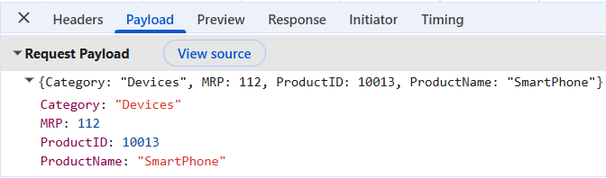
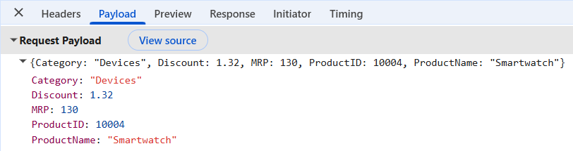
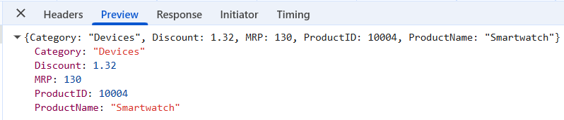

# Flask API Backend Integration in React Pivot Table

[Flask](https://flask.palletsprojects.com/en/stable/) is a lightweight Python web framework that makes it easy to build REST APIs for web applications. It provides a simple way to create API endpoints that can be used to load and process data for the Syncfusion<sup style="font-size:70%">®</sup> React Pivot Table.

## Application architecture

The React Pivot Table and [Flask](https://flask.palletsprojects.com/en/stable/) backend work together as follows:

- **Backend**: [Flask](https://flask.palletsprojects.com/en/stable/) server (Python) that provides REST API endpoints to retrieve and process data from a database or another data source.
- **Frontend**: React application that displays the Syncfusion<sup style="font-size:70%">®</sup> Pivot Table and connects to the [Flask](https://flask.palletsprojects.com/en/stable/) backend to load data.
- **Data source**: Product data stored in a database, file, or another storage system that is accessed through the [Flask](https://flask.palletsprojects.com/en/stable/) API.

## Prerequisites

Before connecting the Syncfusion<sup style="font-size:70%">®</sup> React Pivot Table to a Flask REST API backend, make sure the following software and packages are installed.

| Software / Package | Recommended version | Purpose |
|--------------------|---------------------|---------|
| Python | 3.11 or later | Runs the Flask backend application |
| venv | Included with Python | Creates an isolated Python environment for the Flask application |
| Flask | 3.1 or later | Builds REST API endpoints for data access |
| Flask-CORS | 6.0 or later | Allows requests from the React application |
| Node.js | 20.19+ or 22.12+ | Runs the React application and satisfies the Vite 7 runtime requirement |
| npm | 10.x or later | Installs and manages project packages |
| Yarn | 1.22 or 4.x | Alternative package manager |
| pnpm | 9.x or later | Alternative package manager |
| React | 18.x or later | Provides the client application runtime |
| TypeScript | 5.x or later | Type-checks the `.tsx` examples |
| Vite | 7.3.1 or later | Creates and builds the React application |
| @syncfusion/ej2-react-pivotview | 33.1.45 or later | Provides the Syncfusion<sup style="font-size:70%">®</sup> React Pivot Table component |

The installation commands in this guide resolve the latest compatible packages. For reproducible builds, pin the versions listed above in `requirements.txt` and `package.json`, then commit the generated lock files.

## Setting up the Flask backend using Python

The [Flask](https://flask.palletsprojects.com/en/stable/) backend acts as the REST API service, handling HTTP requests and responses that power the Syncfusion<sup style="font-size:70%">®</sup> React Pivot Table.

### Step 1: Create the Flask server and install required packages

Begin by creating a folder for the [Flask](https://flask.palletsprojects.com/en/stable/) application. This folder will contain the backend files, installed packages, and sample product data.

#### Create the project folder

1. Create a new folder for the Flask application.

```bash
mkdir FlaskAPIServer
cd FlaskAPIServer
```

2. Create and activate a virtual environment inside the `FlaskAPIServer` folder. This keeps the packages used by the Flask application separate from other Python projects.

```bash
python -m venv venv

# Windows
.\venv\Scripts\Activate.ps1

# macOS/Linux
source venv/bin/activate
```

**Current folder structure:**

```text
FlaskAPIServer/
│
└── venv/
```

#### Install the required packages

Run the following command from the `FlaskAPIServer` folder to install the required packages.

```bash
pip install flask flask-cors
```

**Package descriptions:**

- **flask** - Creates the REST API and handles HTTP requests and responses.
- **flask-cors** - Allows the React application to communicate with the Flask backend from a different origin.

The Python environment is now ready. The next step is to create the data file and Flask API endpoints.

### Step 2: Create sample data source

Once the [Flask](https://flask.palletsprojects.com/en/stable/) application is created and the required packages are installed, create a file named `products_data.json` in the `FlaskAPIServer` folder. This file contains the product data that will be processed by the Syncfusion<sup style="font-size:70%">®</sup> React Pivot Table.

The [Flask](https://flask.palletsprojects.com/en/stable/) server reads data from this file and returns the raw product records through API endpoints. The Pivot Table processes and summarizes those records in the browser.

N>
- The snippet below is abbreviated and is not valid JSON because the ellipsis lines are placeholders. For a minimal working data file, remove the three ellipsis lines; the three complete records are sufficient. To add more data, replace the ellipses with comma-separated JSON objects that follow the documented schema.
- The `Discount` field is included in the data source for completeness and can be used as an additional value field in the Pivot Table. The minimal report in this guide summarizes only the `MRP` field, so `Discount` does not appear in [dataSourceSettings](https://ej2.syncfusion.com/react/documentation/api/pivotview/index-default#datasourcesettings).

```json
[
  {
    "ProductID": 10001,
    "ProductName": "Smartwatch",
    "Category": "Electronics",
    "MRP": 100.0,
    "Discount": 1.02
  },
  {
    "ProductID": 10002,
    "ProductName": "Smartwatch",
    "Category": "Accessories",
    "MRP": 110.0,
    "Discount": 1.12
  },
  {
    "ProductID": 10003,
    "ProductName": "Smartwatch",
    "Category": "Home Appliances",
    "MRP": 120.0,
    "Discount": 1.22
  },
  . . .
  . . .
  . . .
]
```

#### Data source structure

| Column | Data type | Description |
|----------|----------|-------------|
| ProductID | Number | Unique identifier for each product. |
| ProductName | String | Name of the product. |
| Category | String | Category of the product. |
| MRP | Number | Maximum Retail Price of the product. |
| Discount | Number | Discount value applied to the product. |

### Step 3: Create the Flask application configuration

Next, create an `app.py` file in the `FlaskAPIServer` folder. This file configures the [Flask](https://flask.palletsprojects.com/en/stable/) application, enables cross-origin requests, loads product data from the JSON file, and defines an API endpoint to return the data.

```python
from flask import Flask, request, jsonify
from flask_cors import CORS
import json
import os

app = Flask(__name__)
CORS(app)

DATA_FILE = os.path.join(os.path.dirname(__file__), "products_data.json")
PRIMARY_KEY = "ProductID"

# Load product data from the JSON file.
def load_products():
    if not os.path.exists(DATA_FILE):
        return []

    with open(DATA_FILE, "r", encoding="utf-8") as file:
        return json.load(file)

# Store product data in memory.
products = load_products()

# GET /products: returns all product records as JSON.
@app.get("/products")
def list_products():
    return jsonify(products)

# Start the Flask application.
if __name__ == "__main__":
    # Use 127.0.0.1 instead of "localhost" to avoid IPv6 resolution issues on Windows
    # where "localhost" may resolve to ::1 while the React app connects to 127.0.0.1.
    app.run(host="127.0.0.1", port=5000, debug=True)
```

**Explanation:**

- The `app.py` file configures the [Flask](https://flask.palletsprojects.com/en/stable/) application and defines the API endpoint used to access product data.
- The `DATA_FILE` variable specifies the location of the `products_data.json` file.
- The `load_products()` function reads the product data from the JSON file and loads it into memory when the application starts.
- The `/products` endpoint returns all product records in JSON format.
- The React Pivot Table can use this endpoint to retrieve product data from the [Flask](https://flask.palletsprojects.com/en/stable/) backend.
- Note: `request` is imported now so the CRUD endpoints added later work without an additional import change.

The initial API exposes the following operation:

| Method | Path | Request | Successful response |
|--------|------|---------|---------------------|
| `GET` | `/products` | No request body | `200 OK` with an array of product records |

### Step 4: Run the Flask API server

After creating and configuring the [Flask](https://flask.palletsprojects.com/en/stable/) application, run the server to verify that the API endpoint is working correctly.

Run the following command from the `FlaskAPIServer` folder:

```bash
python app.py
```

Once the server starts successfully, it will be available at the address printed by Flask. The application is explicitly bound to `127.0.0.1`; use that host consistently if `localhost` resolves to IPv6 on your system.

```text
http://localhost:5000
```

The product data can be accessed through the following API endpoint. If the displayed `localhost` address does not connect, replace `localhost` with `127.0.0.1`.

```text
http://localhost:5000/products
```

After completing this step, the [Flask](https://flask.palletsprojects.com/en/stable/) backend is ready to provide product data to the Syncfusion<sup style="font-size:70%">®</sup> React Pivot Table.

### Reference: Response format

The [Flask](https://flask.palletsprojects.com/en/stable/) API endpoint returns product data in JSON format. This data is used by the Syncfusion<sup style="font-size:70%">®</sup> React Pivot Table to generate summaries and display the results.

The `/products` endpoint returns product records in the following format. The ellipsis marks omitted records and is not part of the JSON response.

```json
[
  {
    "Category": "Electronics",
    "Discount": 1.02,
    "MRP": 100.0,
    "ProductID": 10001,
    "ProductName": "Smartwatch"
  },
  {
    "Category": "Accessories",
    "Discount": 1.12,
    "MRP": 110.0,
    "ProductID": 10002,
    "ProductName": "Smartwatch"
  },
  {
    "Category": "Home Appliances",
    "Discount": 1.22,
    "MRP": 120.0,
    "ProductID": 10003,
    "ProductName": "Smartwatch"
  },
  ...
]
```

## Setting up the React Pivot Table client

After running the [Flask](https://flask.palletsprojects.com/en/stable/) API backend successfully, ensure the Flask server is still running on `http://127.0.0.1:5000` before you start the React app, then create a React application and connect the Syncfusion<sup style="font-size:70%">®</sup> React Pivot Table to the [Flask](https://flask.palletsprojects.com/en/stable/) API backend. This allows the Pivot Table to retrieve data from the server and display it in a summarized report.

### Step 1: Create a React application and add the Pivot Table

Create a React application with TypeScript and add the Syncfusion<sup style="font-size:70%">®</sup> React Pivot Table component by following the [Getting Started](../getting-started) documentation.

The examples in this section use a Vite-based React application with TypeScript. Before continuing:

1. Create the Vite project using the React and TypeScript options described in [Getting Started](../getting-started).
2. Install the Pivot Table and Tailwind 3 theme packages.
3. Replace the default contents of `src/index.css` with the PivotView theme import from the Getting Started guide, and confirm that `src/main.tsx` imports `index.css`.
4. Remove the default rules from `App.css` if they conflict with the component theme, but keep the file if you use the consolidated CRUD example because that example imports it.
5. Generate and register a Syncfusion license key by following [License key registration](https://ej2.syncfusion.com/react/documentation/licensing/license-key-registration).

Before proceeding, install the Syncfusion<sup style="font-size:70%">®</sup> React Pivot Table package and the matching Tailwind 3 theme in the React project by running the following commands:

```bash
npm install @syncfusion/ej2-react-pivotview
npm install @syncfusion/ej2-tailwind3-theme
```

### Step 2: Configure the Pivot Table with custom data binding

After setting up the React application, configure the Syncfusion<sup style="font-size:70%">®</sup> React Pivot Table to retrieve data from the [Flask](https://flask.palletsprojects.com/en/stable/) API. In this example, the React `useEffect` hook is used to load data when the application starts, and the retrieved data is assigned to the Pivot Table data source.

The following example shows how to fetch product data from the Flask API and bind it to the Pivot Table.





import * as React from 'react';
import { PivotViewComponent, Inject, FieldList } from '@syncfusion/ej2-react-pivotview';
import type { DataSourceSettingsModel } from '@syncfusion/ej2-pivotview/src/model/datasourcesettings-model';
import { useEffect } from 'react';

function App(): React.ReactElement {
  const pivotObj = React.useRef<PivotViewComponent>(null);

  useEffect(() => {
    const initialState = { skip: 0 };
    fetchData(initialState)
      .then((data) => {
        if (pivotObj.current) {
          pivotObj.current.dataSourceSettings.dataSource = data; // { result, count }
        }
      })
      .catch((e) => console.error(e));
  }, []);

  const API_BASE = 'http://localhost:5000';

  const fetchData = async () => {
    const url = `${API_BASE}/products`;

    const response = await fetch(url, {
      method: 'GET',
      headers: { 'Content-Type': 'application/json' },
    });

    if (!response.ok) {
      const text = await response.text();
      throw new Error(`HTTP ${response.status}: ${text}`);
    }

    return (await response.json()) as any[];
  };

  const dataSourceSettings: DataSourceSettingsModel = {
    dataSource: [],
    expandAll: true,
    rows: [{ name: 'ProductName' }],
    columns: [{ name: 'Category' }],
    values: [{ name: 'MRP' }],
    filters: [],
  };

  return (
    <div className='control-section' style={{ margin: 100 }}>
      <PivotViewComponent
        ref={pivotObj}
        id='PivotView'
        height={350}
        width={700}
        dataSourceSettings={dataSourceSettings}
        showFieldList={true}
      >
        <Inject services={[FieldList]} />
      </PivotViewComponent>
    </div>
  );
}

export default App;





#### Code explanation

- The `useEffect` hook runs when the React component is initialized.
- During initialization, the `fetchData` function sends a request to the Flask API and retrieves the product data in JSON format.
- After the data is received, it is assigned to the Pivot Table data source.
- The [dataSourceSettings](https://ej2.syncfusion.com/react/documentation/api/pivotview/index-default#datasourcesettings) property defines how the data is organized and displayed in the Pivot Table:
  - [rows](https://ej2.syncfusion.com/react/documentation/api/pivotview/datasourcesettingsmodel#rows) property displays **ProductName** values as row headers.
  - [columns](https://ej2.syncfusion.com/react/documentation/api/pivotview/datasourcesettingsmodel#columns) property displays **Category** values as column headers.
  - [values](https://ej2.syncfusion.com/react/documentation/api/pivotview/datasourcesettingsmodel#values) property summarizes the **MRP** field.
- The [PivotViewComponent](https://ej2.syncfusion.com/react/documentation/api/pivotview/index-default) displays the summarized product data returned from the Flask API.
- The [FieldList](https://ej2.syncfusion.com/react/documentation/pivotview/field-list) service displays the Field List and allows fields to be arranged in rows, columns, values, and filters.

### Step 3: Run and verify the Pivot Table

After configuring the React Pivot Table and connecting it to the [Flask](https://flask.palletsprojects.com/en/stable/) API backend, run the React application to verify that product data is loaded successfully from the server.

Run the following command from the React application folder:

```bash
npm run dev
```

The following image shows the React Pivot Table displaying data loaded from the [Flask](https://flask.palletsprojects.com/en/stable/) API backend.


The Syncfusion<sup style="font-size:70%">®</sup> React Pivot Table is now connected to the [Flask](https://flask.palletsprojects.com/en/stable/) backend and displays the summarized product data returned by the API.

### Verify data binding

To confirm that data is being retrieved from the [Flask](https://flask.palletsprojects.com/en/stable/) API backend, follow these steps:

1. Open the browser's **Developer Tools** by pressing **F12** and select the **Network** tab.
2. Refresh the application page.
3. Look for a **GET** request sent to the `http://127.0.0.1:5000/products` endpoint (or the host configured in `API_BASE`).
4. Select the request and review the response returned by the server.

A successful response should contain product records in JSON format.

If the response is returned successfully, the Pivot Table generates and displays the report using the configured fields. If data is not displayed, check the **Network** tab for failed requests and the **Console** tab for any application errors.

## CRUD operations with Pivot Table

The Syncfusion<sup style="font-size:70%">®</sup> React Pivot Table supports editing operations through its built-in editing feature. When a record is added, edited, or removed, the changes can be sent to the [Flask](https://flask.palletsprojects.com/en/stable/) API backend for processing and data updates. All CRUD operations in this section are performed inside the **drill-through grid** — double-click any value cell in the Pivot Table to open it.

The following operations can be performed:

- **Create**: Add a new record to the data source.
- **Read**: Retrieve and display data from the [Flask](https://flask.palletsprojects.com/en/stable/) API backend.
- **Update**: Modify an existing record in the data source.
- **Delete**: Remove a record from the data source.

The following sections explain how to configure the [Flask](https://flask.palletsprojects.com/en/stable/) backend and the React Pivot Table to support CRUD operations.

### Update the backend application for CRUD operations

To support CRUD operations, update the [Flask](https://flask.palletsprojects.com/en/stable/) application by adding API endpoints for creating, updating, and deleting records. These endpoints receive requests from the React Pivot Table and apply the corresponding changes to the product data.

The CRUD API contract is:

| Method | Path | Request body | Successful response | Common errors |
|--------|------|--------------|---------------------|---------------|
| `GET` | `/products` | None | `200 OK` with all product records | `500` for an unreadable or invalid data source |
| `POST` | `/products` | Product fields; `ProductID` may be omitted when the server generates it | `201 Created` with the stored record and assigned `ProductID` | `400` for invalid fields; `409` for a duplicate `ProductID` |
| `PUT` | `/products/{ProductID}` | Complete replacement product record | `200 OK` with the stored record | `400` for invalid fields; `404` when the record does not exist |
| `DELETE` | `/products/{ProductID}` | None | `200 OK` with the deleted record | `404` when the record does not exist |

Each stored product must contain a numeric `ProductID`, a non-empty `ProductName`, a non-empty `Category`, and numeric `MRP` and `Discount` values. A create request may omit `ProductID` when the server assigns it. The concise demonstration endpoints below do not enforce every rule in this contract: before production use, reject malformed JSON and missing fields, reject duplicate IDs, and guard numeric conversion so invalid data returns a `400` or `409` response instead of an unhandled exception.

#### Insert operation

Open the **FlaskAPIServer/app.py** file and add the following `POST` endpoint below the existing `load_products` function.

```python
# POST /products: create a new product
@app.post("/products")
def create_product():
    row = request.get_json(silent=True) or {}

    if not row.get(PRIMARY_KEY):
        max_id = max((r.get(PRIMARY_KEY, 0) for r in products), default=0)
        row[PRIMARY_KEY] = int(max_id) + 1

    products.append(row)
    return jsonify(row), 201
```

**Insert operation workflow**

| Step | Purpose | Implementation |
|------|---------|----------------|
| **1. Receive request data** | Retrieve the new product record sent from the client application. | `request.get_json(silent=True)` |
| **2. Check ProductID** | Verify whether the record contains a `ProductID` value. | `row.get(PRIMARY_KEY)` |
| **3. Generate ProductID** | Create a new `ProductID` when one is not provided in the request. | `max((r.get(PRIMARY_KEY, 0) for r in products), default=0) + 1` |
| **4. Add record** | Add the new product record to the in-memory data collection. | `products.append(row)` |
| **5. Return response** | Return the newly created record in JSON format. | `return jsonify(row), 201` |


##### Insert request payload

The following image shows the new product record sent from the Pivot Table to the `create_product` API endpoint during the insert operation.



#### Update operation

After adding support for inserting new records, the next step is to enable updating existing records in the product data source.

Add the following `PUT` endpoint to the **FlaskAPIServer/app.py** file.

```python
# PUT /products/<int:item_id>: update an existing product
@app.put("/products/<int:item_id>")
def update_product(item_id: int):
    row = request.get_json(silent=True) or {}

    for i, current in enumerate(products):
        if int(current.get(PRIMARY_KEY)) == int(item_id):
            row[PRIMARY_KEY] = item_id
            products[i] = row
            return jsonify(row)

    return jsonify({"message": "not found"}), 404
```

**Update operation workflow**

| Step | Purpose | Implementation |
|------|---------|----------------|
| **1. Receive request data** | Retrieve the updated product record sent from the client application. | `request.get_json(silent=True)` |
| **2. Get ProductID** | Retrieve the `ProductID` from the request URL. | `item_id` |
| **3. Find record** | Search for the matching product record in the collection. | `current.get(PRIMARY_KEY)` |
| **4. Update record** | Replace the existing record with the updated values. | `products[i] = row` |
| **5. Return response** | Return the updated record in JSON format. | `return jsonify(row)` |

##### Update request payload

The following image shows the updated product record sent from the Pivot Table to the `update_product` API endpoint during the update operation.



#### Delete operation

After configuring the update operation, the next step is to enable deleting existing records from the product data source.

Add the following `DELETE` endpoint to the **FlaskAPIServer/app.py** file.

```python
# DELETE /products/<int:item_id>: delete a product
@app.delete("/products/<int:item_id>")
def delete_product(item_id: int):
    for i, current in enumerate(products):
        if int(current.get(PRIMARY_KEY)) == int(item_id):
            deleted = products.pop(i)
            return jsonify(deleted)

    return jsonify({"message": "not found"}), 404
```

**Delete operation workflow**

| Step | Purpose | Implementation |
|------|---------|----------------|
| **1. Get ProductID** | Retrieve the `ProductID` from the request URL. | `item_id` |
| **2. Find record** | Search for the matching product record in the collection. | `current.get(PRIMARY_KEY)` |
| **3. Delete record** | Remove the matching record from the product collection. | `products.pop(i)` |
| **4. Return response** | Return the deleted record in JSON format. | `return jsonify(deleted)` |

##### Delete request payload

The following image shows the product record sent from the Pivot Table to the `delete_product` API endpoint during the delete operation.



#### Combined app.py reference with CRUD support

After adding the create, update, and delete endpoints, stop the running Flask server (`Ctrl+C`) and restart it with `python app.py` so the new routes are registered. The following example combines data retrieval and CRUD operation support in one `app.py` reference.

```python
from flask import Flask, request, jsonify
from flask_cors import CORS
import json
import os

app = Flask(__name__)
CORS(app)

DATA_FILE = os.path.join(os.path.dirname(__file__), "products_data.json")
PRIMARY_KEY = "ProductID"

# Load products from the JSON file.
def load_products():
    if not os.path.exists(DATA_FILE):
        return []

    with open(DATA_FILE, "r", encoding="utf-8") as f:
        return json.load(f)

# Store product data in memory.
products = load_products()

# GET /products: fetch all products
@app.get("/products")
def list_products():
    return jsonify(products)

# POST /products: create a new product
@app.post("/products")
def create_product():
    row = request.get_json(silent=True) or {}

    if not row.get(PRIMARY_KEY):
        max_id = max((r.get(PRIMARY_KEY, 0) for r in products), default=0)
        row[PRIMARY_KEY] = int(max_id) + 1

    products.append(row)
    return jsonify(row), 201

# PUT /products/<int:item_id>: update an existing product
@app.put("/products/<int:item_id>")
def update_product(item_id: int):
    row = request.get_json(silent=True) or {}

    for i, current in enumerate(products):
        if int(current.get(PRIMARY_KEY)) == int(item_id):
            row[PRIMARY_KEY] = item_id
            products[i] = row
            return jsonify(row)

    return jsonify({"message": "not found"}), 404

# DELETE /products/<int:item_id>: delete a product
@app.delete("/products/<int:item_id>")
def delete_product(item_id: int):
    for i, current in enumerate(products):
        if int(current.get(PRIMARY_KEY)) == int(item_id):
            deleted = products.pop(i)
            return jsonify(deleted)

    return jsonify({"message": "not found"}), 404

# Run Flask development server
if __name__ == "__main__":
    # Use 127.0.0.1 instead of "localhost" to avoid IPv6 resolution issues on Windows
    # where "localhost" may resolve to ::1 while the React app connects to 127.0.0.1.
    app.run(host="127.0.0.1", port=5000, debug=True)
```

### Configure client-side CRUD settings

With the [Flask](https://flask.palletsprojects.com/en/stable/) backend configured for CRUD operations, the next step is to enable editing in the React Pivot Table. This allows records to be added, updated, and deleted through the drill-through editing interface.

The client-side configuration involves the following:

- Enable editing in the Pivot Table.
- Configure a primary key field to identify records during update and delete operations.
- Handle editing actions and connect them to the Flask API endpoints.

#### Enable edit settings

Configure the [editSettings](https://ej2.syncfusion.com/react/documentation/api/pivotview/index-default#editsettings) property to enable CRUD operations in the Pivot Table. Add the `CellEditSettings` type import at the top of `App.tsx`:

```typescript
import type { CellEditSettings } from '@syncfusion/ej2-react-pivotview';
```

Then define the settings inside the component and wire them to the `PivotViewComponent`:

```typescript
  // Enable editing functionality
  const editSettings: CellEditSettings = { 
    allowEditing: true,    // Enables the Edit button and allows users to modify existing records.
    allowAdding: true,     // Enables the Add button and allows users to create new records.
    allowDeleting: true,   // Enables the Delete button and allows users to delete records.
    mode: 'Normal'         // Uses Normal mode; other options: 'Dialog', 'Batch'.
  };

  const pivotObj = React.useRef<PivotViewComponent>(null);

  return (
    <PivotViewComponent 
      id='PivotView' 
      ref={pivotObj}
      editSettings={editSettings} 
      >
    </PivotViewComponent>
  );
```

For detailed information about each editing mode and its usage, refer to the [Editing documentation](https://ej2.syncfusion.com/react/documentation/pivotview/editing).

#### Configure the primary key for editing

After enabling editing, configure a primary key for the drill-through grid. A primary key is required to identify the correct record during update and delete operations.

**What is drill-through editing?**

Drill-through editing allows users to view and edit the underlying records that contribute to a summarized value in the Pivot Table. When a value cell is double-clicked, a drill-through grid opens and displays the corresponding source records. The [beginDrillThrough](https://ej2.syncfusion.com/react/documentation/pivotview/drill-through#begindrillthrough) event is triggered just before the drill-through grid is displayed. This event can be used to customize the grid and configure the primary key field required for editing operations.

**Why is the primary key important?**

A primary key uniquely identifies each record in the data source. During update and delete operations, the [Flask](https://flask.palletsprojects.com/en/stable/) API uses this key to determine which record should be modified or deleted. In this example, **ProductID** is used as the primary key.

Import the required event type at the top of **App.tsx**:

```typescript
import type { BeginDrillThroughEventArgs } from '@syncfusion/ej2-pivotview';
```

Next, define the event handler and assign it to the [beginDrillThrough](https://ej2.syncfusion.com/react/documentation/pivotview/drill-through#begindrillthrough) event:

```typescript
    function beginDrillThrough(args: BeginDrillThroughEventArgs) {
        for (let i = 0; i < args.gridObj.columns.length; i++) {
            if (args.gridObj.columns[i].field === "ProductID") {
		        args.gridObj.columns[i].visible = true;
                args.gridObj.columns[i].isPrimaryKey = true;
            }
        }
    }
```

Then, assign the handler to the [beginDrillThrough](https://ej2.syncfusion.com/react/documentation/pivotview/drill-through#begindrillthrough) event on the `PivotViewComponent` (alongside the previously added `editSettings` and other props):

```typescript
return (
  <PivotViewComponent
    id='PivotView'
    ref={pivotObj}
    editSettings={editSettings}
    beginDrillThrough={beginDrillThrough}
  >
    <Inject services={[FieldList]} />
  </PivotViewComponent>
);
```

#### Configure CRUD operations with custom binding

After enabling editing and configuring the primary key, the next step is to connect the editing actions in the drill-through grid to the [Flask](https://flask.palletsprojects.com/en/stable/) API endpoints.

The drill-through grid triggers the `actionComplete` event whenever a record is added, updated, or deleted. This event provides information about the completed action and the affected record. Based on the action type, the corresponding request is sent to the [Flask](https://flask.palletsprojects.com/en/stable/) API.

Update the existing [beginDrillThrough](https://ej2.syncfusion.com/react/documentation/pivotview/drill-through#begindrillthrough) event to attach the `actionComplete` event handler to the drill-through grid, as shown below:

```ts
  const handleActionComplete = async (args: any) => {
    try {
      if (!args || !args.requestType) {
        return;
      }

      const sanitizeItem = (item: any) => {
        if (!item || typeof item !== 'object') {
          return item;
        }
        const sanitized = { ...item };
        delete sanitized.__index;
        return sanitized;
      };

      if (args.requestType === 'save' && args.action === 'add') {
        const item = sanitizeItem(args.data);
        if (item) {
          const response = await fetch(`${API_BASE}/products`, {
            method: 'POST',
            headers: { 'Content-Type': 'application/json' },
            body: JSON.stringify(item),
          });
          if (!response.ok) {
            console.error('Create failed', await response.text());
          }
        }
        return;
      }
      if (args.requestType === 'save' && args.action === 'edit') {
        const item = sanitizeItem(args.data);
        const id = item?.ProductID ?? args.primaryKeyValue?.[0] ?? args.previousData?.ProductID;
        if (id != null) {
          const response = await fetch(`${API_BASE}/products/${id}`, {
            method: 'PUT',
            headers: { 'Content-Type': 'application/json' },
            body: JSON.stringify(item),
          });
          if (!response.ok) {
            console.error('Update failed', await response.text());
          }
        }
        return;
      }
      if (args.requestType === 'delete') {
        const rows = Array.isArray(args.data) ? args.data : [args.data];
        for (const row of rows) {
          if (!row) continue;
          const id = row?.ProductID;
          if (id == null) continue;
          const response = await fetch(`${API_BASE}/products/${id}`, { method: 'DELETE' });
          if (!response.ok) {
            console.error('Delete failed', await response.text());
          }
        }
      }
    } catch (err) {
      console.error(err);
    }
  };

    function beginDrillThrough(args: any) {
    // Existing code
    const gridObj = args.gridObj;
    if (gridObj) {
        gridObj.addEventListener('actionComplete', (event: any) => {
        handleActionComplete(event);
        });
    }
    }
```

##### Code explanation

- The `handleActionComplete` function is triggered whenever an editing action is completed in the drill-through grid.
- When a new record is added, the function sends a `POST` request to the `/products` endpoint.
- When a record is edited, the function sends a `PUT` request to the `/products/{ProductID}` endpoint with the updated record details.
- When a record is deleted, the function sends a `DELETE` request to the `/products/{ProductID}` endpoint.
- After a successful create, parse the response and apply the server-generated `ProductID` to the local record.
- After every successful mutation, request `/products` again, assign the returned array to `dataSourceSettings.dataSource`, and refresh the Pivot Table.
- If a mutation fails, reload the server data or restore the previous record so the grid does not display an uncommitted change.
- Do not rely on `endEdit()` after `actionComplete`; that event fires after the grid edit has already completed.

#### Combined App.tsx reference with CRUD support

The following example shows the complete `App.tsx` file with data retrieval, editing, and CRUD operation support. The React Pivot Table retrieves product data from the Flask backend and performs add, update, and delete operations through the drill-through editing interface.





import * as React from 'react';
import { PivotViewComponent, Inject, FieldList } from '@syncfusion/ej2-react-pivotview';
import type { DataSourceSettingsModel, CellEditSettings, BeginDrillThroughEventArgs } from '@syncfusion/ej2-react-pivotview';
import './App.css';
import { useEffect } from 'react';

function App(): React.ReactElement {
  const pivotObj = React.useRef<PivotViewComponent>(null);
  useEffect(() => {
    const initialState = { skip: 0 };
    fetchData(initialState)
      .then((data) => {
        if (pivotObj.current) {
          pivotObj.current.dataSourceSettings.dataSource = data; // { result, count }
        }
      })
      .catch((e) => console.error(e));
  }, []);

  const API_BASE = 'http://localhost:5000'; // Flask server endpoint
  // --- READ (GET) ---
  const fetchData = async () => {
    const url = `${API_BASE}/products`;
    const response = await fetch(url, {
      method: 'GET',
      headers: { 'Content-Type': 'application/json' },
    });
    if (!response.ok) {
      const text = await response.text();
      throw new Error(`HTTP ${response.status}: ${text}`);
    }
    return (await response.json()) as any[];
  };

  const handleActionComplete = async (args: any) => {
    try {
      if (!args || !args.requestType) {
        return;
      }

      const sanitizeItem = (item: any) => {
        if (!item || typeof item !== 'object') {
          return item;
        }
        const sanitized = { ...item };
        delete sanitized.__index;
        return sanitized;
      };

      if (args.requestType === 'save' && args.action === 'add') {
        const item = sanitizeItem(args.data);
        if (item) {
          const response = await fetch(`${API_BASE}/products`, {
            method: 'POST',
            headers: { 'Content-Type': 'application/json' },
            body: JSON.stringify(item),
          });
          if (!response.ok) {
            console.error('Create failed', await response.text());
          }
        }
        return;
      }
      if (args.requestType === 'save' && args.action === 'edit') {
        const item = sanitizeItem(args.data);
        const id = item?.ProductID ?? args.primaryKeyValue?.[0] ?? args.previousData?.ProductID;
        if (id != null) {
          const response = await fetch(`${API_BASE}/products/${id}`, {
            method: 'PUT',
            headers: { 'Content-Type': 'application/json' },
            body: JSON.stringify(item),
          });
          if (!response.ok) {
            console.error('Update failed', await response.text());
          }
        }
        return;
      }
      if (args.requestType === 'delete') {
        const rows = Array.isArray(args.data) ? args.data : [args.data];
        for (const row of rows) {
          if (!row) continue;
          const id = row?.ProductID;
          if (id == null) continue;
          const response = await fetch(`${API_BASE}/products/${id}`, { method: 'DELETE' });
          if (!response.ok) {
            console.error('Delete failed', await response.text());
          }
        }
      }
    } catch (err) {
      console.error(err);
    }
  };

  const dataSourceSettings: DataSourceSettingsModel = {
    dataSource: [],
    expandAll: true,
    rows: [{ name: 'ProductName' }],
    columns: [{ name: 'Category' }],
    values: [{ name: 'MRP' }],
    filters: [],
  };

  // Enable editing functionality
  const editSettings: CellEditSettings = {
    allowEditing: true,    // Enables the Edit button and allows users to modify existing records.
    allowAdding: true,     // Enables the Add button and allows users to create new records.
    allowDeleting: true,   // Enables the Delete button and allows users to remove records.
    mode: 'Normal'         // Uses Normal mode (popup dialog) for editing; other options: 'Dialog', 'Batch'.
  };


  // Configure beginDrillThrough event to set the primary key for CRUD operations
  function beginDrillThrough(args: BeginDrillThroughEventArgs) {
    // Iterate through all columns in the drill-through grid
    for (var i = 0; i < args.gridObj.columns.length; i++) {
      // Check if the current column is the primary key column
      if (args.gridObj.columns[i].field === "ProductID") {
        args.gridObj.columns[i].visible = true;
        // Mark this column as the primary key
        // This tells DataManager to use this column's value to uniquely identify records
        args.gridObj.columns[i].isPrimaryKey = true;
      }
    }
    const gridObj = args.gridObj;
    if (gridObj) {
      gridObj.addEventListener('actionComplete', (event: any) => {
        handleActionComplete(event);
      });
    }
  }

  return (
    <div className='control-section' style={{ margin: 100 }}>
      <PivotViewComponent ref={pivotObj} id='PivotView' height={350} width={700} dataSourceSettings={dataSourceSettings} showFieldList={true} editSettings={editSettings} beginDrillThrough={beginDrillThrough}>
        <Inject services={[FieldList]} />
      </PivotViewComponent>
    </div>
  );
}

export default App;





### Test CRUD operations

After configuring CRUD support in both the [Flask](https://flask.palletsprojects.com/en/stable/) backend and the React Pivot Table, the next step is to verify that add, update, and delete operations work correctly.

> All CRUD operations in the following steps are performed inside the **drill-through grid**. To open it, double-click any value cell in the Pivot Table; the grid displays the underlying source records that contribute to the value and exposes the **Add**, **Edit**, and **Delete** buttons.

#### Test create operation

1. Double-click a value cell in the Pivot Table to open the drill-through grid.
2. Click **Add** and enter the required product details.
3. Click **Update** to save the new record.
4. Verify that a `POST` request is sent to the `http://127.0.0.1:5000/products` endpoint (or the configured API host).
5. Confirm that the `201` response contains the stored record and its `ProductID`.
6. Confirm that the refetched record is displayed in the drill-through grid and reflected in the Pivot Table.

#### Test update operation

1. In the drill-through grid, select a record and click **Edit**.
2. Modify one or more field values.
3. Click **Update** to save the changes.
4. Verify that a `PUT` request is sent to the `http://127.0.0.1:5000/products/{ProductID}` endpoint (or the configured API host).
5. Confirm that the refetched values are displayed in both the drill-through grid and the Pivot Table.

#### Test delete operation

1. In the drill-through grid, select a record and click **Delete**.
2. Confirm the delete action.
3. Verify that a `DELETE` request is sent to the `http://127.0.0.1:5000/products/{ProductID}` endpoint (or the configured API host).
4. Confirm that the refetched data no longer contains the selected record.

#### Verify the updated data

- Verify that the changes made through the drill-through grid are reflected in the Pivot Table.
- Verify that the [Flask](https://flask.palletsprojects.com/en/stable/) API returns the updated data after each operation.
- When a database or another persistent data source is used, verify that the changes are saved successfully.

After completing these checks, the CRUD integration between the Syncfusion<sup style="font-size:70%">®</sup> React Pivot Table and the [Flask](https://flask.palletsprojects.com/en/stable/) API backend is ready for use.

### Important notes

- **Primary key field**: The primary key field (**ProductID**) cannot be modified during editing. Changing it causes data inconsistency because it uniquely identifies each record.
- **Edit modes**: The [mode](https://ej2.syncfusion.com/react/documentation/api/pivotview/celleditsettingsmodel#mode) property supports `Normal`, `Dialog`, and `Batch`. Command buttons and direct value-cell editing are enabled through separate properties: `allowCommandColumns` and `allowInlineEditing`. For details, refer to the [Editing documentation](https://ej2.syncfusion.com/react/documentation/pivotview/editing).

## Best practices for Flask API backend integration

The following recommendations help maintain a reliable integration between the Syncfusion<sup style="font-size:70%">®</sup> React Pivot Table and the [Flask](https://flask.palletsprojects.com/en/stable/) API backend.

### 1. API response structure

- Return all product records in JSON format so that the Pivot Table can load and process the data correctly.
- Use consistent field names such as `ProductID`, `ProductName`, `Category`, `MRP`, and `Discount` in all API responses.
- Ensure that every product record follows the same data structure.
- Use a unique primary key field, such as `ProductID`, for update and delete operations.

### 2. Error handling

- Verify that the requested record exists before performing update or delete operations.
- Return `404 Not Found` with a clear error message when a record cannot be found.
- Reject malformed JSON, missing required fields, nonnumeric values, and duplicate `ProductID` values with `400 Bad Request` or `409 Conflict` as appropriate.
- Guard conversions and data-file parsing so malformed input does not become an unhandled `500` response.
- Handle API request failures in the React application, restore server-backed data, and display an actionable message to the user.

### 3. Application maintenance

- Store API endpoints, helper functions, and configuration settings in a well-organized structure.
- Use meaningful names for files, functions, variables, and data fields.
- Keep data retrieval, insert, update, and delete logic separate to improve readability.
- Maintain clear documentation for API endpoints and request formats.

### 4. Performance considerations

- This example loads all product records from the `/products` endpoint. For larger datasets, consider loading data in smaller batches or processing data on the server.
- Avoid unnecessary API requests when the required data is already available.
- Regularly review API response times to ensure smooth data loading.

### 5. Security and deployment

- Restrict access to API endpoints when the application is deployed.
- Replace unrestricted `CORS(app)` with an origin allowlist containing the deployed React application URL.
- Use HTTPS in production environments to secure data transfer.
- Store sensitive settings, such as API URLs and credentials, outside the source code.
- Do not deploy Flask's debug development server; run the application with a supported production WSGI server and disable debug mode.

Following these practices helps ensure smooth communication between the Syncfusion<sup style="font-size:70%">®</sup> React Pivot Table and the [Flask](https://flask.palletsprojects.com/en/stable/) API backend while making the application easier to maintain.

## Troubleshooting

The following table lists common issues that may occur when integrating the Syncfusion<sup style="font-size:70%">®</sup> React Pivot Table with the [Flask](https://flask.palletsprojects.com/en/stable/) API backend, along with recommended solutions.

| Issue | Symptom | Resolution |
|---------|---------|---------|
| **Empty Pivot Table** | The Pivot Table is displayed, but no data is shown. | Verify that the [Flask](https://flask.palletsprojects.com/en/stable/) API is running and that the configured `/products` endpoint returns product records in JSON format. Also ensure that the field names returned by the API match the fields configured in `dataSourceSettings`. |
| **Missing or invalid data file** | No data is returned from the API. | Verify that the `products_data.json` file exists in the `FlaskAPIServer` folder and contains valid JSON data. |
| **PowerShell blocks virtual-environment activation** | `Activate.ps1` reports that script execution is disabled. | Use an execution policy permitted by your organization or activate the environment from Command Prompt with `venv\Scripts\activate.bat`. |
| **Port 5000 is already in use** | Flask fails to start because the address is unavailable. | Stop the process using port `5000` or choose another port and update `API_BASE` to match. |
| **Syncfusion license warning** | A license validation message appears in the browser console. | Complete the linked license registration procedure and restart the React development server. |
| **Data loading request fails** | The Pivot Table does not load data from the API. | Verify that the API URL configured in `API_BASE` is correct and that the [Flask](https://flask.palletsprojects.com/en/stable/) server is running on port `5000`. |
| **404 error during update or delete** | Update or delete requests return a `404` response. | Verify that the `ProductID` sent in the request matches an existing record in the product collection. |
| **Unable to add new records** | New records are not added successfully. | Verify that the `POST` endpoint is available and that valid product data is sent in the request body. |
| **CRUD operations not working** | Records cannot be added, edited, or deleted in the drill-through grid. | Verify that editing is enabled through `editSettings` and that the `ProductID` column is configured as the primary key in the `beginDrillThrough` event. |
| **Changes not reflected in the Pivot Table** | A record is added, updated, or deleted, but the Pivot Table does not show the latest data. | Verify that the API request succeeded, fetch `/products` again, reassign the returned array to the data source, and refresh the Pivot Table. |
| **Changes lost after server restart** | Added, updated, or deleted records disappear after restarting the [Flask](https://flask.palletsprojects.com/en/stable/) server. | The sample stores data only in memory. To keep changes permanently, save the modified records to a file or database. |
| **Network request fails** | Requests do not reach the [Flask](https://flask.palletsprojects.com/en/stable/) API. | Verify that the Flask server is running, the endpoint URL is correct, and `Flask-CORS` is configured properly. |
| **CORS error in the browser** | Browser requests are blocked and CORS-related errors appear in the console. | Verify that `CORS(app)` is configured in the [Flask](https://flask.palletsprojects.com/en/stable/) application and that requests are sent to the correct API endpoint. |
| **Invalid JSON response** | Data cannot be loaded even though the request is completed. | Verify that the API returns valid JSON data and that all product records follow the expected data structure. |

If the issue continues, use the browser's **Developer Tools** (**F12**) to inspect the **Network** and **Console** tabs. These tools can help identify request failures, API responses, and application errors.

## Complete sample repository

For a complete working implementation, refer to the [GitHub repository](https://github.com/SyncfusionExamples/syncfusion-react-pivot-with-flask-api).

## See also

- [**Pivot Table data binding**](https://ej2.syncfusion.com/react/documentation/pivotview/data-binding)
- [**Pivot Table editing**](https://ej2.syncfusion.com/react/documentation/pivotview/editing)
- [**Drill-through**](https://ej2.syncfusion.com/react/documentation/pivotview/drill-through)
