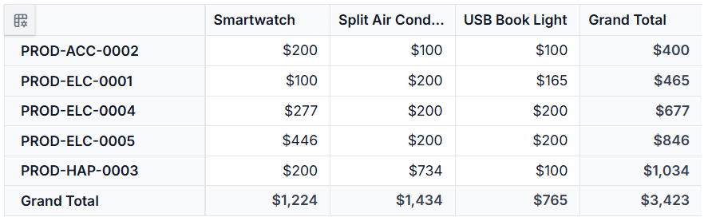
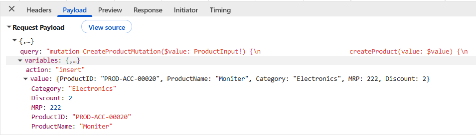
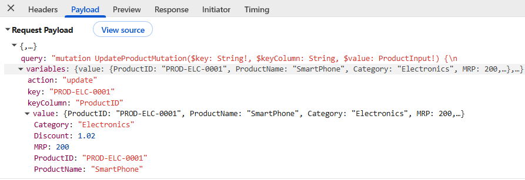
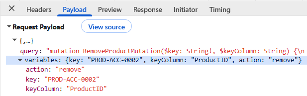

# Apollo GraphQL backend in React Pivot Table

[GraphQL](https://graphql.org/learn/introduction) is a query language that allows applications to request exactly the data needed, nothing more and nothing less. Unlike traditional REST APIs that return fixed data structures, GraphQL enables the client to specify the shape and content of the response.

**Traditional REST APIs** and **GraphQL** differ mainly in the way data is requested and returned. REST APIs expose multiple endpoints that return fixed data structures, often including unnecessary fields and requiring several requests to fetch related data, while [GraphQL](https://graphql.org/learn/introduction) uses a single endpoint where queries define the exact fields needed. This makes [GraphQL](https://graphql.org/learn/introduction) especially useful for [React Pivot Table](https://ej2.syncfusion.com/react/documentation/pivotview/getting-started) integration, because data-centric UI components benefit from well-structured, selective datasets that reduce network calls and improve performance.

**Key GraphQL concepts:**

- **Queries**: A query is a request to read data. Queries do not modify data; they only retrieve it.
- **Mutations**: A mutation is a request to modify data. Mutations create, update, or delete records.
- **Resolvers**: Each query or mutation is handled by a resolver, which is a function responsible for fetching data or executing an operation. **Query resolvers** handle **read operations**, while **mutation resolvers** handle **write operations**.
- **Schema**: Defines the structure of the API. The schema describes available data types, the fields within those types, and the operations that can be executed. Query definitions specify the way data can be retrieved, and mutation definitions specify the way data can be modified.

**What is Apollo?**

[Apollo](https://www.apollographql.com/docs/) Server is a widely used [GraphQL](https://graphql.org/learn/introduction) server that simplifies creating efficient and scalable APIs. It offers a clear structure for defining schemas, handling queries, and connecting data sources, making it a strong choice for building a modern [GraphQL](https://graphql.org/learn/introduction) backend. This guide uses Apollo Server on the backend and Syncfusion's `GraphQLAdaptor` in the React app; Apollo Client is not required for this sample.

## Prerequisites

| Software / Package              | Recommended version          | Purpose                                 |
|-------------------------------- |------------------------------|--------------------------------------   |
| Node.js                         | 20.x LTS or later            | Runtime for React client applications   |
| npm / yarn / pnpm               | Latest stable version        | Package manager                         |
| Vite                            | 7.3.1 or later               | React build tool                        |
| React                            | 18.x or later                | UI framework for the Pivot Table client |
| TypeScript                       | 5.x or later                 | Type checking for backend and client code |
| @apollo/server                  | 5.x or later                 | Apollo GraphQL server runtime           |
| graphql                         | 16.x or later                | GraphQL schema and query execution      |
| @syncfusion/ej2-react-pivotview | 33.1.45 or later             | React Pivot Table component             |
| @syncfusion/ej2-data            | 33.1.45 or later             | DataManager and GraphQLAdaptor support  |

## Setting up the GraphQL Backend Using Apollo Server

The [Apollo](https://www.apollographql.com/docs/) Server backend serves as the data source for the Syncfusion<sup style="font-size:70%">&reg;</sup> [React Pivot Table](https://ej2.syncfusion.com/react/documentation/pivotview/getting-started). It receives [GraphQL](https://graphql.org/learn/introduction) queries from the React application, retrieves the requested data, and returns the results. The [GraphQL](https://graphql.org/learn/introduction) response is then used by the Pivot Table to generate summaries and display information in an organized format.

### Step 1: Create the GraphQL Server and Install Required Packages

To start building the [Apollo](https://www.apollographql.com/docs/) GraphQL backend, create a folder that hosts the [GraphQL](https://graphql.org/learn/introduction) server. This folder contains the server files, project dependencies, and sample data required to process [GraphQL](https://graphql.org/learn/introduction) queries.

In this example, a [GraphQL](https://graphql.org/learn/introduction) server named **GraphQLServer** is created using **Node.js** and **TypeScript**.

#### Create the Project Folder

Open a terminal and run the following commands to create the project folder and the source directory:

```bash
mkdir GraphQLServer
cd GraphQLServer
mkdir src
```

#### Configure TypeScript

TypeScript provides type checking and helps organize application code. The TypeScript configuration file defines how TypeScript files are compiled into JavaScript.

Create a **tsconfig.json** file in the **GraphQLServer** folder and add the following configuration:

```json
{
  "compilerOptions": {
    "target": "ES2020",
    "module": "NodeNext",
    "moduleResolution": "NodeNext",
    "lib": ["ES2020"],
    "resolveJsonModule": true,
    "esModuleInterop": true,
    "forceConsistentCasingInFileNames": true,
    "skipLibCheck": true,
    "strict": true,
    "rootDir": "src",
    "outDir": "dist"
  },
  "include": ["src"]
}
```

#### Install the Required Packages

After creating the project structure and configuring TypeScript, install the packages required to set up the [Apollo](https://www.apollographql.com/docs/) GraphQL server. These packages help create the [GraphQL](https://graphql.org/learn/introduction) server, define the [GraphQL](https://graphql.org/learn/introduction) schema, process queries, and return data to the application. Together, they enable the [GraphQL](https://graphql.org/learn/introduction) backend to provide data to the Syncfusion<sup style="font-size:70%">&reg;</sup> [React Pivot Table](https://ej2.syncfusion.com/react/documentation/pivotview/getting-started).

Create a **package.json** file in the **GraphQLServer** folder and add the following content:

```json
{
  "name": "server",
  "version": "1.0.0",
  "main": "index.js",
  "scripts": {
    "start": "ts-node src/server.ts",
    "build": "tsc"
  },
  "keywords": [],
  "author": "",
  "license": "ISC",
  "description": "",
  "dependencies": {
    "@apollo/server": "^5.1.0",
    "@graphql-tools/schema": "^10.0.31",
    "graphql": "^16.12.0"
  },
  "devDependencies": {
    "@types/node": "^20.0.0",
    "ts-node": "^10.9.2",
    "typescript": "^5.9.3"
  }
}
```

The following packages and npm scripts are used in this project:

- `graphql` - Provides the core [GraphQL](https://graphql.org/learn/introduction) functionality for defining schemas, types, and processing GraphQL queries.
- `@apollo/server` - Creates and runs the [Apollo](https://www.apollographql.com/docs/) GraphQL server.
- `@graphql-tools/schema` - Combines schema definitions and resolver functions into an executable GraphQL schema.
- `@types/node` - Provides TypeScript definitions for Node.js APIs such as `process`, `__dirname`, and file system modules.
- `typescript` - Compiles TypeScript code into JavaScript.
- `ts-node` - Runs TypeScript files directly during development without requiring a separate compilation step.

After saving the file, install all required packages by running the following command from the **GraphQLServer** folder:

```bash
npm install
```

### Step 2: Create a Sample Data Source

After installing the required packages, create a **data.ts** file inside the **src** folder. This file contains the sample data that is used by the [GraphQL](https://graphql.org/learn/introduction) server. In this example, the data is stored in memory and is returned when GraphQL queries are processed.





export interface ProductDetails {
  ProductID: string;
  ProductName?: string;
  Category?: string;
  MRP?: number;
  Discount?: number;
}

export const productDetails: ProductDetails[] = [
  {
    "ProductID": "PROD-ELC-0001",
    "ProductName": "Smartwatch",
    "Category": "Electronics",
    "MRP": 100.0,
    "Discount": 1.02
  },
  {
    "ProductID": "PROD-ACC-0002",
    "ProductName": "USB Book Light",
    "Category": "Accessories",
    "MRP": 100.0,
    "Discount": 0.20
  },
  {
    "ProductID": "PROD-HAP-0003",
    "ProductName": "Split Air Conditioner",
    "MRP": 733.98,
    "Category": "Home Appliances",
    "Discount": 0.15
  }
];





#### Data Source Structure

The sample data contains the following fields:

| Column | Data Type | Description |
|----------|-----------|-------------|
| ProductID | string | Unique identifier for each product. |
| ProductName | string | Name of the product. |
| Category | string | Category of the product. |
| MRP | number | Maximum Retail Price (MRP) of the product. |
| Discount | number | Discount value applied to the product. |

The **data.ts** file is now configured with sample data. In the following steps, this data source will be connected to the [GraphQL](https://graphql.org/learn/introduction) schema and resolver functions. This enables the GraphQL server to return data that can be used by the [React Pivot Table](https://ej2.syncfusion.com/react/documentation/pivotview/getting-started) to create summarized views and reports.

### Step 3: Configure the GraphQL schema

The GraphQL schema acts as a blueprint for the GraphQL API. It defines what data is available and how that data can be requested from the server. In this example, the schema defines the product fields and the queries that the [React Pivot Table](https://ej2.syncfusion.com/react/documentation/pivotview/getting-started) can use to fetch product data from the GraphQL backend.

#### Instructions

1. Create a new schema file named **schema.graphql** inside the **src** folder.

2. Define the **Product** type to represent the product data structure.

```
# Product type
type Product {
  ProductID: String!
  ProductName: String
  Category: String
  MRP: Float
  Discount: Float
}
```

The **Product** type contains the fields available in the sample data source.

3. Define the **ReturnType** type to return the product data along with the total record count.

```
# Response type
type ReturnType {
  result: [Product!]!
  count: Int!
}
```

- **result** - Contains the list of product records.
- **count** - Contains the total number of records returned by the query.

4. Define the **DataManagerInput** type to receive request parameters from the client application.

```
# DataManager input
input DataManagerInput {
  params: String
}
```

The `datamanager` argument receives request metadata from the `GraphQLAdaptor`. This sample does not use `params`, but it is included so the schema can accept the adaptor's default query variable.

5. Define the **Query** type to expose the operations used to retrieve product data from the GraphQL server.

```
type Query {
  getProducts(datamanager: DataManagerInput): ReturnType!
}
```

The GraphQL schema is now configured. In the next step, you will create resolvers to process these queries and return data from the sample data source.

### Step 4: Create GraphQL query resolvers

A resolver is a function that processes a [GraphQL](https://graphql.org/learn/introduction) query and returns the requested data. When a GraphQL query is sent to the [Apollo](https://www.apollographql.com/docs/) GraphQL server, the corresponding resolver retrieves data from the data source and returns it in the format defined in the GraphQL schema.

In this example, the **getProducts** resolver retrieves product data from the sample data source and returns the records along with the total number of records.

#### Instructions

1. Create a new file named **resolvers.ts** inside the **src** folder.

2. Import the sample data source (**productDetails**) from the **data.ts** file.

3. Create the **getProducts** resolver to process the **getProducts** query defined in the [GraphQL](https://graphql.org/learn/introduction) schema.

4. Return the product records and their total count in the format specified by the schema.





import { productDetails } from "./data";

export const resolvers = {
  Query: {
    getProducts: () => {
      const result = [...productDetails];
      const count = result.length;
      return {
        result,
        count
      };
    },
  }
};

export default resolvers;





The [GraphQL](https://graphql.org/learn/introduction) query resolver is now configured. In the next step, the [Apollo](https://www.apollographql.com/docs/) GraphQL server will be configured to use the schema and resolver definitions and expose the GraphQL API endpoint.

### Step 5: Set Up the Apollo Server

After creating the [GraphQL](https://graphql.org/learn/introduction) schema and resolver functions, the next step is to configure the [Apollo](https://www.apollographql.com/docs/) GraphQL server. The Apollo Server uses the schema and resolvers to process GraphQL queries and return data from the configured data source.

#### Instructions

1. Create a new **server.ts** file inside the **src** folder.

   The **server.ts** file serves as the main entry point of the [GraphQL](https://graphql.org/learn/introduction) backend. It loads the GraphQL schema and resolvers, creates an executable schema, starts the [Apollo](https://www.apollographql.com/docs/) Server, and exposes the GraphQL API endpoint.

2. Implement the following steps in the **server.ts** file:

   - **Load the GraphQL schema** to make the schema definitions available to the server.
   - **Load the resolvers** that process [GraphQL](https://graphql.org/learn/introduction) queries and return data.
   - **Create an executable schema** by combining the schema definitions and resolver functions.
   - **Create and start the Apollo Server** to listen for incoming [GraphQL](https://graphql.org/learn/introduction) requests and expose the [GraphQL](https://graphql.org/learn/introduction) endpoint.





import { ApolloServer } from '@apollo/server';
import { startStandaloneServer } from '@apollo/server/standalone';
import { makeExecutableSchema } from '@graphql-tools/schema';
import { readFileSync } from 'fs';
import { join } from 'path';
import { resolvers } from './resolvers';

const typeDefs = readFileSync(join(__dirname, 'schema.graphql'), 'utf8');

const schema = makeExecutableSchema({
  typeDefs,
  resolvers,
});

async function start() {
  const server = new ApolloServer({
    schema,
    csrfPrevention: true,
    cache: 'bounded',
  });

  const port = Number(process.env.PORT) || 4000;
  //const port = Number(process.env.PORT) ?? 4000;

  const { url } = await startStandaloneServer(server, {
    listen: { port },
  });

  console.log(`GraphQL ready at ${url}`);
}

start().catch((err) => {
  console.error('Failed to start Apollo Server', err);
  process.exit(1);
});





3. Verify that the **package.json** file contains the **start** script shown below.

```json
{
  "scripts": {
    "start": "ts-node src/server.ts",
    "build": "tsc"
  }
}
```

The **start** script runs the **server.ts** file, which loads the [GraphQL](https://graphql.org/learn/introduction) schema, registers the resolvers, and starts the [Apollo](https://www.apollographql.com/docs/) Server. If you add a production start script later, copy **schema.graphql** to the compiled output folder or update the schema file path accordingly.

The [Apollo](https://www.apollographql.com/docs/) GraphQL server is now configured and ready to process [GraphQL](https://graphql.org/learn/introduction) queries. In the next step, the server can be started and tested before connecting it to the Syncfusion<sup style="font-size:70%">&reg;</sup> [React Pivot Table](https://ej2.syncfusion.com/react/documentation/pivotview/getting-started).

### Step 6: Run the GraphQL Server

After configuring the [Apollo](https://www.apollographql.com/docs/) GraphQL server, start the server by running the following command from the **GraphQLServer** folder:

```bash
npm run start
```

This command starts the Apollo GraphQL server and exposes the GraphQL endpoint for processing queries.

### Step 7: Verify the GraphQL Endpoint

After the [Apollo](https://www.apollographql.com/docs/) GraphQL server starts, the [GraphQL](https://graphql.org/learn/introduction) endpoint is available at the following URL:

```text
http://localhost:4000/
```

Open the URL in a browser to view the [GraphQL](https://graphql.org/learn/introduction) interface and execute test queries.

Run the following query to verify that the GraphQL server is returning product data correctly:

**Test query example:**

```
query GetProducts {
  getProducts {
    count
    result {
      ProductID
      ProductName
      Category
      MRP
      Discount
    }
  }
}
```

If the query runs successfully, the [GraphQL](https://graphql.org/learn/introduction) server returns the product records along with the total number of records. This confirms that the [GraphQL](https://graphql.org/learn/introduction) endpoint is working correctly and is ready to provide data to the Syncfusion<sup style="font-size:70%">&reg;</sup> [React Pivot Table](https://ej2.syncfusion.com/react/documentation/pivotview/getting-started).

### Step 8: Understand the required response format

When using the `GraphQLAdaptor`, the GraphQL server must return data in a specific response format. This allows the Syncfusion<sup style="font-size:70%">&reg;</sup> React [DataManager](https://ej2.syncfusion.com/react/documentation/data/getting-started) to read the response correctly and provide the data to the [React Pivot Table](https://ej2.syncfusion.com/react/documentation/pivotview/getting-started).

The GraphQL response should contain the following properties inside the GraphQL `data` object:

- **count** - Indicates the total number of records returned by the query.
- **result** - Contains the collection of data records.

The expected response format is shown below:

```json
{
  "data": {
    "getProducts": {
      "count": 3,
      "result": [
        {
          "ProductID": "PROD-ELC-0001",
          "ProductName": "Smartwatch",
          "Category": "Electronics",
          "MRP": 100,
          "Discount": 1.02
        },
        {
          "ProductID": "PROD-ACC-0002",
          "ProductName": "USB Book Light",
          "Category": "Accessories",
          "MRP": 100,
          "Discount": 0.2
        },
        {
          "ProductID": "PROD-HAP-0003",
          "ProductName": "Split Air Conditioner",
          "Category": "Home Appliances",
          "MRP": 733.98,
          "Discount": 0.15
        },
      ]
    }
  }
}
```

## Setting up the React Pivot Table client

After configuring and running the [GraphQL](https://graphql.org/learn/introduction) backend, the next step is to connect the [Syncfusion<sup style="font-size:70%">&reg;</sup> React Pivot Table](https://ej2.syncfusion.com/react/documentation/pivotview/getting-started) to the [Apollo](https://www.apollographql.com/docs/) Server endpoint. This section focuses on the client-side integration and the GraphQLAdaptor configuration needed to retrieve data and generate summarized reports.

### Step 1: Create a React application and add the Pivot Table

Set up a Vite + TypeScript React project that includes the Pivot Table by following the [Getting Started](../getting-started) documentation. To create a new Vite React TypeScript app, run:

```bash
npm create vite@latest react-pivot-graphql -- --template react-ts
cd react-pivot-graphql
npm install
```

Make sure the required Syncfusion<sup style="font-size:70%">&reg;</sup> packages are installed in your React project by running:

```bash
npm install @syncfusion/ej2-react-pivotview
```

### Step 2: Configure the Pivot Table with GraphQLAdaptor

To connect the [Syncfusion<sup style="font-size:70%">&reg;</sup> React Pivot Table](https://ej2.syncfusion.com/react/documentation/pivotview/getting-started) to the [Apollo](https://www.apollographql.com/docs/) GraphQL server, use the built-in `GraphQLAdaptor` provided by the [DataManager](https://ej2.syncfusion.com/react/documentation/data/getting-started). The `GraphQLAdaptor` acts as a bridge between the Pivot Table and the [GraphQL](https://graphql.org/learn/introduction) service, allowing the Pivot Table to retrieve data from the configured GraphQL endpoint.

**What is a GraphQLAdaptor?**

An adaptor acts as a translator between two systems. The `GraphQLAdaptor` specifically:

- Sends [GraphQL](https://graphql.org/learn/introduction) queries from the Pivot Table to the GraphQL endpoint.
- Retrieves the response data returned by the Apollo GraphQL server.
- Maps the returned data to a format that the Pivot Table can process.
- Supplies the data to the Pivot Table for generating summarized reports and analysis.

The following diagram illustrates the data flow between the [React Pivot Table](https://ej2.syncfusion.com/react/documentation/pivotview/getting-started) and the Apollo GraphQL server:


Replace the existing code in the **App.tsx** file with the following code to configure the Pivot Table with `GraphQLAdaptor`:





import * as React from 'react';
import { PivotViewComponent, Inject, FieldList } from '@syncfusion/ej2-react-pivotview';
import { DataManager, GraphQLAdaptor } from '@syncfusion/ej2-data';
import type { DataSourceSettingsModel } from '@syncfusion/ej2-pivotview/src/model/datasourcesettings-model';
import './App.css';

function App(): React.ReactElement {
  const data = new DataManager({
    url: 'http://localhost:4000/',
    adaptor: new GraphQLAdaptor({
      response: {
        result: 'getProducts.result',
        count: 'getProducts.count'
      },
      query: `
        query getProducts($datamanager: DataManagerInput) {
          getProducts(datamanager: $datamanager) {
            count
              result {
                  ProductID
                  ProductName
                  Category
                  MRP
                  Discount
              }
            }
        }
      `,
    }),
    crossDomain: true,
  });

  const dataSourceSettings: DataSourceSettingsModel = {
    dataSource: data,
    expandAll: false,
    rows: [
      { name: 'ProductID' }
    ],
    columns: [
      { name: 'ProductName' }
    ],
    values: [
      { name: 'MRP' }
    ],
    formatSettings: [
      { name: 'MRP', format: 'C0' },
    ]
  };

  const pivotObj = React.useRef<PivotViewComponent>(null);

  return (
    <div className='control-section' style={{ margin: 100 }}>
      <PivotViewComponent ref={pivotObj} id='PivotView' height={350} width={700} showFieldList={true} dataSourceSettings={dataSourceSettings}>
        <Inject services={[FieldList]} />
      </PivotViewComponent>
    </div>
  );
}

export default App;





#### Code explanation

- [DataManager](https://ej2.syncfusion.com/react/documentation/data/getting-started): Creates a data source that connects to the endpoint at `http://localhost:4000/`.
- `GraphQLAdaptor`: Configures the [DataManager](https://ej2.syncfusion.com/react/documentation/data/getting-started) to communicate with the service. It automatically sends [GraphQL](https://graphql.org/learn/introduction) queries to the server and maps the returned response to the format required by the Pivot Table.

- [dataSourceSettings](https://ej2.syncfusion.com/react/documentation/api/pivotview/index-default#datasourcesettings): Defines the Pivot Table report layout.
  - [rows](https://ej2.syncfusion.com/react/documentation/api/pivotview/datasourcesettingsmodel#rows): Displays **ProductID** values as row headers.
  - [columns](https://ej2.syncfusion.com/react/documentation/api/pivotview/datasourcesettingsmodel#columns): Displays **ProductName** values as column headers.
  - [values](https://ej2.syncfusion.com/react/documentation/api/pivotview/datasourcesettingsmodel#values): Summarizes the **MRP** field based on the row and column combinations.
  - [formatSettings](https://ej2.syncfusion.com/react/documentation/api/pivotview/datasourcesettings#formatsettings): Formats the **MRP** values as currency.

- [PivotViewComponent](https://ej2.syncfusion.com/react/documentation/api/pivotview/index-default): Renders the Pivot Table using the data returned from the Apollo GraphQL server.

- [FieldList](https://ej2.syncfusion.com/react/documentation/pivotview/field-list): Displays the Pivot Table Field List, allowing users to dynamically modify the report layout by moving fields between rows, columns, values, and filters.

- `crossDomain: true`: Enables requests to a GraphQL server running on a different origin during local development.

### Step 3: Understand the GraphQLAdaptor configuration

The `GraphQLAdaptor` configuration contains two important properties:

1. **Response mapping** - Specifies where the adaptor can find the data in the [GraphQL](https://graphql.org/learn/introduction) response.
2. **Query definition** - Specifies the [GraphQL](https://graphql.org/learn/introduction) query that retrieves data from the server.

#### 1. Response mapping

The `response` property specifies the location of the data and record count in the GraphQL response.

```ts
response: {
    result: 'getProducts.result',
    count: 'getProducts.count'
},
```

In this configuration:

- `getProducts.result` refers to the collection of product records.
- `getProducts.count` refers to the total number of records returned by the query.

This mapping helps the adaptor identify and extract the required data from the GraphQL response.

The mapping paths are relative to the GraphQL response's `data` object. For example, `getProducts.result` maps to `data.getProducts.result`.

#### 2. Query definition

The `query` property specifies the [GraphQL](https://graphql.org/learn/introduction) query that is sent to the server.

```
query getProducts($datamanager: DataManagerInput) {
    getProducts(datamanager: $datamanager) {
        count
        result {
            ProductID
            ProductName
            Category
            MRP
            Discount
        }
    }
}
```

In this query:

- `getProducts` retrieves product data from the [Apollo](https://www.apollographql.com/docs/) GraphQL server.
- The fields inside `result` define the data returned by the server.

When the Pivot Table loads, this query is executed and the returned data is used to generate the report.

The main `GraphQLAdaptor` options used in this example are:

| Option | Description |
|--------|-------------|
| `url` | GraphQL endpoint used by the `DataManager`. |
| `adaptor` | `GraphQLAdaptor` instance that sends GraphQL requests and reads the response. |
| `response.result` | Path to the returned records, relative to the GraphQL `data` object. |
| `response.count` | Path to the total record count, relative to the GraphQL `data` object. |
| `query` | GraphQL query sent when the Pivot Table requests data. |
| `crossDomain` | Enables requests to a different origin during local development. |

### Step 4: Run and verify the Pivot Table

After configuring the Pivot Table and `GraphQLAdaptor`, run the React application to verify that data is loaded from the [Apollo](https://www.apollographql.com/docs/) GraphQL backend.

Open a terminal in the React application folder and run the following command:

```bash
npm run dev
```

Once the application starts successfully, open the URL displayed in the terminal. The Pivot Table sends a [GraphQL](https://graphql.org/learn/introduction) query to the configured endpoint, retrieves the product data, and displays it using the report layout defined in [dataSourceSettings](https://ej2.syncfusion.com/react/documentation/api/pivotview/index-default#datasourcesettings).

The resulting Pivot Table appears as shown in the following image:



The [React Pivot Table](https://ej2.syncfusion.com/react/documentation/pivotview/getting-started) is now successfully connected to the Apollo GraphQL backend and displays the returned data in a summarized format.

### Verify data binding

To confirm that the [GraphQL](https://graphql.org/learn/introduction) service is returning data correctly:

1. Open the browser's **Developer Tools** (**F12**) and navigate to the **Network** tab.
2. Refresh the application page.
3. Look for a **POST** request sent to the GraphQL endpoint (`http://localhost:4000/`).
4. Select the request and check the response data.

A successful response should contain the `getProducts` object with the `result` and `count` properties.

If the data is loaded successfully, the Pivot Table displays the summarized product information. If no data is displayed, check the **Network** tab for failed requests or the **Console** tab for any JavaScript errors.

## CRUD operations with Pivot Table

In addition to retrieving data, the [React Pivot Table](https://ej2.syncfusion.com/react/documentation/pivotview/getting-started) can work with [GraphQL](https://graphql.org/learn/introduction) mutations to perform **Create**, **Update**, and **Delete** operations on the underlying data source. When a record is added, modified, or removed, the `GraphQLAdaptor` sends the corresponding GraphQL mutation request to the server. The GraphQL server then processes the request and updates the data source. 

Before creating mutation resolvers, update the [GraphQL](https://graphql.org/learn/introduction) schema to define the mutation operations and input types required for create, update, and delete actions. Once the schema is updated, define the TypeScript interfaces that will be used by the mutation methods.

### Update the GraphQL schema for CRUD operations

Update the [GraphQL](https://graphql.org/learn/introduction) schema to support create, update, and delete operations.

The schema must include:

- A **ProductInput** type to receive product data from the client application.
- A **Mutation** type to define the CRUD operations supported by the GraphQL API.

1. Open the **src/schema.graphql** file.

2. Add the **ProductInput** type after the existing **Product** type.

```
# --- Product input (for mutations) ---
input ProductInput {
  ProductID: String!
  ProductName: String
  Category: String
  MRP: Float
  Discount: Float
}
```

3. Add the following **Mutation** type definitions after the existing **Query** type.

```
type Mutation {
  createProduct(value: ProductInput!): Product!
  updateProduct(key: String!, keyColumn: String, value: ProductInput!): Product
  deleteProduct(key: String!, keyColumn: String): Product!
}
```

The mutation definitions provide the following operations:

- **createProduct** - Creates a new product record.
- **updateProduct** - Updates an existing product record using its key value.
- **deleteProduct** - Deletes an existing product record using its key value.

The [GraphQL](https://graphql.org/learn/introduction) schema is now configured to support CRUD operations. Next, define the TypeScript interfaces required by the mutation resolvers.

### Declare types for mutation methods

Create a new file named **types.ts** inside the **src** folder and add the following interfaces.

1. Import the **ProductDetails** interface from the sample data source.

```ts
import type { ProductDetails } from './data';
```

2. Define the **CreateProductArgs** interface to represent the arguments required for inserting a new product record.

```ts
export interface CreateProductArgs {
  value: ProductDetails;
}
```

3. Define the **UpdateProductArgs** interface to represent the arguments required for updating an existing product record.

```ts
export interface UpdateProductArgs {
  key: string | number;
  keyColumn: keyof ProductDetails;
  value: Partial<ProductDetails>;
}
```

4. Define the **DeleteProductArgs** interface to represent the arguments required for deleting a product record.

```ts
export interface DeleteProductArgs {
  key: string | number;
  keyColumn?: keyof ProductDetails;
}
```

The required TypeScript interfaces are now configured. In the next step, you will create GraphQL mutation resolvers to handle insert, update, and delete operations on the data source.

### Create GraphQL mutation resolvers in the backend

In the previous section, you created the TypeScript interfaces required for mutation operations. The next step is to implement the [GraphQL](https://graphql.org/learn/introduction) mutation resolvers that handle creating, updating, and deleting product records.

Mutation resolvers are executed when the client sends a GraphQL mutation request. They process the request, update the data source, and return the modified record.

#### Instructions

1. Open the **src/resolvers.ts** file.

2. Import the mutation interfaces created in the **types.ts** file.

3. Replace the existing resolver object with the following complete resolver object.





import { productDetails } from './data';
import { CreateProductArgs, UpdateProductArgs, ProductDetails, DeleteProductArgs } from './types';

export const resolvers = {
    Query: {
        getProducts: () => {
            const result = [...productDetails];
            const count = result.length;
            return {
                result,
                count
            };
        },
    },

    Mutation: {

        createProduct: (_parent: unknown, { value }: CreateProductArgs) => {
            const newProduct = value;

            /* Add to in-memory store. */
            productDetails.push(newProduct);

            /* Return the created entity. */
            return newProduct;
        },

        updateProduct: (_parent: unknown, { key, keyColumn = "ProductID", value }: UpdateProductArgs): ProductDetails => {
            /* Locate the product by dynamic key column (coerce to string for robust comparison). */
            const product = productDetails.find((p: ProductDetails) => String(p[keyColumn]) === String(key));
            if (!product) throw new Error("Product not found");

            /* Merge the incoming partial fields into the existing product. */
            Object.assign(product, value);

            return product;
        },

        deleteProduct: (_parent: unknown, { key, keyColumn = 'ProductID' }: DeleteProductArgs) => {
            /* Find the index by comparing the specified key column. */
            const idx = productDetails.findIndex((p: ProductDetails) => String(p[keyColumn]) === String(key));
            if (idx === -1) throw new Error('Product not found');

            /* Remove and capture the deleted product. */
            const [deleted] = productDetails.splice(idx, 1);
            return deleted;
        }
    }
};

export default resolvers;





#### Mutation code explanation

The mutation resolver contains three methods: **createProduct**, **updateProduct**, and **deleteProduct**. These methods are executed when the client sends [GraphQL](https://graphql.org/learn/introduction) mutation requests to create, update, or delete product records.

**createProduct - code breakdown:**

| Step | Purpose | Implementation |
|------|---------|----------------|
| **1. Receive input** | Read the product details sent from the client. | The `value` parameter in `createProduct` contains the product data submitted by the client. |
| **2. Prepare record** | Create a new product object using the received values. | `const newProduct = value` |
| **3. Insert record** | Add the new product to the existing data source. | `productDetails.push(newProduct)` |
| **4. Return created record** | Return the newly created product to the client. | `return newProduct` |

**updateProduct - code breakdown:**

| Step | Purpose | Implementation |
|------|---------|----------------|
| **1. Receive input** | Read the product key and updated field values. | Resolver parameters: `key`, `keyColumn`, and `value`. |
| **2. Locate record** | Find the matching product in the data source. | `productDetails.find((p) => String(p[keyColumn]) === String(key))` |
| **3. Validate record** | Ensure the product exists before performing the update. | `if (!product) throw new Error("Product not found")` |
| **4. Apply updates** | Update the existing product with the incoming values. | `Object.assign(product, value)` |
| **5. Return updated record** | Return the modified product to the client. | `return product` |

**deleteProduct - code breakdown:**

| Step | Purpose | Implementation |
|------|---------|----------------|
| **1. Receive key** | Read the key value that identifies the product to be deleted. | Resolver parameters: `key` and `keyColumn`. |
| **2. Locate record** | Find the position of the matching product in the data source. | `productDetails.findIndex((p) => String(p[keyColumn]) === String(key))` |
| **3. Validate record** | Ensure the product exists before removing it. | `if (idx === -1) throw new Error("Product not found")` |
| **4. Remove record** | Delete the product from the data source. | `const [deleted] = productDetails.splice(idx, 1)` |
| **5. Return deleted record** | Return information about the deleted product to the client. | `return deleted` |

### Configure client-side CRUD operations

The [Apollo](https://www.apollographql.com/docs/) GraphQL backend is now ready to process create, update, and delete requests. The next step is to configure the [React Pivot Table](https://ej2.syncfusion.com/react/documentation/pivotview/getting-started) application to send these requests through [GraphQL](https://graphql.org/learn/introduction) mutations.

To enable CRUD operations, update the **App.tsx** file to:

- Configure the [DataManager](https://ej2.syncfusion.com/react/documentation/data/getting-started) with GraphQL mutation definitions.
- Enable editing support in the Pivot Table.
- Specify a primary key field to identify records during update and delete operations.

With these configurations, users can add, edit, and delete records from the Pivot Table, while the changes are automatically synchronized with the [GraphQL](https://graphql.org/learn/introduction) backend through GraphQL mutations.

#### Configure DataManager with GraphQL mutations

The `GraphQLAdaptor` provides the `getMutation` function, which allows you to define different [GraphQL](https://graphql.org/learn/introduction) mutation queries for create, update, and delete operations. Based on the action performed by the user, the corresponding mutation is automatically executed.

```typescript

import { DataManager, GraphQLAdaptor } from '@syncfusion/ej2-data';

function App(): React.ReactElement {
  const data = new DataManager({
    url: 'http://localhost:4000/',
    adaptor: new GraphQLAdaptor({
      response: {
        result: 'getProducts.result',
        count: 'getProducts.count'
      },
      query: `
        query getProducts($datamanager: DataManagerInput) {
          getProducts(datamanager: $datamanager) {
            count
              result {
                  ProductID
                  ProductName
                  Category
                  MRP
                  Discount
              }
            }
        }
      `,
      getMutation: function (action: any): string {
        if (action === 'insert') {
          return `mutation CreateProductMutation($value: ProductInput!) {
                createProduct(value: $value) {
                  ProductID
                  ProductName
                  Category
                  MRP
                  Discount
                }
              }`;
        }
        if (action === 'update') {
          return `mutation UpdateProductMutation($key: String!, $keyColumn: String, $value: ProductInput!) {
                updateProduct(key: $key, keyColumn: $keyColumn, value: $value) {
                  ProductID
                  ProductName
                  Category
                  MRP
                  Discount
                }
              }`;
        }
        if (action === 'remove') {
          return `mutation RemoveProductMutation($key: String!, $keyColumn: String) {
              deleteProduct(key: $key, keyColumn: $keyColumn) {
                  ProductID
                  ProductName
                  Category
                  MRP
                  Discount 
              }
            }`;
        }
        return '';
      }
    }),
    crossDomain: true,
  });
}

```

##### How it works

The `getMutation` function is called automatically whenever a data modification operation is performed.

- When a new record is created, the `insert` action executes the `createProduct` mutation.
- When an existing record is modified, the `update` action executes the `updateProduct` mutation.
- When a record is removed, the `deleteProduct` mutation is executed.
- The required values, such as the product data and record key, are automatically passed to the corresponding mutation.
- Once the mutation completes, the latest data can be retrieved from the [Apollo](https://www.apollographql.com/docs/) GraphQL server and reflected in the Pivot Table.

This configuration connects the CRUD operations performed in the React application with the [GraphQL](https://graphql.org/learn/introduction) mutation resolvers configured in the backend.

The `action` argument passed to `getMutation` is `insert`, `update`, or `remove`.

The mutation variables use the following shapes:

```json
{
  "value": {
    "ProductID": "PROD-NEW-0001",
    "ProductName": "Wireless Charger",
    "Category": "Accessories",
    "MRP": 49.99,
    "Discount": 0.1
  }
}
```

```json
{
  "key": "PROD-ELC-0001",
  "keyColumn": "ProductID",
  "value": {
    "ProductID": "PROD-ELC-0001",
    "ProductName": "Smartwatch",
    "Category": "Electronics",
    "MRP": 120,
    "Discount": 0.15
  }
}
```

```json
{
  "key": "PROD-ELC-0001",
  "keyColumn": "ProductID"
}
```

##### Insert details included in the request payload

The following image illustrates the added record passed from the [DataManager](https://ej2.syncfusion.com/react/documentation/data/getting-started).



##### Update details included in the request payload

The following image illustrates the edited record passed from the [DataManager](https://ej2.syncfusion.com/react/documentation/data/getting-started).



##### Delete details included in the request payload

The following image illustrates the deleted record key passed from the [DataManager](https://ej2.syncfusion.com/react/documentation/data/getting-started).



#### Enable edit settings

Configure the [editSettings](https://ej2.syncfusion.com/react/documentation/api/pivotview/index-default#editsettings) property to enable CRUD operations in the Pivot Table. Add the `CellEditSettings` type import at the top of `App.tsx`:

```typescript
import { CellEditSettings } from '@syncfusion/ej2-react-pivotview';
```

Then define the [editSettings](https://ej2.syncfusion.com/react/documentation/api/pivotview/index-default#editsettings) inside the component and wire them to the `PivotViewComponent`:

```typescript
  // Enable editing functionality
  const editSettings: CellEditSettings = { 
    allowEditing: true,    // Enables the Edit button and allows users to modify existing records.
    allowAdding: true,     // Enables the Add button and allows users to create new records.
    allowDeleting: true,   // Enables the Delete button and allows users to remove records.
    mode: 'Normal'         // Uses Normal mode for editing; other options: 'Dialog', 'Batch', 'CommandColumn'.
  };

  const pivotObj = React.useRef<PivotViewComponent>(null);

  return (
      <PivotViewComponent 
        id='PivotView' 
        ref={pivotObj}
        allowDrillThrough={true}
        editSettings={editSettings} 
      >
    </PivotViewComponent>
  );
```

The Pivot Table supports different editing modes (Normal, Dialog, Batch, and Command Column) that can be configured using the [mode](https://ej2.syncfusion.com/react/documentation/api/pivotview/celleditsettingsmodel#mode) property. For detailed information about each editing mode and its usage, refer to the [Editing documentation](https://ej2.syncfusion.com/react/documentation/pivotview/editing).

#### Configure the primary key for editing

In the previous section, the **GraphQL** mutations were configured to handle create, update, and delete operations. To make update and delete operations work correctly, the drill-through grid must identify each record using a unique field.

**What is drill-through editing?**

Drill-through editing allows users to view and edit the underlying records that contribute to a summarized value in the Pivot Table. When a value cell is double-clicked, a drill-through grid opens and displays the corresponding source records. The [beginDrillThrough](https://ej2.syncfusion.com/react/documentation/pivotview/drill-through#begindrillthrough) event is triggered just before the drill-through grid is displayed. This event can be used to customize the grid and configure the primary key field required for editing operations.

**Why is the primary key important?**

A primary key uniquely identifies each record in the data source. During update and delete operations, the [DataManager](https://ej2.syncfusion.com/react/documentation/data/getting-started) uses this key to determine which record should be modified or removed. In this example, **ProductID** is used as the primary key.

Import the required event type at the top of **App.tsx**:

```typescript
import type { BeginDrillThroughEventArgs } from '@syncfusion/ej2-pivotview';
```

Next, define the event handler and assign it to the [beginDrillThrough](https://ej2.syncfusion.com/react/documentation/pivotview/drill-through#begindrillthrough) event:

```typescript
function beginDrillThrough(args: BeginDrillThroughEventArgs) {

  for (let i = 0; i < args.gridObj.columns.length; i++) {
    if (args.gridObj.columns[i].field === 'ProductID') {
      args.gridObj.columns[i].isPrimaryKey = true;
      args.gridObj.columns[i].editType = 'stringedit';
    } else {
      args.gridObj.columns[i].visible = true;
    }
  }
}

return (
  <PivotViewComponent
    id='PivotView'
    ref={pivotObj}
    beginDrillThrough={beginDrillThrough}
  >
  </PivotViewComponent>
);
```

**How it works:**

- The event iterates through all columns in the drill-through (edit) grid.
- When the `ProductID` column is found, it is marked as the primary key using `isPrimaryKey = true`.
- The `editType = 'stringedit'` setting configures the **ProductID** column to use a text editor in the drill-through grid.
- The configured primary key is used by the [DataManager](https://ej2.syncfusion.com/react/documentation/data/getting-started) during update and delete operations.
- Other columns are made visible so users can view and edit the record details in the drill-through grid.

> **Note:** The `visible = true` setting makes all non-primary-key columns visible in the drill-through grid. Remove or customize this setting if you want to control column visibility differently.

#### Complete App.tsx with GraphQL CRUD support

The previous sections explained how to:

- Configure the `GraphQLAdaptor` with query and mutation definitions.
- Enable editing in the Pivot Table using [editSettings](https://ej2.syncfusion.com/react/documentation/api/pivotview/index-default#editsettings).
- Configure the primary key using the [beginDrillThrough](https://ej2.syncfusion.com/react/documentation/pivotview/drill-through#begindrillthrough) event.

The following example combines all these configurations into a single React component. It enables the [React Pivot Table](https://ej2.syncfusion.com/react/documentation/pivotview/getting-started) to retrieve data from the [Apollo](https://www.apollographql.com/docs/) GraphQL backend and perform create, update, and delete operations through [GraphQL](https://graphql.org/learn/introduction) mutations.





import * as React from 'react';
import { PivotViewComponent, CellEditSettings, Inject, FieldList } from '@syncfusion/ej2-react-pivotview';
import { DataManager, GraphQLAdaptor } from '@syncfusion/ej2-data';
import type { DataSourceSettingsModel } from '@syncfusion/ej2-pivotview/src/model/datasourcesettings-model';
import type { BeginDrillThroughEventArgs } from '@syncfusion/ej2-pivotview';
import './App.css';

function App(): React.ReactElement {

  const data = new DataManager({
    url: 'http://localhost:4000/',
    adaptor: new GraphQLAdaptor({
      response: {
        result: 'getProducts.result',
        count: 'getProducts.count'
      },
      query: `
        query getProducts($datamanager: DataManagerInput) {
          getProducts(datamanager: $datamanager) {
            count
              result {
                  ProductID
                  ProductName
                  Category
                  MRP
                  Discount
              }
            }
        }
      `,
      getMutation: function (action: any): string {
        if (action === 'insert') {
          return `mutation CreateProductMutation($value: ProductInput!) {
                createProduct(value: $value) {
                  ProductID
                  ProductName
                  Category
                  MRP
                  Discount
                }
              }`;
        }
        if (action === 'update') {
          return `mutation UpdateProductMutation($key: String!, $keyColumn: String, $value: ProductInput!) {
                updateProduct(key: $key, keyColumn: $keyColumn, value: $value) {
                  ProductID
                  ProductName
                  Category
                  MRP
                  Discount
                }
              }`;
        }
        if (action === 'remove') {
          return `mutation RemoveProductMutation($key: String!, $keyColumn: String) {
              deleteProduct(key: $key, keyColumn: $keyColumn) {
                  ProductID
                  ProductName
                  Category
                  MRP
                  Discount 
              }
            }`;
        }
        return '';
      }
    }),
    crossDomain: true,
  });

  const dataSourceSettings: DataSourceSettingsModel = {
    dataSource: data,
    expandAll: false,
    rows: [
      { name: 'ProductID' }
    ],
    columns: [
      { name: 'ProductName' }
    ],
    values: [
      { name: 'MRP' }
    ],
    formatSettings: [
      { name: 'MRP', format: 'C0' },
    ]
  };

  // Enable editing functionality
  const editSettings: CellEditSettings = {
    allowEditing: true,    // Enables the Edit button and allows users to modify existing records.
    allowAdding: true,     // Enables the Add button and allows users to create new records.
    allowDeleting: true,   // Enables the Delete button and allows users to remove records.
    mode: 'Normal'         // Uses Normal mode for editing; other options: 'Dialog', 'Batch', 'CommandColumn'.
  };


  const pivotObj = React.useRef<PivotViewComponent>(null);

  // Configure beginDrillThrough event to set the primary key for CRUD operations
  function beginDrillThrough(args: BeginDrillThroughEventArgs) {
    // Iterate through all columns in the drill-through grid
    for (var i = 0; i < args.gridObj.columns.length; i++) {
      // Check if the current column is the primary key column
      if (args.gridObj.columns[i].field === "ProductID") {
        // Mark this column as the primary key
        // This tells DataManager to use this column's value to uniquely identify records
        args.gridObj.columns[i].isPrimaryKey = true;
        args.gridObj.columns[i].editType = 'stringedit';
      } else {
        // Make all other columns visible so users can view and edit them
        args.gridObj.columns[i].visible = true;
      }
    }
  }

  return (
    <div className='control-section' style={{ margin: 100 }}>
      <PivotViewComponent ref={pivotObj} id='PivotView' height={350} width={700} showFieldList={true} allowDrillThrough={true} dataSourceSettings={dataSourceSettings} editSettings={editSettings} beginDrillThrough={beginDrillThrough}>
        <Inject services={[FieldList]} />
      </PivotViewComponent>
    </div>
  );
}

export default App;





### Important notes

- **Primary key field**: The primary key field (**ProductID**) cannot be modified during editing. Changing it causes data inconsistency because it uniquely identifies each record.
- **Refreshing updated data**: After each CRUD operation, verify that the Pivot Table reloads the latest query result from the backend. If your application does not refresh automatically, trigger a Pivot Table refresh after the mutation completes.
- **Edit modes**: The Pivot Table supports different editing modes (Normal, Dialog, Batch, and Command Column) that can be configured using the [mode](https://ej2.syncfusion.com/react/documentation/api/pivotview/celleditsettingsmodel#mode) property. For details, refer to the [Editing documentation](https://ej2.syncfusion.com/react/documentation/pivotview/editing).

### Test CRUD operations

After configuring the [GraphQL](https://graphql.org/learn/introduction) mutations and enabling editing, verify that the create, update, and delete operations work correctly between the [React Pivot Table](https://ej2.syncfusion.com/react/documentation/pivotview/getting-started) and the [Apollo](https://www.apollographql.com/docs/) GraphQL backend.

1. **Test create operation**

   - Double-click a value cell in the Pivot Table to open the drill-through grid.
   - Click **Add** and enter the required product details.
   - Click **Update** to save the new record.
   - Verify that a `createProduct` mutation request is sent to the [Apollo](https://www.apollographql.com/docs/) GraphQL endpoint (`http://localhost:4000/`).
   - Confirm that the newly added record appears in the drill-through grid and is reflected in the Pivot Table.

2. **Test update operation**

   - In the drill-through grid, select a record and click **Edit**.
   - Modify one or more field values.
   - Click **Update** to save the changes.
   - Verify that an `updateProduct` mutation request is sent to the [Apollo](https://www.apollographql.com/docs/) GraphQL endpoint.
   - Confirm that the updated values are displayed in both the drill-through grid and the Pivot Table.

3. **Test delete operation**

   - In the drill-through grid, select a record and click **Delete**.
   - Confirm the deletion action.
   - Verify that a `deleteProduct` mutation request is sent to the [Apollo](https://www.apollographql.com/docs/) GraphQL endpoint.
   - Confirm that the selected record is removed from the drill-through grid and the Pivot Table.

4. **Verify the GraphQL requests**

   - Open the browser's **Developer Tools** (**F12**) and navigate to the **Network** tab.
   - Perform create, update, and delete operations.
   - Check the corresponding [GraphQL](https://graphql.org/learn/introduction) requests and verify that the correct mutation (`createProduct`, `updateProduct`, or `deleteProduct`) is executed.

5. **Verify the updated data**

   - Ensure that all changes made through the drill-through grid are reflected in the Pivot Table.
   - If the backend stores data in a database or another persistent storage system, verify that the changes are successfully saved on the server.

## Best practices for GraphQLAdaptor integration

The following recommendations help ensure reliable communication between the [React Pivot Table](https://ej2.syncfusion.com/react/documentation/pivotview/getting-started) and the [Apollo](https://www.apollographql.com/docs/) GraphQL backend while improving maintainability and performance.

1. **GraphQL response structure**

   - **Use a consistent response structure**: Ensure that GraphQL query responses return both the `result` collection and the `count` value in the format expected by the `GraphQLAdaptor`.
   - **Match response mappings**: Verify that the `response.result` and `response.count` mappings configured in the `GraphQLAdaptor` correctly point to their corresponding fields in the [GraphQL](https://graphql.org/learn/introduction) response.

2. **Error handling**

   - **Validate input values**: Validate incoming data before processing create, update, or delete operations to prevent invalid records from being saved.
   - **Return consistent error responses**: Configure [Apollo](https://www.apollographql.com/docs/) GraphQL Server to return clear and consistent error messages for query and mutation failures.
   - **Log application errors**: Log [GraphQL](https://graphql.org/learn/introduction) requests and errors to simplify debugging and monitoring.
   - **Check record existence**: Verify that a record exists before performing update or delete operations.

3. **Maintainability**

   - **Keep schemas and resolvers organized**: Separate schema definitions, resolvers, and data access logic into different files to make the application easier to maintain.
   - **Use meaningful names**: Choose clear and descriptive names for query and mutation methods, types, and fields.
   - **Reuse GraphQL types**: Create reusable [GraphQL](https://graphql.org/learn/introduction) types and input definitions to avoid duplication.
   - **Document the API**: Maintain clear documentation for [GraphQL](https://graphql.org/learn/introduction) queries, mutations, and response structures to simplify future development.

## Troubleshooting

The following table lists common issues that you may encounter when integrating the [React Pivot Table](https://ej2.syncfusion.com/react/documentation/pivotview/getting-started) with an [Apollo](https://www.apollographql.com/docs/) GraphQL backend and their recommended solutions.

| Issue | Symptom | Resolution |
|---------|---------|---------|
| **Empty Pivot Table** | The Pivot Table loads, but no data is displayed. | Verify that the `getProducts` query returns data and that the GraphQL response contains the expected `result` and `count` properties. Also ensure that the field names returned by the GraphQL query match the fields configured in the Pivot Table's [dataSourceSettings](https://ej2.syncfusion.com/react/documentation/api/pivotview/index-default#datasourcesettings). |
| **GraphQL Query Returns No Data** | The [GraphQL](https://graphql.org/learn/introduction) request completes successfully, but no records appear in the Pivot Table. | Check that the query configured in the `GraphQLAdaptor` matches the GraphQL schema. Also verify that the `response.result` and `response.count` mappings point to the correct locations in the GraphQL response. |
| **404 Error** | A 404 error appears in the browser's Network tab when loading data. | Ensure that the GraphQL endpoint URL configured in the [DataManager](https://ej2.syncfusion.com/react/documentation/data/getting-started) matches the URL and port where the GraphQL server is running. |
| **500 Error** | The [GraphQL](https://graphql.org/learn/introduction) request returns an internal server error. | Review the server logs and error messages. Common causes include resolver errors, invalid query parameters, invalid mutation data, or unexpected null values. |
| **GraphQL Mutation Fails** | Create, update, or delete operations return [GraphQL](https://graphql.org/learn/introduction) errors. | Verify that the mutation definitions configured in the `getMutation` function match the mutation names, parameters, and input types defined in the GraphQL schema and mutation resolvers. |
| **Changes Are Not Reflected in the Pivot Table** | A mutation completes successfully, but the latest data is not displayed. | Verify that the GraphQL query returns the updated data after the mutation is executed. Also check that the GraphQL response structure matches the mappings configured in the `GraphQLAdaptor`. |
| **Network Request Fails** | The [GraphQL](https://graphql.org/learn/introduction) request does not reach the server. | Verify that the GraphQL server is running, the endpoint URL is correct, and there are no network or CORS-related issues blocking the request. |
| **CORS Error** | The browser blocks requests from the Vite app to `http://localhost:4000/`. | Confirm that the Apollo Server allows the React app origin and that the client endpoint URL uses the correct protocol, host, and port. |
| **CSRF Prevention Error** | Apollo Server rejects the GraphQL request before it reaches the resolver. | Ensure the request is sent as JSON with the expected headers, or adjust Apollo Server CSRF settings for your development environment. |
| **Vite or Apollo Server build/start fails** | `npm run dev`, `npm run start`, or `npm run build` exits with a package or schema error. | Confirm that `schema.graphql`, `resolvers.ts`, and `data.ts` exist in `src/`, and verify that the package installation completed successfully. |

If you encounter issues, use the browser's **Developer Tools** (**F12**) to inspect the **Network** and **Console** tabs. These tools can help identify request failures, [GraphQL](https://graphql.org/learn/introduction) errors, and JavaScript exceptions.

## Complete sample repository

For a complete working implementation, refer to the [GitHub repository](https://github.com/SyncfusionExamples/syncfusion-react-pivot-with-apollo-server).

## See Also

- [**Pivot Table Data Binding**](https://ej2.syncfusion.com/react/documentation/pivotview/data-binding)
- [**DataManager**](https://ej2.syncfusion.com/react/documentation/data/getting-started)
- [**GraphQLAdaptor**](https://ej2.syncfusion.com/react/documentation/data/adaptors/graphql-adaptor)
- [**Pivot Table Editing**](https://ej2.syncfusion.com/react/documentation/pivotview/editing)
