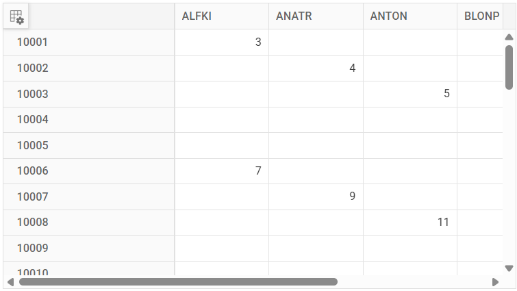
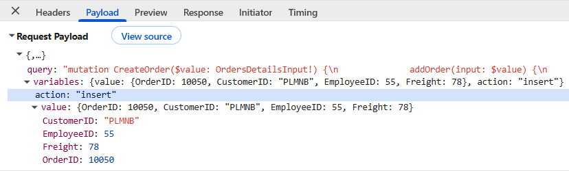
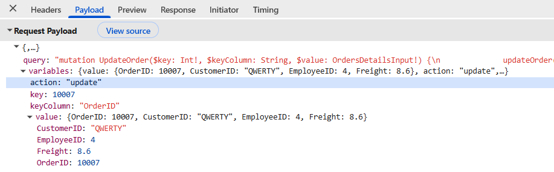
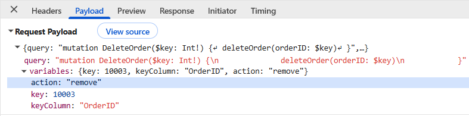

# Syncfusion React Pivot Table with Hot Chocolate GraphQL Backend

[GraphQL](https://graphql.org/learn/introduction) is a query language that allows applications to request exactly the data needed, nothing more and nothing less. Unlike traditional REST APIs that return fixed data structures, GraphQL enables the client to specify the shape and content of the response.

**Traditional REST APIs** and **GraphQL** differ mainly in the way data is requested and returned. REST APIs expose multiple endpoints that return fixed data structures, often including unnecessary fields and requiring several requests to fetch related data, while GraphQL uses a single endpoint where queries define the exact fields needed. This makes GraphQL especially useful for React Pivot Table integration because data-centric UI components require well-structured, selective datasets to reduce network calls and improve overall performance.

**Key GraphQL concepts:**

- **Queries**: A query is a request to read data. Queries do not modify data; they only retrieve it.
- **Mutations**: A mutation is a request to modify data. Mutations create, update, or delete records.
- **Resolvers**: Each query or mutation is handled by a resolver, which is a function responsible for fetching data or executing an operation. **Query resolvers** handle **read operations**, while **mutation resolvers** handle **write operations**.
- **Schema**: Defines the structure of the API. The schema describes available data types, the fields within those types, and the operations that can be executed. Query definitions specify the way data can be retrieved, and mutation definitions specify the way data can be modified.

[Hot Chocolate](https://chillicream.com/docs/hotchocolate/v13) is an open-source GraphQL server for ASP.NET Core that provides a code-first approach to building GraphQL APIs. It integrates with .NET dependency injection, the middleware pipeline, and the type system.

[ASP.NET Core](https://learn.microsoft.com/en-us/aspnet/core/introduction-to-aspnet-core) is a cross-platform, high-performance framework for building modern, cloud-enabled, and internet-connected applications. It provides the foundation for creating web APIs, web applications, and microservices using C# and the .NET platform.

## Prerequisites

| Software / package              | Tested version or requirement | Purpose |
|---------------------------------|-------------------------------|---------|
| .NET SDK                        | 8.0                           | Runtime and tooling for ASP.NET Core |
| Visual Studio                   | 2022 17.8 or later with the ASP.NET and web development workload | Optional IDE for the Visual Studio workflow |
| HotChocolate.AspNetCore         | 13.0.0                        | GraphQL server implementation |
| HotChocolate.Data               | 13.0.0                        | GraphQL data middleware |
| Node.js                         | 20.19+ or 22.12+              | Runtime supported by Vite 7 |
| npm, Yarn, or pnpm              | A current release compatible with the selected Node.js version | Package manager |
| Vite                            | 7.3.1                         | React build tool |
| @syncfusion/ej2-react-pivotview | 33.1.45 or later              | React Pivot Table component |

> **Version note:** This example is tested with Hot Chocolate 13.0.0 and is not guaranteed to work unchanged with later major versions. Hot Chocolate 13 is no longer actively maintained; for new production applications, use a supported release and its migration documentation. All `HotChocolate.*` packages in a project must use the same version.

## Setting up the Hot Chocolate GraphQL backend using ASP.NET Core

The ASP.NET Core application supplies data to the React Pivot Table through a GraphQL endpoint and accepts CRUD operations from the client. This section creates the project, installs the required packages, defines the data and GraphQL types, configures CORS, and runs the API locally. No MVC controller or custom JSON serialization configuration is required for this example.

### Step 1: Create the ASP.NET Core Web API project





#### Create a new ASP.NET Core Web API project in Visual Studio

To create a new ASP.NET Core Web API project named **GraphQLAdaptor** in Visual Studio, follow these steps:

1. Open **Visual Studio**.
2. Select **Create a new project**.
3. Choose the **ASP.NET Core Web API** project template.
4. Name the project **GraphQLAdaptor**.
5. Select **.NET 8.0**, enable **Use controllers**, and keep HTTPS enabled.
6. Click **Create**.





#### Create a new ASP.NET Core Web API project in Visual Studio Code

To create the project using Visual Studio Code, open the integrated terminal by pressing <kbd>Ctrl</kbd>+<kbd>`</kbd> and run the following commands:





dotnet new webapi -n GraphQLAdaptor --use-controllers
cd GraphQLAdaptor





The preceding command creates a project with a **Controllers** folder. To create a **Models** folder, run the following command:





mkdir Models









### Step 2: Install Hot Chocolate packages

Hot Chocolate is installed through NuGet packages. Two packages are required:

- **HotChocolate.AspNetCore**: Core GraphQL server implementation for ASP.NET Core.
- **HotChocolate.Data**: Provides filtering, sorting, and projection capabilities for GraphQL queries.

**Install using Package Manager Console:**

Open the Package Manager Console in Visual Studio and run:

```bash
Install-Package HotChocolate.AspNetCore -Version 13.0.0
Install-Package HotChocolate.Data -Version 13.0.0
```

**Install using .NET CLI:**

Navigate to the **GraphQLAdaptor** project folder in the terminal and run:

```bash
cd GraphQLAdaptor
dotnet add package HotChocolate.AspNetCore --version 13.0.0
dotnet add package HotChocolate.Data --version 13.0.0
```

**Verify installation:**

Open the **GraphQLAdaptor.csproj** file and verify the package references:

```xml
<ItemGroup>
  <PackageReference Include="HotChocolate.AspNetCore" Version="13.0.0" />
  <PackageReference Include="HotChocolate.Data" Version="13.0.0" />
</ItemGroup>
```

### Step 3: Create the data model

The data model represents the structure of the data that the GraphQL API will serve. For this guide, an **orders management system** is created with order details that include OrderID, CustomerID, EmployeeID, and Freight.

**Create the Models folder if needed:**

The Visual Studio Code workflow created this folder in Step 1. If you used Visual Studio, create a folder named **Models** in the **GraphQLAdaptor** project.

**Create OrdersDetails model:**

Create a new file named **Models/OrdersDetails.cs** with the following content:




using System.ComponentModel.DataAnnotations;
using System.Collections.Generic;
using System.Linq;
using HotChocolate;

namespace GraphQLAdaptor.Models
{
    public class OrdersDetails
    {
        public static List<OrdersDetails> order = new List<OrdersDetails>();
        public OrdersDetails()
        {

        }
        public OrdersDetails(
        int OrderID, string CustomerId, int EmployeeId, double Freight)
        {
            this.OrderID = OrderID;
            this.CustomerID = CustomerId;
            this.EmployeeID = EmployeeId;
            this.Freight = Freight;
        }

        public static List<OrdersDetails> GetAllRecords()
        {
            if (order.Count() == 0)
            {
                int code = 10000;
                for (int i = 1; i < 10; i++)
                {
                    order.Add(new OrdersDetails(code + 1, "ALFKI", i + 0, 3.3 * i));
                    order.Add(new OrdersDetails(code + 2, "ANATR", i + 2, 4.3 * i));
                    order.Add(new OrdersDetails(code + 3, "ANTON", i + 1, 5.3 * i));
                    order.Add(new OrdersDetails(code + 4, "BLONP", i + 3, 6.3 * i));
                    order.Add(new OrdersDetails(code + 5, "BOLID", i + 4, 7.3 * i));
                    code += 5;
                }
            }
            return order;
        }
        [Key]
        [GraphQLName("OrderID")]
        public int? OrderID { get; set; }
        [GraphQLName("CustomerID")]
        public string? CustomerID { get; set; }
        [GraphQLName("EmployeeID")]
        public int? EmployeeID { get; set; }
        [GraphQLName("Freight")]
        public double? Freight { get; set; }
    }
}




**Table Structure Explanation:**

| Column | Data Type | Description |
|--------|-----------|-------------|
| OrderID | int? | Unique identifier for each order (serves as the primary key) |
| CustomerID | string? | Identifier of the customer who placed the order |
| EmployeeID | int? | Identifier of the employee handling the order |
| Freight | double? | Shipping cost for the order |

N> Using attributes ([GraphQLName]) for the field names in the data source will retain the original data structure.

> **Demo data limitation:** The records are stored in a process-local static list. Changes are lost when the backend restarts, and the list is not safe for concurrent production use. Replace it with a database-backed, concurrency-safe repository for a production application. Treat `OrderID` as a required, immutable, unique value and validate mutation inputs before changing the data.

### Step 4: Create the return type for GraphQL queries

Syncfusion<sup style="font-size:70%">&reg;</sup> Pivot Table expects the server response to follow a specific structure that includes both the data array and the total count of records. This structure is essential for the backend data.

**Create OrdersReturnType.cs:**

Create a **GraphQL** folder in the **GraphQLAdaptor** project, then add a new class named **OrdersReturnType.cs** inside it and replace its content with the following content:




using System.Collections.Generic;
using GraphQLAdaptor.Models;

namespace GraphQLAdaptor.GraphQL
{
    // Return type for Syncfusion Pivot Table
    // Must have 'result' and 'count' properties
    public class OrdersReturnType
    {
        public List<OrdersDetails> Result { get; set; } = new List<OrdersDetails>();
        public int Count { get; set; }
    }
}




**Required response format:**

The response must follow this structure to work with the Syncfusion<sup style="font-size:70%">&reg;</sup> Pivot Table:

- **Result**: The list of records returned to the Pivot Table. This example returns the entire in-memory dataset; it does not implement server-side paging or on-demand loading.
- **Count**: The total count of records in the dataset.

### Step 5: Configure the GraphQL query resolver

In Hot Chocolate, a query resolver is responsible for processing **GraphQL** query requests and returning data to the client. For the Syncfusion<sup style="font-size:70%">&reg;</sup> Pivot Table, the resolver returns the records and total record count required by the configured response mapping.

In this example, the **GetOrders()** query resolver retrieves all order records from the data source, calculates the total number of available records, and returns the result by using the previously created **OrdersReturnType** class. The **Result** property contains the order data, while the **Count** property represents the total number of records.

**Create Query.cs:**

Create a new file named **Query.cs** inside the **GraphQL** folder and add the following code:




using System.Linq;
using System.Collections.Generic;
using System.Text.Json;
using GraphQLAdaptor.Models;

namespace GraphQLAdaptor.GraphQL
{
    public class Query
    {
        // Updated to accept DataManager parameter and return proper format for Syncfusion
        public OrdersReturnType GetOrders()
        {
            var allOrders = OrdersDetails.GetAllRecords();
            var query = allOrders.AsQueryable();
            var totalCount = query.Count();

            return new OrdersReturnType
            {
                Result = query.ToList(),
                Count = totalCount
            };
        }
    }
}




### Step 6: Configure Program.cs

Update the `Program.cs` file to configure GraphQL services and enable CORS so that the React frontend can communicate with the GraphQL API.

#### Configure GraphQL services

Configure the Hot Chocolate GraphQL server in the `Program.cs` file and register the `Query` resolver that exposes the GraphQL query operations. Register projection middleware and map the GraphQL endpoint so that client applications can send requests to `/graphql`. In this in-memory example, projection registration does not reduce data retrieval because `GetOrders` materializes the complete list and does not apply projection middleware to the field.

#### Configure CORS

CORS (Cross-Origin Resource Sharing) is a browser security feature that blocks requests between applications running on different origins. Since the React frontend and ASP.NET Core backend typically run on different ports during development, configure CORS to allow the frontend application to access the GraphQL API.

#### Complete Program.cs file

Combine the GraphQL service registration and CORS configuration in the `Program.cs` file as shown below:

```cs
using GraphQLAdaptor.GraphQL;
using GraphQLAdaptor.Models;
using HotChocolate;
using HotChocolate.AspNetCore;

var builder = WebApplication.CreateBuilder(args);

// Add services to the container.
builder.Services.AddControllers();
builder.Services.AddEndpointsApiExplorer();

builder.Services.AddCors(options =>
{
    options.AddDefaultPolicy(policy =>
    {
        policy.AllowAnyOrigin()      // Allow requests from any origin (development only; restrict in production).
              .AllowAnyMethod()       // Allow GET, POST, PUT, DELETE, etc.
              .AllowAnyHeader();      // Allow any request headers.
    });
});

// Add GraphQL services with HotChocolate.
builder.Services
    .AddGraphQLServer()
    .AddQueryType<Query>()      // Register query resolver.
    .AddProjections();          // Enable field projection.

var app = builder.Build();

app.UseDefaultFiles();
app.UseStaticFiles();

app.UseHttpsRedirection();

// Enable CORS middleware before routing.
app.UseCors();

app.UseAuthorization();

app.MapControllers();

// Map GraphQL endpoint
app.MapGraphQL("/graphql");

app.Run();
```

### Step 7: Run the backend API

Open a terminal in the project folder and run:

```bash
dotnet run
```

Use the exact scheme and port printed by `dotnet run` and configured in `Properties/launchSettings.json`; do not combine an HTTP port with an `https://` URL. To select the HTTPS profile explicitly, run `dotnet run --launch-profile https`. Use that complete origin in the React `DataManager` URL in the next section.

### Step 8: Verify the GraphQL endpoint

Navigate to **https://localhost:<https-port>/graphql** to access Banana Cake Pop, the GraphQL IDE bundled with Hot Chocolate. If the application was started with an HTTP-only profile, use the emitted `http://` URL instead.

**Test query example:**

```text
query {
  orders {
    count
    result {
      OrderID
      CustomerID
      EmployeeID
      Freight
    }
  }
}
```

### Step 9: Review the required response format

When using the `GraphQLAdaptor`, the GraphQL endpoint must return data in the mapped response structure. This ensures that the Syncfusion<sup style="font-size:70%">®</sup> React DataManager can interpret the response and bind the data to the Pivot Table component. The following abbreviated response illustrates the structure:

```json
{
  "data": {
    "orders": {
      "count": 4,
      "result": [
        {
          "OrderID": 10001,
          "CustomerID": "ALFKI",
          "EmployeeID": 1,
          "Freight": 3.3
        },
        {
          "OrderID": 10003,
          "CustomerID": "ANTON",
          "EmployeeID": 2,
          "Freight": 5.3
        },
	    ....
      ]
    }
  }
}
```

## Setting up the React Pivot Table client

With the backend API configured and running, the next step is to connect the React Pivot Table to it on the client side. This section explains how to integrate the Pivot Table with the backend using the `GraphQLAdaptor`.

### Step 1: Set up a React project with the Pivot Table

Create a Vite React project with the TypeScript template by running `npm create vite@7.3.1`, selecting **React** and **TypeScript**, entering the generated project directory, and running `npm install`. See the [Pivot Table getting-started documentation](https://ej2.syncfusion.com/react/documentation/pivotview/getting-started) for the required theme styles. Register a valid Syncfusion license key by following the [license-key registration documentation](https://ej2.syncfusion.com/react/documentation/licensing/license-key-registration). Then install the Pivot Table package:

```bash
npm install @syncfusion/ej2-react-pivotview
```

### Step 2: Configure the Pivot Table with GraphQLAdaptor

The Pivot Table connects to the backend API through the `GraphQLAdaptor`. This adaptor handles communication between the Pivot Table and the backend API endpoint. Configure the Pivot Table in the React application by using the example below.





import * as React from 'react';
import { PivotViewComponent, Inject, FieldList } from '@syncfusion/ej2-react-pivotview';
import { DataManager, GraphQLAdaptor } from '@syncfusion/ej2-data';
import type { DataSourceSettingsModel } from '@syncfusion/ej2-pivotview/src/model/datasourcesettings-model';
import './App.css';

function App(): React.ReactElement {
    const data = new DataManager({
        url: 'https://localhost:<port>/graphql/',
        adaptor: new GraphQLAdaptor({
            response: {
                result: 'orders.result',  // Path to the result data
                count: 'orders.count'     // Path to the count
            },
            query: `query GetOrders() {
          orders() {
            result {
              OrderID
              CustomerID
              EmployeeID
              Freight
            }
            count
          }
        }`,
        }),
        crossDomain: true
    });

    const dataSourceSettings: DataSourceSettingsModel = {
        dataSource: data,
        expandAll: false,
        rows: [
            { name: 'OrderID' }
        ],
        columns: [
            { name: 'CustomerID' }
        ],
        values: [
            { name: 'Freight' }
        ],
        formatSettings: [{ name: 'Freight', format: 'N0' }]
    };

    const pivotObj = React.useRef<PivotViewComponent>(null);

    return (
        <div className='control-section' style={{ margin: 100 }}>
            <PivotViewComponent ref={pivotObj} id='PivotView' height={350} width={700} showFieldList={true} dataSourceSettings={dataSourceSettings}>
                <Inject services={[FieldList]} />
            </PivotViewComponent>
        </div>
    );
}

export default App;





**Code Explanation:**

- [DataManager](https://ej2.syncfusion.com/react/documentation/data/getting-started): Creates a data source that targets the ASP.NET Core Web API endpoint at `https://localhost:<port>/graphql/`. Replace `<port>` with the port number shown by the `dotnet run` output.
- `GraphQLAdaptor`: Tells the [DataManager](https://ej2.syncfusion.com/react/documentation/data/getting-started) to use the `GraphQLAdaptor`, which automatically handles HTTP POST requests and JSON response parsing for the Pivot Table.
- [dataSourceSettings](https://ej2.syncfusion.com/react/documentation/api/pivotview/index-default#datasourcesettings): Defines the Pivot Table layout:
  - [rows](https://ej2.syncfusion.com/react/documentation/api/pivotview/datasourcesettingsmodel#rows): Displays **OrderID** values as row headers.
  - [columns](https://ej2.syncfusion.com/react/documentation/api/pivotview/datasourcesettingsmodel#columns): Displays **CustomerID** values as column headers.
  - [values](https://ej2.syncfusion.com/react/documentation/api/pivotview/datasourcesettingsmodel#values): Aggregates the **Freight** field based on the row and column combinations.
- [PivotViewComponent](https://ej2.syncfusion.com/react/documentation/api/pivotview/index-default): Renders the Pivot Table with the configured data and layout.

### Step 3: Understand the GraphQLAdaptor configuration

The `GraphQLAdaptor` configuration consists of two main parts:

**1. Response mapping:**

This specifies how to extract data from the GraphQL response:

```js
response: {
  result: 'orders.result',  // Path to the data array
  count: 'orders.count'     // Path to the total count
}
```

This tells the adaptor where to find the result data and the total count within the GraphQL response structure.

**2. Query definition:**

This defines the GraphQL query for fetching data along with all data operations:

```bash
query GetOrders() {
  orders() {
    result {
      OrderID
      CustomerID
      EmployeeID
      Freight
    }
    count
  }
}
```

### Step 4: Run and verify the Pivot Table

**Start the ASP.NET Core API server:**

Open a terminal in the backend project folder and run:

```bash
dotnet run
```

If the backend is not already running, start it using the instructions in backend Step 7. Use the exact scheme and port printed by the selected launch profile; the GraphQL endpoint is that origin followed by `/graphql`.

**Start the React application:**

Open a separate terminal in the client application folder and run:

```bash
npm run dev
```

Once both the server and client are running:

- The Pivot Table retrieves data from the backend API through the `GraphQLAdaptor` and displays it according to the defined report layout.
- The resulting Pivot Table appears as shown in the following image:



The Pivot Table is now successfully connected to the backend API and displays the data in the configured layout.

#### Verify data binding

To confirm that the API is working correctly:

1. Open the browser's **Developer Tools** (F12) → **Network** tab.
2. Load the React application. You should see a POST request to `https://localhost:<port>/graphql` with a 200 status code and a JSON response containing `result` and `count`.
3. If the Pivot Table appears empty, check the Network tab for failed requests or the Console tab for JavaScript errors.

## CRUD operations with the Pivot Table

The Syncfusion<sup style="font-size:70%">®</sup> React Pivot Table supports CRUD (Create, Read, Update, and Delete) operations. These operations connect to the backend through GraphQL mutations. Mutations are GraphQL operations that modify data on the server, such as creating, updating, or deleting records. When an edit action (add, update, or delete) is performed through the Pivot Table's built-in editing pop-up, the `getMutation` function in the GraphQLAdaptor handles CRUD actions by sending the appropriate mutation (insert, update, or delete) to the GraphQL server.

### Create the GraphQL mutation resolver in the backend

While query resolvers are used to retrieve data, mutation resolvers are used to modify data in a GraphQL API. To support CRUD operations in the Syncfusion<sup style="font-size:70%">®</sup> Pivot Table, create a GraphQL mutation resolver that handles inserting, updating, and deleting records.

In this example, the `Mutation` class contains GraphQL mutation methods for performing create, update, and delete operations on the `OrdersDetails` data source. The `OrdersDetailsInput` class defines the input model used to receive data from GraphQL mutation requests.

**Create Mutation.cs:**

Create a new file named `Mutation.cs` in the `GraphQL` folder and add the following code:




using System.Linq;
using GraphQLAdaptor.Models;

namespace GraphQLAdaptor.GraphQL
{
    public class OrdersDetailsInput
    {
        [GraphQLName("OrderID")]
        public int? OrderID { get; set; }
        [GraphQLName("CustomerID")]
        public string? CustomerID { get; set; }
        [GraphQLName("EmployeeID")]
        public int? EmployeeID { get; set; }
        [GraphQLName("Freight")]
        public double? Freight { get; set; }
    }

    public class Mutation
    {
        public OrdersDetails AddOrder(OrdersDetailsInput input)
        {
            var newOrder = new OrdersDetails
            {
                OrderID = input.OrderID,
                CustomerID = input.CustomerID,
                EmployeeID = input.EmployeeID,
                Freight = input.Freight
            };
            OrdersDetails.GetAllRecords().Insert(0, newOrder);
            return newOrder;
        }

        public OrdersDetails? UpdateOrder(int key, string? keyColumn, OrdersDetailsInput input)
        {
            // Find the order by the key (OrderID)
            var existing = OrdersDetails.GetAllRecords().FirstOrDefault(o => o.OrderID == key);
            if (existing == null) return null;

            // Update only the fields that are provided
            if (input.CustomerID != null)
                existing.CustomerID = input.CustomerID;
            if (input.EmployeeID.HasValue)
                existing.EmployeeID = input.EmployeeID;
            if (input.Freight != null)
                existing.Freight = input.Freight;

            return existing;
        }

        public bool DeleteOrder(int orderID)
        {
            var existing = OrdersDetails.GetAllRecords().FirstOrDefault(o => o.OrderID == orderID);
            if (existing == null) return false;
            OrdersDetails.GetAllRecords().Remove(existing);
            return true;
        }
    }
}




#### Insert

The insert operation creates a new order record in the in-memory dataset. When the `Add` button is clicked and the new record is submitted, this mutation receives and adds the data to the process-local list. The change is not persisted across backend restarts.

The "AddOrder" mutation method:

1. Receives the new order data through the `OrdersDetailsInput` parameter.
2. Creates a new `OrdersDetails` instance with the provided values.
3. Inserts the new record at the beginning of the list.
4. Returns the created order back to the client.

```csharp
public OrdersDetails AddOrder(OrdersDetailsInput input)
{
    var newOrder = new OrdersDetails
    {
        OrderID = input.OrderID,
        CustomerID = input.CustomerID,
        EmployeeID = input.EmployeeID,
        Freight = input.Freight
    };
    OrdersDetails.GetAllRecords().Insert(0, newOrder);
    return newOrder;
}
```

#### Update

Update operation modifies an existing order record. When a row is edited and changes are saved, this mutation receives the modified data and updates the record.

The "UpdateOrder" mutation method:

1. Receives the primary key (`key`), key column name, and updated values (`input`). This example accepts `keyColumn` for adaptor compatibility but always searches by `OrderID`.
2. Finds the existing record using the primary key.
3. Updates only the fields that are provided in the input.
4. Returns the updated order back to the client.

```csharp
public OrdersDetails? UpdateOrder(int key, string? keyColumn, OrdersDetailsInput input)
{
    // Find the order by the key (OrderID)
    var existing = OrdersDetails.GetAllRecords().FirstOrDefault(o => o.OrderID == key);
    if (existing == null) return null;

    // Update only the fields that are provided
    if (input.CustomerID != null)
        existing.CustomerID = input.CustomerID;
    if (input.EmployeeID.HasValue)
        existing.EmployeeID = input.EmployeeID;
    if (input.Freight != null)
        existing.Freight = input.Freight;

    return existing;
}
```

#### Delete

Delete operation removes an order record from the dataset. When the delete button is clicked and confirmed, this mutation removes the record from the data source.

The "DeleteOrder" mutation method:

1. Receives the primary key (`orderID`) of the record to delete.
2. Finds the existing record using the primary key.
3. Removes the record from the list.
4. Returns `true` if successful, `false` if the record was not found.

The example returns `null` from update and `false` from delete when a record is not found. A production resolver should convert these outcomes into a documented domain result or an explicit GraphQL error that the client handles.

```csharp
public bool DeleteOrder(int orderID)
{
    var existing = OrdersDetails.GetAllRecords().FirstOrDefault(o => o.OrderID == orderID);
    if (existing == null) return false;
    OrdersDetails.GetAllRecords().Remove(existing);
    return true;
}
```

#### Register the mutation resolver

After creating the `Mutation` class, register it with the Hot Chocolate GraphQL server so that the mutation operations are exposed through the GraphQL endpoint. The `AddMutationType<Mutation>()` method registers the mutation resolver and enables clients to execute GraphQL mutations for inserting, updating, and deleting records.

Update the GraphQL service configuration in the `Program.cs` file as shown below:

```cs
using GraphQLAdaptor.GraphQL;
using GraphQLAdaptor.Models;
using HotChocolate;
using HotChocolate.AspNetCore;

var builder = WebApplication.CreateBuilder(args);

builder.Services
    .AddGraphQLServer()
    .AddQueryType<Query>()          
    .AddMutationType<Mutation>()    // Register mutation resolver.
    .AddProjections();
```

The **GraphQL** backend is now configured with query and mutation resolvers to handle data retrieval and CRUD operations. Next, configure the React Pivot Table application to perform insert, update, and delete operations through **GraphQL** mutations.

### Configure client-side CRUD operations

To enable CRUD operations in the Syncfusion<sup style="font-size:70%">®</sup> Pivot Table, update the React `App.tsx` file to configure the `DataManager` with GraphQL mutation definitions and enable editing support. Make sure the backend mutation resolver is registered first; otherwise the client mutations will not execute successfully.

The following sections explain how to configure the `DataManager` to execute GraphQL mutations, enable editing in the Pivot Table, and set the primary key field required for update and delete operations. Together, these configurations allow users to add, edit, and delete records directly from the Pivot Table while keeping the data synchronized with the GraphQL backend.

#### Configure DataManager with GraphQL mutations

The `GraphQLAdaptor` supports CRUD operations through the `getMutation` function. Define the GraphQL mutation queries for insert, update, and delete operations so that the appropriate mutation method is executed whenever data is modified.

```typescript

import { DataManager, GraphQLAdaptor } from '@syncfusion/ej2-data';

const data = new DataManager({
    url: 'https://localhost:<port>/graphql/',
    adaptor: new GraphQLAdaptor({
        response: {
            result: 'orders.result',  // Path to the result data
            count: 'orders.count'     // Path to the count
        },
        query: `query GetOrders() {
          orders() {
            result {
              OrderID
              CustomerID
              EmployeeID
              Freight
            }
            count
          }
        }`,
        getMutation: function (action) {
            if (action === 'insert') {
                return `mutation CreateOrder($value: OrdersDetailsInput!) {
              addOrder(input: $value) {
                OrderID
                CustomerID
                EmployeeID
                Freight
              }
            }`;
            }
            if (action === 'update') {
                return `mutation UpdateOrder($key: Int!, $keyColumn: String, $value: OrdersDetailsInput!) {
              updateOrder(key: $key, keyColumn: $keyColumn, input: $value) {
                OrderID
                CustomerID
                EmployeeID
                Freight
              }
            }`;
            }
            if (action === 'remove') {
                return `mutation DeleteOrder($key: Int!) {
              deleteOrder(orderID: $key)
            }`;
            }
            return '';
        }
    }),
    crossDomain: true
});

```

##### How it works

The `getMutation` function is automatically called whenever a CRUD operation is performed in the Pivot Table.

- When a new record is added, the `insert` action executes the `addOrder` mutation.
- When an existing record is updated, the `update` action executes the `updateOrder` mutation.
- When a record is deleted, the `remove` action executes the `deleteOrder` mutation.
- The `GraphQLAdaptor` automatically passes the required values, such as the record data and primary key, to the corresponding mutation.
- After the mutation completes, the Pivot Table updates the displayed result; inspect the Network tab if you need to confirm whether the current package version issues a follow-up query.

This configuration connects the Pivot Table CRUD actions to the GraphQL mutation methods defined in the backend.

Use the browser Network tab to inspect the mutation variables. Insert sends the new record as `value`; update sends `key`, `keyColumn`, and `value`; delete sends the primary-key value as `key`.

##### Insert details included in the request payload

The following image illustrates the added record passed from the DataManager.



##### Update details included in the request payload

The following image illustrates the edited record passed from the DataManager.



##### Delete details included in the request payload

The following image illustrates the deleted record key passed from the DataManager.



#### Enable edit settings

Configure the [editSettings](https://ej2.syncfusion.com/react/documentation/api/pivotview/index-default#editsettings) property to enable CRUD operations in the Pivot Table. Add the `CellEditSettings` type import at the top of `App.tsx`:

```typescript
import { CellEditSettings } from '@syncfusion/ej2-react-pivotview';
```

Then define the settings inside the component and wire them to the `PivotViewComponent`:

```typescript
  // Enable editing functionality
  const editSettings: CellEditSettings = { 
    allowEditing: true,    // Enables the Edit button and allows users to modify existing records.
    allowAdding: true,     // Enables the Add button and allows users to create new records.
    allowDeleting: true,   // Enables the Delete button and allows users to remove records.
    mode: 'Normal'         // Uses Normal mode for editing; other options: 'Dialog', 'Batch', 'CommandColumn'.
  };

  const pivotObj = React.useRef<PivotViewComponent>(null);

  return (
    <PivotViewComponent 
      id='PivotView' 
      ref={pivotObj}
      editSettings={editSettings} 
      >
    </PivotViewComponent>
  );
```

Configure Normal, Dialog, or Batch editing with the [mode](https://ej2.syncfusion.com/react/documentation/api/pivotview/celleditsettingsmodel#mode) property. Enable command-column editing separately with `allowCommandColumns`. For detailed behavior and usage, refer to the [Editing documentation](https://ej2.syncfusion.com/react/documentation/pivotview/editing).

#### Configure primary key for editing

**What is drill-through editing?**

Drill-through editing opens a detailed data grid showing all source records when you click a pivot cell. This grid is where users add, edit, or delete individual records that feed into the pivot summary. The [beginDrillThrough](https://ej2.syncfusion.com/react/documentation/pivotview/drill-through#begindrillthrough) event is triggered just before this edit grid opens. This is where the primary key column is configured.

**Why is the primary key important?**

The primary key (**OrderID**) uniquely identifies each record. When the [DataManager](https://ej2.syncfusion.com/react/documentation/data/getting-started) performs update or delete operations, it uses the primary key to locate the exact record to modify. Without a correctly configured primary key, the [DataManager](https://ej2.syncfusion.com/react/documentation/data/getting-started) cannot identify which record to update or delete, and the request will fail.

> **Note:** Editing is enabled by setting `allowEditing`, `allowAdding`, or `allowDeleting` to `true` in [editSettings](https://ej2.syncfusion.com/react/documentation/api/pivotview/index-default#editsettings). Enabling these settings makes the drill-through grid available when a pivot value cell is double-clicked; the snippet below configures column behavior in the [beginDrillThrough](https://ej2.syncfusion.com/react/documentation/pivotview/drill-through#begindrillthrough) event.

Configure the primary key as follows. Add the type import at the top of `App.tsx`:

```typescript
import type { BeginDrillThroughEventArgs } from '@syncfusion/ej2-pivotview';
```

Then define the handler inside the component and wire it to the `beginDrillThrough` event:

```typescript
    // Configure the beginDrillThrough event to set the primary key
    function beginDrillThrough(args: BeginDrillThroughEventArgs) {
        for (var i = 0; i < args.gridObj.columns.length; i++) {
            if (args.gridObj.columns[i].field === "OrderID") {
                args.gridObj.columns[i].isPrimaryKey = true;
            } else {
                args.gridObj.columns[i].visible = true;
            }
        }
    }

  return (
    <PivotViewComponent 
      id='PivotView' 
      ref={pivotObj}
      beginDrillThrough={beginDrillThrough}
      >
    </PivotViewComponent>
  );
```

**How it works:**

- The event iterates through all columns in the drill-through (edit) grid.
- The column whose `field` matches the primary key name (`OrderID`) is flagged with `isPrimaryKey = true`. This tells the [DataManager](https://ej2.syncfusion.com/react/documentation/data/getting-started) which field uniquely identifies each record.
- Other columns are made visible so users can review and edit the available fields.

> **Note:** Setting `visible = true` on every non-key column in `beginDrillThrough` overrides any field-hiding the user applied via the Pivot Table field list. Remove that assignment or scope it to specific fields if you want to honor user hiding.

#### Complete App.tsx with editing and CRUD endpoints

The following example combines the [DataManager](https://ej2.syncfusion.com/react/documentation/data/getting-started) configuration, [editSettings](https://ej2.syncfusion.com/react/documentation/api/pivotview/index-default#editsettings), and the [beginDrillThrough](https://ej2.syncfusion.com/react/documentation/pivotview/drill-through#begindrillthrough) event handler shown in the preceding snippets into a single component reference:





import * as React from 'react';
import { PivotViewComponent, CellEditSettings, Inject, FieldList } from '@syncfusion/ej2-react-pivotview';
import { DataManager, GraphQLAdaptor } from '@syncfusion/ej2-data';
import type { DataSourceSettingsModel } from '@syncfusion/ej2-pivotview/src/model/datasourcesettings-model';
import type { BeginDrillThroughEventArgs } from '@syncfusion/ej2-pivotview';
import './App.css';

function App(): React.ReactElement {

  const data = new DataManager({
    url: 'https://localhost:<port>/graphql/',
    adaptor: new GraphQLAdaptor({
      response: {
        result: 'orders.result',  // Path to the result data
        count: 'orders.count'     // Path to the count
      },
      query: `query GetOrders() {
          orders() {
            result {
              OrderID
              CustomerID
              EmployeeID
              Freight
            }
            count
          }
        }`,
      getMutation: function (action) {
        if (action === 'insert') {
          return `mutation CreateOrder($value: OrdersDetailsInput!) {
              addOrder(input: $value) {
                OrderID
                CustomerID
                EmployeeID
                Freight
              }
            }`;
        }
        if (action === 'update') {
          return `mutation UpdateOrder($key: Int!, $keyColumn: String, $value: OrdersDetailsInput!) {
              updateOrder(key: $key, keyColumn: $keyColumn, input: $value) {
                OrderID
                CustomerID
                EmployeeID
                Freight
              }
            }`;
        }
        if (action === 'remove') {
          return `mutation DeleteOrder($key: Int!) {
              deleteOrder(orderID: $key)
            }`;
        }
        return '';
      }
    }),
    crossDomain: true
  });

  const dataSourceSettings: DataSourceSettingsModel = {
    dataSource: data,
    expandAll: false,
    rows: [
      { name: 'OrderID' }
    ],
    columns: [
      { name: 'CustomerID' }
    ],
    values: [
      { name: 'Freight' }
    ],
    formatSettings: [{ name: 'Freight', format: 'N0' }]
  };

  // Enable editing functionality
  const editSettings: CellEditSettings = {
    allowEditing: true,    // Enables the Edit button and allows users to modify existing records.
    allowAdding: true,     // Enables the Add button and allows users to create new records.
    allowDeleting: true,   // Enables the Delete button and allows users to remove records.
    mode: 'Normal'         // Uses Normal mode (popup dialog) for editing; other options: 'Dialog', 'Batch', 'CommandColumn'.
  };


  const pivotObj = React.useRef<PivotViewComponent>(null);

  // Configure beginDrillThrough event to set the primary key for CRUD operations
  function beginDrillThrough(args: BeginDrillThroughEventArgs) {
    // Iterate through all columns in the drill-through grid
    for (var i = 0; i < args.gridObj.columns.length; i++) {
      // Check if the current column is the primary key column
      if (args.gridObj.columns[i].field === "OrderID") {
        // Mark this column as the primary key
        // This tells DataManager to use this column's value to uniquely identify records
        args.gridObj.columns[i].isPrimaryKey = true;
      } else {
        // Make all other columns visible so users can view and edit them
        args.gridObj.columns[i].visible = true;
      }
    }
  }

  return (
    <div className='control-section' style={{ margin: 100 }}>
      <PivotViewComponent ref={pivotObj} id='PivotView' height={350} width={700} showFieldList={true} dataSourceSettings={dataSourceSettings} editSettings={editSettings} beginDrillThrough={beginDrillThrough}>
        <Inject services={[FieldList]} />
      </PivotViewComponent>
    </div>
  );
}

export default App;





### Important notes

- **Primary key field**: The primary key field (**OrderID**) cannot be modified during editing. Changing it causes data inconsistency because it uniquely identifies each record.
- **Post-CRUD refresh**: After each CRUD operation, the Pivot Table refreshes its displayed data. This example does not implement GraphQL subscriptions or server-pushed real-time updates.
- **Edit modes**: Configure `Normal`, `Dialog`, or `Batch` with the [mode](https://ej2.syncfusion.com/react/documentation/api/pivotview/celleditsettingsmodel#mode) property. Enable command columns separately with `allowCommandColumns`. For details, refer to the [Editing documentation](https://ej2.syncfusion.com/react/documentation/pivotview/editing).

### Test CRUD operations

To verify that CRUD operations work end-to-end:

1. **Test Insert**: Open the drill-through dialog by double-clicking a value cell in the Pivot Table. Click **Add**, enter a unique non-null `OrderID` and the remaining details, and then click **Update**. Verify that an `addOrder` mutation request is sent to the `/graphql` endpoint and that the newly added record appears in the drill-through grid.

2. **Test Update**: In the drill-through grid, click **Edit** on an existing record, modify one or more fields, and then click **Update**. Verify that an `updateOrder` mutation request is sent to the `/graphql` endpoint and that the changes are reflected in the drill-through grid.

3. **Test Delete**: In the drill-through grid, click **Delete** on a record and confirm the action. Verify that a `deleteOrder` mutation request is sent to the `/graphql` endpoint and that the selected record is removed from the drill-through grid.

4. **Verify Data Changes**: Confirm that the inserted, updated, and deleted records are reflected in the Pivot Table and remain available while the backend process is running. This example does not persist changes across restarts.

## Best practices for GraphQLAdaptor integration

### 1. GraphQL response structure

- **Use a consistent response structure**: Ensure that GraphQL query responses return both the `result` collection and the `count` value in the format expected by the `GraphQLAdaptor`.
- **Match response mappings**: Verify that the `response.result` and `response.count` mappings configured in the `GraphQLAdaptor` correctly point to the corresponding fields in the GraphQL response.
- **Preserve the original data structure**: Apply the `[GraphQLName]` attribute to the properties in both the `OrdersDetails` model and the `OrdersDetailsInput` class. This ensures that GraphQL queries and mutations use the original field names, maintaining a consistent data structure for the `GraphQLAdaptor`.

### 2. Security

- **Restrict CORS in production**: The `AllowAnyOrigin()` policy is intended only for development. In production, restrict access to trusted frontend domains by using `policy.WithOrigins("https://yourdomain.com")`.
- **Use HTTPS**: Always host the GraphQL endpoint over HTTPS in production to secure data exchanged between the React application and the GraphQL server.
- **Protect mutations**: Add authentication and authorization before exposing create, update, or delete operations outside a trusted development environment.

### 3. Error handling

- **Validate GraphQL inputs**: Validate mutation input values before performing insert, update, or delete operations to prevent invalid data from being processed.
- **Handle exceptions gracefully**: Catch and handle application or database exceptions within GraphQL resolvers and return meaningful error messages to help identify issues during development and troubleshooting.
- **Log errors**: Use ASP.NET Core logging to record GraphQL requests, exceptions, and application errors for easier debugging and monitoring.

### 4. Performance

- **Use asynchronous resolvers**: For large datasets or database-backed applications, implement asynchronous query and mutation resolvers to improve server scalability and responsiveness.
- **Retrieve only required fields**: Request only the fields needed by the Pivot Table to reduce payload size and improve query performance.
- **Enable projections when applicable**: Register projections and apply projection middleware to a resolver that exposes a compatible `IQueryable`; registration alone does not optimize the materialized list used in this example.

## Troubleshooting

The following table lists common issues and their resolutions when working with the `GraphQLAdaptor` and the Syncfusion<sup style="font-size:70%">®</sup> Pivot Table.

| Issue | Symptom | Resolution |
|---------|---------|---------|
| **Empty Pivot Table** | The Pivot Table loads successfully, but no data is displayed. | Verify that the `GetOrders()` query resolver returns data and that the GraphQL response contains both the `result` collection and `count` value. Also ensure that the field names returned by the GraphQL query match the field names configured in `dataSourceSettings`. |
| **GraphQL Query Returns No Data** | The GraphQL endpoint responds successfully, but the Pivot Table remains empty. | Verify that the query defined in the `GraphQLAdaptor` matches the GraphQL schema and that the response mappings (`result` and `count`) point to the correct paths in the GraphQL response. |
| **404 Error** | The browser Network tab shows a 404 response when loading data. | Ensure that the GraphQL endpoint is mapped correctly using `app.MapGraphQL("/graphql")` and that the URL configured in the React `DataManager` matches the running backend URL and port. |
| **500 Error** | The Pivot Table fails to load, and the GraphQL request returns an internal server error. | Check the ASP.NET Core application logs for exception details. Common causes include errors in query resolvers, invalid mutation inputs, or unexpected null values. |
| **GraphQL Validation Error** | The endpoint returns an `errors` array, potentially with HTTP status 200. | Inspect the GraphQL error message and ensure empty parentheses are removed from operations and fields that declare no variables or arguments. |
| **`GraphQLName` Build Error** | `Mutation.cs` reports that `GraphQLName` cannot be found. | Add the `HotChocolate` namespace import described in the mutation-resolver section. |
| **Authorization Startup Error** | The backend fails during startup because authorization services are missing. | Register authorization services or remove the unused authorization middleware as described in the `Program.cs` correction note. |
| **CORS Error** | The browser console displays a message indicating that the request has been blocked by a CORS policy. | Verify that CORS is configured correctly in `Program.cs` and that `app.UseCors()` is called before mapping the GraphQL endpoint. Also ensure that the frontend origin is included in the allowed origins list. |
| **GraphQL Mutation Execution Fails** | Insert, update, or delete operations return GraphQL errors. | Check the mutation definition in the `getMutation` function and ensure that the mutation name, parameters, and input types match the methods defined in the `Mutation` class. |
| **Field Name Mismatch** | The Pivot Table shows empty fields or displays a "field not found" message. | Ensure that the field names returned by the GraphQL query exactly match the field names used in the Pivot Table configuration, including letter casing. |
| **Pivot Table Loads Slowly** | The Pivot Table takes a long time to render or refresh after data operations. | Retrieve only the required fields in the GraphQL query and avoid returning unnecessary data. For large datasets, consider implementing virtual scrolling, paging, or server-side aggregation to reduce the amount of data sent to the client. |
| **SSL/TLS Certificate Error** | The browser displays `net::ERR_CERT_AUTHORITY_INVALID` or a certificate warning. | ASP.NET Core uses a development certificate for local HTTPS. If the certificate is invalid, run `dotnet dev-certs https --clean` followed by `dotnet dev-certs https --trust` and restart the application. |
| **Syncfusion License Warning** | The client displays a trial or license-validation message. | Register a license key compatible with the installed Syncfusion major version and restart the client application. |

## Complete sample repository

For a complete working implementation, refer to the [GitHub repository](https://github.com/SyncfusionExamples/react-pivot-table-graphql-hotchocolate).

## See also

- [**PivotTable Data Binding**](https://ej2.syncfusion.com/react/documentation/pivotview/data-binding)
- [**DataManager**](https://ej2.syncfusion.com/react/documentation/data/getting-started)
- [**GraphQLAdaptor**](https://ej2.syncfusion.com/react/documentation/data/adaptors/graphql-adaptor)
- [**PivotTable Editing**](https://ej2.syncfusion.com/react/documentation/pivotview/editing)
