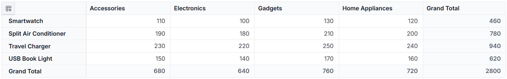
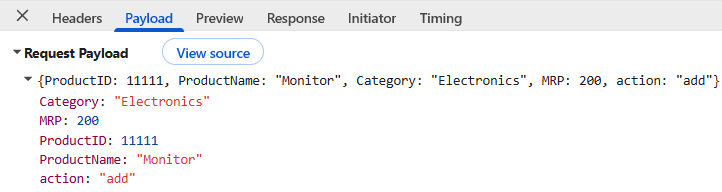
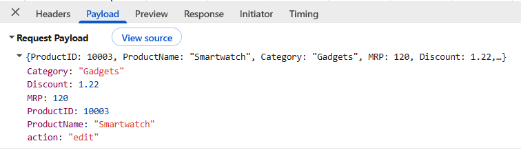
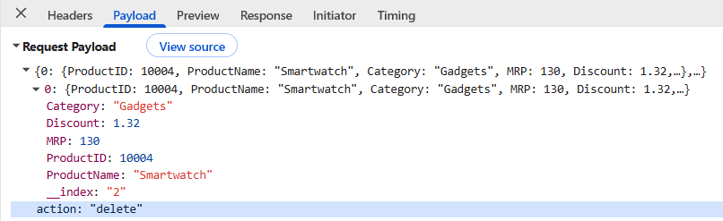

# Connect React Pivot Table to a Next.js Backend

[Next.js](https://nextjs.org/) is a React framework for building full-stack web applications. It includes server-side rendering, automatic code splitting, file-based routing, and App Router Route Handlers for server endpoints.

## Prerequisites

Before connecting the Syncfusion<sup style="font-size:70%">®</sup> React Pivot Table to a [Next.js](https://nextjs.org/) backend, ensure that the following development tools are available. Familiarity with React, TypeScript, and the Next.js App Router is assumed; see the [Next.js getting started guide](https://nextjs.org/docs/app/getting-started) if these concepts are new.

| Software / Package | Supported version for this article | Purpose |
|--------------------|------------------------------------|---------|
| Node.js | 20.9 or later; an active LTS release is recommended | Runs the React application and the [Next.js](https://nextjs.org/) backend; verify the [current Next.js system requirements](https://nextjs.org/docs/app/getting-started/installation) before installation |
| [Next.js](https://nextjs.org/) | 14.x through 16.x (App Router) | Provides file-based routing and the Route Handler used in this article. The `app/` directory is required because the sample files are `app/data.ts` and `app/api/route.ts`. |
| npm | 10.x or later | Installs and manages project packages; all commands in this article use npm |
| TypeScript | 5.x or later | Supports the TypeScript (`.ts` and `.tsx`) examples |
| @syncfusion/ej2-react-pivotview | 33.1.45 or later | Provides the Syncfusion<sup style="font-size:70%">®</sup> React Pivot Table component |
| Syncfusion account and license key | License, trial, or eligible community license | Required to register current Syncfusion Essential JS 2 packages and remove license validation messages |

The examples require compatible Syncfusion package versions from the same release line. If a newer major release changes an imported type or event contract, consult its release notes before using these examples. Generate and register a license key by following the [Syncfusion license registration instructions](https://ej2.syncfusion.com/react/documentation/licensing/license-key-registration) before running the Pivot Table.

## Building the Next.js application

Open a terminal, such as the integrated terminal in Visual Studio Code, Windows Command Prompt, or the macOS Terminal. Then, run the following commands to create a new [Next.js](https://nextjs.org/) application and navigate to the project folder. When `create-next-app` prompts for configuration, select TypeScript, the App Router, and a project layout without a `src/` directory. ESLint and an import alias are optional. The Tailwind CSS prompt does not affect the Syncfusion theme import used later in this article.

```bash
npm create next-app@latest nextjs_pivot
cd nextjs_pivot
```

After the project is created, optionally start the development server as a preliminary setup check:

```bash
npm run dev
```

Once the development server starts successfully, the application will be available at **http://localhost:3000**. Stop the server with **Ctrl+C** before continuing, or keep it running in this terminal and use a second terminal for the remaining commands. The completed application is started again in the verification section.

## Setting up the Next.js Route Handler

After creating the [Next.js](https://nextjs.org/) application, set up a server endpoint to provide data to the Syncfusion<sup style="font-size:70%">®</sup> React Pivot Table. In this example, a sample data source is created and exposed through an App Router Route Handler at `/api`. The Pivot Table sends requests to this endpoint and receives raw records for generating the pivot report in the browser.

### Step 1: Create a sample data source

First, create the sample dataset used by the [Next.js](https://nextjs.org/) server. The data is stored in memory and returned to the Pivot Table in response to each request.

Create a file named **data.ts** inside the **app** folder and add the following code:





import { IDataSet } from "@syncfusion/ej2-react-pivotview";

export const productDetails: IDataSet[] = [
  {
    "ProductID": 10001,
    "ProductName": "Smartwatch",
    "Category": "Electronics",
    "MRP": 100.0,
    "Discount": 1.02
  },
  {
    "ProductID": 10002,
    "ProductName": "Smartwatch",
    "Category": "Accessories",
    "MRP": 110.0,
    "Discount": 1.12
  },
  {
    "ProductID": 10003,
    "ProductName": "Smartwatch",
    "Category": "Home Appliances",
    "MRP": 120.0,
    "Discount": 1.22
  },
  {
    "ProductID": 10004,
    "ProductName": "Smartwatch",
    "Category": "Gadgets",
    "MRP": 130.0,
    "Discount": 1.32
  }
  ...
];





### Step 2: Create a Route Handler

[Next.js](https://nextjs.org/) Route Handlers let you create server-side endpoints directly within the application. These endpoints can process requests, retrieve data, and return the required response to the Pivot Table.

Create a new file named **route.ts** inside the **app/api** folder:

```text
app
 └─ api
     └─ route.ts
```

Add a `GET` method to the **route.ts** file that returns data in response to a request. The Route Handler reads the paging state sent from the client, returns the selected records, and includes the total record count before paging.

The `GET /api` contract used by this example is:

| Item | Description |
|------|-------------|
| Query parameter | `pivotState`, required; a URI-encoded JSON object containing numeric `skip` and `take` values |
| Success response | `200` with `{ result: object[], count: number }`; `count` is the total number of records before paging |
| Missing parameter | `400` with `{ error, result: [], count: 0 }` |

Use non-negative `skip` and positive `take` values. The sample assumes valid encoded JSON; a production endpoint must catch JSON decoding and parsing failures and return a controlled `400` response.






import { NextResponse, NextRequest } from "next/server";
import { DataManager, Query } from '@syncfusion/ej2-data';
import { productDetails } from '../data.ts';

// GET - Retrieve all data
export async function GET(request: NextRequest) {
    const pivotStateParam = new URL(request.url).searchParams.get('pivotState');
    if (!pivotStateParam) {
        return NextResponse.json(
            { error: 'pivotState parameter is required', result: [], count: 0 },
            { status: 400 }
        );
    }
    const pivotState = JSON.parse(decodeURIComponent(pivotStateParam));
    const query = new Query();
    // Execute query on data
    let result: object[] = new DataManager(productDetails).executeLocal(query);
    let count: number = result.length;

    if (pivotState.take && pivotState.take > 0) {
        const skip = pivotState.skip || 0;
        const take = pivotState.take;
        query.page(skip / take + 1, take);
        result = new DataManager(result).executeLocal(query);
    }
    return NextResponse.json({ result, count });
}





The Route Handler is now ready to serve data. In the next step, the React Pivot Table is connected to this endpoint to load and display data from the [Next.js](https://nextjs.org/) server.

## Integrating the Syncfusion React Pivot Table with Next.js

After setting up the [Next.js](https://nextjs.org/) server and creating the Route Handler, the next step is to add the Syncfusion<sup style="font-size:70%">®</sup> React Pivot Table to the application. The Pivot Table connects to the `/api` endpoint, retrieves data from the server, and displays it in a summarized report.

### Step 1: Install Syncfusion React packages

To use the Syncfusion<sup style="font-size:70%">®</sup> React Pivot Table in the application, install the required packages by running the following npm command. This article uses npm consistently; if the project uses Yarn or pnpm, use that package manager's equivalent install command and do not mix lockfiles.




npm install @syncfusion/ej2-react-pivotview @syncfusion/ej2-tailwind3-theme




### Step 2: Add Pivot Table styles

After installing the packages, import the required Tailwind 3 theme styles for the Pivot Table. Open the **app/globals.css** file, remove any existing content if needed, and add the following import:




@import '../node_modules/@syncfusion/ej2-tailwind3-theme/styles/pivotview/index.css';




### Step 3: Add the Syncfusion React Pivot Table

After installing the required packages, add the Syncfusion<sup style="font-size:70%">®</sup> React Pivot Table to the application and connect it to the [Next.js](https://nextjs.org/) server. In this example, data is retrieved from the `/api` Route Handler and then displayed in the Pivot Table.

Open the **app/page.tsx** file, remove any existing content if needed, and add the following code:





'use client';

import React, { useEffect } from 'react';
import { PivotViewComponent, Inject, FieldList } from '@syncfusion/ej2-react-pivotview';
import type { DataSourceSettingsModel } from '@syncfusion/ej2-pivotview/src/model/datasourcesettings-model';

export default function ProductPivotGrid() {
    const pivotObj = React.useRef<PivotViewComponent>(null);

    // Fetch data from the server
    const fetchData = async (pivotState: any) => {
        const response = await fetch(`/api?pivotState=${encodeURIComponent(JSON.stringify(pivotState))}`, {
            method: 'GET',
            headers: { 'Content-Type': 'application/json' },
        });

        const res: any = await response.json();
        return res;
    };

    // Load data when the page is opened
    useEffect(() => {
        if (pivotObj.current) {
            const initialState = {
                skip: 0,
                take: 16,
            };
            fetchData(initialState).then((data) => {
                if (pivotObj.current) {
                    pivotObj.current.dataSourceSettings.dataSource = data.result;
                }
            });
        }
    }, []);

    const dataSourceSettings: DataSourceSettingsModel = {
        dataSource: [],
        expandAll: true,
        rows: [{ name: 'ProductName' }],
        columns: [{ name: 'Category' }],
        values: [{ name: 'MRP' }],
    };

    return (
        <div style={{ padding: '20px' }}>
            <h1>Product Portal</h1>
            <PivotViewComponent
                ref={pivotObj}
                id='PivotView'
                height={350}
                width={700}
                dataSourceSettings={dataSourceSettings}
                showFieldList={true}
            >
                <Inject services={[FieldList]} />
            </PivotViewComponent>
        </div>
    );
}





#### Code explanation

The **fetchData** function sends a request to the Next.js Route Handler and retrieves the product data in JSON format. The request uses a relative `/api` URL and therefore assumes that the page and endpoint share the same Next.js origin.

The React `useEffect` hook runs once when the page is loaded. During this process, the **fetchData** function is called, and the returned data is assigned to the Pivot Table data source.

The [dataSourceSettings](https://ej2.syncfusion.com/react/documentation/api/pivotview/index-default#datasourcesettings) property defines how the data is organized and displayed in the Pivot Table:

- The [rows](https://ej2.syncfusion.com/react/documentation/api/pivotview/datasourcesettingsmodel#rows) property displays **ProductName** values as row headers.
- The [columns](https://ej2.syncfusion.com/react/documentation/api/pivotview/datasourcesettingsmodel#columns) property displays **Category** values as column headers.
- The [values](https://ej2.syncfusion.com/react/documentation/api/pivotview/datasourcesettingsmodel#values) property summarizes the **MRP** field.

The [PivotViewComponent](https://ej2.syncfusion.com/react/documentation/api/pivotview/index-default) displays the summarized product data returned from the Next.js server.

The [FieldList](https://ej2.syncfusion.com/react/documentation/pivotview/field-list) service displays the Field List, making it possible to arrange fields in rows, columns, values, and filters.

This introductory example requests only the first 16 raw records and does not use the returned `count`. Consequently, the displayed aggregation represents that subset, not the complete in-memory dataset. For a complete report, request all required records. For large datasets, implement a documented server-side/custom-binding strategy instead of increasing `take` without a limit.

### Step 4: Run and verify the Pivot Table

After connecting the Syncfusion<sup style="font-size:70%">®</sup> React Pivot Table to the [Next.js](https://nextjs.org/) Route Handler, run the application and verify that data is retrieved successfully from the server and displayed in the Pivot Table.

Run the following command from the project folder:

```bash
npm run dev
```

The following image shows the React Pivot Table displaying data loaded from the Next.js server.



After the runtime check, stop the development server and run `npm run build` from the project folder. Resolve any TypeScript or import errors before continuing to CRUD configuration.

## CRUD operations with the Pivot Table

The Syncfusion<sup style="font-size:70%">®</sup> React Pivot Table supports editing through the [drill‑through](https://ej2.syncfusion.com/react/documentation/pivotview/drill-through) feature. When a value cell is double‑clicked, the drill‑through grid opens and displays the underlying records. Records can then be added, modified, or removed, and the changes can be sent to the [Next.js](https://nextjs.org/) server for processing.

All CRUD operations described in this section are performed within the [drill‑through](https://ej2.syncfusion.com/react/documentation/pivotview/drill-through) grid.

The following operations are supported:

- **Create**: Add a new record to the data source.
- **Read**: Retrieve and display data from the [Next.js](https://nextjs.org/) server.
- **Update**: Modify an existing record in the data source.
- **Delete**: Remove a record from the data source.

The following sections explain how to configure the [Next.js](https://nextjs.org/) server and the Syncfusion<sup style="font-size:70%">®</sup> React Pivot Table to perform CRUD operations and keep the server data synchronized with the Pivot Table. The operation-specific snippets are incremental; the later combined references show their intended placement in each complete file.

### Update the server for CRUD operations

To support CRUD operations, update the **app/api/route.ts** file by adding `POST`, `PUT`, and `DELETE` methods. These methods handle requests sent from the [drill‑through](https://ej2.syncfusion.com/react/documentation/pivotview/drill-through) grid and update the data source on the [Next.js](https://nextjs.org/) server.

The sample uses the following request and response contracts:

| Operation | Request body | Success response | Documented error response |
|-----------|--------------|------------------|---------------------------|
| Create (`POST /api`) | `{ action: "add", ProductID, ProductName, Category, MRP, Discount }` | `201` with the created product | None in the sample |
| Update (`PUT /api`) | `{ action: "edit", ProductID, ProductName, Category, MRP, Discount }` | `200` with the updated product | `404` when `ProductID` is not found |
| Delete (`DELETE /api`) | An object with `action: "delete"` and the selected record at numeric key `0` | `200` with a success message | `404` when `ProductID` is not found |

All product fields are expected to use the same types as `productDetails`. The sample assumes that `ProductID` is supplied by the client and is unique; it does not generate IDs, reject duplicates, authenticate callers, authorize mutations, or validate malformed JSON and invalid actions. Add those controls before using the endpoint outside a local demonstration.

#### Create operation

Add the following `POST` method below the existing `GET` method in the **app/api/route.ts** file. This method receives a new record from the Pivot Table and adds it to the data source.

```ts
// POST - Create a new product
export async function POST(request: NextRequest) {
    const body = await request.json();
    if (body.action === 'add') {
        const newProduct: any = {
            ProductID: body.ProductID,
            ProductName: body.ProductName,
            Category: body.Category,
            MRP: body.MRP,
            Discount: body.Discount
        };
        productDetails.push(newProduct);
        return NextResponse.json(newProduct, { status: 201 });
    }
}
```

##### Create operation workflow

| Step | Purpose | Implementation |
|------|---------|----------------|
| **1. Receive request data** | Retrieve the new record sent from the drill‑through grid. | `const body = await request.json();` |
| **2. Check the action type** | Verify that the request is intended for creating a new record. | `body.action === 'add'` |
| **3. Create a new record** | Create a product object using the values received in the request. | `const newProduct = { ... }` |
| **4. Add the record** | Add the new record to the in-memory data source. | `productDetails.push(newProduct);` |
| **5. Return the response** | Return the created record as a JSON response with a success status code. | `return NextResponse.json(newProduct, { status: 201 });` |

**Create request payload**

The following image shows the new product record sent from the Pivot Table to the [Next.js](https://nextjs.org/) Route Handler during the create operation.



#### Update operation

After enabling record creation, add support for updating existing records in the data source. Add the following `PUT` method to the **app/api/route.ts** file.

```ts
// PUT - Update an existing product
export async function PUT(request: NextRequest) {
    const body = await request.json();
    if (body.action === 'edit') {
        const productIndex = productDetails.findIndex(u => u.ProductID === body.ProductID);
        if (productIndex === -1) {
            return NextResponse.json(
                { error: "Product not found" },
                { status: 404 }
            );
        }
        productDetails[productIndex] = {
            ...productDetails[productIndex],
            ProductID: body.ProductID || productDetails[productIndex].ProductID,
            ProductName: body.ProductName || productDetails[productIndex].ProductName,
            Category: body.Category || productDetails[productIndex].Category,
            MRP: body.MRP || productDetails[productIndex].MRP,
            Discount: body.Discount || productDetails[productIndex].Discount
        };
        return NextResponse.json(productDetails[productIndex]);
    }
}
```

##### Update operation workflow

| Step | Purpose | Implementation |
|------|---------|----------------|
| **1. Receive request data** | Retrieve the updated record sent from the drill‑through grid. | `const body = await request.json();` |
| **2. Check the action type** | Verify that the request is intended for updating a record. | `body.action === 'edit'` |
| **3. Find the record** | Locate the matching record in the data source using the `ProductID` value. | `findIndex(item => item.ProductID === body.ProductID)` |
| **4. Update the record** | Replace the existing field values with the updated values from the request. | `productDetails[productIndex] = { ... }` |
| **5. Return the response** | Return the updated record as a JSON response. | `return NextResponse.json(productDetails[productIndex]);` |

**Update request payload**

The following image shows the updated product record sent from the Pivot Table to the [Next.js](https://nextjs.org/) Route Handler during an update operation.



#### Delete operation

After enabling record updates, add support for deleting existing records from the data source. Add the following `DELETE` method to the **app/api/route.ts** file.

```ts
// DELETE - Delete a product
export async function DELETE(request: NextRequest) {
    const body = await request.json();
    if (body.action === 'delete') {
        const productID = body[0].ProductID;
        const productIndex = productDetails.findIndex(u => u.ProductID === productID);
        if (productIndex === -1) {
            return NextResponse.json(
                { error: "Product not found" },
                { status: 404 }
            );
        }
        const deletedProduct = productDetails[productIndex];
        productDetails.splice(productIndex, 1);
        return NextResponse.json({ message: "Product deleted successfully" });
    }
}
```

##### Delete operation workflow

| Step | Purpose | Implementation |
|------|---------|----------------|
| **1. Receive request data** | Retrieve the record information sent from the drill‑through grid. | `const body = await request.json();` |
| **2. Check the action type** | Verify that the request is intended for deleting a record. | `body.action === 'delete'` |
| **3. Find the record** | Locate the matching record in the data source using the `ProductID` value. | `findIndex(u => u.ProductID === productID)` |
| **4. Delete the record** | Remove the matching record from the in-memory data source. | `productDetails.splice(productIndex, 1);` |
| **5. Return the response** | Return a success message after the record is deleted. | `NextResponse.json({ message: "Product deleted successfully" })` |

**Delete request payload**

The following image shows the product record sent from the Pivot Table to the [Next.js](https://nextjs.org/) Route Handler during a delete operation.



#### Combined route.ts reference with CRUD support

At this stage, the [Next.js](https://nextjs.org/) Route Handler supports data retrieval, record creation, record updates, and record deletion. The following example shows the complete **app/api/route.ts** file with all CRUD operations configured for use with the Syncfusion<sup style="font-size:70%">®</sup> React Pivot Table.





import { NextResponse, NextRequest } from "next/server";
import { DataManager, Query } from '@syncfusion/ej2-data';
import { productDetails } from '../data.ts';

// GET - Retrieve all data
export async function GET(request: NextRequest) {
    const pivotStateParam = new URL(request.url).searchParams.get('pivotState');
    if (!pivotStateParam) {
        return NextResponse.json(
            { error: 'pivotState parameter is required', result: [], count: 0 },
            { status: 400 }
        );
    }
    const pivotState = JSON.parse(decodeURIComponent(pivotStateParam));
    const query = new Query();
    // Execute query on data
    let result: object[] = new DataManager(productDetails).executeLocal(query);
    let count: number = result.length;
    // Paging
    if (pivotState.take && pivotState.take > 0) {
        const skip = pivotState.skip || 0;
        const take = pivotState.take;
        query.page(skip / take + 1, take);
        result = new DataManager(result).executeLocal(query);
    }
    return NextResponse.json({ result, count });
}

// POST - Create a new product
export async function POST(request: NextRequest) {
    const body = await request.json();
    if (body.action === 'add') {
        const newProduct: any = {
            ProductID: body.ProductID,
            ProductName: body.ProductName,
            Category: body.Category,
            MRP: body.MRP,
            Discount: body.Discount
        };
        productDetails.push(newProduct);
        return NextResponse.json(newProduct, { status: 201 });
    }
}

// PUT - Update an existing product
export async function PUT(request: NextRequest) {
    const body = await request.json();
    if (body.action === 'edit') {
        const productIndex = productDetails.findIndex(u => u.ProductID === body.ProductID);
        if (productIndex === -1) {
            return NextResponse.json(
                { error: "Product not found" },
                { status: 404 }
            );
        }
        productDetails[productIndex] = {
            ...productDetails[productIndex],
            ProductID: body.ProductID || productDetails[productIndex].ProductID,
            ProductName: body.ProductName || productDetails[productIndex].ProductName,
            Category: body.Category || productDetails[productIndex].Category,
            MRP: body.MRP || productDetails[productIndex].MRP,
            Discount: body.Discount || productDetails[productIndex].Discount
        };
        return NextResponse.json(productDetails[productIndex]);
    }
}

// DELETE - Delete a product
export async function DELETE(request: NextRequest) {
    const body = await request.json();
    if (body.action === 'delete') {
        const productID = body[0].ProductID;
        const productIndex = productDetails.findIndex(u => u.ProductID === productID);
        if (productIndex === -1) {
            return NextResponse.json(
                { error: "Product not found" },
                { status: 404 }
            );
        }
        const deletedProduct = productDetails[productIndex];
        productDetails.splice(productIndex, 1);
        return NextResponse.json({ message: "Product deleted successfully" });
    }
}





### Configure client-side CRUD settings

After configuring the [Next.js](https://nextjs.org/) server for CRUD operations, the next step is to enable editing in the Syncfusion<sup style="font-size:70%">®</sup> React Pivot Table. This makes it possible to add, edit, and delete records through the [drill‑through](https://ej2.syncfusion.com/react/documentation/pivotview/drill-through) grid and send those changes to the [Next.js](https://nextjs.org/) Route Handler.

The client-side configuration includes the following steps:

- Enable editing in the Pivot Table.
- Define a primary key field to identify records during edit and delete operations.
- Handle editing actions and send the corresponding requests to the [Next.js](https://nextjs.org/) Route Handler.

#### Step 1: Enable edit settings

Configure the [editSettings](https://ej2.syncfusion.com/react/documentation/api/pivotview/index-default#editsettings) property to enable CRUD operations in the Pivot Table. Add the `CellEditSettings` type import at the top of **app/page.tsx**:

```typescript
import type { CellEditSettings } from '@syncfusion/ej2-react-pivotview';
```

Then define the settings inside the component and wire them to the `PivotViewComponent`:

```typescript
  // Enable editing functionality
  const editSettings: CellEditSettings = { 
    allowEditing: true,    // Enables the Edit button and allows users to modify existing records.
    allowAdding: true,     // Enables the Add button and allows users to create new records.
    allowDeleting: true,   // Enables the Delete button and allows users to delete records.
    mode: 'Normal'         // Uses Normal mode; other options: 'Dialog', 'Batch'.
  };

  const pivotObj = React.useRef<PivotViewComponent>(null);

  return (
    <PivotViewComponent 
      id='PivotView' 
      ref={pivotObj}
      editSettings={editSettings} 
      >
    </PivotViewComponent>
  );
```

For detailed information about each editing mode and its usage, refer to the [Editing documentation](https://ej2.syncfusion.com/react/documentation/pivotview/editing).

#### Step 2: Configure the primary key for editing

After enabling editing in the Pivot Table, configure a primary key for the [drill‑through](https://ej2.syncfusion.com/react/documentation/pivotview/drill-through) grid. The primary key is used to identify the correct record when edit or delete operations are performed.

**What is drill-through editing?**

Drill‑through editing allows users to view and edit the underlying records that contribute to a summarized value in the Pivot Table. When a value cell is double‑clicked, a drill‑through grid opens and displays the corresponding source records. The [beginDrillThrough](https://ej2.syncfusion.com/react/documentation/pivotview/drill-through#begindrillthrough) event is triggered just before the drill‑through grid is displayed. This event can be used to customize the grid and configure the primary key field required for editing operations.

**Why is the primary key important?**

A primary key uniquely identifies each record in the data source. During update and delete operations, the [Next.js](https://nextjs.org/) Route Handler uses this value to find the correct record. In this example, the **ProductID** field is used as the primary key.

First, add the following type import to the **app/page.tsx** file:

```ts
import type { BeginDrillThroughEventArgs } from '@syncfusion/ej2-pivotview';
```

Next, define the `beginDrillThrough` event handler and set the **ProductID** column as the primary key:

```ts
function beginDrillThrough(args: BeginDrillThroughEventArgs) {
    for (let i = 0; i < args.gridObj.columns.length; i++) {
        if (args.gridObj.columns[i].field === "ProductID") {
            args.gridObj.columns[i].visible = true;
            args.gridObj.columns[i].isPrimaryKey = true;
        }
    }
}
```

##### Code explanation

| Step | Purpose |
|------|---------|
| **1. Access drill‑through grid columns** | Iterates through all columns available in the drill‑through grid. |
| **2. Find the ProductID column** | Checks whether the current column field is **ProductID**. |
| **3. Display the ProductID column** | Makes the **ProductID** column visible in the drill‑through grid. |
| **4. Set the primary key** | Marks the **ProductID** column as the primary key by setting `isPrimaryKey` to `true`. |

Then, assign the handler to the [beginDrillThrough](https://ej2.syncfusion.com/react/documentation/pivotview/drill-through#begindrillthrough) event on the `PivotViewComponent` (alongside the previously added [editSettings](https://ej2.syncfusion.com/react/documentation/api/pivotview/index-default#editsettings) and other props):

```ts
return (
  <PivotViewComponent
    id='PivotView'
    ref={pivotObj}
    editSettings={editSettings}
    beginDrillThrough={beginDrillThrough}
  >
    <Inject services={[FieldList]} />
  </PivotViewComponent>
);
```

#### Step 3: Forward CRUD requests from the drill-through grid

After configuring the primary key, connect the editing actions in the [drill-through](https://ej2.syncfusion.com/react/documentation/pivotview/drill-through) grid to the [Next.js](https://nextjs.org/) Route Handler. This sample forwards completed local grid edits with `actionComplete`; it is request forwarding, not Syncfusion remote custom binding.

The [drill-through](https://ej2.syncfusion.com/react/documentation/pivotview/drill-through) grid triggers the `actionComplete` event after an editing operation is completed locally. Based on the action type, the corresponding request is sent to the [Next.js](https://nextjs.org/) Route Handler. Because the local change has already completed, a failed server request is only logged by this sample and is not rolled back. Production applications should use a cancellable/custom data-source flow or restore the prior client data when a request fails.

Update the existing [beginDrillThrough](https://ej2.syncfusion.com/react/documentation/pivotview/drill-through#begindrillthrough) event and add the following code:

```ts
// Handle CRUD operations
const handleActionComplete = async (args: any) => {
  try {
    if (!args || !args.requestType) {
      return;
    }

    const sanitizeItem = (item: any) => {
      if (!item || typeof item !== 'object') {
        return item;
      }
      const sanitized = { ...item };
      delete sanitized.__index;
      return sanitized;
    };

    let url = '/api';
    let method = 'POST';
    let body: any = {};

    if (args.action === 'add') {
      const item = sanitizeItem(args.data);
      method = 'POST';
      body = { ...item, action: 'add' };
    } else if (args.action === 'edit') {
      const item = sanitizeItem(args.data);
      method = 'PUT';
      body = { ...item, action: 'edit' };
    } else if (args.requestType === 'delete') {
      const item = sanitizeItem(args.data);
      method = 'DELETE';
      body = { ...item, action: 'delete' };
    } else {
      return;
    }

    const response = await fetch(url, {
      method,
      headers: { 'Content-Type': 'application/json' },
      body: JSON.stringify(body),
    });

    if (response.ok) {
      const result = await response.json();
      args?.endEdit?.();
    } else {
      console.error('Request failed', await response.text());
    }
  } catch (err) {
    console.error(err);
  }
};

function beginDrillThrough(args: any) {
  // Existing code
  const gridObj = args.gridObj;
  if (gridObj) {
    gridObj.addEventListener('actionComplete', (event: any) => {
      handleActionComplete(event);
    });
  }
}
```

##### Code explanation

| Step | Purpose |
|------|---------|
| **1. Detect editing actions** | The `actionComplete` event is triggered when a record is added, edited, or deleted in the drill-through grid. |
| **2. Prepare the record data** | The `sanitizeItem` function removes temporary properties that are not required by the server. |
| **3. Identify the operation type** | Checks whether the action is `add`, `edit`, or `delete`. |
| **4. Select the HTTP method** | Uses `POST` to add a record, `PUT` to update a record, and `DELETE` to remove a record. |
| **5. Configure the request** | Prepares the request data and sends it to the [Next.js](https://nextjs.org/) Route Handler. |
| **6. Process the response** | Reads the response returned from the server after the operation is completed; the sample does not otherwise use the returned value. |
| **7. Complete the editing process** | Optionally calls `endEdit()` only when that function exists on the event argument; a standard `actionComplete` event has already completed the local edit. |

#### Combined page.tsx reference with CRUD support

After configuring the Route Handler, enabling editing, setting the primary key, and connecting the CRUD actions, the application is ready to perform data retrieval and CRUD operations through the [drill-through](https://ej2.syncfusion.com/react/documentation/pivotview/drill-through) grid.

The following example shows the complete **page.tsx** file. The Syncfusion<sup style="font-size:70%">®</sup> React Pivot Table retrieves product data from the [Next.js](https://nextjs.org/) Route Handler and supports adding, editing, and deleting records through the drill-through editing interface.





'use client';

import React, { useEffect } from 'react';
import { PivotViewComponent, Inject, FieldList } from '@syncfusion/ej2-react-pivotview';
import type { DataSourceSettingsModel, CellEditSettings, BeginDrillThroughEventArgs } from '@syncfusion/ej2-react-pivotview';

export default function ProductPivotGrid() {
  const pivotObj = React.useRef<PivotViewComponent>(null);

  // Fetch data from server with current state
  const fetchData = async (pivotState: any) => {
    const response = await fetch(`/api?pivotState=${encodeURIComponent(JSON.stringify(pivotState))}`, {
      method: 'GET',
      headers: { 'Content-Type': 'application/json' },
    });
    const res: any = await response.json();
    return res;
  };

  // Load initial data
  useEffect(() => {
    if (pivotObj.current) {
      const initialState = {
        skip: 0,
        take: 16,
      };

      fetchData(initialState).then((data) => {
        if (pivotObj.current) {
          pivotObj.current.dataSourceSettings.dataSource = data.result;
        }
      });
    }
  }, []);

  // Handle CRUD operations
  const handleActionComplete = async (args: any) => {
    try {
      if (!args || !args.requestType) {
        return;
      }
      const sanitizeItem = (item: any) => {
        if (!item || typeof item !== 'object') {
          return item;
        }
        const sanitized = { ...item };
        delete sanitized.__index;
        return sanitized;
      };
      let url = '/api';
      let method = 'POST';
      let body: any = {};

      if (args.action === 'add') {
        const item = sanitizeItem(args.data);
        method = 'POST';
        body = { ...item, action: 'add' };
      } else if (args.action === 'edit') {
        const item = sanitizeItem(args.data);
        method = 'PUT';
        body = { ...item, action: 'edit' };
      } else if (args.requestType === 'delete') {
        const item = sanitizeItem(args.data);
        method = 'DELETE';
        body = { ...item, action: 'delete' };
      } else {
        return;
      }

      const response = await fetch(url, {
        method,
        headers: { 'Content-Type': 'application/json' },
        body: JSON.stringify(body),
      });

      if (response.ok) {
        const result = await response.json();
        args?.endEdit?.();
      } else {
        console.error('Request failed', await response.text());
      }
    } catch (err) {
      console.error(err);
    }
  };

  const dataSourceSettings: DataSourceSettingsModel = {
    dataSource: [],
    expandAll: true,
    rows: [{ name: 'ProductName' }],
    columns: [{ name: 'Category' }],
    values: [{ name: 'MRP' }],
    filters: [],
  };

  // Enable editing functionality
  const editSettings: CellEditSettings = {
    allowEditing: true,
    allowAdding: true,
    allowDeleting: true,
    mode: 'Normal'
  };

  // Configure the primary key and CRUD event handling
  function beginDrillThrough(args: BeginDrillThroughEventArgs) {
    for (let i = 0; i < args.gridObj.columns.length; i++) {
      if (args.gridObj.columns[i].field === "ProductID") {
        args.gridObj.columns[i].visible = true;
        args.gridObj.columns[i].isPrimaryKey = true;
      }
    }
    const gridObj = args.gridObj;
    if (gridObj) {
      gridObj.addEventListener('actionComplete', (event: any) => {
        handleActionComplete(event);
      });
    }
  }

  return (
    <div style={{ padding: '20px' }}>
      <h1>Product Portal</h1>
      <PivotViewComponent
        ref={pivotObj}
        id='PivotView'
        height={350}
        width={700}
        dataSourceSettings={dataSourceSettings}
        showFieldList={true}
        editSettings={editSettings}
        beginDrillThrough={beginDrillThrough}
      >
        <Inject services={[FieldList]} />
      </PivotViewComponent>
    </div>
  );
}





### Test CRUD operations

After configuring CRUD support in both the [Next.js](https://nextjs.org/) Route Handler and the Syncfusion<sup style="font-size:70%">®</sup> React Pivot Table, verify that records can be added, updated, and deleted successfully.

> All CRUD operations described in the following steps are performed in the **drill‑through grid**. To open the drill‑through grid, double‑click any value cell in the Pivot Table. The grid displays the underlying records and provides options for adding, editing, and deleting records.

Keep the browser's **Developer Tools** open on the **Network** tab while testing. For each operation, select the `/api` request and verify its HTTP method, JSON request body, response status, and response body against the contracts documented above. Also review the **Console** tab because this sample reports failed requests there.

#### Test create operation

1. Double‑click a value cell in the Pivot Table to open the [drill‑through](https://ej2.syncfusion.com/react/documentation/pivotview/drill-through) grid.
2. Click the **Add** button.
3. Enter the required product details.
4. Click **Update** to save the new record.
5. Verify that the record is sent to the [Next.js](https://nextjs.org/) Route Handler through a `POST` request.
6. Confirm that the new record is added successfully and appears in the [drill‑through](https://ej2.syncfusion.com/react/documentation/pivotview/drill-through) grid.
7. Verify that the updated data is reflected in the Pivot Table.

#### Test update operation

1. Open the [drill‑through](https://ej2.syncfusion.com/react/documentation/pivotview/drill-through) grid by double‑clicking a value cell.
2. Select a record and click **Edit**.
3. Modify one or more field values.
4. Click **Update** to save the changes.
5. Verify that the modified record is sent to the [Next.js](https://nextjs.org/) Route Handler through a `PUT` request.
6. Confirm that the updated values are displayed in the [drill‑through](https://ej2.syncfusion.com/react/documentation/pivotview/drill-through) grid.
7. Verify that the changes are reflected in the Pivot Table.

#### Test delete operation

1. Open the [drill‑through](https://ej2.syncfusion.com/react/documentation/pivotview/drill-through) grid.
2. Select a record and click **Delete**.
3. Confirm the delete action when prompted.
4. Verify that the selected record is sent to the [Next.js](https://nextjs.org/) Route Handler through a `DELETE` request.
5. Confirm that the record is removed from the [drill‑through](https://ej2.syncfusion.com/react/documentation/pivotview/drill-through) grid.
6. Verify that the updated data is reflected in the Pivot Table.

#### Verify the updated data

Perform the following checks after each CRUD operation:

- Verify that the latest data is displayed in the [drill‑through](https://ej2.syncfusion.com/react/documentation/pivotview/drill-through) grid.
- Verify that the Pivot Table reflects the changes made to the data source.
- Verify that the [Next.js](https://nextjs.org/) Route Handler returns the expected response after each operation.
- When a database or another persistent data source is used, verify that the changes are saved successfully.

### Important notes

- **Primary key field**: The primary key field (**ProductID**) cannot be modified during editing. Changing it causes data inconsistency because the value uniquely identifies each record.
- **Edit modes**: The [mode](https://ej2.syncfusion.com/react/documentation/api/pivotview/celleditsettingsmodel#mode) property supports `Normal`, `Dialog`, and `Batch`. Command buttons and direct value-cell editing are enabled through separate properties: `allowCommandColumns` and `allowInlineEditing`. For details, refer to the [Editing documentation](https://ej2.syncfusion.com/react/documentation/pivotview/editing).
- **Client/server consistency**: The example updates the local drill-through grid before confirming the server mutation. If the request fails, reload the data or implement rollback behavior before allowing further edits.
- **Paged source data**: CRUD operations apply only to records loaded into the client. The initial `take: 16` request does not expose records outside that subset.

## Best practices for Next.js backend integration

The following recommendations help maintain smooth communication between the Syncfusion<sup style="font-size:70%">®</sup> React Pivot Table and the [Next.js](https://nextjs.org/) backend.

### API response structure

- Return data in a consistent JSON format so that the Pivot Table can retrieve and process the data correctly.
- Use the same field names across all API responses, such as `ProductID`, `ProductName`, `Category`, `MRP`, and `Discount`.
- Ensure that all records follow the same data structure.
- Use a unique field, such as `ProductID`, as the primary key for update and delete operations.
- Return the required response data after create, update, and delete operations.

### Error handling requirements

- Verify that a record exists before performing update or delete operations.
- Return meaningful error messages when a requested record cannot be found.
- Validate request data before processing it on the server.
- Catch malformed JSON and URI-decoding errors and return a `400` response.
- Return `400` for unsupported `action` values instead of allowing a handler to finish without a response.
- Reject duplicate or missing `ProductID` values and invalid product field types.
- Authenticate callers and authorize create, update, and delete operations when the endpoint is not a local demonstration.
- Handle request failures in the application, display a suitable message, and restore client state when an operation is not completed successfully.

### Application maintenance

- Organize Route Handlers, utility functions, and configuration files in a clear structure.
- Use meaningful names for files, functions, variables, and data fields.
- Keep data retrieval, create, update, and delete logic separate for easier maintenance.
- Maintain clear documentation for Route Handlers and request formats.

### Performance considerations

- For large datasets, process both filtering and aggregation on the server through an appropriate server-side binding design; paging raw records alone produces a pivot report for only that page.
- Avoid sending unnecessary requests when the required data is already available.
- Reduce the size of API responses whenever possible.
- Monitor response times regularly to ensure smooth data loading in the Pivot Table.

Following these practices helps maintain a reliable integration between the Syncfusion<sup style="font-size:70%">®</sup> React Pivot Table and the [Next.js](https://nextjs.org/) backend while making the application easier to manage and maintain.

## Troubleshooting

Even after completing the configuration, issues may occasionally occur while connecting the Syncfusion<sup style="font-size:70%">®</sup> React Pivot Table to a [Next.js](https://nextjs.org/) backend. The following table lists common issues and their solutions.

| Issue | Symptom | Resolution |
|---------|---------|---------|
| **Empty Pivot Table** | The Pivot Table is displayed, but no data appears. | Verify that the [Next.js](https://nextjs.org/) Route Handler is running and returns data correctly. Also ensure that the field names returned by the endpoint match the fields configured in [dataSourceSettings](https://ej2.syncfusion.com/react/documentation/api/pivotview/index-default#datasourcesettings). |
| **Missing or invalid data source** | No data is returned from the Route Handler. | Verify that `data.ts` contains a valid array, that the placeholder ellipsis has been removed, and that the data is exported and imported correctly. |
| **TypeScript import error** | `npm run build` reports an import-extension or package-internal-path error. | Confirm the installed package versions; if the TypeScript configuration rejects `.ts` import extensions, use an extensionless local import, and prefer public Syncfusion type exports over `/src/` paths when available. |
| **Port already in use** | The [Next.js](https://nextjs.org/) application fails to start because the port is unavailable. | Stop the process using the current port or run `npm run dev -- -p 3001`, then open the corresponding URL. |
| **Syncfusion license warning** | A license validation message appears in the browser console. | Complete the [Syncfusion license registration process](https://ej2.syncfusion.com/react/documentation/licensing/license-key-registration) and restart the application. |
| **Data loading request fails** | The Pivot Table does not load data from the Route Handler. | Verify that `/api` is correct, that `pivotState` is present and valid, and that the [Next.js](https://nextjs.org/) application is running successfully. |
| **404 error during update or delete** | Update or delete requests return a `404` response. | Verify that the `ProductID` value sent in the request exists in the data source. |
| **Unable to add new records** | New records are not added successfully. | Verify that the `POST` method is configured correctly and that valid data is sent in the request body. |
| **CRUD operations not working** | Records cannot be added, edited, or deleted in the drill-through grid. | Verify that [editSettings](https://ej2.syncfusion.com/react/documentation/api/pivotview/index-default#editsettings) is enabled and that the `ProductID` column is configured as the primary key in the [beginDrillThrough](https://ej2.syncfusion.com/react/documentation/pivotview/drill-through#begindrillthrough) event. |
| **Changes not reflected in the Pivot Table** | Records are added, edited, or deleted, but the latest data is not displayed. | Confirm that the mutation succeeded, reload data from `/api`, and remember that the initial request contains only the first 16 records. |
| **Changes lost after application restart** | Added, edited, or deleted records disappear after restarting the application. | The sample stores data only in memory. Use a shared database or another persistent store to retain changes across restarts and deployment instances. |
| **Network request fails** | Requests do not reach the Route Handler. | Verify that the application is running and that the request URL is correct. Check the browser's Network and Console tabs for details. |
| **Invalid JSON response** | Data cannot be loaded even though the request is completed. | Verify that the Route Handler returns JSON matching the documented response contract and that all records follow the expected data structure. |

If the issue continues, use the browser's **Developer Tools** (**F12**) and review the **Network** and **Console** tabs. These tools can help identify request failures, API responses, and application errors.

## Complete sample repository

For a complete working implementation, refer to the [GitHub repository](https://github.com/SyncfusionExamples/syncfusion-react-pivot-with-nextjs-server).

## See also

**Data binding:**

- [**Pivot Table Data Binding**](https://ej2.syncfusion.com/react/documentation/pivotview/data-binding)
- [**DataManager**](https://ej2.syncfusion.com/react/documentation/data/getting-started)

**Editing:**

- [**Pivot Table Editing**](https://ej2.syncfusion.com/react/documentation/pivotview/editing)
- [**Drill-through**](https://ej2.syncfusion.com/react/documentation/pivotview/drill-through)
