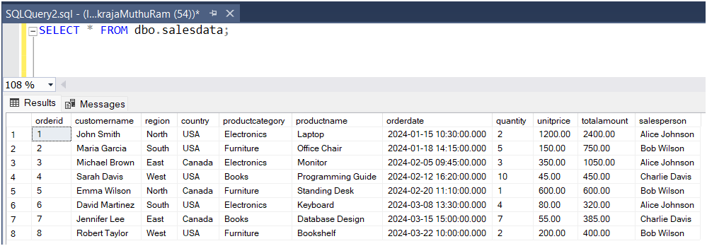
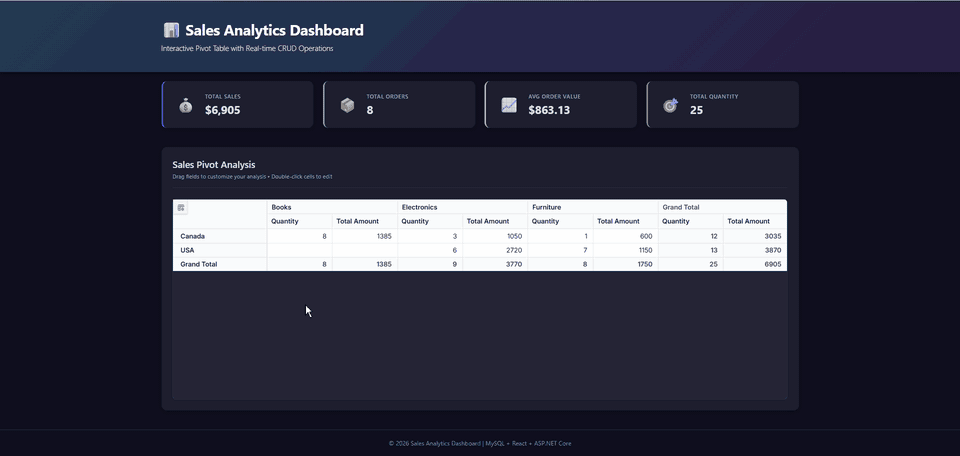

# Dapper data binding in React Pivot Table

The Syncfusion<sup style="font-size:70%">&reg;</sup> React Pivot Table supports binding data from SQL Server through an ASP.NET Core Web API using [Dapper](https://www.learndapper.com/), a lightweight object-relational mapper (ORM) over ADO.NET. This architecture separates the React presentation layer from database access while retaining direct control over SQL queries.

## Key benefits of Dapper

- **High performance**: Minimal overhead with direct ADO.NET access, resulting in faster query execution compared to full-featured ORMs.
- **SQL control**: Write raw SQL queries when needed, giving developers full control over database operations and optimization.
- **Simple and lightweight**: Requires minimal configuration and has a short learning curve compared to full-featured ORMs such as Entity Framework.
- **Flexible mapping**: Automatically maps query results to objects with minimal configuration.
- **Parameterized-query support**: Supports parameters that keep values separate from SQL text and reduce SQL injection risk when used correctly.
- **Direct connection management**: Fine-grained control over connection lifecycle and transaction handling.

## Prerequisites

This tutorial targets Windows because it uses SQL Server Management Studio (SSMS), SQL Server LocalDB, and Windows Authentication. Use equivalent SQL Server administration and authentication tooling if you adapt the tutorial to another platform.

Ensure the following software and packages are installed before proceeding:

| Software/Package | Version | Purpose |
| ------------------ | -------- | --------- |
| Node.js | 20.19 or later, or 22.12 or later | Runtime required by `npm create vite@latest` |
| React | 18.x or later | Create and run React apps |
| .NET SDK | 8.0 or later | Build and run ASP.NET Core Web API |
| SQL Server | 2019 or later | Database server |
| SQL Server Express LocalDB | 2019 or later | Local SQL Server instance used by the sample connection string |
| SQL Server Management Studio (SSMS) | 19.x or later | Create and inspect the database |
| Microsoft.Data.SqlClient (NuGet) | 5.1.2 or later | SQL Server connectivity (data provider for .NET) |
| Dapper (NuGet) | 2.1.35 or later | Lightweight micro-ORM for SQL mapping |
| Syncfusion.EJ2.AspNet.Core | 34.1.32 or later | Server helpers: `DataManagerRequest`, `DataOperations` |
| @syncfusion/ej2-react-pivotview | 34.1.32 or later | React Pivot Table component |
| ASP.NET Core dev certificate | n/a | Trust the local HTTPS certificate before first run with `dotnet dev-certs https --trust` |

Because `npm create vite@latest` changes over time, verify its current Node.js requirement before starting or pin a tested `create-vite` version for reproducible builds. Keep the Syncfusion client and server packages on compatible release versions.

## Setting up the SQL Server environment

First, create the **SQL Server database** structure required to store sales records for the Pivot Table.

### What is SQL Server?

[SQL Server](https://www.microsoft.com/en-us/sql-server) is a Microsoft relational database management system (RDBMS) that supports transactional processing, analytics, and business intelligence workloads. SQL Server Express is a free edition suitable for development and small-scale applications.

### Step 1: Create the SQL Server database

1. **Install SQL Server**: If not already installed, download SQL Server from [microsoft.com/sql-server](https://www.microsoft.com/en-us/sql-server/sql-server-downloads). Install the LocalDB feature if you plan to use the sample connection string unchanged.
2. **Open SSMS**: SQL Server Management Studio (SSMS) is the integrated environment for managing any SQL Server infrastructure. After installation, open SSMS.
3. **Connect to the server**: In the **Connect to Server** dialog, enter `(localdb)\MSSQLLocalDB` to match the connection string used later. If you choose another instance, use that same server name in the API connection string. Enter your authentication credentials, then click **Connect**.
4. **Open a new query window**: Right-click on the server name in **Object Explorer** and choose **New Query** (or press <kbd>Ctrl</kbd>+<kbd>N</kbd>) to open a new SQL editor window.


5. **Create the database**: Paste the following SQL script into the query editor and click the **Execute** button (or press <kbd>F5</kbd>):

```sql
-- Create Database
IF NOT EXISTS (SELECT * FROM sys.databases WHERE name = 'salesdb')
BEGIN
  CREATE DATABASE salesdb;
END
GO
```

After successful execution, refresh the **Databases** node in Object Explorer to see the new `salesdb` database.


### Step 2: Create the sales data table

After creating the database, you need to create a table to store sales records. This table will hold all the data that the Pivot Table will display and analyze.

1. **Set the database context**: In the query editor toolbar, select `salesdb` from the **Available Databases** dropdown. The script also includes a `USE salesdb;` statement, so this step is optional.
2. **Open a new query tab** (or reuse the existing one).
3. **Create the table**: Paste the following SQL script into the query editor and click **Execute** (or press <kbd>F5</kbd>):

```sql
-- Create SalesData Table
USE salesdb;
GO

IF NOT EXISTS (SELECT * FROM sys.tables WHERE name = 'salesdata')
BEGIN
    CREATE TABLE dbo.salesdata (
        orderid INT PRIMARY KEY IDENTITY(1,1),
        customername VARCHAR(100),
        region VARCHAR(50),
        country VARCHAR(50),
        productcategory VARCHAR(100),
        productname VARCHAR(100),
        orderdate DATETIME,
        quantity INT,
        unitprice DECIMAL(10, 2),
        totalamount DECIMAL(10, 2),
        salesperson VARCHAR(100)
    );
END
GO
```

You should see a success message "Command(s) completed successfully" confirming that the table was created.


**Table structure explanation:**

| Column | Data Type | Description |
|--------|-----------|-------------|
| orderid | INT IDENTITY(1,1) | Unique order identifier (auto-incremented primary key) |
| customername | VARCHAR(100) | Name of the customer who placed the order |
| region | VARCHAR(50) | Geographic region of the customer |
| country | VARCHAR(50) | Country where the order was placed |
| productcategory | VARCHAR(100) | Category of the product (e.g., Electronics, Furniture) |
| productname | VARCHAR(100) | Name of the product ordered |
| orderdate | DATETIME | Date and time when the order was placed (includes both date and time values) |
| quantity | INT | Number of units ordered |
| unitprice | DECIMAL(10, 2) | Price per unit of the product |
| totalamount | DECIMAL(10, 2) | Total cost of the order (quantity × unitprice) |
| salesperson | VARCHAR(100) | Name of the sales representative handling the order |

### Step 3: Insert sample data

Insert sample sales data into the table. This data will be used to populate the Pivot Table. Run the insert script only once unless you first clear the table; rerunning it adds another eight records and changes the counts shown later.

1. **Open a new query window** (or reuse the existing one) with `salesdb` still selected.
2. **Insert the sample data**: Paste the following SQL script into the query editor and click **Execute** (or press <kbd>F5</kbd>):

```sql
-- Insert Sample Data
USE salesdb;
GO

INSERT INTO dbo.salesdata (customername, region, country, productcategory, productname, orderdate, quantity, unitprice, totalamount, salesperson)
VALUES
('John Smith', 'North', 'USA', 'Electronics', 'Laptop', '2024-01-15 10:30:00', 2, 1200.00, 2400.00, 'Alice Johnson'),
('Maria Garcia', 'South', 'USA', 'Furniture', 'Office Chair', '2024-01-18 14:15:00', 5, 150.00, 750.00, 'Bob Wilson'),
('Michael Brown', 'East', 'Canada', 'Electronics', 'Monitor', '2024-02-05 09:45:00', 3, 350.00, 1050.00, 'Alice Johnson'),
('Sarah Davis', 'West', 'USA', 'Books', 'Programming Guide', '2024-02-12 16:20:00', 10, 45.00, 450.00, 'Charlie Davis'),
('Emma Wilson', 'North', 'Canada', 'Furniture', 'Standing Desk', '2024-02-20 11:10:00', 1, 600.00, 600.00, 'Bob Wilson'),
('David Martinez', 'South', 'USA', 'Electronics', 'Keyboard', '2024-03-08 13:30:00', 4, 80.00, 320.00, 'Alice Johnson'),
('Jennifer Lee', 'East', 'Canada', 'Books', 'Database Design', '2024-03-15 15:00:00', 7, 55.00, 385.00, 'Charlie Davis'),
('Robert Taylor', 'West', 'USA', 'Furniture', 'Bookshelf', '2024-03-22 10:00:00', 2, 200.00, 400.00, 'Bob Wilson');
GO
```

You should see a success message showing "(8 row(s) affected)", indicating that 8 rows were successfully inserted.

**Verify the data:**

To confirm the data was inserted correctly, run the following verification query in the **Query Editor**:

```sql
SELECT * FROM dbo.salesdata;
```

You should see all 8 sample records displayed in the results grid.



## Setting up the ASP.NET Core Web API

Now that the SQL Server database is configured, let's create the backend API that the React Pivot Table will communicate with.

### Step 1: Create the ASP.NET Core Web API project

To connect the Syncfusion<sup style="font-size:70%">&reg;</sup> React Pivot Table to SQL Server, the **ASP.NET Core Web API server** must be configured with the required NuGet packages. The server application is responsible for handling HTTP requests from the Pivot Table and accessing data from SQL Server.

**To create a new ASP.NET Core Web API project using the .NET CLI:**

Execute the following commands in your terminal:

```bash
dotnet new webapi --use-controllers -n PivotTable_Dapper.Server
```
```bash
cd PivotTable_Dapper.Server
```

The `--use-controllers` switch creates the `Controllers/` folder used in Step 4. If you omit it, create the folder manually.

**Install Required NuGet Packages:**

Add the SQL Server client library, the Dapper micro-ORM, and Syncfusion<sup style="font-size:70%">&reg;</sup> server‑side helper packages:

```bash
dotnet add package Microsoft.Data.SqlClient --version 5.2.2
```
```bash
dotnet add package Dapper --version 2.1.35
```
```bash
dotnet add package Syncfusion.EJ2.AspNet.Core --version 34.1.32
```

The Web API exposes HTTP endpoints that are used by the Pivot Table to perform read and data modification operations. The Syncfusion<sup style="font-size:70%">&reg;</sup> server helper package can process DataManager requests and apply data operations on the server when those types are used by the controller.

### Step 2: Configure the connection string

The connection string contains the information needed to connect to SQL Server. For local development, use [.NET Secret Manager](https://learn.microsoft.com/en-us/aspnet/core/security/app-secrets) so that the password is not committed to source control:

```bash
dotnet user-secrets init
```
```bash
dotnet user-secrets set "ConnectionStrings:SalesDb" "Server=(localdb)\MSSQLLocalDB;Database=salesdb;Integrated Security=True;TrustServerCertificate=True;Encrypt=False;Connect Timeout=30;"
```

The server name in this connection string must match the instance where you created `salesdb`. Before starting the API, verify that the Windows account running it can connect to `salesdb` and has `SELECT`, `INSERT`, `UPDATE`, and `DELETE` permissions on `dbo.salesdata`. For non-LocalDB environments, create a restricted application login and database user rather than granting broad server roles. Use a managed secret store and require TLS in production.

**Connection string components:**

| Component | Description | Example |
|-----------|-------------|----------|
| Data Source | SQL Server instance address | `(localdb)\MSSQLLocalDB` |
| Initial Catalog | Database name | `salesdb` |
| Integrated Security | Uses the current Windows account | `True` |
| Connect Timeout | Connection timeout in seconds | `30` |
| Encrypt | Enables encryption for the connection | `False` (development) / `True` (production) |
| Trust Server Certificate | Whether to trust the server certificate | `False` (recommended for security) |

The database connection string has been configured successfully.

### Step 3: Configure Program.cs

Update **Program.cs** to enable controller routing and allow requests from the React development server.

```csharp
var builder = WebApplication.CreateBuilder(args);

// Add services to the container
builder.Services.AddControllers();

// Enable CORS to allow requests from React client
builder.Services.AddCors(options =>
{
    // Vite serves the React app over plain HTTP on http://localhost:5173
    // while the API listens on https://localhost:7086. Browsers send the
    // request from the HTTP origin and trust the API's HTTPS certificate
    // (after running `dotnet dev-certs https --trust`).
            .AllowAnyMethod()
            .AllowAnyHeader());
});

var app = builder.Build();

// CORS must be registered BEFORE UseHttpsRedirection so that
// preflight OPTIONS requests are not redirected.
app.UseCors("ReactClient");
app.UseHttpsRedirection();
// UseAuthorization is registered without an authentication scheme for
// this sample. Add authentication and authorization services in
// production (for example, JWT bearer authentication).
app.UseAuthorization();
app.MapControllers();

app.Run();
```

**What's happening:**

1. **AddControllers**: Registers controller support for the API endpoints.
2. **AddCors**: Registers a named policy that allows the React development origin to call the API.
3. **ReactClient policy**: Restricts cross-origin requests to `http://localhost:5173`; update it if Vite selects another port, and replace it with the deployed client origin in production.

The relative order of HTTPS redirection and CORS depends on how the API is exposed. When the client calls the HTTPS endpoint directly, follow the standard ASP.NET Core middleware order. If an HTTP preflight request would otherwise be redirected to HTTPS, avoid the redirect by configuring the client to call HTTPS directly.

### Step 4: Create the data model and controller

Create a new file named **SalesController.cs** in the **Controllers** folder. This file contains the data model and all the API endpoints for reading and modifying sales data.

```csharp
using Microsoft.AspNetCore.Mvc;
using System.ComponentModel.DataAnnotations;
using Dapper;
using Microsoft.Data.SqlClient;

namespace PivotTable_Dapper.Server.Controllers
{
    [ApiController]
    public class SalesController : ControllerBase
    {
        private readonly string _connectionString;

        public SalesController(IConfiguration configuration)
        {
            _connectionString = configuration.GetConnectionString("SalesDb")
                ?? throw new InvalidOperationException(
                    "Connection string 'SalesDb' is not configured.");
        }

        /// <summary>
        /// Handles the DataManager request and returns data to the client.
        /// </summary>
        /// <param name="DataManagerRequest">Contains the details of the data operation requested.</param>
        /// <returns>Returns the data records along with the total count.</returns>
        [HttpPost]
        [Route("api/[controller]")]
        public object Post([FromBody] object DataManagerRequest)
        {
            // Retrieve data from the data source (database).
            IQueryable<SalesData> DataSource = GetSalesData().AsQueryable();
            int totalRecordsCount = DataSource.Count();
            // Return data based on the request.
            return new { result = DataSource, count = totalRecordsCount };
        }

        /// <summary>
        /// Retrieves the sales data from the database using Dapper.
        /// </summary>
        /// <returns>Returns a list of SalesData records fetched from the database.</returns>
        [HttpGet]
        [Route("api/[controller]")]
        public async Task<List<SalesData>> GetSalesData()
        {
            const string Query = @"SELECT * FROM dbo.salesdata ORDER BY orderid;";

            using var Connection = new SqlConnection(_connectionString);
            await Connection.OpenAsync();

            // Dapper's QueryAsync<T> maps query results directly to the SalesData model.
            var DataSource = (await Connection.QueryAsync<SalesData>(Query)).ToList();
            return DataSource;
        }

        /// <summary>
        /// Data model that represents the structure of a sales record.
        /// This class maps to the columns in the 'salesdata' table in MySQL.
        /// </summary>
        public class SalesData
        {
            /// <summary>
            /// Unique identifier for each order (Primary Key).
            /// The [Key] attribute marks this as the primary key for CRUD operations.
            /// </summary>
            [Key]
            public int? OrderID { get; set; }

            /// <summary>
            /// Name of the customer who placed the order.
            /// </summary>
            public string? CustomerName { get; set; }

            /// <summary>
            /// Geographic region where the customer is located.
            /// Useful for regional analysis in the pivot table.
            /// </summary>
            public string? Region { get; set; }

            /// <summary>
            /// Country where the order was placed.
            /// </summary>
            public string? Country { get; set; }

            /// <summary>
            /// Category of the product (e.g., Electronics, Furniture).
            /// Used as a dimension in the pivot table analysis.
            /// </summary>
            public string? ProductCategory { get; set; }

            /// <summary>
            /// Name of the specific product ordered.
            /// </summary>
            public string? ProductName { get; set; }

            /// <summary>
            /// Date when the order was placed.
            /// </summary>
            public DateTime? OrderDate { get; set; }

            /// <summary>
            /// Number of units ordered.
            /// </summary>
            public int? Quantity { get; set; }

            /// <summary>
            /// Price per unit of the product.
            /// </summary>
            public decimal UnitPrice { get; set; }

            /// <summary>
            /// Total cost of the order (typically quantity × unitprice).
            /// Used as a measure/aggregate value in pivot table analysis.
            /// </summary>
            public decimal TotalAmount { get; set; }

            /// <summary>
            /// Name of the sales representative who handled the order.
            /// </summary>
            public string? SalesPerson { get; set; }
        }
    }
}
```

**Explanation:**

- **GetSalesData()**: Connects to SQL Server, executes a SELECT query through Dapper, and returns all sales records with automatic mapping to `SalesData`.
- **Post()**: Is intended to accept DataManager requests and return `{ result, count }`; the preserved sample requires the corrections noted above before it can process requests.
- **SalesData class**: Represents `dbo.salesdata` in SQL Server. Dapper populates the public properties by matching column names returned from the query. The `[Key]` attribute is metadata and is not used by Dapper to configure CRUD operations; the drill-through grid primary key is configured separately on the client.

## Setting up the React Pivot Table client

Now that the backend API is ready, let's create the React client application that displays the Pivot Table and connects to the SQL Server data.

### Step 1: Create the React client application

Open a Visual Studio Code terminal or Command Prompt and run the following command to create a React application:

```bash
npm create vite@latest pivottable_dapper.client -- --template react-ts
```
```bash
cd pivottable_dapper.client
```

### Step 2: Install Syncfusion Pivot Table package

Install the Syncfusion React Pivot Table component and its dependencies:

```bash
npm install @syncfusion/ej2-react-pivotview --save
```

Register your Syncfusion license by following the [license key registration documentation](https://ej2.syncfusion.com/react/documentation/licensing/license-key-registration). Add the license key to **src/main.tsx** before rendering `App`:

```typescript
import { registerLicense } from '@syncfusion/ej2-base';

registerLicense('YOUR-LICENSE-KEY');
```

### Step 3: Import Syncfusion CSS styles

Install the Tailwind 3 theme package and replace the contents of **src/index.css** with the Pivot Table theme import:

```bash
npm install @syncfusion/ej2-tailwind3-theme --save
```

```css
@import '../node_modules/@syncfusion/ej2-tailwind3-theme/styles/pivotview/index.css';
```

The "tailwind3" theme is applied for reference. For other theme options or customization, refer to the [Syncfusion<sup style="font-size:70%">&reg;</sup> React Appearance](https://ej2.syncfusion.com/react/documentation/appearance/theme-studio) documentation.

### Step 4: Add the Pivot Table component - display data

The React Pivot Table component retrieves and displays data from the SQL Server database through the ASP.NET Core Web API. Update your **src/App.tsx** file with the following code:

```typescript
import { FieldList, Inject, PivotViewComponent } from '@syncfusion/ej2-react-pivotview';
import { DataManager, UrlAdaptor } from '@syncfusion/ej2-data';
import './App.css';

function App() {
  let pivotObj: PivotViewComponent;

  // Initialize DataManager with the Web API endpoint
  let data: DataManager = new DataManager({
    url: 'https://localhost:7086/api/Sales',
    adaptor: new UrlAdaptor
  });

  // Configure the Pivot Table data structure
  const dataSourceSettings = {
    dataSource: data,
    expandAll: true,
    rows: [{ name: 'country', caption: 'Country' }],
    columns: [{ name: 'productCategory', caption: 'Product Category' }],
    values: [{ name: 'quantity', caption: 'Quantity' }, { name: 'totalAmount', caption: 'Total Amount' }],
    filters: [],
    fieldMapping: [{ name: 'orderDate', caption: 'Order Date' }, { name: 'orderID', caption: 'Order ID' }, { name: 'customerName', caption: 'Customer Name' }, { name: 'region', caption: 'Region' }, { name: 'salesPerson', caption: 'Sales Person' }, { name: 'productName', caption: 'Product Name' }, { name: 'unitPrice', caption: 'Unit Price' }]
  }

  return (
    <PivotViewComponent
      id='PivotView'
      ref={(scope: any) => { pivotObj = scope; }}
      height={350}
      dataSourceSettings={dataSourceSettings}
      showFieldList={true}>
      <Inject services={[FieldList]}/>
    </PivotViewComponent>
  );
}

export default App;
```

**Code explanation:**

- [DataManager](https://ej2.syncfusion.com/react/documentation/data/getting-started): Connects to the ASP.NET Core Web API endpoint at `https://localhost:7086/api/Sales`. Replace the example port with the HTTPS URL printed by `dotnet run --launch-profile https`.

- [UrlAdaptor](https://ej2.syncfusion.com/react/documentation/data/adaptors/url-adaptor): Uses the standard URL adaptor to automatically send requests to and receive responses from the backend API.

- [dataSourceSettings](https://ej2.syncfusion.com/react/documentation/api/pivotview/index-default#datasourcesettings): Defines the Pivot Table layout:
  - [rows](https://ej2.syncfusion.com/react/documentation/api/pivotview/datasourcesettingsmodel#rows): Displays **country** as row headers
  - [columns](https://ej2.syncfusion.com/react/documentation/api/pivotview/datasourcesettingsmodel#columns): Displays **productCategory** as column headers
  - [values](https://ej2.syncfusion.com/react/documentation/api/pivotview/datasourcesettingsmodel#values): Aggregates **quantity** and **totalAmount** based on rows and columns
  - [fieldMapping](https://ej2.syncfusion.com/react/documentation/api/pivotview/datasourcesettingsmodel#fieldmapping):  Defines captions for fields that are not bound in pivot reports.
- [showFieldList](https://ej2.syncfusion.com/react/documentation/api/pivotview/index-default#showfieldlist): Displays the field list panel allowing users to rearrange fields

- [PivotViewComponent](https://ej2.syncfusion.com/react/documentation/api/pivotview/index-default): Renders the Pivot Table with the configured data and layout.

### Step 5: Build and run the applications

You will need two terminal windows: one for the API server and one for the React client.

**Before the first run**, trust the local HTTPS certificate so the browser accepts the API over HTTPS:

```bash
dotnet dev-certs https --trust
```

Before starting either application, run `npm run build` in **pivottable_dapper.client** and resolve any TypeScript errors.

**Start the ASP.NET Core API server first**, then start the React dev server:

Open a terminal in the **PivotTable_Dapper.Server** folder and run:

```bash
dotnet run
```

The .NET CLI uses the first project profile in `launchSettings.json`, which may expose only HTTP. To use HTTPS, run `dotnet run --launch-profile https`, or configure the chosen profile to expose HTTPS. The remaining examples use `https://localhost:7086`; if the server prints a different HTTPS port, update the hardcoded URL in the initial `src/App.tsx`, the `API_BASE` fallback in the CRUD version, and any related CORS origin.

For the final CRUD client, you can set `VITE_API_URL` in **pivottable_dapper.client/.env** to the API root, including `/api` (for example, `https://localhost:7086/api`). Restart Vite after changing the environment file.

**In a separate terminal, start the React development server:**

Open a terminal in the **pivottable_dapper.client** folder and run:

```bash
npm run dev
```

The React application normally starts at `http://localhost:5173`. Open the URL printed by Vite to see the Pivot Table. If Vite selects a different port, update the `ReactClient` CORS policy to match that exact origin. If the local HTTPS certificate is not trusted, run `dotnet dev-certs https --trust`.

## CRUD operations with Pivot Table

This section describes how to enable Create, Read, Update, and Delete (CRUD) operations in the Pivot Table, allowing users to modify the underlying database records directly through the built-in editing pop-up.

> **How to open the editing pop-up:** double-click any value cell in the Pivot Table. The drill-through grid opens with **Add**, **Edit**, and **Delete** buttons (drill-through is enabled by setting `allowDrillThrough={true}` on the component, which is already configured in the final `App.tsx` below).

### Understanding CRUD in the Pivot Table

The Syncfusion React Pivot Table supports CRUD operations through [DataManager](https://ej2.syncfusion.com/react/documentation/data/getting-started) with [UrlAdaptor](https://ej2.syncfusion.com/react/documentation/data/adaptors/url-adaptor). This enables:

- **Create**: Add new sales records through the Pivot Table editing pop-up
- **Read**: Display data from the database (already implemented)
- **Update**: Edit existing records in place
- **Delete**: Remove records from the database

When a user performs any edit action (add, update, or delete), the Pivot Table sends an HTTP request using [DataManager](https://ej2.syncfusion.com/react/documentation/data/getting-started) to the corresponding server endpoint, which processes the operation and updates the SQL Server database.

### Implement server-side CRUD methods

Extend your **SalesController.cs** with Insert, Update, and Remove methods. These methods will be called automatically when users edit data in the Pivot Table editing pop-up.

#### CRUD model class

The `CRUDModel<T>` class is the envelope the Pivot Table uses to send single-record Insert, Update, and Remove requests. Add it to the same file before the CRUD action methods so all three methods can reference it.

This model does not include the added, changed, and deleted collections required for batch requests. The implementation in this tutorial therefore supports Normal and Dialog editing only; do not select Batch mode unless you add a compatible batch model, endpoint, and `batchUrl`.

```csharp
/// <summary>
/// Generic model for handling CRUD operations from the Pivot Table.
/// The Pivot Table uses this structure to send data to Insert, Update, and Remove endpoints.
/// </summary>
/// <typeparam name="T">The data type (e.g., SalesData)</typeparam>
public class CRUDModel<T> where T : class
{
    /// <summary>
    /// Action being performed (e.g., "insert", "update", "remove").
    /// </summary>
    public string? Action { get; set; }

    /// <summary>
    /// Primary key column name (e.g., "orderid").
    /// </summary>
    public string? KeyColumn { get; set; }

    /// <summary>
    /// The primary key value (e.g., the OrderID).
    /// </summary>
    public object? Key { get; set; }

    /// <summary>
    /// The single record being operated on (for Insert, Update operations).
    /// </summary>
    public T? Value { get; set; }

    /// <summary>
    /// Additional parameters sent by the client.
    /// </summary>
    public IDictionary<string, object>? Params { get; set; }
}
```

#### Insert

To add a new record, double-click a pivot cell to open the editing pop-up and click the **Add** button to create a new empty row. Enter the required data in the new row fields, then click the **Update** button to save the record to the **salesdata** table using the following POST method:

```csharp
/// <summary>
/// Inserts a new sales record into the database using Dapper.
/// This method is called when a new row is added in the Pivot Table.
/// </summary>
/// <param name="model">Contains the new sales data to insert.</param>
/// <returns>Returns the inserted record with its new OrderID.</returns>
[HttpPost]
[Route("api/[controller]/Insert")]
public async Task<IActionResult> Insert([FromBody] CRUDModel<SalesData> model)
{
    if (model?.Value == null)
        return BadRequest("A sales record is required.");

    if (string.IsNullOrWhiteSpace(model.Value.CustomerName) ||
        string.IsNullOrWhiteSpace(model.Value.Country) ||
        model.Value.OrderDate == null ||
        model.Value.Quantity == null ||
        model.Value.Quantity <= 0 ||
        model.Value.UnitPrice < 0)
    {
        return BadRequest("Required fields, a positive quantity, and a non-negative unit price are required.");
    }

    try
    {
        // The server recalculates TotalAmount so the persisted column
        // always equals Quantity × UnitPrice, regardless of client input.
        model.Value.TotalAmount =
            model.Value.Quantity.Value * model.Value.UnitPrice;
        const string sql = @"
            INSERT INTO dbo.salesdata
            (customername, region, country, productcategory, productname, orderdate, quantity, unitprice, totalamount, salesperson)
            OUTPUT INSERTED.orderid
            VALUES
            (@CustomerName, @Region, @Country, @ProductCategory, @ProductName, @OrderDate, @Quantity, @UnitPrice, @TotalAmount, @SalesPerson);
        ";

        using var conn = new SqlConnection(_connectionString);
        await conn.OpenAsync();

        // Dapper's ExecuteScalarAsync<T> returns the first column of the
        // first row from the executed query, which in this case is the
        // newly generated identity value.
        var newId = await conn.ExecuteScalarAsync<int>(sql, model.Value);

        // Update the model with the new ID
        model.Value.OrderID = newId;

        // UrlAdaptor expects { key, value, action } on insert.
        return Ok(new { key = newId, value = model.Value, action = "insert" });
    }
    catch (Exception)
    {
        // Log the exception in a real application. Returning a generic
        // message avoids leaking database or stack details to the client.
        return StatusCode(500, new { error = "Insert failed." });
    }
}
```

**How it works:**

- The method receives a `CRUDModel<SalesData>` object containing the new record data.
- Input validation rejects missing required values, non-positive quantities, and negative unit prices.
- The server recalculates `TotalAmount` from `Quantity × UnitPrice` before persisting.
- Dapper maps `model.Value` properties to the SQL parameters automatically, preventing SQL injection.
- `OUTPUT INSERTED.orderid` retrieves the auto-generated identity value from SQL Server.
- The response returns the assigned key and inserted value. Verify this response contract against the Syncfusion package version used by your application; `UrlAdaptor` does not define `{ key, value, action }` as a universal required response shape.
- All operations are wrapped in try-catch for error handling.


#### Update

To modify a record, double-click a pivot cell to open the editing pop-up, select the row you want to edit, and click the **Edit** button. The row becomes editable so you can modify the fields. Click the **Update** button to save the changes to the **salesdata** table using the following POST method:

```csharp
/// <summary>
/// Updates an existing sales record in the database using Dapper.
/// This method is called when a row is edited in the Pivot Table.
/// </summary>
/// <param name="model">Contains the updated sales data.</param>
/// <returns>Returns the updated record.</returns>
[HttpPost]
[Route("api/[controller]/Update")]
public async Task<IActionResult> Update([FromBody] CRUDModel<SalesData> model)
{
    if (model?.Value == null)
        return BadRequest("A sales record is required.");

    if (model.Value.OrderID == null)
        return BadRequest("OrderID is required.");

    if (string.IsNullOrWhiteSpace(model.Value.CustomerName) ||
        string.IsNullOrWhiteSpace(model.Value.Country) ||
        model.Value.OrderDate == null ||
        model.Value.Quantity == null ||
        model.Value.Quantity <= 0 ||
        model.Value.UnitPrice < 0)
    {
        return BadRequest("Required fields, a positive quantity, and a non-negative unit price are required.");
    }

    try
    {
        // The server recalculates TotalAmount so the persisted column
        // always equals Quantity × UnitPrice, regardless of client input.
        model.Value.TotalAmount =
            model.Value.Quantity.Value * model.Value.UnitPrice;
        const string sql = @"
            UPDATE dbo.salesdata
            SET customername    = @CustomerName,
                region          = @Region,
                country         = @Country,
                productcategory = @ProductCategory,
                productname     = @ProductName,
                orderdate       = @OrderDate,
                quantity        = @Quantity,
                unitprice       = @UnitPrice,
                totalamount     = @TotalAmount,
                salesperson     = @SalesPerson
            WHERE orderid = @OrderID;
        ";

        using var conn = new SqlConnection(_connectionString);
        await conn.OpenAsync();

        // Dapper's ExecuteAsync maps the SalesData properties to the SQL
        // parameters automatically and returns the number of affected rows.
        var affected = await conn.ExecuteAsync(sql, model.Value);

        // UrlAdaptor expects { key, value, action } on update.
        return Ok(new { key = model.Value.OrderID, value = model.Value, action = "update", affected });
    }
    catch (Exception)
    {
        return StatusCode(500, new { error = "Update failed." });
    }
}
```

**How it works:**

- The method validates that the data object and `OrderID` are provided.
- The same business rules as `Insert` are enforced before persisting.
- The server recalculates `TotalAmount` from `Quantity × UnitPrice` to keep the column consistent.
- The WHERE clause targets the specific record using the `OrderID` primary key.
- Dapper binds the `SalesData` properties to the SQL parameters, preventing SQL injection.
- The response returns the key, updated value, action label, and affected-row count; verify this response contract against the Syncfusion package version used by your application.
- The preserved method returns success when `affected` is zero. A production endpoint should return `404 Not Found` when the requested `OrderID` does not exist.
- The catch block returns a generic client response but does not log the exception; inject `ILogger<SalesController>` and log the server-side failure in production.


#### Delete

To delete a record, double-click a pivot cell to open the editing pop-up, select the row you want to delete, and click the **Delete** button. This sends a POST request to the Remove endpoint with the primary key value. The corresponding record is then removed from the **salesdata** table:

```csharp
/// <summary>
/// Deletes a sales record from the database using Dapper.
/// This method is called when a row is deleted in the Pivot Table.
/// </summary>
/// <param name="model">Contains the OrderID of the record to delete.</param>
/// <returns>Returns the deleted key.</returns>
[HttpPost]
[Route("api/[controller]/Remove")]
public async Task<IActionResult> Remove([FromBody] CRUDModel<SalesData> model)
{
    if (model?.Key == null)
        return BadRequest("Missing key.");

    if (!int.TryParse(model.Key.ToString(), out var id))
        return BadRequest("Invalid OrderID.");

    try
    {
        const string sql = @"DELETE FROM dbo.salesdata WHERE orderid = @OrderID;";

        using var conn = new SqlConnection(_connectionString);
        await conn.OpenAsync();

        // Dapper's ExecuteAsync runs the parameterized DELETE and returns the
        // number of rows affected.
        await conn.ExecuteAsync(sql, new { OrderID = id });

        // UrlAdaptor expects { key, action } on remove.
        return Ok(new { key = id, action = "remove" });
    }
    catch (Exception)
    {
        return StatusCode(500, new { error = "Delete failed." });
    }
}
```

**How it works:**

- The method extracts the `OrderID` (primary key) from the `Key` property.
- Input validation ensures the key is properly formatted as an integer.
- Dapper binds the `OrderID` parameter to the SQL statement, preventing SQL injection.
- The response returns the deleted key and action label; verify this response contract against the Syncfusion package version used by your application.
- The preserved method discards the affected-row count and therefore returns success for a nonexistent record. A production endpoint should return `404 Not Found` when no row is deleted.
- The catch block returns a generic client response but does not log the exception; log the server-side failure with `ILogger<SalesController>` in production.


### Configure client-side CRUD endpoints

Replace the contents of **src/App.tsx** with the complete file below. It includes the `DataManager` with CRUD URLs, the `editSettings` block, and the `beginDrillThrough` event that marks `orderID` as the primary key.

The CRUD endpoints (`insertUrl`, `updateUrl`, `removeUrl`) are properties of [`DataManager`](https://ej2.syncfusion.com/react/documentation/data/getting-started), not the `PivotViewComponent`. The `url` is the data retrieval endpoint; the three `*Url` properties are called automatically when a user adds, edits, or deletes a record through the editing pop-up.

**Response shapes used by this sample:**

- `Insert` returns the inserted record with its assigned key: `{ key, value, action: "insert" }`.
- `Update` returns the updated record with the original key: `{ key, value, action: "update" }`.
- `Remove` returns the deleted key: `{ key, action: "remove" }`.
- The `value` field is the full record; the `key` is the primary-key value (`orderID`).

```typescript
import { DrillThrough, FieldList, Inject, PivotViewComponent } from '@syncfusion/ej2-react-pivotview'; // Docs: https://ej2.syncfusion.com/react/documentation/api/pivotview/drillthrough
import { DataManager, UrlAdaptor } from '@syncfusion/ej2-data';
import './App.css';

const API_BASE: string =
  (import.meta.env.VITE_API_URL as string | undefined) ??
  'https://localhost:7086/api';

function App() {
  let pivotObj: PivotViewComponent;

  // Configure DataManager with CRUD URLs.
  // - url        : data retrieval endpoint
  // - insertUrl  : called when the user adds a new record
  // - updateUrl  : called when the user edits an existing record
  // - removeUrl  : called when the user deletes a record
  // - adaptor    : standard URL adaptor for HTTP communication
  const data: DataManager = new DataManager({
    url: 'https://localhost:7086/api/Sales',
    insertUrl: 'https://localhost:7086/api/Sales/Insert',
    updateUrl: 'https://localhost:7086/api/Sales/Update',
    removeUrl: 'https://localhost:7086/api/Sales/Remove',
    adaptor: new UrlAdaptor()
  });

  const dataSourceSettings = {
    dataSource: data,
    expandAll: true,
    rows: [{ name: 'country', caption: 'Country' }],
    columns: [{ name: 'productCategory', caption: 'Product Category' }],
    values: [
      { name: 'quantity', caption: 'Quantity' },
      { name: 'totalAmount', caption: 'Total Amount' }
    ],
    filters: [],
    fieldMapping: [
      { name: 'orderDate', caption: 'Order Date' },
      { name: 'orderID', caption: 'Order ID' },
      { name: 'customerName', caption: 'Customer Name' },
      { name: 'region', caption: 'Region' },
      { name: 'salesPerson', caption: 'Sales Person' },
      { name: 'productName', caption: 'Product Name' },
      { name: 'unitPrice', caption: 'Unit Price' }
    ]
  };

  // Common editSettings options:
  //   allowEditing           - show the Edit button for existing records
  //   allowAdding            - show the Add button for new records
  //   allowDeleting          - show the Delete button
  //   mode                   - 'Normal' (popup) | 'Dialog' | 'Batch'
  //   allowCommandColumns    - show inline Edit/Delete buttons in the grid
  //   showConfirmBeforeSave  - ask the user to confirm before persisting
  //   showAddNewRecord       - show the Add button when the grid opens
  const editSettings = {
    allowEditing: true,
    allowAdding: true,
    allowDeleting: true,
    mode: 'Normal' as const
  };

  // beginDrillThrough fires when the user double-clicks a pivot cell to open
  // the editing pop-up. We use it to mark the primary-key column and to show
  // a date picker for orderDate. Without marking the primary key, the
  // DataManager cannot identify the record on update or delete.
  function beginDrillThrough(args: any): void {
    for (let i = 0; i < args.gridObj.columns.length; i++) {
      const column = args.gridObj.columns[i];
      if (column.field === 'orderID') {
        column.isPrimaryKey = true;
      } else {
        column.visible = true;
        if (column.field === 'orderDate') {
          column.editType = 'datetimepickeredit';
        }
      }
    }
  }

  return (
    <PivotViewComponent
      id="PivotView"
      ref={(scope: any) => { pivotObj = scope; }}
      height={350}
      dataSourceSettings={dataSourceSettings}
      showFieldList={true}
      allowDrillThrough={true}
      editSettings={editSettings}
      beginDrillThrough={beginDrillThrough}
      actionFailure={(args: any) => {
        console.error('Pivot Table action failed.', args);
      }}
    >
      <Inject services={[FieldList, DrillThrough]} />
    </PivotViewComponent>
  );
}

export default App;
```

The Pivot Table component supports `Normal`, `Dialog`, and `Batch` modes through the [mode](https://ej2.syncfusion.com/react/documentation/api/pivotview/celleditsettingsmodel#mode) property. This tutorial's server contract supports Normal and Dialog modes only. Command columns are enabled separately with `allowCommandColumns`; they are not a `mode` value. For details, refer to the [Editing documentation](https://ej2.syncfusion.com/react/documentation/pivotview/editing).

**How it works:**

- **`url`**: This is the main endpoint that retrieves data from the database. When the Pivot Table loads, it sends a POST request to this URL to fetch records from `dbo.salesdata`.

- **`insertUrl`**: When a user clicks **Add** in the drill-through grid and submits a new record, the [DataManager](https://ej2.syncfusion.com/react/documentation/data/getting-started) automatically sends a POST request to this endpoint with the new record data. The server's **Insert** method processes this request and adds the record to the database.

- **`updateUrl`**: When a user clicks **Edit** and modifies an existing record, the [DataManager](https://ej2.syncfusion.com/react/documentation/data/getting-started) sends a POST request to this endpoint with the updated data. The server's **Update** method processes this request and updates the record in the database.

- **`removeUrl`**: When a user clicks **Delete** and confirms the deletion, the [DataManager](https://ej2.syncfusion.com/react/documentation/data/getting-started) sends a POST request to this endpoint with the record ID. The server's **Remove** method processes this request and deletes the record from the database.

- **`adaptor: new UrlAdaptor`**: This tells the [DataManager](https://ej2.syncfusion.com/react/documentation/data/getting-started) to use the URL adaptor, which handles automatic HTTP communication with your REST API.

#### Enable edit settings

The `editSettings` block in the full `App.tsx` above enables CRUD operations. Configure the [editSettings](https://ej2.syncfusion.com/react/documentation/api/pivotview/index-default#editsettings) property with the following options:

- `allowEditing: true` — show the **Edit** button for existing records.
- `allowAdding: true` — show the **Add** button for new records.
- `allowDeleting: true` — show the **Delete** button.
- `mode: 'Normal' as const` — edits one selected row at a time in the drill-through grid. Dialog mode opens a separate row-edit dialog. Batch mode requires a server contract that this tutorial does not provide.

The [mode](https://ej2.syncfusion.com/react/documentation/api/pivotview/celleditsettingsmodel#mode) property accepts Normal, Dialog, or Batch. Command columns are configured separately with `allowCommandColumns`. For details about each option, refer to the [Editing documentation](https://ej2.syncfusion.com/react/documentation/pivotview/editing).

#### Configure the primary key for editing

The [beginDrillThrough](https://ej2.syncfusion.com/react/documentation/pivotview/drill-through#begindrillthrough) event is triggered whenever a user double-clicks a pivot cell to open the editing pop-up. This event is crucial for CRUD operations because it's where you configure the primary key column.

**Why is the primary key important?**

The primary key (OrderID in our case) uniquely identifies each record in the database. When the [DataManager](https://ej2.syncfusion.com/react/documentation/data/getting-started) performs update or delete operations, it needs to know which record to modify or delete. It uses the primary key to identify the exact record. Without a properly configured primary key, the [DataManager](https://ej2.syncfusion.com/react/documentation/data/getting-started) won't know which record is being edited or deleted.

The `beginDrillThrough` handler in the full `App.tsx` above walks `args.gridObj.columns`, sets `isPrimaryKey = true` on the `orderID` column, makes the other columns visible, and assigns a `datetimepickeredit` editor to the `orderDate` column.

### Using CRUD operations

Once your Pivot Table is running with both server and client configured, you can perform CRUD operations directly through the Pivot Table's built-in editing pop-up.

For detailed information about the Pivot Table's built-in editing feature and its usage, refer to the [Editing documentation](https://ej2.syncfusion.com/react/documentation/pivotview/editing).

**Important notes:**

- **Primary Key (OrderID)**: You cannot modify the OrderID field during editing because it's the primary key. The primary key uniquely identifies each record, and changing it would break the data relationship.
- **Validation**: The server rejects missing required values, non-positive quantities, and negative unit prices. Add validation for every business rule required by your application.
- **Updates**: After a successful CRUD operation, verify that the Pivot Table reflects the server response; handle failures with the component's `actionFailure` event and provide a user-visible message rather than relying only on the console.

### Verify CRUD operations end to end

1. Add a record in the drill-through grid, then run `SELECT * FROM dbo.salesdata ORDER BY orderid DESC;` in SSMS and confirm that the generated `orderid` appears in the client.
2. Update that record, query it by its `orderid`, and confirm that both the database values and Pivot Table reflect the change.
3. Delete that record, query it again, and confirm that the API reports failure for any repeated update or delete using the removed key.

## Best practices for Dapper data management

### Security

- Always use parameterized queries (as shown in the code) to prevent SQL injection attacks.
- Store connection strings in .NET Secret Manager, environment variables, or a managed secret store. Never hardcode passwords.
- Prefer Windows Authentication (`Integrated Security=True`) over SQL authentication when possible.
- Ensure all API communications use HTTPS in production.

### Performance

- SqlClient automatically manages connection pooling. Monitor connection limits based on your application's needs.
- After measuring actual queries, consider indexes on columns such as `orderdate`, `country`, `region`, and `productcategory`.
- Use Dapper's `Query<T>`, `ExecuteScalar<T>`, and `Execute` for the lightest possible mapping overhead.
- When inserting, use the `OUTPUT INSERTED.orderid` clause to retrieve the generated ID in the same round trip.
- For bulk operations, use a true multi-row statement, `SqlBulkCopy`, or a tested bulk extension. Passing an enumerable to Dapper can still execute one command per item; a transaction alone does not eliminate those commands.

### Error handling

- Catch database exceptions at an appropriate boundary and return a helpful but non-sensitive client response.
- Use `ILogger<SalesController>` to record failed SQL operations and safe diagnostic context without logging secrets. The preserved CRUD snippets return generic responses but do not implement logging.

### Data validation

- Validate all user inputs on the server before sending them to the database.
- Enforce business rules (for example, `quantity > 0`, non-negative prices) before persisting.
- Add matching `NOT NULL` and `CHECK` constraints in SQL Server so invalid records cannot bypass application validation.
- Handle database constraint violations gracefully and surface a user-friendly message.

## Troubleshooting

When working with the Pivot Table, Web API, and SQL Server integration, you may encounter various issues. This section covers common problems and their solutions to help you get your application running smoothly.

### Common issues and solutions

#### 1. CORS error: "Access to XMLHttpRequest blocked by CORS policy"

**Issue**: The React frontend (`http://localhost:5173`) cannot communicate with the API (`https://localhost:7086` in these examples).

**Symptoms**: The browser console reports that a request to `https://localhost:7086/api/Sales` is blocked by the CORS policy.

**Solution**:
- Ensure CORS is enabled in `Program.cs` and the middleware is properly configured.
- Verify that the allowed origin matches the React URL: `http://localhost:5173`.
- Ensure the client calls the HTTPS API URL directly so a preflight request is not redirected. Place CORS according to the ASP.NET Core middleware guidance and before controller endpoints are mapped.
- Clear browser cache or use incognito mode.

**Example - correct Program.cs:**
```csharp
// CORS must run before UseHttpsRedirection so preflight requests
// are not redirected, and before MapControllers so the pipeline
// applies the policy to controller endpoints.
app.UseCors("ReactClient");
app.UseHttpsRedirection();
app.UseAuthorization();
app.MapControllers();
```

#### 2. "Unable to connect to the server" or API returns 404

**Issue**: React app cannot reach the API endpoint.

**Symptoms**: Network tab shows 404 or connection refused errors

**Solutions**:
- Verify the API server is running: Open terminal in server folder and run `dotnet run`
- Check the endpoint URL in React matches the running server URL
  - Example: `https://localhost:7086/api/Sales`
- Verify the port number in your React code matches the actual server port
- Check if your firewall is blocking the port
- Ensure the controller route matches exactly (case-sensitive)

**Verify the API is running:**
Send a POST request with an empty JSON object to your running endpoint at `https://localhost:7086/api/Sales`. You should receive JSON similar to:
```json
{"result":[{"orderID":1,"customerName":"John Smith",...}],"count":8}
```

#### 3. "Cannot open database" or "Invalid object name 'salesdata'"

**Issue**: The SQL Server database or table structure hasn't been created, or the connection is pointing to the wrong database.

**Symptoms**: API returns error mentioning missing database or table

**Solution**:
- Follow the setup instructions to create the database and table
- Run the database creation SQL script in SSMS:
  ```sql
  CREATE DATABASE salesdb;
  GO
  USE salesdb;
  GO
  CREATE TABLE dbo.salesdata (
      orderid INT PRIMARY KEY IDENTITY(1,1),
      customername VARCHAR(100),
      region VARCHAR(50),
      country VARCHAR(50),
      productcategory VARCHAR(100),
      productname VARCHAR(100),
      orderdate DATETIME,
      quantity INT,
      unitprice DECIMAL(10, 2),
      totalamount DECIMAL(10, 2),
      salesperson VARCHAR(100)
  );
  GO
  ```
- Verify the database exists: Run `SELECT name FROM sys.databases;` in SSMS
- Verify the table exists: Run `SELECT * FROM sys.tables;` in the `salesdb` database

#### 4. SQL Server connection: Login failed

**Issue**: Cannot authenticate to SQL Server from the application.

**Symptoms**: `Login failed for user '...'` error in API response

**Solution**:
- **For Windows Authentication**: Ensure the application is running under a Windows account that has access to SQL Server
- **For SQL Server Authentication**: Verify the `User Id` and `Password` in the connection string are correct
- If using `localhost`, ensure SQL Server is configured to allow local connections
- Run this in SSMS to check authentication mode:
  ```sql
  SELECT SERVERPROPERTY('IsIntegratedSecurityOnly') AS IsWindowsAuthOnly;
  ```
  - `1` = Windows Authentication only (switch to SQL Auth or use Integrated Security)
  - `0` = Mixed mode authentication enabled

#### 5. "Column field not found" or "Invalid field name" error

**Issue**: The field names in `dataSourceSettings` do not match the JSON property names returned by the API.

**Symptoms**: Pivot table appears empty or shows errors

**Solution**:
- Ensure field names in React match the serialized JSON property names exactly:
  ```typescript
  rows: [{ name: 'country', caption: 'Country' }],
  columns: [{ name: 'productCategory', caption: 'Product Category' }],
  values: [{ name: 'quantity', caption: 'Quantity' }]
  ```
- Inspect the API response in the browser's network tab; ASP.NET Core's default `System.Text.Json` serializer uses camelCase, so `ProductCategory`, `OrderDate`, and `OrderID` are emitted as `productCategory`, `orderDate`, and `orderID`. If you have configured a different naming policy, the field names in the Pivot Table configuration must match.

#### 6. Primary key not recognized: CRUD operations fail

**Issue**: Update and Delete operations fail because the primary key isn't properly identified.

**Symptoms**: "Primary key not found" error or update/delete operations affect wrong records

**Solution**:
- Verify the `beginDrillThrough` event is configured correctly:
  ```typescript
  function beginDrillThrough(args: any) {
    for (var i = 0; i < args.gridObj.columns.length; i++) {
      if (args.gridObj.columns[i].field == "orderID") {
        args.gridObj.columns[i].isPrimaryKey = true;  // Mark as primary key
      }
    }
  }
  ```
- Ensure the field name matches the serialized API property name (`orderID`).
- The `[Key]` attribute shown below is optional metadata and is not used by Dapper or the client-side DataManager to identify the record; `isPrimaryKey` on the drill-through grid column performs that role:
  ```csharp
  [Key]
  public int? OrderID { get; set; }
  ```

#### 7. HTTPS certificate errors on first run

**Issue**: The browser blocks requests to the API with `NET::ERR_CERT_AUTHORITY_INVALID` or similar.

**Solution**:
- Trust the local dev certificate: `dotnet dev-certs https --trust`.
- Restart the browser and the API server.
- If the certificate still fails, be aware that the following cleanup command removes development HTTPS certificates used by other local projects. Recreate and trust any certificates those projects require after running it:
  ```bash
  dotnet dev-certs https --clean
  dotnet dev-certs https --trust
  ```

#### 8. Pivot Table is empty after a successful CRUD operation

**Issue**: An Insert, Update, or Delete returns success but the Pivot Table is empty until a manual refresh.

**Solution**:
- Verify the response contract against the installed Syncfusion version; a response-side `action` field is not a universal `UrlAdaptor` cache requirement.
- Handle the `actionFailure` event on the component to surface server errors.
- If the component does not update automatically, retain a usable component ref and invoke its supported refresh method from the write-success path; the preserved sample's unused `pivotObj` assignment does not implement this behavior.

## Next steps

### Sample application - Sales Analytics Dashboard

The sample application demonstrates how to integrate the React Pivot Table with a SQL Server database through Dapper, including data binding and CRUD operations. Review its package versions, authentication, authorization, secret storage, logging, and deployment configuration before using it in production.

You can explore the complete implementation in this [GitHub repository](https://github.com/SyncfusionExamples/syncfusion-react-pivot-table-dapper).



### See also

- [**PivotTable Data Binding**](https://ej2.syncfusion.com/react/documentation/pivotview/data-binding)
- [**DataManager**](https://ej2.syncfusion.com/react/documentation/data/getting-started)
- [**UrlAdaptor**](https://ej2.syncfusion.com/react/documentation/data/adaptors/url-adaptor)
- [**PivotTable Editing**](https://ej2.syncfusion.com/react/documentation/pivotview/editing)
