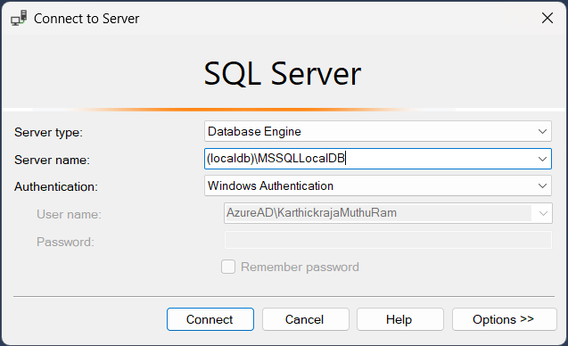
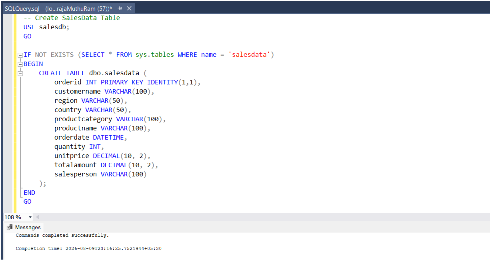
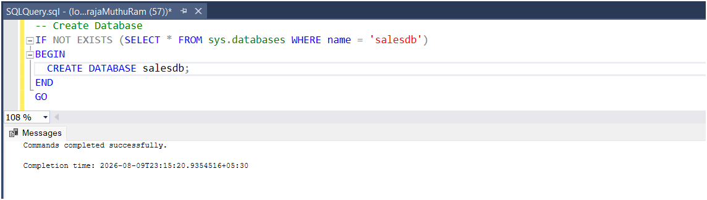
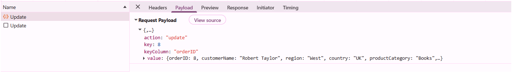
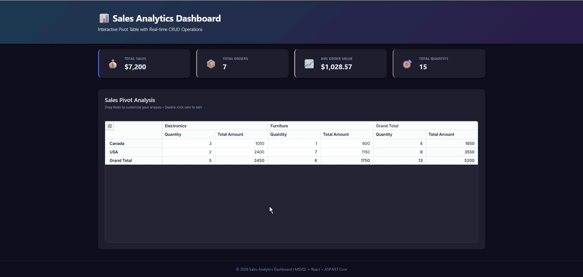

# Entity Framework Core data binding in React Pivot Table

The Syncfusion<sup style="font-size:70%">&reg;</sup> React Pivot Table supports binding data from an existing SQL Server database through an ASP.NET Core Web API using [Entity Framework Core](https://learn.microsoft.com/en-us/ef/core/). This walkthrough maps an EF Core model to a schema created manually with SQL; it does not use EF Core migrations. By leveraging React for the UI and ASP.NET Core with EF Core for data access, applications maintain clear separation between presentation and data layers.

**What is Entity Framework Core?**

[Entity Framework Core](https://learn.microsoft.com/en-us/ef/core/) is a lightweight, extensible, open-source, and cross-platform object-relational mapper (ORM) for .NET. It serves as a bridge between C# code and databases, eliminating the need for raw SQL queries and providing a modern, code-first approach to data management.

**Key benefits of Entity Framework Core:**

- **High Productivity**: Eliminates repetitive data-access code with strongly typed LINQ queries and change tracking.
- **LINQ Support**: Use familiar LINQ syntax for type-safe database queries instead of raw SQL strings.
- **Parameterized LINQ Queries**: EF Core parameterizes translated LINQ queries, reducing SQL injection risk. Authentication, authorization, input validation, and safe handling of raw SQL remain application responsibilities.
- **Database Migrations**: Manage schema changes version-by-version without manual SQL scripts.
- **Cross-Platform**: Runs on Windows, Linux, and macOS through .NET.
- **Provider Support**: Pluggable providers allow EF Core to target SQL Server, PostgreSQL, MySQL, SQLite, and Oracle.

## Prerequisites

Ensure the following software and packages are installed before proceeding:

| Software/Package | Version | Purpose |
| ------------------ | -------- | --------- |
| Node.js | 18.x or later | React development runtime |
| React | 18.x or later | Create and run React apps |
| .NET SDK | 8.0 or later | Build and run ASP.NET Core Web API |
| SQL Server | 2019 or later | Database server |
| SQL Server Management Studio (SSMS) | Current supported release | Create and inspect the sample database |
| Microsoft.EntityFrameworkCore (NuGet) | 8.0.x or later | Core framework for database operations |
| Microsoft.EntityFrameworkCore.SqlServer (NuGet) | 8.0.x or later | SQL Server provider for EF Core |
| Syncfusion.EJ2.AspNet.Core | 33.1.45 or later | Server helpers (DataManagerRequest, DataOperations) |
| @syncfusion/ej2-react-pivotview | 33.1.45 or later | React Pivot Table component |

Use matching major versions for all EF Core packages, and verify that the selected EF Core major version supports the project's target framework. The commands in this article install EF Core 8.0.10 and are tested with .NET 8. Syncfusion packages used together should also use compatible versions; review the package release notes before combining different versions.

The database setup requires a SQL Server login with permission to create a database and table and insert sample records. The account used by the running API should be separate and restricted to the required `SELECT`, `INSERT`, `UPDATE`, and `DELETE` permissions on `salesdb`. The API, SSMS, and connection string must all target the same SQL Server instance.

## Setting up the SQL Server environment

First, create the **SQL Server database** structure required to store sales records for the Pivot Table.

**What is SQL Server?**

[SQL Server](https://www.microsoft.com/en-us/sql-server) is a Microsoft relational database management system (RDBMS) that supports transactional processing, analytics, and business intelligence workloads. SQL Server Express is a free edition suitable for development and small-scale applications.

### Step 1: Create the SQL Server database

1. **Install SQL Server**: If not already installed, download SQL Server from [microsoft.com/sql-server](https://www.microsoft.com/en-us/sql-server/sql-server-downloads).
2. **Install and open SSMS**: Download [SQL Server Management Studio](https://learn.microsoft.com/en-us/sql/ssms/download-sql-server-management-studio-ssms) separately if it is not installed, then open it.
3. **Connect to the server**: In the **Connect to Server** dialog, enter your **Server name** (e.g., `localhost` or `.` for the local default instance) and authentication credentials, then click **Connect**.
4. **Open a new query window**: Right-click on the server name in **Object Explorer** and choose **New Query** (or press <kbd>Ctrl</kbd>+<kbd>N</kbd>) to open a new SQL editor window.



5. **Create the database**: Paste the following SQL script into the query editor and click the **Execute** button (or press <kbd>F5</kbd>):

```sql
-- Create Database
IF NOT EXISTS (SELECT * FROM sys.databases WHERE name = 'salesdb')
BEGIN
  CREATE DATABASE salesdb;
END
GO
```

After successful execution, you should see a message confirming the database creation.



After successful execution, refresh the **Databases** node in Object Explorer to see the new `salesdb` database.

### Step 2: Create the sales data table

After creating the database, you need to create a table to store sales records. This table will hold all the data that the Pivot Table will display and analyze.

**Using SSMS Query Editor:**

1. **Select the salesdb Database**: In the toolbar, select **salesdb** from the database dropdown.
2. **Create the Table**: Paste the following SQL script into the query editor and click **Execute**:

```sql
-- Create SalesData Table
CREATE TABLE dbo.salesdata (
    orderid INT IDENTITY(1,1) PRIMARY KEY,
    customername VARCHAR(100),
    region VARCHAR(50),
    country VARCHAR(50),
    productcategory VARCHAR(100),
    productname VARCHAR(100),
    orderdate DATETIME,
    quantity INT,
    unitprice DECIMAL(10, 2),
    totalamount DECIMAL(10, 2),
    salesperson VARCHAR(100)
);
```

You should see a success message confirming the table creation.



**Table Structure Explanation:**

| Column | Data Type | Description |
|--------|-----------|-------------|
| orderid | INT IDENTITY(1,1) | Unique order identifier (auto-incremented primary key) |
| customername | VARCHAR(100) | Name of the customer who placed the order |
| region | VARCHAR(50) | Geographic region of the customer |
| country | VARCHAR(50) | Country where the order was placed |
| productcategory | VARCHAR(100) | Category of the product (e.g., Electronics, Furniture) |
| productname | VARCHAR(100) | Name of the product ordered |
| orderdate | DATETIME | Date and time when the order was placed (includes both date and time values) |
| quantity | INT | Number of units ordered |
| unitprice | DECIMAL(10, 2) | Price per unit of the product |
| totalamount | DECIMAL(10, 2) | Total cost of the order (quantity × unitprice) |
| salesperson | VARCHAR(100) | Name of the sales representative handling the order |

### Step 3: Insert sample data

Insert sample sales data into the table. This data will be used to populate the Pivot Table.

**Using SSMS Query Editor:**

1. **Open Query Editor**: With **salesdb** still selected, open a new query window.
2. **Insert Sample Data**: Paste the following SQL script into the query editor and click **Execute**:

```sql
-- Insert Sample Data
INSERT INTO dbo.salesdata (customername, region, country, productcategory, productname, orderdate, quantity, unitprice, totalamount, salesperson)
VALUES
('John Smith', 'North', 'USA', 'Electronics', 'Laptop', '2024-01-15', 2, 1200.00, 2400.00, 'Alice Johnson'),
('Maria Garcia', 'South', 'USA', 'Furniture', 'Office Chair', '2024-01-18', 5, 150.00, 750.00, 'Bob Wilson'),
('Michael Brown', 'East', 'Canada', 'Electronics', 'Monitor', '2024-02-05', 3, 350.00, 1050.00, 'Alice Johnson'),
('Sarah Davis', 'West', 'USA', 'Books', 'Programming Guide', '2024-02-12', 10, 45.00, 450.00, 'Charlie Davis'),
('Emma Wilson', 'North', 'Canada', 'Furniture', 'Standing Desk', '2024-02-20', 1, 600.00, 600.00, 'Bob Wilson'),
('David Martinez', 'South', 'USA', 'Electronics', 'Keyboard', '2024-03-08', 4, 80.00, 320.00, 'Alice Johnson'),
('Jennifer Lee', 'East', 'Canada', 'Books', 'Database Design', '2024-03-15', 7, 55.00, 385.00, 'Charlie Davis'),
('Robert Taylor', 'West', 'USA', 'Furniture', 'Bookshelf', '2024-03-22', 2, 200.00, 400.00, 'Bob Wilson');
```

You should see a success message showing "(8 row(s) affected)" or similar, indicating that 8 rows were successfully inserted.

**Verify the Data:**

To confirm the data was inserted correctly, run the following verification query in the **Query Editor**:

```sql
SELECT * FROM dbo.salesdata;
```

You should see all 8 sample records displayed in the results grid.


## Setting up the ASP.NET Core Web API

Now that the SQL Server database is configured, let's create the backend API that the React Pivot Table will communicate with.

### Step 1: Create the ASP.NET Core Web API project

To connect the Syncfusion<sup style="font-size:70%">&reg;</sup> React Pivot Table to SQL Server, the **ASP.NET Core Web API server** must be configured with the required NuGet packages. The server application is responsible for handling HTTP requests from the Pivot Table and accessing data from SQL Server.

**To create a new ASP.NET Core Web API project using the .NET CLI:**

Execute the following commands in your terminal:

```bash
dotnet new webapi -n PivotTable_EFCore.Server
```
```bash
cd PivotTable_EFCore.Server
```

The .NET 8 and later `webapi` template creates a Minimal API project unless controller support is requested. Because this walkthrough adds controllers manually, create the `Controllers` folder in Step 4. Alternatively, when starting over, add `--use-controllers` to the project-creation command.

**Install Required NuGet Packages:**

Add the Entity Framework Core packages and Syncfusion<sup style="font-size:70%">&reg;</sup> server-side helper packages:

```bash
dotnet add package Microsoft.EntityFrameworkCore --version 8.0.10
```
```bash
dotnet add package Microsoft.EntityFrameworkCore.SqlServer --version 8.0.10
```
```bash
dotnet add package Syncfusion.EJ2.AspNet.Core --version 33.1.45
```

> **.NET 9 or later:** the `AddOpenApi()` and `MapOpenApi()` calls shown in `Program.cs` use the built-in OpenAPI support. On .NET 8, remove those two calls or use the .NET 8 Swagger/OpenAPI setup. Ensure the installed OpenAPI package matches the target framework.

The Web API exposes HTTP endpoints that are used by the Pivot Table to perform read and data modification operations. The Syncfusion<sup style="font-size:70%">&reg;</sup> server helper package provides the required types for processing pivot requests and applying data operations on the server.

### Step 2: Configure the connection string

The connection string contains the information needed to connect to SQL Server. The sample string below targets the `(localdb)\MSSQLLocalDB` instance. Create `salesdb` on that same instance in SSMS, or replace the server value with the exact instance used during database setup. For local development, use [.NET Secret Manager](https://learn.microsoft.com/en-us/aspnet/core/security/app-secrets) so that credentials are not committed to source control:

```bash
dotnet user-secrets init
```
```bash
dotnet user-secrets set "ConnectionStrings:SalesDb" "Server=(localdb)\MSSQLLocalDB;Database=salesdb;Integrated Security=True;TrustServerCertificate=True;Encrypt=False;Connect Timeout=30;"
```

`Encrypt=False` is for local development only; when encryption is disabled, `TrustServerCertificate` does not provide certificate validation. Use a restricted SQL Server account with only the permissions required for `salesdb`. Use a managed secret store, enable encryption, and validate the server certificate in production.

**Connection string components:**

| Component | Description | Example |
|-----------|-------------|----------|
| Data Source | SQL Server instance address | `localhost`, `.`, or `192.168.1.100\SQLEXPRESS` |
| Initial Catalog | Database name | `salesdb` |
| Connect Timeout | Connection timeout in seconds | `30` |
| Encrypt | Enables encryption for the connection | `False` (development) / `True` (production) |
| Trust Server Certificate | Bypasses certificate-chain validation when encryption is enabled | `False` (recommended for production) |

The database connection string has been configured successfully.

### Step 3: Configure Program.cs

Update the **Program.cs** file to register the SQL Server connection, register the EF Core DbContext, and enable CORS for communication between the React client and the API:

```csharp
using Microsoft.EntityFrameworkCore;
using PivotTable_EFCore.Server.Data;

var builder = WebApplication.CreateBuilder(args);

// Add services to the container
builder.Services.AddOpenApi();
builder.Services.AddControllers();

// Get the connection string from configuration
var connectionString = builder.Configuration.GetConnectionString("SalesDb");

// Register the DbContext with the SQL Server provider
builder.Services.AddDbContext<SalesDbContext>(options =>
{
    options.UseSqlServer(connectionString);
});

// Enable CORS to allow requests from React client
builder.Services.AddCors(options =>
{
    options.AddPolicy("AllowAll",
        policy => policy
            .AllowAnyOrigin()
            .AllowAnyMethod()
            .AllowAnyHeader());
});

var app = builder.Build();

// Configure the HTTP request pipeline
if (app.Environment.IsDevelopment())
{
    app.MapOpenApi();
}

app.UseHttpsRedirection();
app.UseAuthorization();
app.UseCors("AllowAll");  // Apply CORS policy
app.MapControllers();

app.Run();
```

For applications that enable authentication, place CORS after routing and before authentication/authorization, and add the corresponding authentication and authorization services. The broad `AllowAll` policy is suitable only for an isolated development sample; production configuration should name trusted origins and allow only required methods and headers.

**What's happening:**

1. **AddDbContext**: Registers the SalesDbContext with the SQL Server provider and the configured connection string
2. **AddCors**: Enables Cross-Origin Resource Sharing (CORS), allowing the React frontend to make API requests to this backend
3. **AllowAll policy**: Permits all origins, methods, and headers (suitable for development; restrict in production)

### Step 4: Create the data model and controller

Create a new folder named **Data** and add `SalesData.cs` and `SalesDbContext.cs`. Create a **Controllers** folder if the project template did not create one, then add `SalesController.cs`. These files contain the data model, the DbContext, and the API endpoints for reading and modifying sales data.

After this step, the project layout looks like:

```
PivotTable_EFCore.Server/
├── Controllers/
│   └── SalesController.cs
└── Data/
    ├── SalesData.cs
    └── SalesDbContext.cs
```

**SalesData.cs** (inside the Data folder) - The data model:

```csharp
using System.ComponentModel.DataAnnotations;

namespace PivotTable_EFCore.Server.Data
{
    /// <summary>
    /// Data model that represents the structure of a sales record.
    /// This class maps to the columns in the 'salesdata' table in SQL Server.
    /// </summary>
    public class SalesData
    {
        /// <summary>
        /// Unique identifier for each order (Primary Key).
        /// The [Key] attribute marks this as the primary key for CRUD operations.
        /// </summary>
        [Key]
        public int? OrderID { get; set; }

        /// <summary>
        /// Name of the customer who placed the order.
        /// </summary>
        public string? CustomerName { get; set; }

        /// <summary>
        /// Geographic region where the customer is located.
        /// Useful for regional analysis in the pivot table.
        /// </summary>
        public string? Region { get; set; }

        /// <summary>
        /// Country where the order was placed.
        /// </summary>
        public string? Country { get; set; }

        /// <summary>
        /// Category of the product (e.g., Electronics, Furniture).
        /// Used as a dimension in the pivot table analysis.
        /// </summary>
        public string? ProductCategory { get; set; }

        /// <summary>
        /// Name of the specific product ordered.
        /// </summary>
        public string? ProductName { get; set; }

        /// <summary>
        /// Date when the order was placed.
        /// </summary>
        public DateTime? OrderDate { get; set; }

        /// <summary>
        /// Number of units ordered.
        /// </summary>
        public int? Quantity { get; set; }

        /// <summary>
        /// Price per unit of the product.
        /// </summary>
        public decimal UnitPrice { get; set; }

        /// <summary>
        /// Total cost of the order (typically quantity × unitprice).
        /// Used as a measure/aggregate value in pivot table analysis.
        /// </summary>
        public decimal TotalAmount { get; set; }

        /// <summary>
        /// Name of the sales representative who handled the order.
        /// </summary>
        public string? SalesPerson { get; set; }
    }
}
```

**SalesDbContext.cs** (inside the Data folder) - The DbContext that manages database operations:

```csharp
using Microsoft.EntityFrameworkCore;

namespace PivotTable_EFCore.Server.Data
{
    /// <summary>
    /// DbContext for SalesData entity.
    /// Manages database connections and entity configurations for SQL Server.
    /// </summary>
    public class SalesDbContext : DbContext
    {
        public SalesDbContext(DbContextOptions<SalesDbContext> options) : base(options) { }

        /// <summary>
        /// DbSet for SalesData entities, representing the 'salesdata' table.
        /// </summary>
        public DbSet<SalesData> SalesData => Set<SalesData>();
    }
}
```

**SalesController.cs** (inside the Controllers folder) - The controller and the read endpoints:

```csharp
using Microsoft.AspNetCore.Mvc;
using Microsoft.EntityFrameworkCore;
using System.ComponentModel.DataAnnotations;
using Syncfusion.EJ2.Base;
using PivotTable_EFCore.Server.Data;

namespace PivotTable_EFCore.Server.Controllers
{
    [ApiController]
    public class SalesController : ControllerBase
    {
        private readonly SalesDbContext _db;

        /// <summary>
        /// Constructor that injects the DbContext for database access.
        /// </summary>
        public SalesController(SalesDbContext db)
        {
            _db = db;
        }

        /// <summary>
        /// Handles GET requests to retrieve all sales data for the Pivot Table.
        /// This endpoint is called when the Pivot Table first loads or refreshes data.
        /// </summary>
        /// <returns>Returns a list of all sales records from the database.</returns>
        [HttpGet]
        [Route("api/[controller]")]
        public async Task<List<SalesData>> GetSalesData()
        {
            return await _db.SalesData
                .AsNoTracking()
                .OrderBy(s => s.OrderID)
                .ToListAsync();
        }

        /// <summary>
        /// Handles POST requests from the Pivot Table DataManager.
        /// Processes the data request and returns formatted data for the component.
        /// </summary>
        /// <param name="DataManagerRequest">Contains the details of the data operation requested.</param>
        /// <returns>Returns the data records along with the total count.</returns>
        [HttpPost]
        [Route("api/[controller]")]
        public object Post([FromBody] DataManagerRequest DataManagerRequest)
        {
            // Note: this sample returns the full result set. Server-side
            // DataManager operations (search, filter, sort, paging) from
            // DataManagerRequest are NOT applied. To apply them, use the
            // Syncfusion DataOperations helpers from Syncfusion.EJ2.Base.
            // See: https://ej2.syncfusion.com/aspnetcore/documentation/data/getting-started

            // Retrieve all sales data from the database
            IQueryable<SalesData> DataSource = _db.SalesData.AsNoTracking();

            // Get the total number of records
            int totalRecordsCount = DataSource.Count();

            // Return data and count to the client
            return new { result = DataSource, count = totalRecordsCount };
        }
    }
}
```

**Explanation:**

- **GetSalesData()**: Uses EF Core's `AsNoTracking()` for read-only performance, then returns all sales records ordered by `OrderID`
- **Post()**: Handles requests from the React Pivot Table and returns data with a total count
- **SalesData class**: Represents the structure of each sales record with XML documentation for clarity
- **SalesDbContext class**: Inherits from `DbContext` and exposes a `DbSet<SalesData>` that represents the `salesdata` table

The GET action returns a JSON array. The POST action is the `UrlAdaptor` endpoint and returns `{ result, count }`. The POST sample intentionally returns the complete result set and ignores filtering, sorting, searching, and paging values in `DataManagerRequest`; for large datasets, apply those operations to the query before materializing it.

## Setting up the React Pivot Table client

Now that the backend API is ready, let's create the React client application that displays the Pivot Table and connects to the SQL Server data.

### Step 1: Create the React client application

Open a Visual Studio Code terminal or Command Prompt and run the following command to create a React application. When Vite prompts for selections, choose **React** and **TypeScript**. The later `.tsx` examples require the TypeScript template.

```bash
npm create vite@latest pivottable_efcore.client
```
```bash
cd pivottable_efcore.client
```

### Step 2: Install Syncfusion Pivot Table package

Install the Syncfusion React Pivot Table component and the packages imported directly by the examples. Keep their versions compatible with the Pivot Table package. The command below installs the component; also add `@syncfusion/ej2-data` and `@syncfusion/ej2-base` as direct project dependencies rather than relying on transitive packages.

```bash
npm install @syncfusion/ej2-react-pivotview --save
```

Register your Syncfusion license by following the [license key registration documentation](https://ej2.syncfusion.com/react/documentation/licensing/license-key-registration). Add the license key to **src/main.tsx** before rendering `App`:

```typescript
import { registerLicense } from '@syncfusion/ej2-base';

registerLicense('YOUR-LICENSE-KEY');
```

### Step 3: Import Syncfusion CSS styles

Install the Tailwind 3 theme package and replace the contents of **src/index.css** with the Pivot Table theme import:

```bash
npm install @syncfusion/ej2-tailwind3-theme --save
```

```css
@import '../node_modules/@syncfusion/ej2-tailwind3-theme/styles/pivotview/index.css';
```

The "tailwind3" theme is applied for reference. For other theme options or customization, refer to the [Syncfusion<sup style="font-size:70%">&reg;</sup> React Appearance](https://ej2.syncfusion.com/react/documentation/appearance/theme-studio) documentation.

### Step 4: Add the Pivot Table component - display data

The React Pivot Table component retrieves and displays data from the SQL Server database through the ASP.NET Core Web API. Update your **src/App.tsx** file with the following code:

```typescript
import { FieldList, Inject, PivotViewComponent } from '@syncfusion/ej2-react-pivotview';
import { DataManager, UrlAdaptor } from '@syncfusion/ej2-data';
import './App.css';

function App() {
  let pivotObj: PivotViewComponent;

  // Initialize DataManager with the Web API endpoint
  let data: DataManager = new DataManager({
    url: 'https://localhost:7086/api/Sales',
    adaptor: new UrlAdaptor
  });

  // Configure the Pivot Table data structure
  const dataSourceSettings = {
    dataSource: data,
    expandAll: true,
    rows: [{ name: 'country', caption: 'Country' }],
    columns: [{ name: 'productCategory', caption: 'Product Category' }],
    values: [{ name: 'quantity', caption: 'Quantity' }, { name: 'totalAmount', caption: 'Total Amount' }],
    filters: [],
    fieldMapping: [{ name: 'orderDate', caption: 'Order Date' }, { name: 'orderID', caption: 'Order ID' }, { name: 'customerName', caption: 'Customer Name' }, { name: 'region', caption: 'Region' }, { name: 'salesPerson', caption: 'Sales Person' }, { name: 'productName', caption: 'Product Name' }, { name: 'unitPrice', caption: 'Unit Price' }]
  }

  return (
    <PivotViewComponent
      id='PivotView'
      ref={(scope: any) => { pivotObj = scope; }}
      height={350}
      dataSourceSettings={dataSourceSettings}
      showFieldList={true}>
      <Inject services={[FieldList]}/>
    </PivotViewComponent>
  );
}

export default App;
```

**Code explanation:**

- [DataManager](https://ej2.syncfusion.com/react/documentation/data/getting-started): Connects to the ASP.NET Core Web API endpoint at `https://localhost:7086/api/Sales`. This URL must match your actual API server port and controller route.

- [UrlAdaptor](https://ej2.syncfusion.com/react/documentation/data/adaptors/url-adaptor): Uses the standard URL adaptor to automatically send requests to and receive responses from the backend API.

- [dataSourceSettings](https://ej2.syncfusion.com/react/documentation/api/pivotview/index-default#datasourcesettings): Defines the Pivot Table layout:
  - [rows](https://ej2.syncfusion.com/react/documentation/api/pivotview/datasourcesettingsmodel#rows): Displays **country** as row headers
  - [columns](https://ej2.syncfusion.com/react/documentation/api/pivotview/datasourcesettingsmodel#columns): Displays **productCategory** as column headers
  - [values](https://ej2.syncfusion.com/react/documentation/api/pivotview/datasourcesettingsmodel#values): Aggregates **quantity** and **totalAmount** based on rows and columns
  - [fieldMapping](https://ej2.syncfusion.com/react/documentation/api/pivotview/datasourcesettingsmodel#fieldmapping):  Defines captions for fields that are not bound in pivot reports.
- [showFieldList](https://ej2.syncfusion.com/react/documentation/api/pivotview/index-default#showfieldlist): Displays the field list panel allowing users to rearrange fields

- [PivotViewComponent](https://ej2.syncfusion.com/react/documentation/api/pivotview/index-default): Renders the Pivot Table with the configured data and layout.

### Step 5: Run the applications

**Start the ASP.NET Core API server:**

Open a terminal in the **PivotTable_EFCore.Server** folder and run:

```bash
dotnet run
```

Use the HTTPS URL printed by `dotnet run`; ASP.NET Core development ports are generated per project and are not guaranteed to be `7086`. If the port differs, update the client URL or configure the server explicitly to use port `7086`. If the browser rejects the local certificate, trust the ASP.NET Core development certificate with `dotnet dev-certs https --trust` and restart the browser and server.

**In a separate terminal, start the React development server:**

Open a terminal in the **pivottable_efcore.client** folder and run:

```bash
npm run dev
```

Vite prints the actual client URL, commonly `http://localhost:5173`. Open that URL in your browser to see the Pivot Table displaying SQL Server sales data. If either development port changes, update the API URL and the production CORS allowlist accordingly. You can interact with the field list to rearrange and customize the Pivot Table layout.

## CRUD operations with Pivot Table

This section describes how to enable Create, Read, Update, and Delete (CRUD) operations in the Pivot Table, allowing users to modify the underlying database records directly through the built-in editing pop-up.

### Understanding CRUD in Pivot Table

The Syncfusion React Pivot Table supports CRUD operations through [DataManager](https://ej2.syncfusion.com/react/documentation/data/getting-started) with [UrlAdaptor](https://ej2.syncfusion.com/react/documentation/data/adaptors/url-adaptor). This enables:

- **Create**: Add new sales records through the Pivot Table editing pop-up
- **Read**: Display data from the database (already implemented)
- **Update**: Edit existing records in place
- **Delete**: Remove records from the database

When a user performs any edit action (add, update, or delete), the Pivot Table sends an HTTP request using [DataManager](https://ej2.syncfusion.com/react/documentation/data/getting-started) to the corresponding server endpoint, which processes the operation and updates the SQL Server database.

### Implement server-side CRUD methods

Extend your **SalesController.cs** with Insert, Update, and Remove methods. These methods will be called automatically when users edit data in the Pivot Table editing pop-up.

Before exposing these endpoints, require authentication and an authorization policy that grants data-modification access only to approved users. Restrict CORS to known client origins in production, validate every submitted field, and use centralized exception handling and server-side logging. Do not return raw exception messages to clients. The unchanged samples below demonstrate data flow only and require those protections before production use.

#### CRUD model class

The `CRUDModel<T>` class is the envelope the Pivot Table uses to send data to Insert, Update, and Remove endpoints. Add it to the same file before the CRUD action methods so all three methods can reference it.

For insert and update, `value` contains the record. For remove, `key` contains the serialized primary-key value. ASP.NET Core's default JSON settings bind the camel-case request members to the Pascal-case properties shown below. Capture real requests in the browser network panel when integrating a different adaptor version, because request and response contracts can vary by component and adaptor release.

```csharp
/// <summary>
/// Generic model for handling CRUD operations from the Pivot Table.
/// The Pivot Table uses this structure to send data to Insert, Update, and Remove endpoints.
/// </summary>
/// <typeparam name="T">The data type (e.g., SalesData)</typeparam>
public class CRUDModel<T> where T : class
{
    /// <summary>
    /// Action being performed (e.g., "insert", "update", "remove").
    /// </summary>
    public string? Action { get; set; }

    /// <summary>
    /// Primary key column name (e.g., "orderid").
    /// </summary>
    public string? KeyColumn { get; set; }

    /// <summary>
    /// The primary key value (e.g., the OrderID).
    /// </summary>
    public object? Key { get; set; }

    /// <summary>
    /// The single record being operated on (for Insert, Update operations).
    /// </summary>
    public T? Value { get; set; }

    /// <summary>
    /// Additional parameters sent by the client.
    /// </summary>
    public IDictionary<string, object>? Params { get; set; }
}
```

#### Insert

To add a new record, double-click a pivot cell to open the editing pop-up and click the **Add** button to create a new empty row. Enter the required data in the new row fields, then click the **Update** button to save the record to the **salesdata** table using the following POST method:

```csharp
/// <summary>
/// Inserts a new sales record into the database.
/// This method is called when a new row is added in the Pivot Table.
/// </summary>
/// <param name="value">Contains the new sales data to insert.</param>
/// <returns>Returns the inserted record with its new OrderID.</returns>
[HttpPost]
[Route("api/[controller]/Insert")]
public async Task<IActionResult> Insert([FromBody] CRUDModel<SalesData> value)
{
    if (value?.Value == null)
        return BadRequest("A sales record is required.");

    try
    {
        // EF Core assigns the new OrderID via IDENTITY after SaveChanges.
        _db.SalesData.Add(value.Value);
        await _db.SaveChangesAsync();

        // UrlAdaptor expects { key, value, action } on insert.
        return Ok(new { key = value.Value.OrderID, value = value.Value, action = "insert" });
    }
    catch (Exception ex)
    {
        return StatusCode(500, new { error = "Insert failed", details = ex.Message });
    }
}
```

**How it works:**

- The method receives a `CRUDModel<SalesData>` object containing the new record data
- `_db.SalesData.Add` and `_db.SaveChanges` persist the record to the SQL Server database
- EF Core populates the `OrderID` from the IDENTITY column after `SaveChanges` is called
- The new ID is returned to the client, allowing the Pivot Table to track the newly created record
- All operations are wrapped in try-catch for error handling


#### Update

To modify a record, double-click a pivot cell to open the editing pop-up, select the row you want to edit, and click the **Edit** button. The row becomes editable so you can modify the fields. Click the **Update** button to save the changes to the **salesdata** table using the following POST method:

```csharp
/// <summary>
/// Updates an existing sales record in the database.
/// This method is called when a row is edited in the Pivot Table.
/// </summary>
/// <param name="value">Contains the updated sales data.</param>
/// <returns>Returns the number of rows updated.</returns>
[HttpPost]
[Route("api/[controller]/Update")]
public async Task<IActionResult> Update([FromBody] CRUDModel<SalesData> value)
{
    if (value?.Value == null || value.Value.OrderID == null)
        return BadRequest("OrderID and payload are required.");

    try
    {
        // EntityState.Modified tells EF Core to UPDATE every mapped column
        // of the row whose primary key matches value.Value.OrderID.
        _db.Entry(value.Value).State = EntityState.Modified;
        await _db.SaveChangesAsync();

        // UrlAdaptor expects { key, value, action } on update.
        return Ok(new { key = value.Value.OrderID, value = value.Value, action = "update" });
    }
    catch (Exception ex)
    {
        return StatusCode(500, new { error = "Update failed", details = ex.Message });
    }
}
```

**How it works:**

- The method validates that both OrderID and the data object are provided
- The same EF Core change tracker issues an UPDATE statement for the matching primary key
- All fields are updated using parameterized SQL generated by EF Core, which prevents SQL injection
- `SaveChanges()` returns the number of affected rows
- Error handling ensures issues are properly reported to the client



#### Delete

To delete a record, double-click a pivot cell to open the editing pop-up, select the row you want to delete, and click the **Delete** button. With the configured `UrlAdaptor`, this sends a POST request to the Remove endpoint with the primary key value. The corresponding record is then removed from the **salesdata** table:

```csharp
/// <summary>
/// Deletes a sales record from the database.
/// This method is called when a row is deleted in the Pivot Table.
/// </summary>
/// <param name="value">Contains the OrderID of the record to delete.</param>
/// <returns>Returns the number of rows deleted.</returns>
[HttpPost]
[Route("api/[controller]/Remove")]
public async Task<IActionResult> Remove([FromBody] CRUDModel<SalesData> value)
{
    if (value?.Key == null)
        return BadRequest("Missing key.");

    if (!int.TryParse(value.Key.ToString(), out var id))
        return BadRequest("Invalid OrderID.");

    try
    {
        var existing = await _db.SalesData.FindAsync(id);
        if (existing == null)
            return NotFound("Record not found.");

        _db.SalesData.Remove(existing);
        await _db.SaveChangesAsync();

        // UrlAdaptor expects { key, action } on remove.
        return Ok(new { key = id, action = "remove" });
    }
    catch (Exception ex)
    {
        return StatusCode(500, new { error = "Delete failed", details = ex.Message });
    }
}
```

**How it works:**

- The method extracts the OrderID (primary key) from the `key` property
- Input validation ensures the key is properly formatted as an integer
- EF Core's `Find` retrieves the entity by primary key
- `_db.SalesData.Remove` marks the entity for deletion
- `SaveChanges()` executes the DELETE statement against the SQL Server database
- Parameterized SQL prevents SQL injection even for delete operations


### Configure client-side CRUD endpoints

Replace the contents of **src/App.tsx** with the complete file below. It includes the `DataManager` with CRUD URLs, the `editSettings` block, and the `beginDrillThrough` event that marks `orderID` as the primary key.

The CRUD endpoints (`insertUrl`, `updateUrl`, `removeUrl`) are properties of [`DataManager`](https://ej2.syncfusion.com/react/documentation/data/getting-started), not the `PivotViewComponent`. The `url` is the data retrieval endpoint; the three `*Url` properties are called automatically when a user adds, edits, or deletes a record through the editing pop-up.

**Response shapes used by this sample:**

- `Insert` returns the inserted record with its assigned key: `{ key, value, action: "insert" }`.
- `Update` returns the updated record with the original key: `{ key, value, action: "update" }`.
- `Remove` returns the deleted key: `{ key, action: "remove" }`.
- The `value` field is the full record; the `key` is the primary-key value (`orderID`).

```typescript
import { DrillThrough, FieldList, Inject, PivotViewComponent } from '@syncfusion/ej2-react-pivotview'; // Docs: https://ej2.syncfusion.com/react/documentation/api/pivotview/drillthrough
import { DataManager, UrlAdaptor } from '@syncfusion/ej2-data';
import './App.css';

const API_BASE: string =
  (import.meta.env.VITE_API_URL as string | undefined) ??
  'https://localhost:7086/api';

function App() {
  let pivotObj: PivotViewComponent;

  // Configure DataManager with CRUD URLs.
  // - url        : data retrieval endpoint
  // - insertUrl  : called when the user adds a new record
  // - updateUrl  : called when the user edits an existing record
  // - removeUrl  : called when the user deletes a record
  // - adaptor    : standard URL adaptor for HTTP communication
  const data: DataManager = new DataManager({
    url: 'https://localhost:7086/api/Sales',
    insertUrl: 'https://localhost:7086/api/Sales/Insert',
    updateUrl: 'https://localhost:7086/api/Sales/Update',
    removeUrl: 'https://localhost:7086/api/Sales/Remove',
    adaptor: new UrlAdaptor()
  });

  const dataSourceSettings = {
    dataSource: data,
    expandAll: true,
    rows: [{ name: 'country', caption: 'Country' }],
    columns: [{ name: 'productCategory', caption: 'Product Category' }],
    values: [
      { name: 'quantity', caption: 'Quantity' },
      { name: 'totalAmount', caption: 'Total Amount' }
    ],
    filters: [],
    fieldMapping: [
      { name: 'orderDate', caption: 'Order Date' },
      { name: 'orderID', caption: 'Order ID' },
      { name: 'customerName', caption: 'Customer Name' },
      { name: 'region', caption: 'Region' },
      { name: 'salesPerson', caption: 'Sales Person' },
      { name: 'productName', caption: 'Product Name' },
      { name: 'unitPrice', caption: 'Unit Price' }
    ]
  };

  // Common editSettings options:
  //   allowEditing           - show the Edit button for existing records
  //   allowAdding            - show the Add button for new records
  //   allowDeleting          - show the Delete button
  //   mode                   - 'Normal' (popup) | 'Dialog' | 'Batch'
  //   allowCommandColumns    - show inline Edit/Delete buttons in the grid
  //   showConfirmBeforeSave  - ask the user to confirm before persisting
  //   showAddNewRecord       - show the Add button when the grid opens
  const editSettings = {
    allowEditing: true,
    allowAdding: true,
    allowDeleting: true,
    mode: 'Normal' as const
  };

  // beginDrillThrough fires when the user double-clicks a pivot cell to open
  // the editing pop-up. We use it to mark the primary-key column and to show
  // a date picker for orderDate. Without marking the primary key, the
  // DataManager cannot identify the record on update or delete.
  function beginDrillThrough(args: any): void {
    for (let i = 0; i < args.gridObj.columns.length; i++) {
      const column = args.gridObj.columns[i];
      if (column.field === 'orderID') {
        column.isPrimaryKey = true;
      } else {
        column.visible = true;
        if (column.field === 'orderDate') {
          column.editType = 'datetimepickeredit';
        }
      }
    }
  }

  return (
    <PivotViewComponent
      id="PivotView"
      ref={(scope: any) => { pivotObj = scope; }}
      height={350}
      dataSourceSettings={dataSourceSettings}
      showFieldList={true}
      allowDrillThrough={true}
      editSettings={editSettings}
      beginDrillThrough={beginDrillThrough}
      actionFailure={(args: any) => {
        console.error('Pivot Table action failed.', args);
      }}
    >
      <Inject services={[FieldList, DrillThrough]} />
    </PivotViewComponent>
  );
}

export default App;
```

The Pivot Table supports `Normal`, `Dialog`, and `Batch` modes through the [mode](https://ej2.syncfusion.com/react/documentation/api/pivotview/celleditsettingsmodel#mode) property. This sample implements the per-record endpoints needed for Normal and Dialog workflows; do not enable Batch until a compatible batch endpoint is available. Command columns are not an editing mode and are enabled separately with `allowCommandColumns`. For details, refer to the [Editing documentation](https://ej2.syncfusion.com/react/documentation/pivotview/editing).

**How it works:**

- **`url`**: This is the main endpoint that retrieves data from the database. When the Pivot Table loads, it sends a POST request to this URL to fetch all records from the **SalesData** table.

- **`insertUrl`**: When a user clicks **Add** in the drill-through grid and submits a new record, the [DataManager](https://ej2.syncfusion.com/react/documentation/data/getting-started) automatically sends a POST request to this endpoint with the new record data. The server's **Insert** method processes this request and adds the record to the database.

- **`updateUrl`**: When a user clicks **Edit** and modifies an existing record, the [DataManager](https://ej2.syncfusion.com/react/documentation/data/getting-started) sends a POST request to this endpoint with the updated data. The server's **Update** method processes this request and updates the record in the database.

- **`removeUrl`**: When a user clicks **Delete** and confirms the deletion, the [DataManager](https://ej2.syncfusion.com/react/documentation/data/getting-started) sends a POST request to this endpoint with the record ID. The server's **Remove** method processes this request and deletes the record from the database.

- **`adaptor: new UrlAdaptor`**: This tells the [DataManager](https://ej2.syncfusion.com/react/documentation/data/getting-started) to use the URL adaptor, which handles automatic HTTP communication with your REST API.

#### Enable Edit Settings

The `editSettings` block in the full `App.tsx` above enables CRUD operations. Configure the [editSettings](https://ej2.syncfusion.com/react/documentation/api/pivotview/index-default#editsettings) property with the following options:

- `allowEditing: true` — show the **Edit** button for existing records.
- `allowAdding: true` — show the **Add** button for new records.
- `allowDeleting: true` — show the **Delete** button.
- `mode: 'Normal' as const` — uses the popup dialog. Other values are `'Dialog'` and `'Batch'`.

The Pivot Table supports Normal, Dialog, and Batch editing modes through the [mode](https://ej2.syncfusion.com/react/documentation/api/pivotview/celleditsettingsmodel#mode) property. Command columns are configured separately with `allowCommandColumns`. For detailed information about each editing mode and its usage, refer to the [Editing documentation](https://ej2.syncfusion.com/react/documentation/pivotview/editing).

#### Configure Primary Key to perform editing

The [beginDrillThrough](https://ej2.syncfusion.com/react/documentation/pivotview/drill-through#begindrillthrough) event is triggered whenever a user double-clicks a pivot cell to open the editing pop-up. This event is crucial for CRUD operations because it's where you configure the primary key column.

**Why is the primary key important?**

The primary key (OrderID in our case) uniquely identifies each record in the database. When the [DataManager](https://ej2.syncfusion.com/react/documentation/data/getting-started) performs update or delete operations, it needs to know which record to modify or delete. It uses the primary key to identify the exact record. Without a properly configured primary key, the [DataManager](https://ej2.syncfusion.com/react/documentation/data/getting-started) won't know which record is being edited or deleted.

The `beginDrillThrough` handler in the full `App.tsx` above walks `args.gridObj.columns`, sets `isPrimaryKey = true` on the `orderID` column, makes the other columns visible, and assigns a `datetimepickeredit` editor to the `orderDate` column.

### Using CRUD operations

Once your Pivot Table is running with both server and client configured, you can perform CRUD operations directly through the Pivot Table's built-in editing pop-up.

For detailed information about the Pivot Table's built-in editing feature and its usage, refer to the [Editing documentation](https://ej2.syncfusion.com/react/documentation/pivotview/editing).

**Important notes:**

- **Primary Key (OrderID)**: You cannot modify the OrderID field during editing because it's the primary key. The primary key uniquely identifies each record, and changing it would break the data relationship.
- **Validation**: The illustrative controller only checks for a payload and key. Add data annotations or a dedicated request model for required text, positive quantity, valid prices, calculated totals, and acceptable dates, and add matching grid validation rules.
- **Updates**: Verify refresh behavior with the installed Syncfusion version. If a saved change is not reflected, refresh or re-query the `DataManager` after a successful operation.
- **Feedback**: The supplied `actionFailure` handler logs failures to the console. Add visible success and error feedback and map server validation responses to the editing UI.

## Best practices for Entity Framework Core data management

### Security

- **Parameterized Queries**: EF Core automatically parameterizes all queries, which prevents SQL injection attacks
- **Connection Strings**: Store connection strings in environment variables or secure configuration, never hardcode passwords
- **HTTPS Only**: Ensure all API communications use HTTPS in production

### Performance

- **AsNoTracking for Reads**: Use `AsNoTracking()` for read-only queries to skip EF Core's change tracking overhead
- **Indexing**: Create database indexes on frequently queried columns (e.g., `OrderDate`, `Country`) to improve query performance
- **Query Optimization**: Use LINQ expressions that translate to efficient SQL and avoid N+1 query problems

### Error handling

- **Centralized Handling**: Prefer ASP.NET Core exception-handling middleware for unexpected failures; catch exceptions in an action only when it can recover or translate a known condition.
- **Safe Messages**: Return standardized problem details without stack traces, SQL text, connection details, or raw exception messages.
- **Logging**: Log exceptions with request correlation while avoiding credentials and sensitive record data.
- **Concurrency**: Detect missing records and conflicting updates and return an appropriate `404` or `409` response.

### Data validation

- **Input Validation**: Validate all user inputs before sending to the database
- **Business Logic Validation**: Ensure data meets your business requirements (e.g., quantity > 0, prices are valid)
- **Constraint Violations**: Handle database constraint violations gracefully
- **Over-posting Protection**: Bind write endpoints to dedicated request models containing only editable fields

## Troubleshooting

When working with the Pivot Table, Web API, and SQL Server integration, you may encounter various issues. This section covers common problems and their solutions to help you get your application running smoothly.

### Common issues and solutions

#### 1. CORS Error: "Access to XMLHttpRequest blocked by CORS policy"

**Issue**: The React frontend cannot communicate with the API backend at the configured origins and ports.

**Symptoms**: Browser console shows: `Access to XMLHttpRequest at 'https://localhost:7086/api/Sales' blocked by CORS policy`

**Solution**:
- Ensure CORS is enabled in `Program.cs` and the middleware is properly configured
- For a restricted policy, verify the allowed origin exactly matches the URL printed by Vite, including scheme and port
- Check that `UseCors()` is called **before** `MapControllers()` in the middleware pipeline (order matters!)
- Clear browser cache or use incognito mode

**Example - Correct Program.cs:**
```csharp
app.UseHttpsRedirection();
app.UseCors("AllowAll");        // CORS MUST be before MapControllers
app.UseAuthorization();
app.MapControllers();
```

#### 2. "Unable to connect to the server" or API returns 404

**Issue**: React app cannot reach the API endpoint.

**Symptoms**: Network tab shows 404 or connection refused errors

**Solutions**:
- Verify the API server is running: Open terminal in server folder and run `dotnet run`
- Check the endpoint URL in React matches the running server URL
  - By default: `https://localhost:7086/api/Sales`
- Verify the port number in your React code matches the actual server port
- Check if your firewall is blocking the port
- Ensure the controller route matches exactly (case-sensitive on Linux)
- If HTTPS fails before a response is received, trust or repair the ASP.NET Core development certificate and verify the URL scheme

**Verify the API is running:**
Open your browser and navigate to the actual HTTPS server URL followed by `/api/Sales`. This invokes the GET action and should return a JSON array similar to:
```json
{"result":[{"orderID":1,"customerName":"John Smith",...}],"count":8}
```

The unchanged JSON block above illustrates a DataManager POST response rather than the GET response. A GET response starts with an array (`[`); use an API client or browser developer tools to send POST when verifying the `{ result, count }` envelope.

#### 3. "Cannot open database" or "Invalid object name 'salesdata'"

**Issue**: The SQL Server database or table structure hasn't been created.

**Symptoms**: API returns error mentioning missing database or invalid object name

**Solution**:
- Follow the setup instructions to create the database and table
- Run the database creation SQL script in SSMS:
  ```sql
  CREATE DATABASE salesdb;
  USE salesdb;
  CREATE TABLE dbo.salesdata (
      orderid INT IDENTITY(1,1) PRIMARY KEY,
      customername VARCHAR(100),
      region VARCHAR(50),
      country VARCHAR(50),
      productcategory VARCHAR(100),
      productname VARCHAR(100),
      orderdate DATETIME,
      quantity INT,
      unitprice DECIMAL(10, 2),
      totalamount DECIMAL(10, 2),
      salesperson VARCHAR(100)
  );
  ```
- Verify the database exists in SSMS Object Explorer
- Verify the table exists by running: `SELECT * FROM INFORMATION_SCHEMA.TABLES WHERE TABLE_NAME = 'salesdata';`

#### 4. "Column field not found" or "Invalid field name" Error

**Issue**: The field names in `dataSourceSettings` do not match the API's serialized JSON property names.

**Symptoms**: Pivot table appears empty or shows errors

**Solution**:
- Ensure field names in React match the serialized API properties exactly; with ASP.NET Core's default JSON configuration, Pascal-case C# properties are emitted in camel case:
  ```typescript
  rows: [{ name: 'country', caption: 'Country' }],  // 'country' matches DB column
  columns: [{ name: 'region', caption: 'Region' }], // 'region' matches DB column
  values: [{ name: 'quantity', caption: 'Quantity' }] // 'quantity' matches DB column
  ```
  The unchanged inline comments say “DB column,” but these names actually match the camel-case JSON returned by the API.
- If EF Core reports a database-column error, separately verify the SQL mapping and actual database columns with this query:
  ```sql
  SELECT column_name FROM information_schema.columns
  WHERE table_name = 'salesdata';
  ```

#### 5. Primary Key Not Recognized - CRUD Operations Fail

**Issue**: Update and Delete operations fail because the primary key isn't properly identified.

**Symptoms**: "Primary key not found" error or update/delete operations affect wrong records

**Solution**:
- Verify the `beginDrillThrough` event is configured correctly:
  ```typescript
  function beginDrillThrough(args: any) {
    for (var i = 0; i < args.gridObj.columns.length; i++) {
      if (args.gridObj.columns[i].field == "orderID") {
        args.gridObj.columns[i].isPrimaryKey = true;  // Mark as primary key
      }
    }
  }
  ```
- Ensure the grid field matches the serialized API primary-key property (`orderID` with the default JSON configuration)
- Verify the `SalesData` class has the `[Key]` attribute on the primary key:
  ```csharp
  [Key]
  public int? OrderID { get; set; }
  ```

The unchanged model excerpt above uses `int?`; use a non-nullable, database-generated integer for the actual EF Core primary key.

## Next steps

### Sample application - Sales Analytics Dashboard

The sample application demonstrates how to integrate the React Pivot Table with a SQL Server database through Entity Framework Core, including data binding and CRUD operations. Review its package versions, authentication, authorization, secret storage, logging, and deployment configuration before using it in production.

You can explore the complete implementation in this [GitHub repository](https://github.com/SyncfusionExamples/syncfusion-react-pivot-table-entity-framework).



### See also

- [**PivotTable Data Binding**](https://ej2.syncfusion.com/react/documentation/pivotview/data-binding)
- [**DataManager**](https://ej2.syncfusion.com/react/documentation/data/getting-started)
- [**UrlAdaptor**](https://ej2.syncfusion.com/react/documentation/data/adaptors/url-adaptor)
- [**PivotTable Editing**](https://ej2.syncfusion.com/react/documentation/pivotview/editing)
