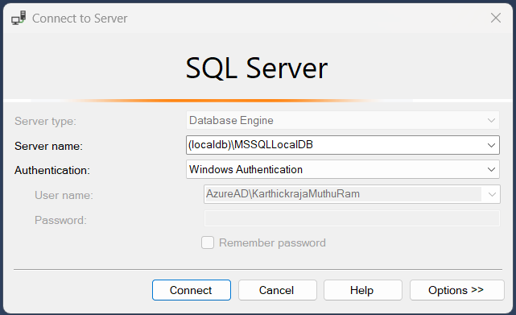
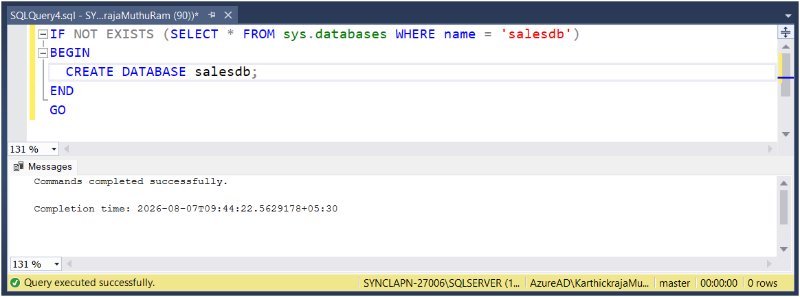
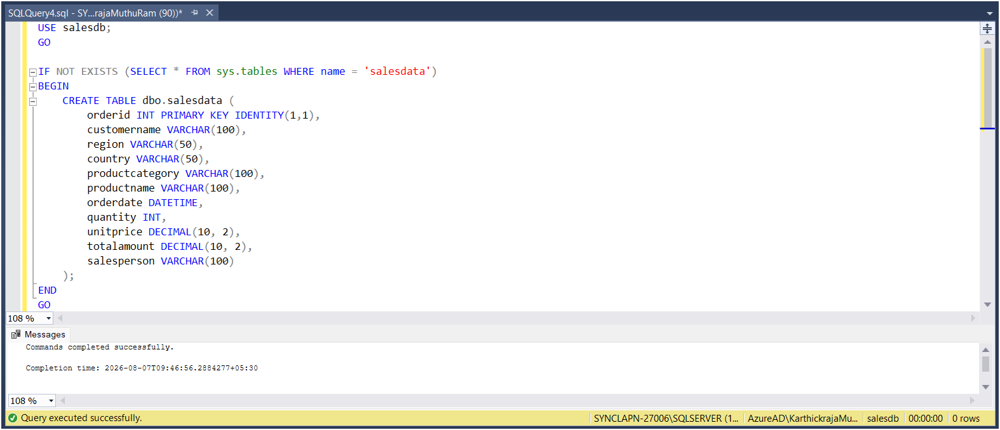
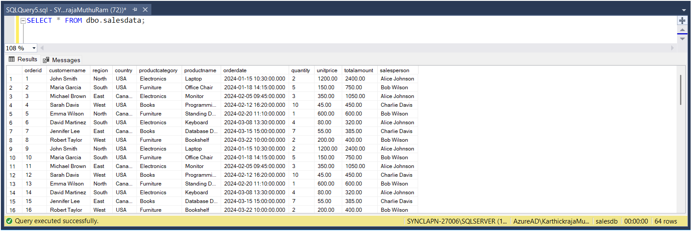
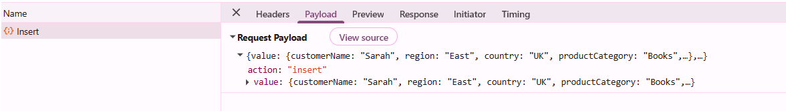
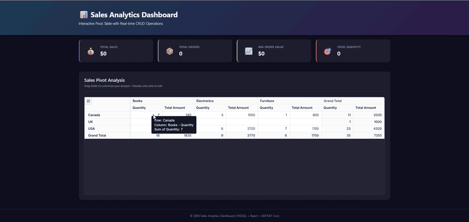

# Microsoft SQL Server data binding in React Pivot Table

The Syncfusion<sup style="font-size:70%">&reg;</sup> React Pivot Table supports binding data from a Microsoft SQL Server database through an ASP.NET Core Web API using [Microsoft.Data.SqlClient](https://www.nuget.org/packages/Microsoft.Data.SqlClient/). This modern architecture provides a secure and scalable way to access the database from a backend service while enabling efficient server‑side processing. By using React for the UI and ASP.NET Core with SqlClient for data access, applications keep a clean separation between presentation and data layers. They also retain full control over SQL Server interactions.

**What is Microsoft.Data.SqlClient?**

[Microsoft.Data.SqlClient](https://www.nuget.org/packages/Microsoft.Data.SqlClient) is the official .NET data provider used to connect ASP.NET Core applications to Microsoft SQL Server. It enables applications to execute SQL queries, call stored procedures, and read or write data securely using first-party APIs from Microsoft. SqlClient is commonly used in Web APIs where precise control over database access, performance, and security is required.

**Key benefits of SqlClient:**

- **Secure by design**: Supports parameterized queries to help prevent SQL injection attacks.
- **High performance**: Provides efficient, low‑level access to SQL Server with minimal overhead.
- **Asynchronous support**: Supports async database operations for better scalability in web APIs.
- **Modern .NET**: Supports current .NET releases and integrates with ASP.NET Core applications.
- **Full SQL control**: Allows precise control over SQL queries, stored procedures, and transactions.
- **Cross-platform**: Works on Windows, Linux, and macOS through ASP.NET Core.

## Prerequisites

Ensure the following software and packages are installed before proceeding:

| Software/Package | Version | Purpose |
| ------------------ | -------- | --------- |
| Node.js | 20.19+ or 22.12+ | Runtime required by the current `create-vite` release |
| React | 18.x or 19.x | Create and run React apps |
| .NET SDK | 8.0 or later | Build and run ASP.NET Core Web API |
| SQL Server | 2019 or later | Database server |
| SQL Server Management Studio (SSMS) | 19.x or later | Create and inspect the database |
| Microsoft.Data.SqlClient (NuGet) | 5.1.2 or later | SQL Server connectivity (data provider for .NET) |
| Syncfusion.EJ2.AspNet.Core | 34.1.32 or later | Server helpers: `DataManagerRequest`, `DataOperations` |
| @syncfusion/ej2-react-pivotview | 34.1.32 or later | React Pivot Table component |
| ASP.NET Core dev certificate | n/a | Local HTTPS support; trust it before the first run as described in Step 5 |

This walkthrough uses Syncfusion<sup style="font-size:70%">&reg;</sup> 34.1.32 with .NET 8 and a Vite React TypeScript client. Pin these versions for reproducible builds, or verify compatibility before upgrading any package independently.

The SSMS and LocalDB workflow below is Windows-specific. On Linux or macOS, connect to a full or remote SQL Server instance with a cross-platform tool such as `sqlcmd`, and replace the LocalDB connection string with that instance's connection details. The account used for setup must be allowed to create a database and table and insert rows. The account used by the API needs `SELECT`, `INSERT`, `UPDATE`, and `DELETE` permissions on `salesdb`.

## Setting up the SQL Server environment

First, create the **SQL Server database** structure required to store sales records for the Pivot Table.

### Step 1: Create the SQL Server database

1. **Install SQL Server**: If not already installed, download SQL Server from [microsoft.com/sql-server](https://www.microsoft.com/en-us/sql-server/sql-server-downloads).
2. **Open SSMS**: SQL Server Management Studio (SSMS) is the integrated environment for managing any SQL Server infrastructure. After installation, open SSMS.
3. **Connect to the server**: To use the connection string shown later in this walkthrough, enter `(localdb)\MSSQLLocalDB` as the **Server name** and use Windows Authentication. Verify that LocalDB is installed with `sqllocaldb info MSSQLLocalDB`; install the LocalDB feature from SQL Server Express media if the instance is unavailable. If you instead connect to `localhost`, `.`, or another instance, use that same server and authentication method in the API connection string.
4. **Open a new query window**: Right-click on the server name in **Object Explorer** and choose **New Query** (or press <kbd>Ctrl</kbd>+<kbd>N</kbd>) to open a new SQL editor window.



5. **Create the database**: Paste the following SQL script into the query editor and click the **Execute** button (or press <kbd>F5</kbd>):

```sql
-- Create Database
IF NOT EXISTS (SELECT * FROM sys.databases WHERE name = 'salesdb')
BEGIN
  CREATE DATABASE salesdb;
END
GO
```

After successful execution, refresh the **Databases** node in Object Explorer to see the new `salesdb` database.



### Step 2: Create the sales data table

After creating the database, you need to create a table to store sales records. This table will hold all the data that the Pivot Table will display and analyze.

1. **Set the database context**: In the query editor toolbar, select `salesdb` from the **Available Databases** dropdown. The script also includes a `USE salesdb;` statement, so this step is optional.
2. **Open a new query tab** (or reuse the existing one).
3. **Create the table**: Paste the following SQL script into the query editor and click **Execute** (or press <kbd>F5</kbd>):

```sql
-- Create SalesData Table
USE salesdb;
GO

IF NOT EXISTS (SELECT * FROM sys.tables WHERE name = 'salesdata')
BEGIN
    CREATE TABLE dbo.salesdata (
        orderid INT PRIMARY KEY IDENTITY(1,1),
        customername VARCHAR(100),
        region VARCHAR(50),
        country VARCHAR(50),
        productcategory VARCHAR(100),
        productname VARCHAR(100),
        orderdate DATETIME,
        quantity INT,
        unitprice DECIMAL(10, 2),
        totalamount DECIMAL(10, 2),
        salesperson VARCHAR(100)
    );
END
GO
```

You should see a success message "Command(s) completed successfully" confirming that the table was created.



**Table structure explanation:**

| Column | Data Type | Description |
|--------|-----------|-------------|
| orderid | INT IDENTITY(1,1) | Unique order identifier (auto-incremented primary key) |
| customername | VARCHAR(100) | Name of the customer who placed the order |
| region | VARCHAR(50) | Geographic region of the customer |
| country | VARCHAR(50) | Country where the order was placed |
| productcategory | VARCHAR(100) | Category of the product (e.g., Electronics, Furniture) |
| productname | VARCHAR(100) | Name of the product ordered |
| orderdate | DATETIME | Date and time when the order was placed (includes both date and time values) |
| quantity | INT | Number of units ordered |
| unitprice | DECIMAL(10, 2) | Price per unit of the product |
| totalamount | DECIMAL(10, 2) | Total cost of the order (quantity × unitprice) |
| salesperson | VARCHAR(100) | Name of the sales representative handling the order |

### Step 3: Insert sample data

Insert sample sales data into the table. This data will be used to populate the Pivot Table.

1. **Open a new query window** (or reuse the existing one) with `salesdb` still selected.
2. **Insert the sample data**: Paste the following SQL script into the query editor and click **Execute** (or press <kbd>F5</kbd>):

```sql
-- Insert Sample Data
USE salesdb;
GO

INSERT INTO dbo.salesdata (customername, region, country, productcategory, productname, orderdate, quantity, unitprice, totalamount, salesperson)
VALUES
('John Smith', 'North', 'USA', 'Electronics', 'Laptop', '2024-01-15 10:30:00', 2, 1200.00, 2400.00, 'Alice Johnson'),
('Maria Garcia', 'South', 'USA', 'Furniture', 'Office Chair', '2024-01-18 14:15:00', 5, 150.00, 750.00, 'Bob Wilson'),
('Michael Brown', 'East', 'Canada', 'Electronics', 'Monitor', '2024-02-05 09:45:00', 3, 350.00, 1050.00, 'Alice Johnson'),
('Sarah Davis', 'West', 'USA', 'Books', 'Programming Guide', '2024-02-12 16:20:00', 10, 45.00, 450.00, 'Charlie Davis'),
('Emma Wilson', 'North', 'Canada', 'Furniture', 'Standing Desk', '2024-02-20 11:10:00', 1, 600.00, 600.00, 'Bob Wilson'),
('David Martinez', 'South', 'USA', 'Electronics', 'Keyboard', '2024-03-08 13:30:00', 4, 80.00, 320.00, 'Alice Johnson'),
('Jennifer Lee', 'East', 'Canada', 'Books', 'Database Design', '2024-03-15 15:00:00', 7, 55.00, 385.00, 'Charlie Davis'),
('Robert Taylor', 'West', 'USA', 'Furniture', 'Bookshelf', '2024-03-22 10:00:00', 2, 200.00, 400.00, 'Bob Wilson');
GO
```

You should see a success message showing "(8 row(s) affected)", indicating that 8 rows were successfully inserted.

**Verify the data:**

To confirm the data was inserted correctly, run the following verification query in the **Query Editor**:

```sql
SELECT * FROM dbo.salesdata;
```

You should see all 8 sample records displayed in the results grid.



## Setting up the ASP.NET Core Web API

Now that the SQL Server database is configured, let's create the backend API that the React Pivot Table will communicate with.

### Step 1: Create the ASP.NET Core Web API project

To connect the Syncfusion<sup style="font-size:70%">&reg;</sup> React Pivot Table to SQL Server, the **ASP.NET Core Web API server** must be configured with the required NuGet packages. The server application is responsible for handling HTTP requests from the Pivot Table and accessing data from SQL Server.

**To create a new ASP.NET Core Web API project using the .NET CLI:**

Execute the following commands in your terminal:

```bash
dotnet new webapi --use-controllers -n PivotTable_MSSQL.Server
cd PivotTable_MSSQL.Server
```

The `--use-controllers` switch creates the `Controllers/` folder used in Step 4. If you omit it, create the folder manually.

**Install Required NuGet Packages:**

Add the SQL Server client library and Syncfusion<sup style="font-size:70%">&reg;</sup> server‑side helper packages:

```bash
dotnet add package Microsoft.Data.SqlClient --version 5.2.2
dotnet add package Syncfusion.EJ2.AspNet.Core --version 34.1.32
```

The Web API exposes HTTP endpoints that are used by the Pivot Table to perform read and data modification operations. The Syncfusion<sup style="font-size:70%">&reg;</sup> server helper package provides `DataManagerRequest` and `DataOperations` when server-side filtering, sorting, searching, or paging is required. The initial read example below does not use those types and returns the complete result set; either implement those operations before using large datasets or omit this package.

### Step 2: Configure the connection string

The connection string contains the information needed to connect to SQL Server. For local development, use [.NET Secret Manager](https://learn.microsoft.com/en-us/aspnet/core/security/app-secrets) so that the password is not committed to source control:

```bash
dotnet user-secrets init
dotnet user-secrets remove "ConnectionStrings:SalesDb"
dotnet user-secrets set "ConnectionStrings:SalesDb" "Server=(localdb)\MSSQLLocalDB;Database=salesdb;Integrated Security=True;TrustServerCertificate=True;Encrypt=False;Connect Timeout=30;"
```

Use a restricted SQL Server account with only the permissions required for `salesdb`. .NET Secret Manager keeps development values outside the project but does not encrypt them. Use a managed secret store and require TLS in production.

**Connection string components:**

| Component | Description | Example |
|-----------|-------------|----------|
| Data Source | SQL Server instance address | `localhost`, `.`, or `192.168.1.100\SQLEXPRESS` |
| Initial Catalog | Database name | `salesdb` |
| Connect Timeout | Connection timeout in seconds | `30` |
| Encrypt | Enables encryption for the connection | `False` (development) / `True` (production) |
| Trust Server Certificate | Bypasses certificate-chain validation when encryption is enabled | `True` only for local development with a self-signed certificate; `False` in production |

The example disables SQL connection encryption for local development, so `TrustServerCertificate=True` has no effect until `Encrypt=True` is used. In production, set `Encrypt=True`, set `TrustServerCertificate=False`, and install a certificate trusted by the API host.

### Step 3: Configure Program.cs

Update **Program.cs** to enable controller routing and allow requests from the React development server:

The CORS origin must exactly match the URL printed by Vite. If port `5173` is already in use, either start Vite with `npm run dev -- --port 5173 --strictPort` or update `WithOrigins` to the actual client origin. The sample API is intentionally unauthenticated for local development; add authentication, authorization services, and endpoint policies before exposing it beyond a trusted development machine.

```csharp
var builder = WebApplication.CreateBuilder(args);

// Add services to the container
builder.Services.AddControllers();

// Enable CORS to allow requests from React client
builder.Services.AddCors(options =>
{
    // Vite serves the React app over plain HTTP on http://localhost:5173
    // while the API listens on https://localhost:7086. Browsers send the
    // request from the HTTP origin and trust the API's HTTPS certificate
    // (after running `dotnet dev-certs https --trust`).
    options.AddPolicy("ReactClient",
        policy => policy
            .WithOrigins("http://localhost:5173")
            .AllowAnyMethod()
            .AllowAnyHeader());
});

var app = builder.Build();

// CORS must be registered BEFORE UseHttpsRedirection so that
// preflight OPTIONS requests are not redirected.
app.UseCors("ReactClient");
app.UseHttpsRedirection();
// UseAuthorization is registered without an authentication scheme for
// this sample. Add authentication and authorization services in
// production (for example, JWT bearer authentication).
app.UseAuthorization();
app.MapControllers();

app.Run();
```

**What's happening:**

1. **AddControllers**: Registers controller support for the API endpoints.
2. **AddCors**: Allows the React development origin to call the API.
3. **ReactClient policy**: Restricts cross-origin requests to `http://localhost:5173`; replace this with the deployed client origin in production.

### Step 4: Create the data model and controller

Create a new file named **SalesController.cs** in the **Controllers** folder. The initial version below contains the data model and read endpoints. The CRUD section later adds the data-modification endpoints.

```csharp
using Microsoft.AspNetCore.Mvc;
using System.ComponentModel.DataAnnotations;
using System.Data;
using Microsoft.Data.SqlClient;

namespace PivotTable_MSSQL.Server.Controllers
{
    [ApiController]
    public class SalesController : ControllerBase
    {
        private readonly string _connectionString;

        public SalesController(IConfiguration configuration)
        {
            _connectionString = configuration.GetConnectionString("SalesDb")
                ?? throw new InvalidOperationException(
                    "Connection string 'SalesDb' is not configured.");
        }

        /// <summary>
        /// Handles the DataManager request and returns data to the client.
        /// </summary>
        /// <param name="DataManagerRequest">Contains the details of the data operation requested.</param>
        /// <returns>Returns the data records along with the total count.</returns>
        [HttpPost]
        [Route("api/[controller]")]
        public object Post([FromBody] object DataManagerRequest)
        {
            // Note: this sample returns the full result set. Server-side
            // DataManager operations (search, filter, sort, paging) from
            // DataManagerRequest are NOT applied. To apply them, use the
            // Syncfusion DataOperations helpers from Syncfusion.EJ2.Base.
            // See: https://ej2.syncfusion.com/aspnetcore/documentation/data/getting-started

            // Retrieve data from the data source (database).
            IQueryable<SalesData> DataSource = GetSalesData().AsQueryable();
            int totalRecordsCount = DataSource.Count();
            // Return data based on the request.
            return new { result = DataSource, count = totalRecordsCount };
        }
        
        /// <summary>
        /// Retrieves the sales data from the database.
        /// </summary>
        /// <returns>Returns a list of SalesData records fetched from the database.</returns>
        [HttpGet]
        [Route("api/[controller]")]
        public List<SalesData> GetSalesData()
        {
            const string Query = @"SELECT * FROM dbo.salesdata ORDER BY orderid;";

            using var Connection = new SqlConnection(_connectionString);
            Connection.Open();

            using var Command = new SqlCommand(Query, Connection);
            using var DataAdapter = new SqlDataAdapter(Command);
            var DataTable = new DataTable();
            DataAdapter.Fill(DataTable);

            var DataSource = (from DataRow Data in DataTable.Rows
                select new SalesData
                {
                    OrderID = Data["orderid"] == DBNull.Value ? (int?)null : Convert.ToInt32(Data["orderid"]),
                    CustomerName = Data["customername"] == DBNull.Value ? null : Data["customername"].ToString(),
                    Region = Data["region"] == DBNull.Value ? null : Data["region"].ToString(),
                    Country = Data["country"] == DBNull.Value ? null : Data["country"].ToString(),
                    ProductCategory = Data["productcategory"] == DBNull.Value ? null : Data["productcategory"].ToString(),
                    ProductName = Data["productname"] == DBNull.Value ? null : Data["productname"].ToString(),
                    OrderDate = Data["orderdate"] == DBNull.Value ? (DateTime?)null : Convert.ToDateTime(Data["orderdate"]),
                    Quantity = Data["quantity"] == DBNull.Value ? (int?)null : Convert.ToInt32(Data["quantity"]),
                    UnitPrice = Data["unitprice"] == DBNull.Value ? 0m : Convert.ToDecimal(Data["unitprice"]),
                    TotalAmount = Data["totalamount"] == DBNull.Value ? 0m : Convert.ToDecimal(Data["totalamount"]),
                    SalesPerson = Data["salesperson"] == DBNull.Value ? null : Data["salesperson"].ToString()
                }
            ).ToList();
            return DataSource;
        }

        public class SalesData
        {
            [Key]
            public int? OrderID { get; set; }
            public string? CustomerName { get; set; }
            public string? Region { get; set; }
            public string? Country { get; set; }
            public string? ProductCategory { get; set; }
            public string? ProductName { get; set; }
            public DateTime? OrderDate { get; set; }
            public int? Quantity { get; set; }
            public decimal UnitPrice { get; set; }
            public decimal TotalAmount { get; set; }
            public string? SalesPerson { get; set; }
        }
    }
}
```

**Explanation:**

- **GetSalesData()**: Connects to SQL Server, executes a SELECT query, and returns all sales records.
- **Post()**: Handles requests from the React Pivot Table and returns the complete data collection with its total count. It does not apply the request's search, filter, sort, or paging options.
- **SalesData class**: Represents the structure of each sales record.

For production use, make the read path asynchronous, log database failures with `ILogger<SalesController>`, return a safe error response, and apply server-side operations before loading large tables.

## Setting up the React Pivot Table client

Now that the backend API is ready, let's create the React client application that displays the Pivot Table and connects to the SQL Server data.

### Step 1: Create the React client application

Open a Visual Studio Code terminal or Command Prompt and run the following commands to create a React application:

```bash
npm create vite@latest pivottable_mssql.client -- --template react-ts
cd pivottable_mssql.client
```

### Step 2: Install Syncfusion Pivot Table package

Install the Syncfusion React Pivot Table component and its dependencies:

```bash
npm install @syncfusion/ej2-react-pivotview
```

The Pivot Table package currently brings `@syncfusion/ej2-data` as a dependency, but the application imports it directly. Ensure it is listed in the generated application's dependencies; if it is absent, install `@syncfusion/ej2-data@34.1.32`. Keep the Pivot Table, data, and theme packages on the same release. For a reproducible application, pin the installed packages to the tested 34.1.32 release instead of accepting future major versions.

Register your Syncfusion license by following the [license key registration documentation](https://ej2.syncfusion.com/react/documentation/licensing/license-key-registration). Add the license key to **src/main.tsx** before rendering `App`:

```typescript
import { registerLicense } from '@syncfusion/ej2-base';

registerLicense('YOUR-LICENSE-KEY');
```

### Step 3: Import Syncfusion CSS styles

Install the Tailwind 3 theme package and replace the contents of **src/index.css** with the Pivot Table theme import:

```bash
npm install @syncfusion/ej2-tailwind3-theme --save
```

```css
@import '../node_modules/@syncfusion/ej2-tailwind3-theme/styles/pivotview/index.css';
```

The "tailwind3" theme is applied for reference. For other theme options or customization, refer to the [Syncfusion<sup style="font-size:70%">&reg;</sup> React Appearance](https://ej2.syncfusion.com/react/documentation/appearance/theme-studio) documentation.

### Step 4: Add the Pivot Table component - display data

The React Pivot Table component retrieves and displays data from the SQL Server database through the ASP.NET Core Web API. Update your **src/App.tsx** file with the following code:

```typescript
import { FieldList, Inject, PivotViewComponent } from '@syncfusion/ej2-react-pivotview';
import { DataManager, UrlAdaptor } from '@syncfusion/ej2-data';
import './App.css';

function App() {
  let pivotObj: PivotViewComponent;

  // Initialize DataManager with the Web API endpoint
  let data: DataManager = new DataManager({
    url: 'https://localhost:7086/api/Sales',
    adaptor: new UrlAdaptor
  });

  // Configure the Pivot Table data structure
  const dataSourceSettings = {
    dataSource: data,
    expandAll: true,
    rows: [{ name: 'country', caption: 'Country' }],
    columns: [{ name: 'productCategory', caption: 'Product Category' }],
    values: [{ name: 'quantity', caption: 'Quantity' }, { name: 'totalAmount', caption: 'Total Amount' }],
    filters: [],
    fieldMapping: [{ name: 'orderDate', caption: 'Order Date' }, { name: 'orderID', caption: 'Order ID' }, { name: 'customerName', caption: 'Customer Name' }, { name: 'region', caption: 'Region' }, { name: 'salesPerson', caption: 'Sales Person' }, { name: 'productName', caption: 'Product Name' }, { name: 'unitPrice', caption: 'Unit Price' }]
  }

  return (
    <PivotViewComponent
      id='PivotView'
      ref={(scope: any) => { pivotObj = scope; }}
      height={350}
      dataSourceSettings={dataSourceSettings}
      showFieldList={true}>
      <Inject services={[FieldList]}/>
    </PivotViewComponent>
  );
}

export default App;
```

This first listing intentionally demonstrates read-only binding. The CRUD section later replaces it with a complete client configuration that adds drill-through editing and the modification endpoints.

**Code explanation:**

- [DataManager](https://ej2.syncfusion.com/react/documentation/data/getting-started): Connects to the ASP.NET Core Web API endpoint at `https://localhost:7086/api/Sales`. Replace the example port with the HTTPS URL printed by `dotnet run`.

- [UrlAdaptor](https://ej2.syncfusion.com/react/documentation/data/adaptors/url-adaptor): Uses the standard URL adaptor to automatically send requests to and receive responses from the backend API.

- [dataSourceSettings](https://ej2.syncfusion.com/react/documentation/api/pivotview/index-default#datasourcesettings): Defines the Pivot Table layout:
  - [rows](https://ej2.syncfusion.com/react/documentation/api/pivotview/datasourcesettingsmodel#rows): Displays **country** as row headers
  - [columns](https://ej2.syncfusion.com/react/documentation/api/pivotview/datasourcesettingsmodel#columns): Displays **productCategory** as column headers
  - [values](https://ej2.syncfusion.com/react/documentation/api/pivotview/datasourcesettingsmodel#values): Aggregates **quantity** and **totalAmount** based on rows and columns
  - [fieldMapping](https://ej2.syncfusion.com/react/documentation/api/pivotview/datasourcesettingsmodel#fieldmapping): Defines captions for fields that are not bound in pivot reports.
- [showFieldList](https://ej2.syncfusion.com/react/documentation/api/pivotview/index-default#showfieldlist): Displays the field list panel allowing users to rearrange fields

- [PivotViewComponent](https://ej2.syncfusion.com/react/documentation/api/pivotview/index-default): Renders the Pivot Table with the configured data and layout.

### Step 5: Run the applications

You will need two terminal windows: one for the API server and one for the React client. The commands below are cross-platform (Windows, Linux, macOS).

**Before the first run**, trust the local HTTPS certificate so the browser accepts the API over HTTPS:

```bash
dotnet dev-certs https --trust
```

**Start the ASP.NET Core API server first**, then start the React dev server:

Open a terminal in the **PivotTable_MSSQL.Server** folder and run:

```bash
dotnet run
```

The terminal prints the HTTP and HTTPS addresses selected from `launchSettings.json`. The remaining examples use `https://localhost:7086`; if your server prints a different HTTPS port, update every hardcoded API endpoint in `src/App.tsx`. Also keep the CORS origin in `Program.cs` synchronized with the URL printed by Vite.

**In a separate terminal, start the React development server:**

Open a terminal in the **pivottable_mssql.client** folder and run:

```bash
npm run dev
```

The React application normally starts at `http://localhost:5173`. Open the URL printed by Vite to see the Pivot Table. If the certificate step fails, use the certificate troubleshooting section below.


## CRUD operations with Pivot Table

This section describes how to enable Create, Read, Update, and Delete (CRUD) operations in the Pivot Table, allowing users to modify the underlying database records directly through the built-in editing pop-up.

> **How to open the editing pop-up:** double-click any value cell in the Pivot Table. The drill-through grid opens with **Add**, **Edit**, and **Delete** buttons (drill-through is enabled by setting `allowDrillThrough={true}` on the component, which is already configured in the final `App.tsx` below).

### Understanding CRUD in Pivot Table

The Syncfusion React Pivot Table supports CRUD operations through [DataManager](https://ej2.syncfusion.com/react/documentation/data/getting-started) with [UrlAdaptor](https://ej2.syncfusion.com/react/documentation/data/adaptors/url-adaptor). This enables:

- **Create**: Add new sales records through the Pivot Table editing pop-up
- **Read**: Display data from the database (already implemented)
- **Update**: Edit existing records in place
- **Delete**: Remove records from the database

When a user performs any edit action (add, update, or delete), the Pivot Table sends an HTTP request using [DataManager](https://ej2.syncfusion.com/react/documentation/data/getting-started) to the corresponding server endpoint, which processes the operation and updates the SQL Server database.

### Implement server-side CRUD methods

Extend your **SalesController.cs** with Insert, Update, and Remove methods. Place the `CRUDModel<T>` declaration and all three action methods inside the `SalesController` class, before its final closing brace. These methods will be called automatically when users edit data in the Pivot Table editing pop-up.

#### CRUD model class

The `CRUDModel<T>` class is the envelope the Pivot Table uses to send data to Insert, Update, and Remove endpoints. Add it to the same file before the CRUD action methods so all three methods can reference it.

For Insert and Update, `CustomerName`, `Country`, `OrderDate`, `Quantity`, and `UnitPrice` are required by the sample validation. `Quantity` must be greater than zero, and `UnitPrice` must not be negative. The remaining fields are optional. The demonstration table allows null values at the database level, so add matching `NOT NULL` and `CHECK` constraints before relying on these rules in production.

```csharp
/// <summary>
/// Generic model for handling CRUD operations from the Pivot Table.
/// The Pivot Table uses this structure to send data to Insert, Update, and Remove endpoints.
/// </summary>
/// <typeparam name="T">The data type (e.g., SalesData)</typeparam>
public class CRUDModel<T> where T : class
{
    /// <summary>
    /// Action being performed (e.g., "insert", "update", "remove").
    /// </summary>
    public string? Action { get; set; }

    /// <summary>
    /// Primary key column name (e.g., "orderid").
    /// </summary>
    public string? KeyColumn { get; set; }

    /// <summary>
    /// The primary key value (e.g., the OrderID).
    /// </summary>
    public object? Key { get; set; }

    /// <summary>
    /// The single record being operated on (for Insert, Update operations).
    /// </summary>
    public T? Value { get; set; }

    /// <summary>
    /// Additional parameters sent by the client.
    /// </summary>
    public IDictionary<string, object>? Params { get; set; }
}
```

#### Insert

To add a new record, double-click a pivot cell to open the editing pop-up and click the **Add** button to create a new empty row. Enter the required data in the new row fields, then click the **Update** button to save the record to the **salesdata** table using the following POST method:

```csharp
/// <summary>
/// Inserts a new sales record into the database.
/// This method is called when a new row is added in the Pivot Table.
/// </summary>
/// <param name="value">Contains the new sales data to insert.</param>
/// <returns>Returns the inserted record with its new OrderID.</returns>
[HttpPost]
[Route("api/[controller]/Insert")]
public async Task<IActionResult> Insert([FromBody] CRUDModel<SalesData> model)
{
    if (model?.Value == null)
        return BadRequest("A sales record is required.");

    if (string.IsNullOrWhiteSpace(model.Value.CustomerName) ||
        string.IsNullOrWhiteSpace(model.Value.Country) ||
        model.Value.OrderDate == null ||
        model.Value.Quantity == null ||
        model.Value.Quantity <= 0 ||
        model.Value.UnitPrice < 0)
    {
        return BadRequest("Required fields, a positive quantity, and a non-negative unit price are required.");
    }

    try
    {
        // The server recalculates TotalAmount so the persisted column
        // always equals Quantity × UnitPrice, regardless of client input.
        model.Value.TotalAmount =
            model.Value.Quantity.Value * model.Value.UnitPrice;
        const string sql = @"
            INSERT INTO dbo.salesdata
            (customername, region, country, productcategory, productname, orderdate, quantity, unitprice, totalamount, salesperson)
            OUTPUT INSERTED.orderid
            VALUES
            (@CustomerName, @Region, @Country, @ProductCategory, @ProductName, @OrderDate, @Quantity, @UnitPrice, @TotalAmount, @SalesPerson);
        ";

        using var conn = new SqlConnection(_connectionString);
        await conn.OpenAsync();

        using var cmd = new SqlCommand(sql, conn);

        // Add parameters to prevent SQL injection
        cmd.Parameters.AddWithValue("@CustomerName", (object?)model.Value.CustomerName ?? DBNull.Value);
        cmd.Parameters.AddWithValue("@Region", (object?)model.Value.Region ?? DBNull.Value);
        cmd.Parameters.AddWithValue("@Country", (object?)model.Value.Country ?? DBNull.Value);
        cmd.Parameters.AddWithValue("@ProductCategory", (object?)model.Value.ProductCategory ?? DBNull.Value);
        cmd.Parameters.AddWithValue("@ProductName", (object?)model.Value.ProductName ?? DBNull.Value);
        cmd.Parameters.AddWithValue("@OrderDate", (object?)model.Value.OrderDate ?? DBNull.Value);
        cmd.Parameters.AddWithValue("@Quantity", (object?)model.Value.Quantity ?? DBNull.Value);
        cmd.Parameters.AddWithValue("@UnitPrice", model.Value.UnitPrice);
        cmd.Parameters.AddWithValue("@TotalAmount", model.Value.TotalAmount);
        cmd.Parameters.AddWithValue("@SalesPerson", (object?)model.Value.SalesPerson ?? DBNull.Value);

        // Execute the query and get the newly created OrderID
        var newId = Convert.ToInt32(await cmd.ExecuteScalarAsync());

        // Update the model with the new ID
        model.Value.OrderID = newId;

        // UrlAdaptor expects { key, value, action } on insert.
        return Ok(new { key = newId, value = model.Value, action = "insert" });
    }
    catch (Exception)
    {
        // Log the exception in a real application. Returning a generic
        // message avoids leaking database or stack details to the client.
        return StatusCode(500, new { error = "Insert failed." });
    }
}
```

**How it works:**

- The method receives a `CRUDModel<SalesData>` object containing the new record data.
- Input validation rejects missing required values, non-positive quantities, and negative unit prices.
- The server recalculates `TotalAmount` from `Quantity × UnitPrice` before persisting.
- Parameterized queries prevent SQL injection attacks by separating SQL code from data.
- `OUTPUT INSERTED.orderid` retrieves the auto-generated identity value from SQL Server.
- The method returns the `{ key, value, action }` wrapper used by this walkthrough.
- All operations are wrapped in try-catch for error handling.



The catch block intentionally returns a generic message but does not log the exception. Inject `ILogger<SalesController>` and log the exception without secrets or sensitive field values in a production implementation. The XML comment uses the legacy parameter name `value`; the action parameter is `model`.

#### Update

To modify a record, double-click a pivot cell to open the editing pop-up, select the row you want to edit, and click the **Edit** button. The row becomes editable so you can modify the fields. Click the **Update** button to save the changes to the **salesdata** table using the following POST method:

```csharp
/// <summary>
/// Updates an existing sales record in the database.
/// This method is called when a row is edited in the Pivot Table.
/// </summary>
/// <param name="value">Contains the updated sales data.</param>
/// <returns>Returns the number of rows updated.</returns>
[HttpPost]
[Route("api/[controller]/Update")]
public async Task<IActionResult> Update([FromBody] CRUDModel<SalesData> model)
{
    if (model?.Value == null)
        return BadRequest("A sales record is required.");

    if (string.IsNullOrWhiteSpace(model.Value.CustomerName) ||
        string.IsNullOrWhiteSpace(model.Value.Country) ||
        model.Value.OrderDate == null ||
        model.Value.Quantity == null ||
        model.Value.Quantity <= 0 ||
        model.Value.UnitPrice < 0)
    {
        return BadRequest("Required fields, a positive quantity, and a non-negative unit price are required.");
    }

    try
    {
        // The server recalculates TotalAmount so the persisted column
        // always equals Quantity × UnitPrice, regardless of client input.
        model.Value.TotalAmount =
            model.Value.Quantity.Value * model.Value.UnitPrice;
        const string sql = @"
            UPDATE dbo.salesdata
            SET customername    = @CustomerName,
                region          = @Region,
                country         = @Country,
                productcategory = @ProductCategory,
                productname     = @ProductName,
                orderdate       = @OrderDate,
                quantity        = @Quantity,
                unitprice       = @UnitPrice,
                totalamount     = @TotalAmount,
                salesperson     = @SalesPerson
            WHERE orderid = @OrderID;
        ";

        using var conn = new SqlConnection(_connectionString);
        await conn.OpenAsync();

        using var cmd = new SqlCommand(sql, conn);

        // Add parameters to prevent SQL injection
        cmd.Parameters.AddWithValue("@CustomerName", (object?)model.Value.CustomerName ?? DBNull.Value);
        cmd.Parameters.AddWithValue("@Region", (object?)model.Value.Region ?? DBNull.Value);
        cmd.Parameters.AddWithValue("@Country", (object?)model.Value.Country ?? DBNull.Value);
        cmd.Parameters.AddWithValue("@ProductCategory", (object?)model.Value.ProductCategory ?? DBNull.Value);
        cmd.Parameters.AddWithValue("@ProductName", (object?)model.Value.ProductName ?? DBNull.Value);
        cmd.Parameters.AddWithValue("@OrderDate", (object?)model.Value.OrderDate ?? DBNull.Value);
        cmd.Parameters.AddWithValue("@Quantity", (object?)model.Value.Quantity ?? DBNull.Value);
        cmd.Parameters.AddWithValue("@UnitPrice", model.Value.UnitPrice);
        cmd.Parameters.AddWithValue("@TotalAmount", model.Value.TotalAmount);
        cmd.Parameters.AddWithValue("@SalesPerson", (object?)model.Value.SalesPerson ?? DBNull.Value);
        cmd.Parameters.AddWithValue("@OrderID", model.Value.OrderID);

        // Execute the update
        var rows = await cmd.ExecuteNonQueryAsync();

        // UrlAdaptor expects { key, value, action } on update.
        return Ok(new { key = model.Value.OrderID, value = model.Value, action = "update" });
    }
    catch (Exception)
    {
        return StatusCode(500, new { error = "Update failed." });
    }
}
```

**How it works:**

- The method validates that the data object is provided.
- The same business rules as `Insert` are enforced before persisting.
- The server recalculates `TotalAmount` from `Quantity × UnitPrice` to keep the column consistent.
- The WHERE clause targets the specific record using the OrderID primary key.
- All fields are updated using parameterized queries to prevent SQL injection.
- The method returns the `{ key, value, action }` wrapper used by this walkthrough.
- The catch block returns a generic failure response to the client.


The sample assumes `model.Value.OrderID` is present and valid. Validate the key before creating the SQL parameter, and return `404 Not Found` when `ExecuteNonQueryAsync()` reports that no row was updated. The XML comment uses the legacy parameter name `value`; the action parameter is `model`, and the method returns a response object rather than a row count.

#### Delete

To delete a record, double-click a pivot cell to open the editing pop-up, select the row you want to delete, and click the **Delete** button. This sends a POST request to the Remove endpoint with the primary key value. The corresponding record is then removed from the **salesdata** table:

```csharp
/// <summary>
/// Deletes a sales record from the database.
/// This method is called when a row is deleted in the Pivot Table.
/// </summary>
/// <param name="value">Contains the OrderID of the record to delete.</param>
/// <returns>Returns the number of rows deleted.</returns>
[HttpPost]
[Route("api/[controller]/Remove")]
public async Task<IActionResult> Remove([FromBody] CRUDModel<SalesData> model)
{
    if (model?.Key == null)
        return BadRequest("Missing key.");

    if (!int.TryParse(model.Key.ToString(), out var id))
        return BadRequest("Invalid OrderID.");

    try
    {
        const string sql = @"DELETE FROM dbo.salesdata WHERE orderid = @OrderID;";

        using var conn = new SqlConnection(_connectionString);
        await conn.OpenAsync();

        using var cmd = new SqlCommand(sql, conn);
        cmd.Parameters.AddWithValue("@OrderID", id);

        // Execute the delete
        var rows = await cmd.ExecuteNonQueryAsync();

        // UrlAdaptor expects { key, action } on remove.
        return Ok(new { key = id, action = "remove" });
    }
    catch (Exception)
    {
        return StatusCode(500, new { error = "Delete failed." });
    }
}
```

**How it works:**

- The method extracts the OrderID (primary key) from the `Key` property.
- Input validation ensures the key is properly formatted as an integer.
- The DELETE statement targets the specific record using the OrderID.
- `ExecuteNonQueryAsync()` returns the number of deleted rows to the local `rows` variable; the sample does not currently use that value.
- The method returns the `{ key, action }` wrapper used by this walkthrough.
- Parameterized queries prevent SQL injection even for delete operations.


Return `404 Not Found` when `rows` is zero instead of reporting a successful deletion. The XML comment uses the legacy parameter name `value`; the action parameter is `model`, and the method returns a response object rather than a row count.

### Configure client-side CRUD endpoints

Replace the contents of **src/App.tsx** with the complete file below. It includes the `DataManager` with CRUD URLs, the `editSettings` block, and the `beginDrillThrough` event that marks `orderID` as the primary key.

The CRUD endpoints (`insertUrl`, `updateUrl`, `removeUrl`) are properties of [`DataManager`](https://ej2.syncfusion.com/react/documentation/data/getting-started), not the `PivotViewComponent`. The `url` is the data retrieval endpoint; the three `*Url` properties are called automatically when a user adds, edits, or deletes a record through the editing pop-up.

**Response shapes used by this sample:**

- `Insert` returns the inserted record with its assigned key: `{ key, value, action: "insert" }`.
- `Update` returns the updated record with the original key: `{ key, value, action: "update" }`.
- `Remove` returns the deleted key: `{ key, action: "remove" }`.
- The `value` field is the full record; the `key` is the primary-key value (`orderID`).

These response wrappers match the controller implementation in this walkthrough; they are not a universal `UrlAdaptor` response requirement. Verify CRUD response handling against the installed Syncfusion version when adapting the endpoints.

```typescript
import { DrillThrough, FieldList, Inject, PivotViewComponent } from '@syncfusion/ej2-react-pivotview'; // Docs: https://ej2.syncfusion.com/react/documentation/api/pivotview/drillthrough
import { DataManager, UrlAdaptor } from '@syncfusion/ej2-data';
import './App.css';

const API_BASE: string =
  (import.meta.env.VITE_API_URL as string | undefined) ??
  'https://localhost:7086/api';

function App() {
  let pivotObj: PivotViewComponent;

  // Configure DataManager with CRUD URLs.
  // - url        : data retrieval endpoint
  // - insertUrl  : called when the user adds a new record
  // - updateUrl  : called when the user edits an existing record
  // - removeUrl  : called when the user deletes a record
  // - adaptor    : standard URL adaptor for HTTP communication
  const data: DataManager = new DataManager({
    url: 'https://localhost:7086/api/Sales',
    insertUrl: 'https://localhost:7086/api/Sales/Insert',
    updateUrl: 'https://localhost:7086/api/Sales/Update',
    removeUrl: 'https://localhost:7086/api/Sales/Remove',
    adaptor: new UrlAdaptor()
  });

  const dataSourceSettings = {
    dataSource: data,
    expandAll: true,
    rows: [{ name: 'country', caption: 'Country' }],
    columns: [{ name: 'productCategory', caption: 'Product Category' }],
    values: [
      { name: 'quantity', caption: 'Quantity' },
      { name: 'totalAmount', caption: 'Total Amount' }
    ],
    filters: [],
    fieldMapping: [
      { name: 'orderDate', caption: 'Order Date' },
      { name: 'orderID', caption: 'Order ID' },
      { name: 'customerName', caption: 'Customer Name' },
      { name: 'region', caption: 'Region' },
      { name: 'salesPerson', caption: 'Sales Person' },
      { name: 'productName', caption: 'Product Name' },
      { name: 'unitPrice', caption: 'Unit Price' }
    ]
  };

  // Common editSettings options:
  //   allowEditing           - show the Edit button for existing records
  //   allowAdding            - show the Add button for new records
  //   allowDeleting          - show the Delete button
  //   mode                   - 'Normal' (popup) | 'Dialog' | 'Batch'
  //   allowCommandColumns    - show inline Edit/Delete buttons in the grid
  //   showConfirmBeforeSave  - ask the user to confirm before persisting
  //   showAddNewRecord       - show the Add button when the grid opens
  const editSettings = {
    allowEditing: true,
    allowAdding: true,
    allowDeleting: true,
    mode: 'Normal' as const
  };

  // beginDrillThrough fires when the user double-clicks a pivot cell to open
  // the editing pop-up. We use it to mark the primary-key column and to show
  // a date picker for orderDate. Without marking the primary key, the
  // DataManager cannot identify the record on update or delete.
  function beginDrillThrough(args: any): void {
    for (let i = 0; i < args.gridObj.columns.length; i++) {
      const column = args.gridObj.columns[i];
      if (column.field === 'orderID') {
        column.isPrimaryKey = true;
      } else {
        column.visible = true;
        if (column.field === 'orderDate') {
          column.editType = 'datetimepickeredit';
        }
      }
    }
  }

  return (
    <PivotViewComponent
      id="PivotView"
      ref={(scope: any) => { pivotObj = scope; }}
      height={350}
      dataSourceSettings={dataSourceSettings}
      showFieldList={true}
      allowDrillThrough={true}
      editSettings={editSettings}
      beginDrillThrough={beginDrillThrough}
      actionFailure={(args: any) => {
        console.error('Pivot Table action failed.', args);
      }}
    >
      <Inject services={[FieldList, DrillThrough]} />
    </PivotViewComponent>
  );
}

export default App;
```

The Pivot Table supports `Normal`, `Dialog`, and `Batch` modes through the [mode](https://ej2.syncfusion.com/react/documentation/api/pivotview/celleditsettingsmodel#mode) property. The individual `insertUrl`, `updateUrl`, and `removeUrl` endpoints shown here cover `Normal` and `Dialog` editing. Batch mode requires a `batchUrl` plus a server endpoint that accepts the adaptor's `added`, `changed`, and `deleted` collections. Command columns are enabled separately with `allowCommandColumns`. For details, refer to the [Editing documentation](https://ej2.syncfusion.com/react/documentation/pivotview/editing).

### Using CRUD operations

Once your Pivot Table is running with both server and client configured, you can perform CRUD operations directly through the Pivot Table's built-in editing pop-up.

For detailed information about the Pivot Table's built-in editing features and their usage, refer to the [Editing documentation](https://ej2.syncfusion.com/react/documentation/pivotview/editing).

**Important Notes:**

- **Primary Key (OrderID)**: You cannot modify the OrderID field during editing because it's the primary key. The primary key uniquely identifies each record, and changing it would break the data relationship.
- **Validation**: The server rejects missing required values, non-positive quantities, and negative unit prices. Add validation for every business rule required by your application.
- **Updates**: After a successful CRUD operation, verify that the Pivot Table reflects the server response; handle failures with the component's `actionFailure` event.

## Best practices for SQL Server data management

### Security

- Always use parameterized queries (as shown in the code) to prevent SQL injection attacks.
- Store connection strings in .NET Secret Manager, environment variables, or a managed secret store. Never hardcode passwords.
- Prefer Windows Authentication (`Integrated Security=True`) over SQL authentication when possible.
- Ensure all API communications use HTTPS in production.
- Require authentication and authorization for every read and modification endpoint before deploying the API.

### Performance

- SqlClient automatically manages connection pooling. Monitor connection limits based on your application's needs.
- After measuring actual queries, consider indexes on columns such as `orderdate`, `country`, `region`, and `productcategory`.
- Use appropriate SQL queries and avoid N+1 query problems.
- When inserting, use the `OUTPUT INSERTED.orderid` clause to retrieve the generated ID in the same round trip.

### Error handling

- Handle database failures consistently for both read and CRUD operations.
- Return helpful error messages to help users understand what went wrong.
- Use `ILogger<T>` and log failed SQL operations with their parameters (without secrets) for diagnostics.

### Data validation

- Validate all user inputs on the server before sending them to the database.
- Enforce business rules (for example, `quantity > 0`, non-negative prices) before persisting.
- Handle database constraint violations gracefully and surface a user-friendly message.

## Troubleshooting

When working with the Pivot Table, Web API, and SQL Server integration, you may encounter various issues. This section covers common problems and their solutions to help you get your application running smoothly.

### Common issues and solutions

#### 1. CORS Error: "Access to XMLHttpRequest blocked by CORS policy"

**Issue**: The React frontend (`http://localhost:5173`) cannot communicate with the API (`https://localhost:7086` in these examples).

**Symptoms**: The browser console reports that a request to `https://localhost:7086/api/Sales` is blocked by the CORS policy.

**Solution**:
- Ensure CORS is enabled in `Program.cs` and the middleware is properly configured.
- Verify that the allowed origin matches the React URL: `http://localhost:5173`.
- Check that `UseCors()` is called **before** `UseHttpsRedirection()` and **before** `MapControllers()` in the middleware pipeline (order matters!).
- Clear browser cache or use incognito mode.

**Example - correct Program.cs:**
```csharp
// CORS must run before UseHttpsRedirection so preflight requests
// are not redirected, and before MapControllers so the pipeline
// applies the policy to controller endpoints.
app.UseCors("ReactClient");
app.UseHttpsRedirection();
app.UseAuthorization();
app.MapControllers();
```

#### 2. "Unable to connect to the server" or API returns 404

**Issue**: React app cannot reach the API endpoint.

**Symptoms**: Network tab shows 404 or connection refused errors

**Solutions**:
- Verify the API server is running: Open terminal in server folder and run `dotnet run`
- Check the endpoint URL in React matches the running server URL
  - Example: `https://localhost:7086/api/Sales`
- Verify the port number in your React code matches the actual server port
- Check if your firewall is blocking the port
- Ensure the controller route matches exactly (case-sensitive)

**Verify the API is running:**
Send a POST request with an empty JSON object to your running endpoint at `https://localhost:7086/api/Sales`. You should receive JSON similar to:
```json
{"result":[{"orderID":1,"customerName":"John Smith",...}],"count":8}
```

#### 3. "Cannot open database" or "Invalid object name 'salesdata'"

**Issue**: The SQL Server database or table structure hasn't been created, or the connection is pointing to the wrong database.

**Symptoms**: API returns error mentioning missing database or table

**Solution**:
- Follow the setup instructions to create the database and table
- Run the database creation SQL script in SSMS:
  ```sql
  CREATE DATABASE salesdb;
  GO
  USE salesdb;
  GO
  CREATE TABLE dbo.salesdata (
      orderid INT PRIMARY KEY IDENTITY(1,1),
      customername VARCHAR(100),
      region VARCHAR(50),
      country VARCHAR(50),
      productcategory VARCHAR(100),
      productname VARCHAR(100),
      orderdate DATETIME,
      quantity INT,
      unitprice DECIMAL(10, 2),
      totalamount DECIMAL(10, 2),
      salesperson VARCHAR(100)
  );
  GO
  ```
- Verify the database exists: Run `SELECT name FROM sys.databases;` in SSMS
- Verify the table exists: Run `SELECT * FROM sys.tables;` in the `salesdb` database

#### 4. SQL Server Connection - Login Failed

**Issue**: Cannot authenticate to SQL Server from the application.

**Symptoms**: `Login failed for user '...'` error in API response

**Solution**:
- **For Windows Authentication**: Ensure the application is running under a Windows account that has access to SQL Server
- **For SQL Server Authentication**: Verify the `User Id` and `Password` in the connection string are correct
- If using `localhost`, ensure SQL Server is configured to allow local connections
- Run this in SSMS to check authentication mode:
  ```sql
  SELECT SERVERPROPERTY('IsIntegratedSecurityOnly') AS IsWindowsAuthOnly;
  ```
  - `1` = Windows Authentication only (switch to SQL Auth or use Integrated Security)
  - `0` = Mixed mode authentication enabled

#### 5. "Column field not found" or "Invalid field name" Error

**Issue**: The field names in `dataSourceSettings` do not match the JSON property names returned by the API.

**Symptoms**: Pivot table appears empty or shows errors

**Solution**:
- Ensure field names in React match the serialized JSON property names exactly:
  ```typescript
  rows: [{ name: 'country', caption: 'Country' }],
  columns: [{ name: 'productCategory', caption: 'Product Category' }],
  values: [{ name: 'quantity', caption: 'Quantity' }]
  ```
- Inspect the API response in the browser's network tab; ASP.NET Core's default `System.Text.Json` serializer uses camelCase, so `ProductCategory`, `OrderDate`, and `OrderID` are emitted as `productCategory`, `orderDate`, and `orderID`. If you have configured a different naming policy, the field names in the Pivot Table configuration must match.

#### 6. Primary Key Not Recognized - CRUD Operations Fail

**Issue**: Update and Delete operations fail because the primary key isn't properly identified.

**Symptoms**: "Primary key not found" error or update/delete operations affect wrong records

**Solution**:
- Verify the `beginDrillThrough` event is configured correctly:
  ```typescript
  function beginDrillThrough(args: any) {
    for (var i = 0; i < args.gridObj.columns.length; i++) {
      if (args.gridObj.columns[i].field == "orderID") {
        args.gridObj.columns[i].isPrimaryKey = true;  // Mark as primary key
      }
    }
  }
  ```
- Ensure the field name matches the database primary key column name
- Verify the `SalesData` class has the `[Key]` attribute on the primary key:
  ```csharp
  [Key]
  public int OrderID { get; set; }
  ```

#### 7. HTTPS certificate errors on first run

**Issue**: The browser blocks requests to the API with `NET::ERR_CERT_AUTHORITY_INVALID` or similar.

**Solution**:
- Trust the local dev certificate: `dotnet dev-certs https --trust`.
- Restart the browser and the API server.
- If the certificate still fails, clear the old cert and re-trust:
  ```bash
  dotnet dev-certs https --clean
  dotnet dev-certs https --trust
  ```

On Linux, follow the ASP.NET Core HTTPS guidance for trusting development certificates because `dotnet dev-certs https --trust` support depends on the installed .NET SDK and distribution.

#### 8. Firewall blocks the API port

**Issue**: The browser reports `ERR_CONNECTION_REFUSED` even though `dotnet run` is active.

**Solution**:
- Allow inbound traffic to the API port (e.g., 7086) in your OS firewall.
- Confirm the URL printed by `dotnet run` matches the `url` in `App.tsx`.

## Next steps

### Sample application - Sales Analytics Dashboard

The sample application demonstrates how to integrate the React Pivot Table with a Microsoft SQL Server database, including data binding and CRUD operations. Review its package versions, authentication, authorization, secret storage, logging, and deployment configuration before using it in production.

You can explore the complete implementation in this [GitHub repository](https://github.com/SyncfusionExamples/syncfusion-react-pivot-table-mssql-database-binding-sample).



### See also

- [**Pivot Table Data Binding**](https://ej2.syncfusion.com/react/documentation/pivotview/data-binding)
- [**DataManager**](https://ej2.syncfusion.com/react/documentation/data/getting-started)
- [**UrlAdaptor**](https://ej2.syncfusion.com/react/documentation/data/adaptors/url-adaptor)
- [**Pivot Table Editing**](https://ej2.syncfusion.com/react/documentation/pivotview/editing)
