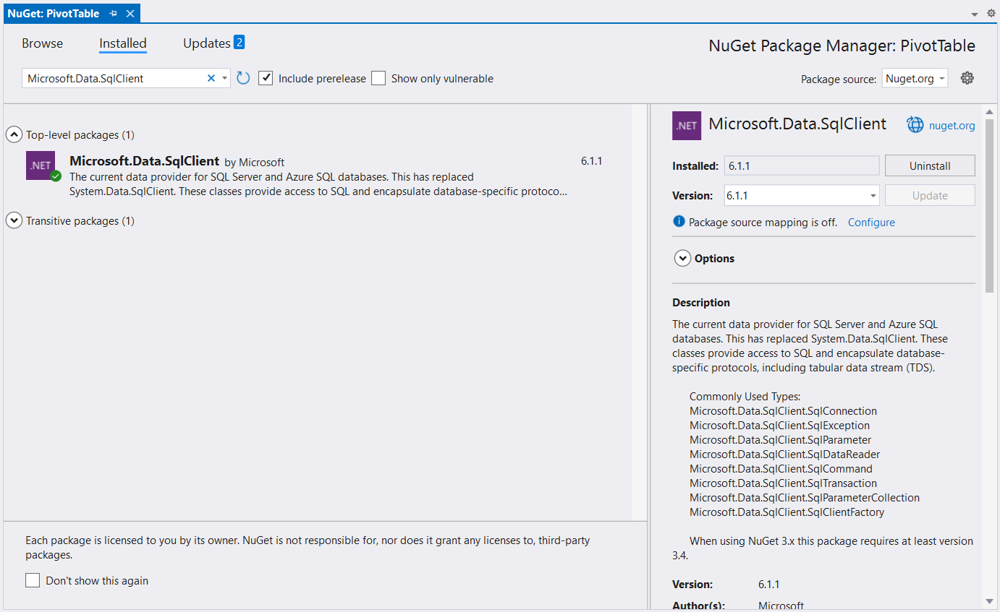
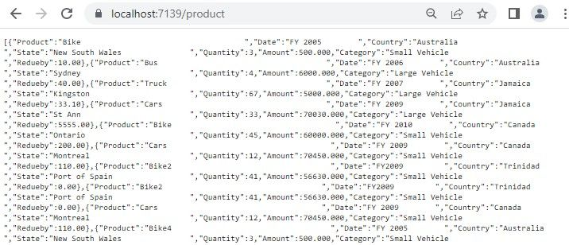

# Microsoft SQL Server data binding in React Pivot Table

This section describes how to retrieve data from SQL Server database using [Microsoft.Data.SqlClient](https://learn.microsoft.com/en-us/dotnet/api/microsoft.data.sqlclient) and bind it to the Pivot Table via a Web API controller.

> **Note:** The legacy `System.Data.SqlClient` namespace is part of .NET Framework. For ASP.NET Core, use the `Microsoft.Data.SqlClient` package and `using Microsoft.Data.SqlClient;`.

## Steps to Connect the SQL Server Database via Web API Application

### Step 1: Create the ASP.NET Core Web API Project
Create a new **ASP.NET Core Web API** project named **PivotController** using Visual Studio or the .NET CLI:

```bash
dotnet new webapi -n PivotController
cd PivotController
```

### Step 2: Install the Required NuGet Packages
1. Open the **NuGet Package Manager** in your project solution.
2. Install the [Microsoft.Data.SqlClient](https://www.nuget.org/packages/Microsoft.Data.SqlClient) package for SQL Server connectivity.
3. Install the [Newtonsoft.Json](https://www.nuget.org/packages/Newtonsoft.Json) package (required by `JsonConvert.SerializeObject`).

```bash
dotnet add package Microsoft.Data.SqlClient
dotnet add package Newtonsoft.Json
```



### Step 3: Connect to SQL Server and Retrieve Data
In the **PivotController.cs** file (under the **Controllers** folder), the `Microsoft.Data.SqlClient` library is used to connect to a Microsoft SQL Server database and retrieve data for the Pivot Table.

1. **Establish Connection**: Use **SqlConnection** with a valid connection string to connect to the SQL Server database.
2. **Query and Fetch Data**: Execute a SQL query (e.g., `SELECT * FROM table1`) using **SqlCommand** to retrieve data for the Pivot Table.
3. **Structure the Data**: Use the **Fill** method of **SqlDataAdapter** to populate query results into a **DataTable** for JSON serialization.

> **Schema dependency:** The pivot report below references the fields `Product`, `Quantity`, `Amount`, `Country`, and `State`. Make sure your table contains these columns (rename `table1` in the SQL query to match your table), otherwise the Pivot Table will be empty.

> **Connection string example:** `Server=localhost;Database=your_database;User Id=your_user;Password=your_password;TrustServerCertificate=True;`

```csharp
using Microsoft.AspNetCore.Mvc;
using Microsoft.Data.SqlClient;
using Newtonsoft.Json;
using System.Data;

namespace PivotController.Controllers
{
     [ApiController]
     [Route("[controller]")]
     public class PivotController : ControllerBase
     {
          [HttpGet(Name = "GetSQLResult")]
          public object Get()
          {
               return JsonConvert.SerializeObject(FetchSQLResult());
          }

          private static DataTable FetchSQLResult()
          {
               string conSTR = @"<Enter your valid connection string here>";
               string xquery = "SELECT * FROM table1";
               SqlConnection sqlConnection = new(conSTR);
               sqlConnection.Open();
               SqlCommand cmd = new(xquery, sqlConnection);
               SqlDataAdapter dataAdapter = new(cmd);
               DataTable dataTable = new();
               dataAdapter.Fill(dataTable);
               return dataTable;
          }
     }
}
```

> Replace `<Enter your valid connection string here>` with the actual connection string for your SQL Server database. The Microsoft.Data.SqlClient package supports both SQL Server Authentication (`User Id`/`Password`) and Windows Authentication (`Integrated Security=true`).

### Step 4: Enable CORS in the Web API
React (typically `http://localhost:3000` or `http://localhost:5173`) running on a different origin than the Web API will be blocked by CORS unless the API explicitly allows it. In **Program.cs**, register and apply a CORS policy:

```csharp
var builder = WebApplication.CreateBuilder(args);

builder.Services.AddControllers();
builder.Services.AddCors(options =>
{
    options.AddPolicy("AllowReactApp", policy =>
        policy.WithOrigins("http://localhost:3000", "http://localhost:5173")
              .AllowAnyHeader()
              .AllowAnyMethod());
});

var app = builder.Build();

app.UseCors("AllowReactApp"); // Must be called before MapControllers.
app.MapControllers();

app.Run();
```

### Step 5: Run the Web API Application
1. Build and run the **PivotController** application.
2. The application will be hosted at `https://localhost:7139/` by default (the port number is defined in **Properties/launchSettings.json** and may vary depending on your configuration).

### Step 6: Access the JSON Data
1. Access the Web API endpoint at `https://localhost:7139/Pivot` to view the JSON data retrieved from the SQL Server database (note: ASP.NET Core routing for `[Route("[controller]")]` with the class name `PivotController` produces the lowercase path `/pivot`; the route is case-insensitive by default).
2. The browser will display the JSON data, as shown below, ready to be used by the Pivot Table.



## Connecting the Pivot Table to the Hosted Web API URL

This section explains how to connect the Pivot Table component to a Microsoft SQL Server database by retrieving data from the Web API service created in the previous section.

### Step 1: Set Up the React Pivot Table
1. Create a new React project with the Pivot Table dependency by following the [Getting Started](https://ej2.syncfusion.com/react/documentation/pivotview/getting-started) documentation.
2. A complete reference sample is also available in the [GitHub](https://github.com/SyncfusionExamples/how-to-bind-SQL-database-to-pivot-table) repository.

### Step 2: Configure the Web API URL in the Pivot Table
1. In the **App.tsx** or **App.jsx** file, configure the Pivot Table to use the hosted Web API URL (`https://localhost:7139/pivot`) by setting the [url](https://ej2.syncfusion.com/react/documentation/api/pivotview/datasourcesettings#url) property within the [dataSourceSettings](https://ej2.syncfusion.com/react/documentation/api/pivotview/datasourcesettings) object.
2. Below is the sample code to configure the Pivot Table to fetch data from the Web API:

```typescript
import { PivotViewComponent, FieldList, Inject } from '@syncfusion/ej2-react-pivotview';
import * as React from 'react';
import './App.css';

function App() {
     let dataSourceSettings = {
          url: 'https://localhost:7139/pivot'
          //Other codes here...
     };

     return (<PivotViewComponent id='PivotView' height={350} dataSourceSettings={dataSourceSettings} showFieldList={true}>
     <Inject services={[FieldList]}/></PivotViewComponent>);
};
export default App;
```

### Step 3: Define the Pivot Table Report
1. Configure the Pivot Table report in the **App.tsx** or **App.jsx** file to structure the data retrieved from the SQL Server database.
2. Add fields to the [rows](https://ej2.syncfusion.com/react/documentation/api/pivotview/datasourcesettings#rows), [columns](https://ej2.syncfusion.com/react/documentation/api/pivotview/datasourcesettings#columns), [values](https://ej2.syncfusion.com/react/documentation/api/pivotview/datasourcesettings#values), and [filters](https://ej2.syncfusion.com/react/documentation/api/pivotview/datasourcesettings#filters) properties of [dataSourceSettings](https://ej2.syncfusion.com/react/documentation/api/pivotview/datasourcesettings) to define how data fields are organized and aggregated in the Pivot Table.
3. Enable the field list by setting the [showFieldList](https://ej2.syncfusion.com/react/documentation/api/pivotview/index-default#showfieldlist) property to **true** and including the `FieldList` module in the services section. This allows users to dynamically add or rearrange fields across the columns, rows, and values axes using an interactive user interface.

Here’s the updated sample code for **App.jsx** with the report configuration and field list support:

```typescript
import { PivotViewComponent, FieldList, Inject } from '@syncfusion/ej2-react-pivotview';
import * as React from 'react';
import './App.css';

function App() {
     let dataSourceSettings = {
          url: 'https://localhost:7139/pivot',
          enableSorting: true,
          expandAll: false,
          columns: [{ name: 'Product' }],
          values: [{ name: 'Quantity' }, { name: 'Amount', caption: 'Sold Amount' }],
          rows: [{ name: 'Country' }, { name: 'State' }],
          formatSettings: [{ name: 'Amount', format: 'C0' }],
          filters: []
     };

     return (<PivotViewComponent id='PivotView' height={350} dataSourceSettings={dataSourceSettings} showFieldList={true}>
     <Inject services={[FieldList]}/></PivotViewComponent>);
};
export default App;
```

### Step 4: Run and Verify the Pivot Table
1. Run the React application.
2. The Pivot Table will display the data fetched from the SQL Server database via the Web API, structured according to the defined report.
3. The resulting Pivot Table will look like this:


### Additional Resources
Explore a complete example of the React Pivot Table integrated with an ASP.NET Core Web Application to fetch data from a SQL Server database in the [GitHub](https://github.com/SyncfusionExamples/how-to-bind-SQL-database-to-pivot-table) repository.