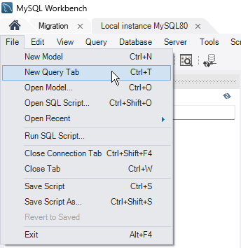
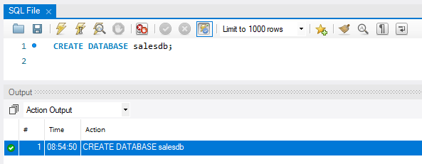
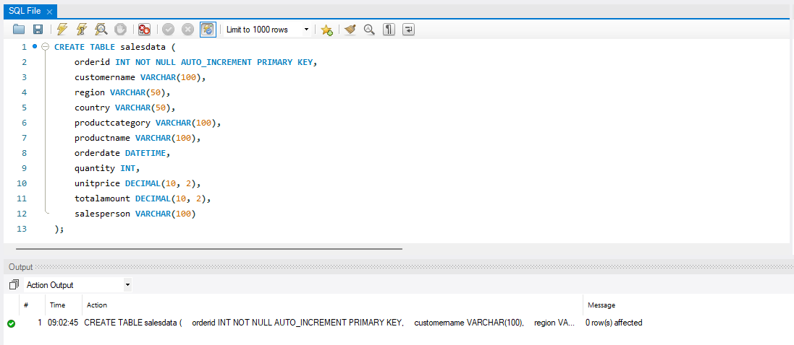
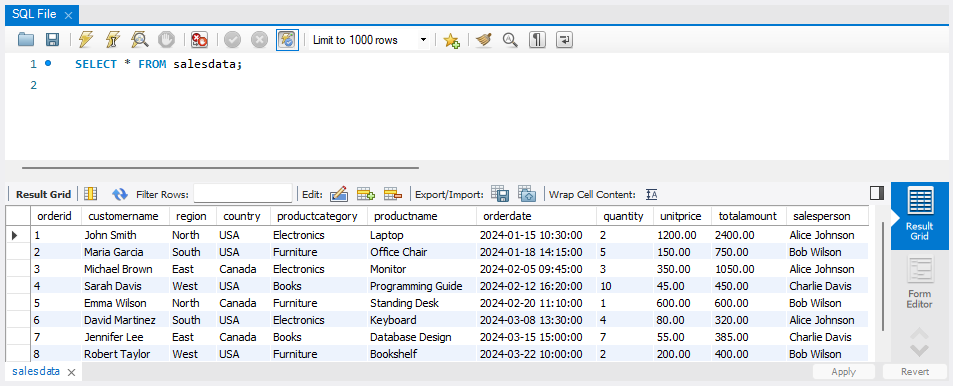
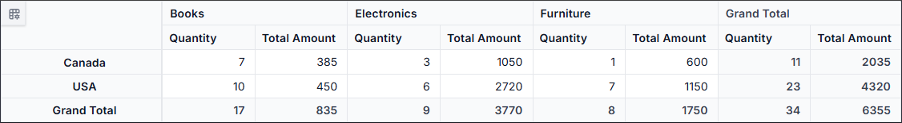
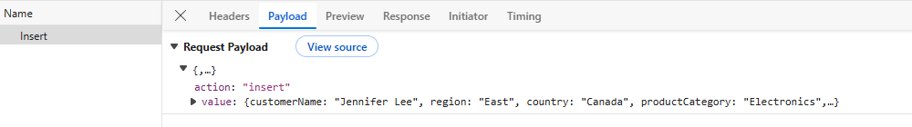
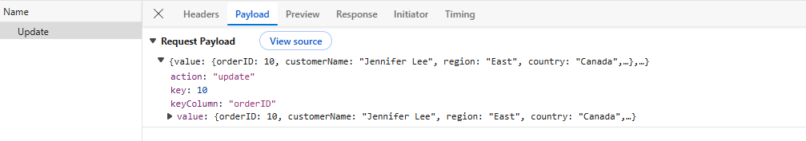
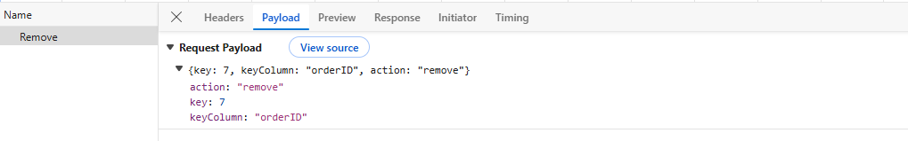
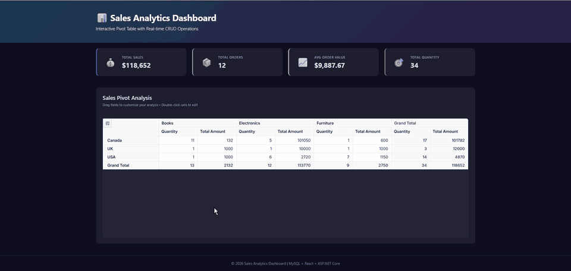

# Connecting MySQL to React Pivot Table Using ASP.NET Core Web API

The Syncfusion<sup style="font-size:70%">&reg;</sup> React Pivot Table supports binding data from a MySQL database through an ASP.NET Core Web API using [MySqlConnector](https://www.nuget.org/packages/MySqlConnector/). This modern architecture provides a secure and scalable way to access the database from a backend service while enabling efficient server‑side processing. By leveraging React for the UI and ASP.NET Core with MySqlConnector for data access, applications maintain a clear separation between presentation and data layers and retain full control over MySQL interactions.

## What is MySqlConnector?

[MySqlConnector](https://www.nuget.org/packages/MySqlConnector/) is a modern, fully managed ADO.NET data provider for MySQL. It is a high‑performance, open‑source alternative to Oracle's [MySql.Data](https://www.nuget.org/packages/MySql.Data/) driver and is widely used in ASP.NET Core applications for MySQL connectivity. MySqlConnector supports asynchronous operations, dependency injection, and is fully compatible with the Syncfusion<sup style="font-size:70%">&reg;</sup> server‑side helpers for processing data operations.

**Key benefits of MySqlConnector:**

- **High performance**: Optimized connection pooling and async I/O for fast, scalable web APIs.
- **Async support**: First‑class support for `async`/`await` patterns improves scalability under load.
- **Modern .NET**: Supports current .NET releases and integrates with ASP.NET Core applications.
- **Parameterized commands**: Supports parameterized queries that developers can use to prevent SQL injection.
- **Fully managed**: 100% managed code, no native dependencies, easy to deploy on Windows, Linux, and macOS.
- **Open-source and actively maintained**: Strong community backing with regular updates.

## Prerequisites

Ensure the following software and packages are installed before proceeding:

| Software/Package | Version | Purpose |
| ------------------ | -------- | --------- |
| Node.js | 18.x or later | React development runtime |
| React | 18.x or later | Create and run React apps |
| .NET SDK | 8.0 or later | Build and run ASP.NET Core Web API |
| MySQL Server | 8.0 or later | Database server |
| MySQL Workbench | 8.0 or later | Create and inspect the database |
| MySqlConnector (NuGet) | 2.3.7 or later | MySQL connectivity |
| Syncfusion.EJ2.AspNet.Core | 34.1.32 or later | Server helpers (DataManagerRequest, DataOperations) |
| @syncfusion/ej2-react-pivotview | 34.1.32 or later | React Pivot Table component |

## Setting up the MySQL environment

First, create the **MySQL database** structure required to store sales records for the Pivot Table.

### What is MySQL?

MySQL is one of the world's most popular open‑source relational database management systems. It powers a wide range of web, enterprise, and cloud applications due to its reliability, performance, and ease of use. MySQL uses structured query language (SQL) for managing data and is supported by a rich ecosystem of tools, including MySQL Workbench.

### Step 1: Create the MySQL Database

**Instructions:**

1. **Install MySQL**: If not already installed, download MySQL from [mysql.com](https://dev.mysql.com/downloads/).
2. **Open MySQL Workbench**: MySQL Workbench is a unified visual tool for database architects, developers, and DBAs. After installation, open MySQL Workbench and connect to your local MySQL server.

**Using MySQL Workbench:**

1. **Connect to the Server**: In the MySQL Workbench home screen, click on your local instance (for example, **Local instance MySQL80**) to open the SQL editor.
2. **Open Query Editor**: Click the **File → New Query Tab** (or press <kbd>Ctrl</kbd>+<kbd>T</kbd>) to open a new SQL editor window.


3. **Create the Database**: Paste the following SQL script into the query editor and click the **Execute** button (lightning bolt icon, or press <kbd>Ctrl</kbd>+<kbd>Enter</kbd>):

```sql
-- Create Database
CREATE DATABASE salesdb;
```

After successful execution, refresh the **Schemas** panel to see the new `salesdb` database.



### Step 2: Create the Sales Data Table

After creating the database, you need to create a table to store sales records. This table will hold all the data that the Pivot Table will display and analyze.

**Using MySQL Workbench:**

1. **Set the Default Schema**: In the left **Navigator** panel, right-click on **salesdb** and choose **Set as Default Schema** from the context menu. The database name will appear in bold to indicate it is now the default schema for queries.
2. **Open Query Editor**: Use the existing or a new query tab.
3. **Create the Table**: Paste the following SQL script into the query editor and click **Execute**:

```sql
-- Create SalesData Table
CREATE TABLE salesdata (
    orderid INT NOT NULL AUTO_INCREMENT PRIMARY KEY,
    customername VARCHAR(100),
    region VARCHAR(50),
    country VARCHAR(50),
    productcategory VARCHAR(100),
    productname VARCHAR(100),
    orderdate DATETIME,
    quantity INT,
    unitprice DECIMAL(10, 2),
    totalamount DECIMAL(10, 2),
    salesperson VARCHAR(100)
);
```

You should see a success message confirming that the table was created.

The demonstration schema permits null values for most columns, while the later API treats `customername`, `country`, `orderdate`, and `quantity` as required. For production use, align database `NOT NULL` and `CHECK` constraints with the API validation rules so invalid records cannot bypass the API.



**Table Structure Explanation:**

| Column | Data Type | Description |
|--------|-----------|-------------|
| orderid | INT AUTO_INCREMENT | Unique order identifier (auto-incremented primary key) |
| customername | VARCHAR(100) | Name of the customer who placed the order |
| region | VARCHAR(50) | Geographic region of the customer |
| country | VARCHAR(50) | Country where the order was placed |
| productcategory | VARCHAR(100) | Category of the product (e.g., Electronics, Furniture) |
| productname | VARCHAR(100) | Name of the product ordered |
| orderdate | DATETIME | Date and time when the order was placed (includes both date and time values) |
| quantity | INT | Number of units ordered |
| unitprice | DECIMAL(10, 2) | Price per unit of the product |
| totalamount | DECIMAL(10, 2) | Total cost of the order (quantity × unitprice) |
| salesperson | VARCHAR(100) | Name of the sales representative handling the order |

### Step 3: Insert Sample Data

Insert sample sales data into the table. This data will be used to populate the Pivot Table.

**Using MySQL Workbench:**

1. **Open Query Editor**: With **salesdb** still selected, open a new Query tab (or use the existing one).
2. **Insert Sample Data**: Paste the following SQL script into the query editor and click **Execute**:

```sql
-- Insert Sample Data
INSERT INTO salesdata (customername, region, country, productcategory, productname, orderdate, quantity, unitprice, totalamount, salesperson)
VALUES
('John Smith', 'North', 'USA', 'Electronics', 'Laptop', '2024-01-15 10:30:00', 2, 1200.00, 2400.00, 'Alice Johnson'),
('Maria Garcia', 'South', 'USA', 'Furniture', 'Office Chair', '2024-01-18 14:15:00', 5, 150.00, 750.00, 'Bob Wilson'),
('Michael Brown', 'East', 'Canada', 'Electronics', 'Monitor', '2024-02-05 09:45:00', 3, 350.00, 1050.00, 'Alice Johnson'),
('Sarah Davis', 'West', 'USA', 'Books', 'Programming Guide', '2024-02-12 16:20:00', 10, 45.00, 450.00, 'Charlie Davis'),
('Emma Wilson', 'North', 'Canada', 'Furniture', 'Standing Desk', '2024-02-20 11:10:00', 1, 600.00, 600.00, 'Bob Wilson'),
('David Martinez', 'South', 'USA', 'Electronics', 'Keyboard', '2024-03-08 13:30:00', 4, 80.00, 320.00, 'Alice Johnson'),
('Jennifer Lee', 'East', 'Canada', 'Books', 'Database Design', '2024-03-15 15:00:00', 7, 55.00, 385.00, 'Charlie Davis'),
('Robert Taylor', 'West', 'USA', 'Furniture', 'Bookshelf', '2024-03-22 10:00:00', 2, 200.00, 400.00, 'Bob Wilson');
```

You should see a success message showing "8 row(s) affected", indicating that 8 rows were successfully inserted.

**Verify the Data:**

To confirm the data was inserted correctly, run the following verification query in the **Query Editor**:

```sql
SELECT * FROM salesdata;
```

You should see all 8 sample records displayed in the result grid.



## Setting up the ASP.NET Core Web API

Now that the MySQL database is configured, let's create the backend API that the React Pivot Table will communicate with.

### Step 1: Create the ASP.NET Core Web API project

To connect the Syncfusion<sup style="font-size:70%">&reg;</sup> React Pivot Table to MySQL, the **ASP.NET Core Web API server** must be configured with the required NuGet packages. The server application is responsible for handling HTTP requests from the Pivot Table and accessing data from MySQL.

**To create a new ASP.NET Core Web API project using the .NET CLI:**

Execute the following commands in your terminal:

```bash
dotnet new webapi --use-controllers -f net8.0 -n PivotTable_MySQL.Server
cd PivotTable_MySQL.Server
```

**Install Required NuGet Packages:**

Add the MySQL client library and Syncfusion<sup style="font-size:70%">&reg;</sup> server‑side helper packages:

```bash
dotnet add package MySqlConnector --version 2.3.7
dotnet add package Syncfusion.EJ2.AspNet.Core --version 34.1.32
```

The Web API exposes HTTP endpoints that are used by the Pivot Table to perform read and data modification operations. The Syncfusion<sup style="font-size:70%">&reg;</sup> server helper package provides the required types for processing pivot requests and applying data operations on the server.

### Step 2: Configure the Connection String

The connection string contains the information needed to connect to MySQL. For local development, use [.NET Secret Manager](https://learn.microsoft.com/en-us/aspnet/core/security/app-secrets) so that the password is not committed to source control:

Before configuring the application, create a dedicated MySQL account for `salesdb` and grant it only `SELECT`, `INSERT`, `UPDATE`, and `DELETE` permissions. Do not use the MySQL `root` account. For account-management instructions, refer to the [MySQL account management documentation](https://dev.mysql.com/doc/refman/8.0/en/access-control.html).

```bash
dotnet user-secrets init
dotnet user-secrets set "ConnectionStrings:SalesDb" "Server=localhost;Port=3306;Database=salesdb;User Id=your_app_user;Password=your_password;AllowMultipleQueries=true;"
```

> **MySqlConnector compatibility:** MySqlConnector always permits batch statements and does not support `AllowMultipleQueries` as a connection-string option. When substituting your credentials, omit that option; the `INSERT …; SELECT LAST_INSERT_ID();` command still works.

Use a restricted MySQL account with only the permissions required for `salesdb`. Use a managed secret store and require TLS in production.

**Connection String Components:**

| Component | Description | Example |
|-----------|-------------|----------|
| Server | MySQL server address | `localhost` (for local) or `192.168.1.100` (for remote) |
| Port | MySQL port number | `3306` (default) |
| Database | Database name | `salesdb` |
| User Id | Restricted MySQL application account | `your_app_user` |
| Password | User password | Your MySQL password set during installation |

For production connections, configure and verify TLS with an appropriate `SslMode`, such as `VerifyFull`, and provide the required CA certificate. See the [MySqlConnector SSL/TLS options](https://mysqlconnector.net/connection-options/#ssl-tls-options).

Replace all placeholder values, then verify the account can connect to `salesdb` and perform only the four granted operations before continuing.

### Step 3: Configure Program.cs

Update **Program.cs** to enable controller routing and allow requests from the React development server:

```csharp
var builder = WebApplication.CreateBuilder(args);

// Add services to the container
builder.Services.AddControllers();

// Enable CORS to allow requests from React client
builder.Services.AddCors(options =>
{
    // Vite serves the React app over plain HTTP on http://localhost:5173
    // while the API listens on https://localhost:7086. Browsers send the
    // request from the HTTP origin and trust the API's HTTPS certificate
    // (after running `dotnet dev-certs https --trust`).
    options.AddPolicy("ReactClient",
        policy => policy
            .WithOrigins("http://localhost:5173")
            .AllowAnyMethod()
            .AllowAnyHeader());
});

var app = builder.Build();

app.UseHttpsRedirection();
app.UseCors("ReactClient");
app.UseAuthorization();
app.MapControllers();

app.Run();
```

**What's Happening:**

1. **AddControllers**: Registers controller support for the API endpoints.
2. **AddCors**: Allows the React development origin to call the API.
3. **ReactClient policy**: Restricts cross-origin requests to `http://localhost:5173`; replace this with the deployed client origin in production.

### Step 4: Create the Data Model and Controller

Create a new file named **SalesController.cs** in the **Controllers** folder. At this stage, the file contains the data model and read endpoints. The CRUD section later adds the modification endpoints.

```csharp
using Microsoft.AspNetCore.Mvc;
using System.ComponentModel.DataAnnotations;
using System.Data;
using Syncfusion.EJ2.Base;
using MySqlConnector;

namespace PivotTable_MySQL.Server.Controllers
{
    [ApiController]
    public class SalesController : ControllerBase
    {
        private readonly string _connectionString;

        /// <summary>
        /// Constructor that injects the configuration to retrieve the connection string.
        /// </summary>
        public SalesController(IConfiguration configuration)
        {
            _connectionString = configuration.GetConnectionString("SalesDb")
                ?? throw new InvalidOperationException(
                    "Connection string 'SalesDb' is not configured.");
        }

        /// <summary>
        /// Handles GET requests to retrieve all sales data for the Pivot Table.
        /// This endpoint is called when the Pivot Table first loads or refreshes data.
        /// </summary>
        /// <returns>Returns a list of all sales records from the database.</returns>
        [HttpGet]
        [Route("api/[controller]")]
        public List<SalesData> GetSalesData()
        {
            const string Query = @"SELECT * FROM salesdata ORDER BY orderid;";

            using var Connection = new MySqlConnection(_connectionString);
            Connection.Open();

            using var Command = new MySqlCommand(Query, Connection);
            using var DataAdapter = new MySqlDataAdapter(Command);
            var DataTable = new DataTable();
            DataAdapter.Fill(DataTable);

            // Convert database rows to SalesData objects
            var DataSource = (from DataRow Data in DataTable.Rows
                              select new SalesData
                              {
                                  OrderID = Data["orderid"] == DBNull.Value ? (int?)null : Convert.ToInt32(Data["orderid"]),
                                  CustomerName = Data["customername"] == DBNull.Value ? null : Data["customername"].ToString(),
                                  Region = Data["region"] == DBNull.Value ? null : Data["region"].ToString(),
                                  Country = Data["country"] == DBNull.Value ? null : Data["country"].ToString(),
                                  ProductCategory = Data["productcategory"] == DBNull.Value ? null : Data["productcategory"].ToString(),
                                  ProductName = Data["productname"] == DBNull.Value ? null : Data["productname"].ToString(),
                                  OrderDate = Data["orderdate"] == DBNull.Value ? (DateTime?)null : Convert.ToDateTime(Data["orderdate"]),
                                  Quantity = Data["quantity"] == DBNull.Value ? (int?)null : Convert.ToInt32(Data["quantity"]),
                                  UnitPrice = Data["unitprice"] == DBNull.Value ? 0m : Convert.ToDecimal(Data["unitprice"]),
                                  TotalAmount = Data["totalamount"] == DBNull.Value ? 0m : Convert.ToDecimal(Data["totalamount"]),
                                  SalesPerson = Data["salesperson"] == DBNull.Value ? null : Data["salesperson"].ToString()
                              }).ToList();

            return DataSource;
        }

        /// <summary>
        /// Handles POST requests from the Pivot Table DataManager.
        /// Processes the data request and returns formatted data for the component.
        /// </summary>
        /// <param name="DataManagerRequest">Contains the details of the data operation requested.</param>
        /// <returns>Returns the data records along with the total count.</returns>
        [HttpPost]
        [Route("api/[controller]")]
        public object Post([FromBody] DataManagerRequest DataManagerRequest)
        {
            // Retrieve sales data and apply supported DataManager operations
            IQueryable<SalesData> DataSource = GetSalesData().AsQueryable();

            if (DataManagerRequest.Search?.Count > 0)
                DataSource = DataOperations.PerformSearching(
                    DataSource, DataManagerRequest.Search).Cast<SalesData>();

            if (DataManagerRequest.Where?.Count > 0)
                DataSource = DataOperations.PerformFiltering(
                    DataSource,
                    DataManagerRequest.Where,
                    DataManagerRequest.Where[0].Operator).Cast<SalesData>();

            if (DataManagerRequest.Sorted?.Count > 0)
                DataSource = DataOperations.PerformSorting(
                    DataSource, DataManagerRequest.Sorted).Cast<SalesData>();

            int totalRecordsCount = DataSource.Count();

            if (DataManagerRequest.Skip != 0)
                DataSource = DataOperations.PerformSkip(
                    DataSource, DataManagerRequest.Skip).Cast<SalesData>();

            if (DataManagerRequest.Take != 0)
                DataSource = DataOperations.PerformTake(
                    DataSource, DataManagerRequest.Take).Cast<SalesData>();

            return new
            {
                result = DataSource.ToList(),
                count = totalRecordsCount
            };
        }

        /// <summary>
        /// Data model that represents the structure of a sales record.
        /// This class maps to the columns in the 'salesdata' table in MySQL.
        /// </summary>
        public class SalesData
        {
            /// <summary>
            /// Unique identifier for each order (Primary Key).
            /// The [Key] attribute marks this as the primary key for CRUD operations.
            /// </summary>
            [Key]
            public int? OrderID { get; set; }

            /// <summary>
            /// Name of the customer who placed the order.
            /// </summary>
            public string? CustomerName { get; set; }

            /// <summary>
            /// Geographic region where the customer is located.
            /// Useful for regional analysis in the pivot table.
            /// </summary>
            public string? Region { get; set; }

            /// <summary>
            /// Country where the order was placed.
            /// </summary>
            public string? Country { get; set; }

            /// <summary>
            /// Category of the product (e.g., Electronics, Furniture).
            /// Used as a dimension in the pivot table analysis.
            /// </summary>
            public string? ProductCategory { get; set; }

            /// <summary>
            /// Name of the specific product ordered.
            /// </summary>
            public string? ProductName { get; set; }

            /// <summary>
            /// Date when the order was placed.
            /// </summary>
            public DateTime? OrderDate { get; set; }

            /// <summary>
            /// Number of units ordered.
            /// </summary>
            public int? Quantity { get; set; }

            /// <summary>
            /// Price per unit of the product.
            /// </summary>
            public decimal UnitPrice { get; set; }

            /// <summary>
            /// Total cost of the order (typically quantity × unitprice).
            /// Used as a measure/aggregate value in pivot table analysis.
            /// </summary>
            public decimal TotalAmount { get; set; }

            /// <summary>
            /// Name of the sales representative who handled the order.
            /// </summary>
            public string? SalesPerson { get; set; }
        }
    }
}
```

**Explanation:**

- **GetSalesData()**: Connects to MySQL, executes a SELECT query, and returns all sales records
- **Post()**: Handles requests from the React Pivot Table and returns data with a total count
- **SalesData class**: Represents the structure of each sales record with XML documentation for clarity. The `[Key]` attribute supplies server-side model metadata; the client-side primary key is configured separately in `beginDrillThrough`.

## Setting up the React Pivot Table Client

Now that the backend API is ready, let's create the React client application that displays the Pivot Table and connects to the MySQL data.

### Step 1: Create the React Client Application

From the directory that will contain both projects, open a Visual Studio Code terminal or Command Prompt and run the following commands to create a React application. If the terminal is still in **PivotTable_MySQL.Server**, return to its parent directory first.

```bash
npm create vite@latest pivottable_mysql.client -- --template react-ts
cd pivottable_mysql.client
npm install
```

### Step 2: Install Syncfusion Pivot Table Package

Install the Syncfusion React Pivot Table component and its dependencies:

```bash
npm install @syncfusion/ej2-react-pivotview
```

The application also imports `@syncfusion/ej2-data` directly. Ensure it is installed as a direct dependency at a version compatible with the Pivot Table package. For reproducible builds, pin the Pivot Table, DataManager, and theme packages to the compatible versions listed in the prerequisites instead of relying on the current npm `latest` versions.

Register your Syncfusion license by following the [license key registration documentation](https://ej2.syncfusion.com/react/documentation/licensing/license-key-registration). Add the license key to **src/main.tsx** before rendering `App`:

```typescript
import { registerLicense } from '@syncfusion/ej2-base';

registerLicense('YOUR-LICENSE-KEY');
```

### Step 3: Import Syncfusion CSS styles

Install the Tailwind 3 theme package and replace the contents of **src/index.css** with the Pivot Table theme import:

```bash
npm install @syncfusion/ej2-tailwind3-theme --save
```

```css
@import '../node_modules/@syncfusion/ej2-tailwind3-theme/styles/pivotview/index.css';
```

The "tailwind3" theme is applied for reference. For other theme options or customization, refer to the [Syncfusion<sup style="font-size:70%">&reg;</sup> React Appearance](https://ej2.syncfusion.com/react/documentation/appearance/theme-studio) documentation.

### Step 4: Add the Pivot Table Component - Display Data

The React Pivot Table component retrieves and displays data from the MySQL database through the ASP.NET Core Web API. Update your **src/App.tsx** file with the following code:

```typescript
import { FieldList, Inject, PivotViewComponent } from '@syncfusion/ej2-react-pivotview';
import { DataManager, UrlAdaptor } from '@syncfusion/ej2-data';
import './App.css';

function App() {
  let pivotObj: PivotViewComponent;

  // Initialize DataManager with the Web API endpoint
  let data: DataManager = new DataManager({
    url: 'https://localhost:7086/api/Sales',
    adaptor: new UrlAdaptor
  });

  // Configure the Pivot Table data structure
  const dataSourceSettings = {
    dataSource: data,
    expandAll: true,
    rows: [{ name: 'country', caption: 'Country' }],
    columns: [{ name: 'productCategory', caption: 'Product Category' }],
    values: [{ name: 'quantity', caption: 'Quantity' }, { name: 'totalAmount', caption: 'Total Amount' }],
    filters: [],
    fieldMapping: [{ name: 'orderDate', caption: 'Order Date' }, { name: 'orderID', caption: 'Order ID' }, { name: 'customerName', caption: 'Customer Name' }, { name: 'region', caption: 'Region' }, { name: 'salesPerson', caption: 'Sales Person' }, { name: 'productName', caption: 'Product Name' }, { name: 'unitPrice', caption: 'Unit Price' }]
  }

  return (
    <PivotViewComponent
      id='PivotView'
      ref={(scope: any) => { pivotObj = scope; }}
      height={350}
      dataSourceSettings={dataSourceSettings}
      showFieldList={true}>
      <Inject services={[FieldList]}/>
    </PivotViewComponent>
  );
}

export default App;
```

**Code Explanation:**

- [DataManager](https://ej2.syncfusion.com/react/documentation/data/getting-started): Connects to the ASP.NET Core Web API endpoint at `https://localhost:7086/api/Sales`. Replace the example port with the HTTPS URL printed by `dotnet run`.

- [UrlAdaptor](https://ej2.syncfusion.com/react/documentation/data/adaptors/url-adaptor): Uses the standard URL adaptor to automatically send requests to and receive responses from the backend API.

- [dataSourceSettings](https://ej2.syncfusion.com/react/documentation/api/pivotview/index-default#datasourcesettings): Defines the Pivot Table layout:
  - [rows](https://ej2.syncfusion.com/react/documentation/api/pivotview/datasourcesettingsmodel#rows): Displays **country** as row headers
  - [columns](https://ej2.syncfusion.com/react/documentation/api/pivotview/datasourcesettingsmodel#columns): Displays **productCategory** as column headers
  - [values](https://ej2.syncfusion.com/react/documentation/api/pivotview/datasourcesettingsmodel#values): Aggregates **quantity** and **totalAmount** based on rows and columns
- [fieldMapping](https://ej2.syncfusion.com/react/documentation/api/pivotview/datasourcesettingsmodel#fieldmapping): Defines captions for fields that are not bound in pivot reports.
- [showFieldList](https://ej2.syncfusion.com/react/documentation/api/pivotview/index-default#showfieldlist): Displays the field list panel allowing users to rearrange fields

- [PivotViewComponent](https://ej2.syncfusion.com/react/documentation/api/pivotview/index-default): Renders the Pivot Table with the configured data and layout.

### Step 5: Run the Applications

**Before the first run**, trust the local HTTPS certificate so the browser accepts the API over HTTPS:

```bash
dotnet dev-certs https --trust
```

**Start the ASP.NET Core API server first**, then start the React dev server:

Open a terminal in the **PivotTable_MySQL.Server** folder and run the API with its HTTPS launch profile:

```bash
dotnet run
```

If the plain command does not select the HTTPS profile, run `dotnet run --launch-profile https` instead.

The terminal prints the HTTP and HTTPS addresses selected from `launchSettings.json`. The remaining examples use `https://localhost:7086`; replace this port with the HTTPS port printed by your server in the initial `url`, `insertUrl`, `updateUrl`, and `removeUrl` settings. If Vite uses an origin other than `http://localhost:5173`, update the `WithOrigins` value in `Program.cs` as well.

**In a separate terminal, start the React development server:**

Open a terminal in the **pivottable_mysql.client** folder and run:

```bash
npm run dev
```

The React application normally starts at `http://localhost:5173`. Open the URL printed by Vite to see the Pivot Table. If the local HTTPS certificate is not trusted, run `dotnet dev-certs https --trust`.



## CRUD Operations with Pivot Table

This section describes how to enable Create, Read, Update, and Delete (CRUD) operations in the Pivot Table, allowing users to modify the underlying database records directly through the built-in editing pop-up.

### Understanding CRUD in Pivot Table

The Syncfusion React Pivot Table supports CRUD operations through [DataManager](https://ej2.syncfusion.com/react/documentation/data/getting-started) with [UrlAdaptor](https://ej2.syncfusion.com/react/documentation/data/adaptors/url-adaptor). This enables:

- **Create**: Add new sales records through the Pivot Table editing pop-up
- **Read**: Display data from the database (already implemented)
- **Update**: Edit existing records in place
- **Delete**: Remove records from the database

When a user performs any edit action (add, update, or delete), the Pivot Table sends an HTTP request using [DataManager](https://ej2.syncfusion.com/react/documentation/data/getting-started) to the corresponding server endpoint, which processes the operation and updates the MySQL database.

### Implement Server-Side CRUD Methods

Extend your **SalesController.cs** with Insert, Update, and Remove methods. Place all three methods inside `SalesController`, before the controller's closing brace shown in the earlier complete sample. Add the `CRUDModel<T>` declaration after `SalesController` but before the namespace's closing brace. These methods will be called automatically when users edit data in the Pivot Table editing pop-up.

The snippets use the following HTTP contract: Insert and Update receive a JSON object whose `value` property contains one sales record; Remove receives a JSON object whose `key` property contains the `OrderID`. Successful Insert and Update responses contain `key`, `value`, and `action`; a successful Remove response contains `key`, `action`, and `deleted`. Validation failures return HTTP 400, missing records should return HTTP 404, and unexpected server failures return HTTP 500.

#### Insert

To add a new record, double-click a pivot cell to open the editing pop-up and click the **Add** button to create a new empty row. Enter the required data in the new row fields, then click the **Update** button to save the record to the **salesdata** table using the following POST method:

```csharp
/// <summary>
/// Inserts a new sales record into the database.
/// This method is called when a new row is added in the Pivot Table.
/// </summary>
/// <param name="value">Contains the new sales data to insert.</param>
/// <returns>Returns the inserted record with its new OrderID.</returns>
[HttpPost]
[Route("api/[controller]/Insert")]
public async Task<IActionResult> Insert([FromBody] CRUDModel<SalesData> value)
{
    if (value?.value == null)
        return BadRequest("A sales record is required.");

    if (string.IsNullOrWhiteSpace(value.value.CustomerName) ||
        string.IsNullOrWhiteSpace(value.value.Country) ||
        value.value.OrderDate == null ||
        value.value.Quantity == null ||
        value.value.Quantity <= 0 ||
        value.value.UnitPrice < 0)
    {
        return BadRequest("Required fields, a positive quantity, and a non-negative unit price are required.");
    }

    try
    {
        // The server recalculates TotalAmount so the persisted column
        // always equals Quantity × UnitPrice, regardless of client input.
        value.Value.TotalAmount =
            value.Value.Quantity.Value * value.Value.UnitPrice;
        const string sql = @"
            INSERT INTO salesdata
            (customername, region, country, productcategory, productname, orderdate, quantity, unitprice, totalamount, salesperson)
            VALUES (@CustomerName, @Region, @Country, @ProductCategory, @ProductName, @OrderDate, @Quantity, @UnitPrice, @TotalAmount, @SalesPerson);
            SELECT LAST_INSERT_ID();
        ";

        using var conn = new MySqlConnection(_connectionString);
        await conn.OpenAsync();

        using var cmd = new MySqlCommand(sql, conn);

        // Add parameters to prevent SQL injection
        cmd.Parameters.AddWithValue("@CustomerName", (object?)value.Value?.CustomerName ?? DBNull.Value);
        cmd.Parameters.AddWithValue("@Region", (object?)value.Value?.Region ?? DBNull.Value);
        cmd.Parameters.AddWithValue("@Country", (object?)value.Value?.Country ?? DBNull.Value);
        cmd.Parameters.AddWithValue("@ProductCategory", (object?)value.Value?.ProductCategory ?? DBNull.Value);
        cmd.Parameters.AddWithValue("@ProductName", (object?)value.Value?.ProductName ?? DBNull.Value);
        cmd.Parameters.AddWithValue("@OrderDate", (object?)value.Value?.OrderDate ?? DBNull.Value);
        cmd.Parameters.AddWithValue("@Quantity", (object?)value.Value?.Quantity ?? DBNull.Value);
        cmd.Parameters.AddWithValue("@UnitPrice", (object?)value.Value?.UnitPrice ?? DBNull.Value);
        cmd.Parameters.AddWithValue("@TotalAmount", (object?)value.Value?.TotalAmount ?? DBNull.Value);
        cmd.Parameters.AddWithValue("@SalesPerson", (object?)value.Value?.SalesPerson ?? DBNull.Value);

        // Execute the query and get the newly created OrderID
        var newId = Convert.ToInt32(await cmd.ExecuteScalarAsync());

        // Update the value object with the new ID
        if (value.Value != null) value.Value.OrderID = newId;

        // UrlAdaptor expects { key, value, action } on insert.
        return Ok(new { key = newId, value = value.Value, action = "insert" });
    }
    catch (Exception ex)
    {
        return StatusCode(500, new { error = "Insert failed." });
    }
}
```

**How it works:**

- The method receives a `CRUDModel<SalesData>` object containing the new record data
- Parameterized queries prevent SQL injection attacks by separating SQL code from data
- `LAST_INSERT_ID()` retrieves the auto-generated primary key from MySQL
- The new ID is returned to the client, allowing the Pivot Table to track the newly created record
- All operations are wrapped in try-catch for error handling



#### Update

To modify a record, double-click a pivot cell to open the editing pop-up, select the row you want to edit, and click the **Edit** button. The row becomes editable so you can modify the fields. Click the **Update** button to save the changes to the **salesdata** table using the following POST method:

```csharp
/// <summary>
/// Updates an existing sales record in the database.
/// This method is called when a row is edited in the Pivot Table.
/// </summary>
/// <param name="value">Contains the updated sales data.</param>
/// <returns>Returns the number of rows updated.</returns>
[HttpPost]
[Route("api/[controller]/Update")]
public async Task<IActionResult> Update([FromBody] CRUDModel<SalesData> value)
{
    if (value?.Value == null || value.Value.OrderID == null)
        return BadRequest("OrderID and payload are required.");

    if (string.IsNullOrWhiteSpace(value.Value.CustomerName) ||
        string.IsNullOrWhiteSpace(value.Value.Country) ||
        value.Value.OrderDate == null ||
        value.Value.Quantity == null ||
        value.Value.Quantity <= 0 ||
        value.Value.UnitPrice < 0)
    {
        return BadRequest("Required fields, a positive quantity, and a non-negative unit price are required.");
    }

    try
    {
        // The server recalculates TotalAmount so the persisted column
        // always equals Quantity × UnitPrice, regardless of client input.
        value.Value.TotalAmount =
            value.Value.Quantity.Value * value.Value.UnitPrice;
        const string sql = @"
            UPDATE salesdata
            SET customername    = @CustomerName,
                region          = @Region,
                country         = @Country,
                productcategory = @ProductCategory,
                productname     = @ProductName,
                orderdate       = @OrderDate,
                quantity        = @Quantity,
                unitprice       = @UnitPrice,
                totalamount     = @TotalAmount,
                salesperson     = @SalesPerson
            WHERE orderid = @OrderID;
        ";

        using var conn = new MySqlConnection(_connectionString);
        await conn.OpenAsync();

        using var cmd = new MySqlCommand(sql, conn);

        // Add parameters to prevent SQL injection
        cmd.Parameters.AddWithValue("@CustomerName", (object?)value.Value?.CustomerName ?? DBNull.Value);
        cmd.Parameters.AddWithValue("@Region", (object?)value.Value?.Region ?? DBNull.Value);
        cmd.Parameters.AddWithValue("@Country", (object?)value.Value?.Country ?? DBNull.Value);
        cmd.Parameters.AddWithValue("@ProductCategory", (object?)value.Value?.ProductCategory ?? DBNull.Value);
        cmd.Parameters.AddWithValue("@ProductName", (object?)value.Value?.ProductName ?? DBNull.Value);
        cmd.Parameters.AddWithValue("@OrderDate", (object?)value.Value?.OrderDate ?? DBNull.Value);
        cmd.Parameters.AddWithValue("@Quantity", (object?)value.Value?.Quantity ?? DBNull.Value);
        cmd.Parameters.AddWithValue("@UnitPrice", (object?)value.Value?.UnitPrice ?? DBNull.Value);
        cmd.Parameters.AddWithValue("@TotalAmount", (object?)value.Value?.TotalAmount ?? DBNull.Value);
        cmd.Parameters.AddWithValue("@SalesPerson", (object?)value.Value?.SalesPerson ?? DBNull.Value);
        cmd.Parameters.AddWithValue("@OrderID", value.Value.OrderID);

        // Execute the update
        var rows = await cmd.ExecuteNonQueryAsync();

        // UrlAdaptor expects { key, value, action } on update.
        return Ok(new { key = value.Value.OrderID, value = value.Value, action = "update", affected = rows });
    }
    catch (Exception ex)
    {
        return StatusCode(500, new { error = "Update failed." });
    }
}
```

**How it works:**

- The method validates that both OrderID and the data object are provided
- The WHERE clause targets the specific record using the OrderID primary key
- All fields are updated using parameterized queries to prevent SQL injection
- `ExecuteNonQueryAsync()` returns the number of affected rows
- Error handling ensures issues are properly reported to the client

If `ExecuteNonQueryAsync()` reports zero affected rows, return HTTP 404 instead of reporting a successful update.



#### Delete

To delete a record, double-click a pivot cell to open the editing pop-up, select the row you want to delete, and click the **Delete** button. This sends a POST request to the Remove endpoint with the primary key value. The corresponding record is then removed from the **salesdata** table:

```csharp
/// <summary>
/// Deletes a sales record from the database.
/// This method is called when a row is deleted in the Pivot Table.
/// </summary>
/// <param name="value">Contains the OrderID of the record to delete.</param>
/// <returns>Returns the number of rows deleted.</returns>
[HttpPost]
[Route("api/[controller]/Remove")]
public async Task<IActionResult> Remove([FromBody] CRUDModel<SalesData> value)
{
    if (value?.Key == null)
        return BadRequest("Missing key.");

    if (!int.TryParse(value.Key.ToString(), out var id))
        return BadRequest("Invalid OrderID.");

    try
    {
        const string sql = @"DELETE FROM salesdata WHERE orderid = @OrderID;";

        using var conn = new MySqlConnection(_connectionString);
        await conn.OpenAsync();

        using var cmd = new MySqlCommand(sql, conn);
        cmd.Parameters.AddWithValue("@OrderID", id);

        // Execute the delete
        var rows = await cmd.ExecuteNonQueryAsync();

        // UrlAdaptor expects { key, action } on remove.
        return Ok(new { key = id, action = "remove", deleted = rows });
    }
    catch (Exception ex)
    {
        return StatusCode(500, new { error = "Delete failed." });
    }
}
```

**How it works:**

- The method extracts the OrderID (primary key) from the `key` property
- Input validation ensures the key is properly formatted as an integer
- The DELETE statement targets the specific record using the OrderID
- `ExecuteNonQueryAsync()` returns the number of deleted rows
- Parameterized queries prevent SQL injection even for delete operations

If `ExecuteNonQueryAsync()` reports zero deleted rows, return HTTP 404 instead of reporting a successful deletion.



#### CRUD Model Class

The `CRUDModel<T>` class encapsulates the data sent from the client to the server during CRUD operations. Add it in the same namespace as `SalesController`, outside the controller class. C# type declarations do not need to appear before the methods that reference them.

```csharp
/// <summary>
/// Generic model for handling CRUD operations from the Pivot Table.
/// The Pivot Table uses this structure to send data to Insert, Update, and Remove endpoints.
/// </summary>
/// <typeparam name="T">The data type (e.g., SalesData)</typeparam>
public class CRUDModel<T> where T : class
{
    /// <summary>
    /// Action being performed (e.g., "insert", "update", "remove").
    /// </summary>
    public string? Action { get; set; }

    /// <summary>
    /// Primary key column name (e.g., "orderid").
    /// </summary>
    public string? KeyColumn { get; set; }

    /// <summary>
    /// The primary key value (e.g., the OrderID).
    /// </summary>
    public object? Key { get; set; }

    /// <summary>
    /// The single record being operated on (for Insert, Update operations).
    /// </summary>
    public T? Value { get; set; }

    /// <summary>
    /// Additional parameters sent by the client.
    /// </summary>
    public IDictionary<string, object>? Params { get; set; }
}
```

### Configure Client-Side CRUD Endpoints

Replace the contents of **src/App.tsx** with the complete file below. It configures the [DataManager](https://ej2.syncfusion.com/react/documentation/data/getting-started) with the four CRUD URLs, the `editSettings` block, and the `beginDrillThrough` event that marks `orderID` as the primary key.

```typescript
import { DrillThrough, FieldList, Inject, PivotViewComponent } from '@syncfusion/ej2-react-pivotview'; // Docs: https://ej2.syncfusion.com/react/documentation/api/pivotview/drillthrough
import { DataManager, UrlAdaptor } from '@syncfusion/ej2-data';
import './App.css';

function App() {
  let pivotObj: PivotViewComponent;

  // Configure DataManager with CRUD URLs.
  // - url        : data retrieval endpoint
  // - insertUrl  : called when the user adds a new record
  // - updateUrl  : called when the user edits an existing record
  // - removeUrl  : called when the user deletes a record
  // - adaptor    : standard URL adaptor for HTTP communication
  const data: DataManager = new DataManager({
    url: 'https://localhost:7086/api/Sales',
    insertUrl: 'https://localhost:7086/api/Sales/Insert',
    updateUrl: 'https://localhost:7086/api/Sales/Update',
    removeUrl: 'https://localhost:7086/api/Sales/Remove',
    adaptor: new UrlAdaptor()
  });

  const dataSourceSettings = {
    dataSource: data,
    expandAll: true,
    rows: [{ name: 'country', caption: 'Country' }],
    columns: [{ name: 'productCategory', caption: 'Product Category' }],
    values: [
      { name: 'quantity', caption: 'Quantity' },
      { name: 'totalAmount', caption: 'Total Amount' }
    ],
    filters: [],
    fieldMapping: [
      { name: 'orderDate', caption: 'Order Date' },
      { name: 'orderID', caption: 'Order ID' },
      { name: 'customerName', caption: 'Customer Name' },
      { name: 'region', caption: 'Region' },
      { name: 'salesPerson', caption: 'Sales Person' },
      { name: 'productName', caption: 'Product Name' },
      { name: 'unitPrice', caption: 'Unit Price' }
    ]
  };

  // Common editSettings options:
  //   allowEditing           - show the Edit button for existing records
  //   allowAdding            - show the Add button for new records
  //   allowDeleting          - show the Delete button
  //   mode                   - 'Normal' (popup) | 'Dialog' | 'Batch'
  //   allowCommandColumns    - show inline Edit/Delete buttons in the grid
  //   showConfirmBeforeSave  - ask the user to confirm before persisting
  //   showAddNewRecord       - show the Add button when the grid opens
  const editSettings = {
    allowEditing: true,
    allowAdding: true,
    allowDeleting: true,
    mode: 'Normal' as const
  };

  // beginDrillThrough fires when the user double-clicks a pivot cell to open
  // the editing pop-up. We use it to mark the primary-key column and to show
  // a date picker for orderDate. Without marking the primary key, the
  // DataManager cannot identify the record on update or delete.
  function beginDrillThrough(args: any): void {
    for (let i = 0; i < args.gridObj.columns.length; i++) {
      const column = args.gridObj.columns[i];
      if (column.field === 'orderID') {
        column.isPrimaryKey = true;
      } else {
        column.visible = true;
        if (column.field === 'orderDate') {
          column.editType = 'datetimepickeredit';
        }
      }
    }
  }

  return (
    <PivotViewComponent
      id="PivotView"
      ref={(scope: any) => { pivotObj = scope; }}
      height={350}
      dataSourceSettings={dataSourceSettings}
      showFieldList={true}
      allowDrillThrough={true}
      editSettings={editSettings}
      beginDrillThrough={beginDrillThrough}
      actionFailure={(args: any) => {
        console.error('Pivot Table action failed.', args);
      }}
    >
      <Inject services={[FieldList, DrillThrough]} />
    </PivotViewComponent>
  );
}

export default App;
```

The Pivot Table component supports `Normal`, `Dialog`, and `Batch` modes through the [mode](https://ej2.syncfusion.com/react/documentation/api/pivotview/celleditsettingsmodel#mode) property, but this implementation supports only `Normal`. Command columns are enabled separately with `allowCommandColumns`. For details, refer to the [Editing documentation](https://ej2.syncfusion.com/react/documentation/pivotview/editing) and current [drill-through documentation](https://ej2.syncfusion.com/react/documentation/pivotview/drill-through).

**How it works:**

- **`url`**: This is the main endpoint that retrieves data from the database. When the Pivot Table loads, it sends a POST request to this URL to fetch all records from the **salesdata** table.

- **`insertUrl`**: When a user clicks **Add** in the drill-through grid and submits a new record, the [DataManager](https://ej2.syncfusion.com/react/documentation/data/getting-started) automatically sends a POST request to this endpoint with the new record data. The server's [Insert](#insert) method processes this request and adds the record to the database.

- **`updateUrl`**: When a user clicks **Edit** and modifies an existing record, the [DataManager](https://ej2.syncfusion.com/react/documentation/data/getting-started) sends a POST request to this endpoint with the updated data. The server's [Update](#update) method processes this request and updates the record in the database.

- **`removeUrl`**: When a user clicks **Delete** and confirms the deletion, the [DataManager](https://ej2.syncfusion.com/react/documentation/data/getting-started) sends a POST request to this endpoint with the record ID. The server's [Delete](#delete) method processes this request and deletes the record from the database.

- **`adaptor: new UrlAdaptor`**: This tells the [DataManager](https://ej2.syncfusion.com/react/documentation/data/getting-started) to use the URL adaptor, which handles automatic HTTP communication with your REST API.

### Using CRUD Operations

Once your Pivot Table is running with both server and client configured, you can perform CRUD operations directly through the Pivot Table's built-in editing pop-up.

For detailed information about the Pivot Table's built-in editing feature and its usage, refer to the [Editing documentation](https://ej2.syncfusion.com/react/documentation/pivotview/editing).

**Important Notes:**

- **Primary Key (OrderID)**: You cannot modify the OrderID field during editing because it's the primary key. The primary key uniquely identifies each record, and changing it would break the data relationship.
- **Validation**: The server rejects missing required values, non-positive quantities, and negative unit prices. Add validation for every business rule required by your application.
- **Updates**: After a successful CRUD operation, verify that the Pivot Table reflects the server response; handle failures with the component's `actionFailure` event.
- **Real-time Updates**: After each CRUD operation, the Pivot Table automatically refreshes to show the updated data from the database.
- **Confirmation**: The editing pop-up confirms successful operations, and you can see the results immediately.

## Best practices for MySQL data management

### Security

- Always use parameterized queries (as shown in the code) to prevent SQL injection attacks.
- Store connection strings in environment variables or secure configuration. Never hardcode passwords.
- Ensure all API communications use HTTPS in production.
- Protect Insert, Update, and Remove with authentication and authorization before exposing the API outside local development.
- Authorize write operations according to the application's roles and data-access rules; CORS is not an access-control mechanism.

### Performance

- MySqlConnector automatically manages connection pooling. Monitor connection limits based on your application's needs.
- After measuring actual queries, consider indexes on columns such as `orderdate`, `country`, `region`, and `productcategory`.
- Use appropriate SQL queries and avoid N+1 query problems.

### Error handling

- Always wrap database operations in try-catch blocks (as shown in the CRUD operations).
- Return safe, actionable client messages without exposing connection strings, SQL text, or stack traces.
- Log exceptions on the server with request or correlation identifiers before returning HTTP 500; the sample catch blocks intentionally return only generic client messages.
- Handle connection failures, permission errors, duplicate or missing keys, validation failures, and database constraint violations with appropriate status codes.

### Data validation

- Validate all user inputs before sending to the database.
- Enforce business rules (for example, `quantity > 0`, non-negative prices) before persisting.
- Handle database constraint violations gracefully.

## Troubleshooting

When working with the Pivot Table, Web API, and MySQL integration, you may encounter various issues. This section covers common problems and their solutions to help you get your application running smoothly.

### Common Issues and Solutions

#### 1. CORS Error: "Access to XMLHttpRequest blocked by CORS policy"

**Issue**: The React frontend (`http://localhost:5173`) cannot communicate with the API (`https://localhost:7086` in these examples).

**Symptoms**: The browser console reports that a request to `https://localhost:7086/api/Sales` was blocked by the CORS policy.

**Solution**:
- Ensure CORS is enabled in `Program.cs` and the middleware is properly configured
- Verify that the allowed origin matches the React URL: `http://localhost:5173`
- Check that `UseCors()` is called **before** `MapControllers()` in the middleware pipeline (order matters!)
- Clear browser cache or use incognito mode

**Example - Correct Program.cs:**
```csharp
app.UseHttpsRedirection();
app.UseCors("ReactClient");     // CORS must be before MapControllers
app.UseAuthorization();
app.MapControllers();
```

#### 2. "Unable to connect to the server" or API returns 404

**Issue**: React app cannot reach the API endpoint.

**Symptoms**: Network tab shows 404 or connection refused errors

**Solutions**:
- Verify the API server is running: Open terminal in server folder and run `dotnet run`
- Check the endpoint URL in React matches the running server URL
  - Example: `https://localhost:7086/api/Sales`
- Verify the port number in your React code matches the actual server port
- Check if your firewall is blocking the port
- Ensure the controller route matches exactly (case-sensitive on Linux/macOS)

**Verify the API is running:**
Send a POST request with an empty JSON object to `https://localhost:7086/api/Sales`. You should receive JSON similar to:
```json
{"result":[{"orderID":1,"customerName":"John Smith",...}],"count":8}
```

#### 3. "Database does not exist" or "Table 'salesdb.salesdata' doesn't exist"

**Issue**: The MySQL database or table structure hasn't been created.

**Symptoms**: API returns error mentioning missing database or table

**Solution**:
- Follow the setup instructions to create the database and table
- Run the database creation SQL script in MySQL Workbench or the MySQL CLI:
  ```sql
  CREATE DATABASE salesdb;
  USE salesdb;
  CREATE TABLE salesdata (
      orderid INT NOT NULL AUTO_INCREMENT PRIMARY KEY,
      customername VARCHAR(100),
      region VARCHAR(50),
      country VARCHAR(50),
      productcategory VARCHAR(100),
      productname VARCHAR(100),
      orderdate DATETIME,
      quantity INT,
      unitprice DECIMAL(10, 2),
      totalamount DECIMAL(10, 2),
      salesperson VARCHAR(100)
  );
  ```
- Verify the database exists: `SHOW DATABASES;` in MySQL CLI
- Verify the table exists: `SHOW TABLES;` in MySQL CLI

#### 4. "Column field not found" or "Invalid field name" Error

**Issue**: The field names in `dataSourceSettings` do not match the JSON property names returned by the API.

**Symptoms**: Pivot table appears empty or shows errors

**Solution**:
- Ensure field names in React match the serialized JSON property names exactly:
  ```typescript
  rows: [{ name: 'country', caption: 'Country' }],
  columns: [{ name: 'productCategory', caption: 'Product Category' }],
  values: [{ name: 'quantity', caption: 'Quantity' }]
  ```
- Inspect the API response in browser developer tools; ASP.NET Core serializes `ProductCategory`, `OrderDate`, and `OrderID` as `productCategory`, `orderDate`, and `orderID` by default.

#### 5. Primary Key Not Recognized - CRUD Operations Fail

**Issue**: Update and Delete operations fail because the primary key isn't properly identified.

**Symptoms**: "Primary key not found" error or update/delete operations affect wrong records

**Solution**:
- Verify the `beginDrillThrough` event is configured correctly:
  ```typescript
  function beginDrillThrough(args: any) {
    for (var i = 0; i < args.gridObj.columns.length; i++) {
      if (args.gridObj.columns[i].field == "orderID") {
        args.gridObj.columns[i].isPrimaryKey = true;  // Mark as primary key
      }
    }
  }
  ```
- Ensure the field name matches the database primary key column name
- Verify the `SalesData` class has the `[Key]` attribute on the primary key:
  ```csharp
  [Key]
  public int? OrderID { get; set; }
  ```

#### 6. MySQL authentication plugin `caching_sha2_password` cannot be loaded

**Issue**: The API returns `Authentication method 'caching_sha2_password' not supported` or a similar plugin error on first connection.

**Solution**:
- For MySQL 8 with the legacy .NET MySQL driver, switch the user to the native password plugin:
  ```sql
  ALTER USER 'your_app_user'@'localhost' IDENTIFIED WITH mysql_native_password BY 'your_password';
  FLUSH PRIVILEGES;
  ```
- For `MySqlConnector` used in this document, retain `caching_sha2_password` and upgrade to a supported MySqlConnector release if the error persists. See the [MySQL native authentication lifecycle](https://dev.mysql.com/doc/refman/8.4/en/native-pluggable-authentication.html).

## Next steps

### Sample application - Sales Analytics Dashboard

The sample application demonstrates how to integrate the React Pivot Table with a MySQL database, including data binding and CRUD operations. Review its package versions, authentication, authorization, secret storage, logging, and deployment configuration before using it in production.

You can explore the complete implementation in this [GitHub repository](https://github.com/SyncfusionExamples/syncfusion-react-pivot-table-mysql-database-binding-sample).



### See also

- [**PivotTable Data Binding**](https://ej2.syncfusion.com/react/documentation/pivotview/data-binding)
- [**DataManager**](https://ej2.syncfusion.com/react/documentation/data/getting-started)
- [**UrlAdaptor**](https://ej2.syncfusion.com/react/documentation/data/adaptors/url-adaptor)
- [**PivotTable Editing**](https://ej2.syncfusion.com/react/documentation/pivotview/editing)
