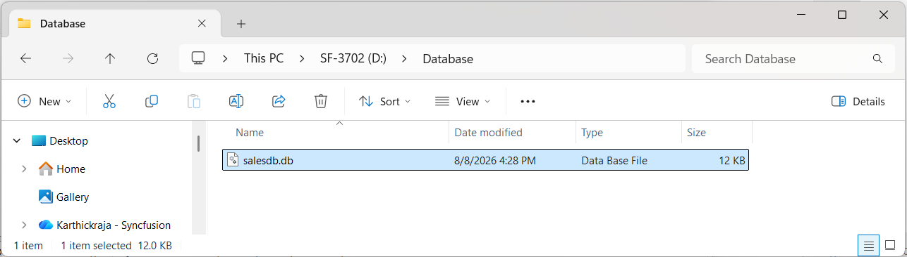
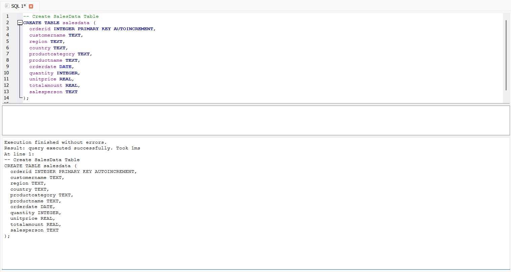
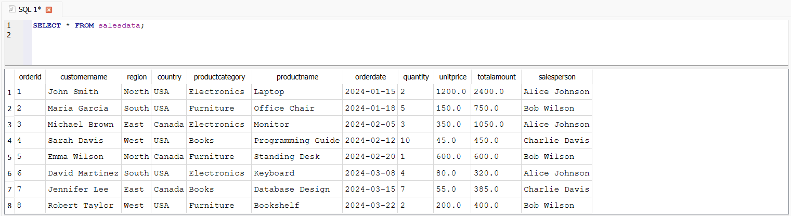
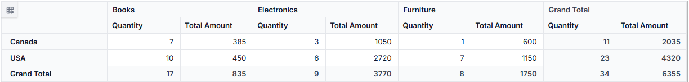
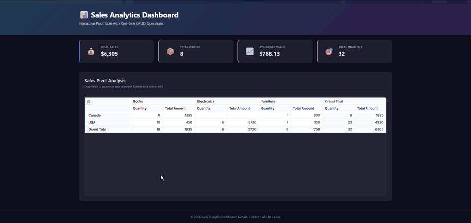

# Connecting SQLite to React Pivot Table Using ASP.NET Core Web API

The Syncfusion<sup style="font-size:70%">&reg;</sup> React Pivot Table supports binding data from a SQLite database through an ASP.NET Core Web API. This modern architecture provides a lightweight, file-based data source ideal for embedded scenarios, mobile applications, and small-to-medium-scale web applications. By using React for the UI and ASP.NET Core for data access, applications keep a clean separation between presentation and data layers and retain full control over SQLite interactions. SQLite is a great choice when you need a zero-configuration, file-based database without the overhead of a database server.

## What is SQLite?

[SQLite](https://www.sqlite.org/docs.html) is a self-contained, serverless, file-based SQL database engine. The entire database is a single file on disk, which makes it ideal for local development, prototyping, embedded systems, and small-to-medium web applications that do not need a dedicated database server.

### Key benefits of SQLite

- **Zero configuration**: No server process, no configuration files, and no service management required.
- **Lightweight**: The entire database is stored in a single cross-platform file on disk.
- **High performance**: Reliable and fast for read-heavy and small-to-medium write workloads.
- **Cross-platform compatibility**: Works seamlessly on Windows, Linux, and macOS.
- **Open-source**: Public domain software that is free to use for any purpose.
- **Standards compliant**: Implements most of the SQL standard with full ACID transactions.

## Prerequisites

Ensure the following software and packages are installed before proceeding:

| Software/Package | Version | Purpose |
| ------------------ | -------- | --------- |
| Node.js | 20.19 or later, or 22.12 or later | React and current Vite development runtime |
| React | 18.x or later | Create and run React apps |
| .NET SDK | 8.0 or later | Build and run ASP.NET Core Web API |
| SQLite CLI | Current stable release (optional) | Command-line database inspection and troubleshooting |
| DB Browser for SQLite | Current stable release | Visual database creation and management used in this guide |
| Microsoft.Data.Sqlite (NuGet) | 8.0.x or later | SQLite connectivity |
| Syncfusion.EJ2.AspNet.Core | 34.1.32 or later | Server helpers (DataManagerRequest, DataOperations) |
| @syncfusion/ej2-react-pivotview | 34.1.32 or later | React Pivot Table component |

The tested baseline for this guide is React 18, .NET 8, `Microsoft.Data.Sqlite` 8.0.10, and Syncfusion<sup style="font-size:70%">&reg;</sup> packages 34.1.32. Keep all Syncfusion npm packages on the same release line. The `Microsoft.Data.Sqlite` package supplies the SQLite runtime used by the API; install the SQLite CLI only if you want to use the command-line troubleshooting steps.

## Setting up the SQLite environment

First, create the **SQLite database** structure required to store sales records for the Pivot Table.

### Step 1: Create the SQLite Database

**Instructions:**

1. **Install SQLite tools**: Install DB Browser for SQLite. Optionally download the SQLite CLI from [sqlite.org](https://www.sqlite.org/download.html) for command-line verification.
2. **Open DB Browser for SQLite**: Launch DB Browser for SQLite to create and manage the database visually.
3. **Create a New Database**: Select **New Database**, choose a file name such as `salesdb.db`, and save it in the **PivotTable_SQLite.Server** project folder (the same folder as the `.csproj` file). This keeps the connection string relative and the database file tracked alongside the rest of the project.

After saving the new database, the `salesdb.db` file will be created in the selected location.

**Verify**: Confirm the file exists at the project path (Windows example):

```bash
dir PivotTable_SQLite.Server\salesdb.db
```

On macOS/Linux:

```bash
ls PivotTable_SQLite.Server/salesdb.db
```



### Step 2: Create the Sales Data Table

After creating the database, you need to create a table to store sales records. This table will hold all the data that the Pivot Table will display and analyze.

**Using DB Browser for SQLite:**

1. **Open the Database**: Open the `salesdb.db` file in DB Browser for SQLite.
2. **Go to Execute SQL**: Select the **Execute SQL** tab.
3. **Create the Table**: Paste the following SQL script into the editor and click **Execute all**.

```sql
-- Create SalesData Table
CREATE TABLE salesdata (
  orderid INTEGER PRIMARY KEY AUTOINCREMENT,
  customername TEXT,
  region TEXT,
  country TEXT,
  productcategory TEXT,
  productname TEXT,
  orderdate DATE,
  quantity INTEGER,
  unitprice REAL,
  totalamount REAL,
  salesperson TEXT
);
```

You should see a success message confirming the table creation.

Click **Write Changes** in DB Browser for SQLite to persist the new table to `salesdb.db`.



**Table Structure Explanation:**

| Column | Data Type | Description |
|--------|-----------|-------------|
| orderid | INTEGER PRIMARY KEY AUTOINCREMENT | Unique order identifier (auto-incremented primary key) |
| customername | TEXT | Name of the customer who placed the order |
| region | TEXT | Geographic region of the customer |
| country | TEXT | Country where the order was placed |
| productcategory | TEXT | Category of the product (e.g., Electronics, Furniture) |
| productname | TEXT | Name of the product ordered |
| orderdate | DATE | Order date stored as an ISO-8601-compatible value; SQLite does not have a dedicated date storage class |
| quantity | INTEGER | Number of units ordered |
| unitprice | REAL | Price per unit of the product |
| totalamount | REAL | Total cost of the order (quantity × unitprice) |
| salesperson | TEXT | Name of the sales representative handling the order |

### Step 3: Insert Sample Data

Insert sample sales data into the table. This data will be used to populate the Pivot Table.

**Using DB Browser for SQLite:**

1. **Open the Database**: Open `salesdb.db` in DB Browser for SQLite.
2. **Go to Execute SQL**: Select the **Execute SQL** tab if it is not already open.
3. **Insert Sample Data**: Paste the following SQL script into the editor and click **Execute all**.

```sql
-- Insert Sample Data
INSERT INTO salesdata (customername, region, country, productcategory, productname, orderdate, quantity, unitprice, totalamount, salesperson)
VALUES
('John Smith', 'North', 'USA', 'Electronics', 'Laptop', '2024-01-15', 2, 1200.00, 2400.00, 'Alice Johnson'),
('Maria Garcia', 'South', 'USA', 'Furniture', 'Office Chair', '2024-01-18', 5, 150.00, 750.00, 'Bob Wilson'),
('Michael Brown', 'East', 'Canada', 'Electronics', 'Monitor', '2024-02-05', 3, 350.00, 1050.00, 'Alice Johnson'),
('Sarah Davis', 'West', 'USA', 'Books', 'Programming Guide', '2024-02-12', 10, 45.00, 450.00, 'Charlie Davis'),
('Emma Wilson', 'North', 'Canada', 'Furniture', 'Standing Desk', '2024-02-20', 1, 600.00, 600.00, 'Bob Wilson'),
('David Martinez', 'South', 'USA', 'Electronics', 'Keyboard', '2024-03-08', 4, 80.00, 320.00, 'Alice Johnson'),
('Jennifer Lee', 'East', 'Canada', 'Books', 'Database Design', '2024-03-15', 7, 55.00, 385.00, 'Charlie Davis'),
('Robert Taylor', 'West', 'USA', 'Furniture', 'Bookshelf', '2024-03-22', 2, 200.00, 400.00, 'Bob Wilson');
```

You should see a success message indicating that 8 rows were successfully inserted.

Click **Write Changes** to persist the inserted rows before closing DB Browser for SQLite.

**Verify the Data:**

To confirm the data was inserted correctly, use the **Browse Data** tab in DB Browser for SQLite and select the **salesdata** table. You should see all 8 sample records displayed in the results grid.

If you want to verify the records using a SQL command, open the **Execute SQL** tab and run the following query:

```sql
SELECT * FROM salesdata;
```



## Setting up the ASP.NET Core Web API

Now that the SQLite database is configured, let's create the backend API that the React Pivot Table will communicate with.

### Step 1: Create the ASP.NET Core Web API project

To connect the Syncfusion<sup style="font-size:70%">&reg;</sup> React Pivot Table to SQLite, the **ASP.NET Core Web API server** must be configured with the required NuGet packages. The server application is responsible for handling HTTP requests from the Pivot Table and accessing data from SQLite.

**To create a new ASP.NET Core Web API project using the .NET CLI:**

Execute the following commands in your terminal:

> The `--name` option sets the project name but does not create a same-named output directory. Run the `dotnet new` command from an empty `PivotTable_SQLite.Server` directory and omit the subsequent `cd`, or add `--output PivotTable_SQLite.Server` when running it from the parent directory. Because the unchanged command block combines these two directory workflows, follow one of the corrected alternatives in this note instead of pasting the block verbatim.

```bash
dotnet new webapi --use-controllers -n PivotTable_SQLite.Server
cd PivotTable_SQLite.Server
```

**Install Required NuGet Packages:**

Add the SQLite client library and Syncfusion<sup style="font-size:70%">&reg;</sup> server-side helper packages:

```bash
dotnet add package Microsoft.Data.Sqlite --version 8.0.10
dotnet add package Syncfusion.EJ2.AspNet.Core --version 34.1.32
```

The Web API exposes HTTP endpoints that are used by the Pivot Table to perform read and data modification operations. The Syncfusion<sup style="font-size:70%">&reg;</sup> server helper package provides `DataManagerRequest` and `DataOperations`. The read example below accepts `DataManagerRequest` but returns the complete data set; add the relevant `DataOperations` calls if the API must perform server-side filtering, sorting, or paging.

### Step 2: Configure the Connection String

The connection string contains the information needed to connect to your SQLite database. For local development, use [.NET Secret Manager](https://learn.microsoft.com/en-us/aspnet/core/security/app-secrets) to keep the connection string out of source control:

```bash
dotnet user-secrets init
dotnet user-secrets set "ConnectionStrings:SalesDb" "Data Source=salesdb.db"
```

Use a relative file path for local development, or provide an absolute path if the database file is stored outside the project folder. `Microsoft.Data.Sqlite` resolves relative paths from the process working directory, which may differ from the project folder after deployment. For a deployed application, construct a stable path from the application content root and ensure the process identity has read/write permission to the database file and its directory.

**Connection String Components:**

| Component | Description | Example |
|-----------|-------------|----------|
| Data Source | Path to the SQLite database file | `salesdb.db` (relative) or `C:\Data\salesdb.db` (absolute) |

The database connection string has been configured successfully.

### Step 3: Configure Program.cs

Update the **Program.cs** file to enable CORS for communication between the React client and the API. The controller reads the SQLite connection string from `IConfiguration`; the example does not register a singleton SQLite connection.

```csharp
using Microsoft.Data.Sqlite;

var builder = WebApplication.CreateBuilder(args);

// Add services to the container
builder.Services.AddControllers();

// Enable CORS to allow requests from React client
builder.Services.AddCors(options =>
{
    options.AddPolicy("AllowAll",
        policy => policy
            .AllowAnyOrigin()
            .AllowAnyMethod()
            .AllowAnyHeader());
});

var app = builder.Build();

// Configure the HTTP request pipeline
if (app.Environment.IsDevelopment())
{
    app.MapOpenApi();
}

app.UseHttpsRedirection();
app.UseAuthorization();
app.UseCors("AllowAll");  // Apply CORS policy
app.MapControllers();

app.Run();
```

**What's Happening:**

1. **Configuration injection**: Supplies the `SalesDb` connection string to `SalesController` through `IConfiguration`
2. **AddCors**: Enables Cross-Origin Resource Sharing (CORS), allowing the React frontend to make API requests to this backend
3. **AllowAll policy**: Permits all origins, methods, and headers for local development; use an explicit frontend origin in production

### Step 4: Create the Data Model and Controller

Create a new file named **SalesController.cs** in the **Controllers** folder. This file contains the data model and all the API endpoints for reading and modifying sales data.

```csharp
using Microsoft.AspNetCore.Mvc;
using Microsoft.Data.Sqlite;
using Syncfusion.EJ2.Base;
using System.ComponentModel.DataAnnotations;
using System.Data;

namespace PivotTable_SQLite.Server.Controllers
{
    [ApiController]
    public class SalesController : ControllerBase
    {
        private readonly string _connectionString;

        /// <summary>
        /// Constructor that injects the configuration to retrieve the connection string.
        /// </summary>
        public SalesController(IConfiguration configuration)
        {
            _connectionString = configuration.GetConnectionString("SalesDb")!;
        }

        /// <summary>
        /// Handles GET requests to retrieve all sales data for the Pivot Table.
        /// This endpoint is called when the Pivot Table first loads or refreshes data.
        /// </summary>
        /// <returns>Returns a list of all sales records from the database.</returns>
        [HttpGet]
        [Route("api/[controller]")]
        public List<SalesData> GetSalesData()
        {
            const string Query = @"SELECT * FROM salesdata ORDER BY orderid;";

            using var Connection = new SqliteConnection(_connectionString);
            Connection.Open();

            using var Command = new SqliteCommand(Query, Connection);
            using var Reader = Command.ExecuteReader();

            var DataTable = new DataTable();
            DataTable.Load(Reader);

            // Convert database rows to SalesData objects
            var DataSource = (from DataRow Data in DataTable.Rows
                select new SalesData {
                    OrderID = Data["orderid"] == DBNull.Value ? (int?)null : Convert.ToInt32(Data["orderid"]),
                    CustomerName = Data["customername"] == DBNull.Value ? null : Data["customername"].ToString(),
                    Region = Data["region"] == DBNull.Value ? null : Data["region"].ToString(),
                    Country = Data["country"] == DBNull.Value ? null : Data["country"].ToString(),
                    ProductCategory = Data["productcategory"] == DBNull.Value ? null : Data["productcategory"].ToString(),
                    ProductName = Data["productname"] == DBNull.Value ? null : Data["productname"].ToString(),
                    OrderDate = Data["orderdate"] == DBNull.Value ? (DateTime?)null : Convert.ToDateTime(Data["orderdate"]),
                    Quantity = Data["quantity"] == DBNull.Value ? (int?)null : Convert.ToInt32(Data["quantity"]),
                    UnitPrice = Data["unitprice"] == DBNull.Value ? 0m : Convert.ToDecimal(Data["unitprice"]),
                    TotalAmount = Data["totalamount"] == DBNull.Value ? 0m : Convert.ToDecimal(Data["totalamount"]),
                    SalesPerson = Data["salesperson"] == DBNull.Value ? null : Data["salesperson"].ToString()
                }
            ).ToList();
            return DataSource;
        }

        /// <summary>
        /// Handles POST requests from the Pivot Table DataManager.
        /// Processes the data request and returns formatted data for the component.
        /// </summary>
        /// <param name="DataManagerRequest">
        /// Contains the details of the data operation requested.
        /// </param>
        /// <returns>
        /// Returns the data records along with the total count.
        /// </returns>
        [HttpPost]
        [Route("api/[controller]")]
        public object Post([FromBody] DataManagerRequest DataManagerRequest)
        {
            // Retrieve all sales data from the database
            List<SalesData> DataSource = GetSalesData();

            // Get the total number of records
            int totalRecordsCount = DataSource.Count;

            // Return data and count to the client
            return new { result = DataSource, count = totalRecordsCount };
        }

        /// <summary>
        /// Data model that represents the structure of a sales record.
        /// This class maps to the columns in the 'salesdata' table in SQLite.
        /// </summary>
        public class SalesData
        {
            /// <summary>
            /// Unique identifier for each order (Primary Key).
            /// The [Key] attribute marks this as the primary key for CRUD operations.
            /// </summary>
            [Key]
            public int? OrderID { get; set; }

            /// <summary>
            /// Name of the customer who placed the order.
            /// </summary>
            public string? CustomerName { get; set; }

            /// <summary>
            /// Geographic region where the customer is located.
            /// Useful for regional analysis in the pivot table.
            /// </summary>
            public string? Region { get; set; }

            /// <summary>
            /// Country where the order was placed.
            /// </summary>
            public string? Country { get; set; }

            /// <summary>
            /// Category of the product (e.g., Electronics, Furniture).
            /// Used as a dimension in the pivot table analysis.
            /// </summary>
            public string? ProductCategory { get; set; }

            /// <summary>
            /// Name of the specific product ordered.
            /// </summary>
            public string? ProductName { get; set; }

            /// <summary>
            /// Date when the order was placed.
            /// </summary>
            public DateTime? OrderDate { get; set; }

            /// <summary>
            /// Number of units ordered.
            /// </summary>
            public int? Quantity { get; set; }

            /// <summary>
            /// Price per unit of the product.
            /// </summary>
            public decimal UnitPrice { get; set; }

            /// <summary>
            /// Total cost of the order (typically quantity × unitprice).
            /// Used as a measure/aggregate value in pivot table analysis.
            /// </summary>
            public decimal TotalAmount { get; set; }

            /// <summary>
            /// Name of the sales representative who handled the order.
            /// </summary>
            public string? SalesPerson { get; set; }
        }
    }
}
```

**Explanation:**

- **GetSalesData()**: Connects to SQLite, executes a SELECT query, and returns all sales records
- **Post()**: Handles requests from the React Pivot Table and returns the complete data set with a total count; it does not apply the supplied `DataManagerRequest`
- **SalesData class**: Represents the structure of each sales record with XML documentation for clarity

## Setting up the React Pivot Table Client

Now that the backend API is ready, let's create the React client application that displays the Pivot Table and connects to the SQLite data.

### Step 1: Create the React Client Application

Open a Visual Studio Code terminal or command prompt and run the following command to create a React application. When Vite prompts for a framework and variant, select **React** and **TypeScript** so the generated project contains `src/App.tsx`. After entering the project directory, run `npm install` if the scaffolder did not install dependencies automatically.

```bash
npm create vite@latest pivottable_sqlite.client
cd pivottable_sqlite.client
```

### Step 2: Install Syncfusion Pivot Table Package

Install the Syncfusion React Pivot Table component and its dependencies:

```bash
npm install @syncfusion/ej2-react-pivotview --save
```

For a reproducible installation, install the tested 34.1.32 release and keep `@syncfusion/ej2-react-pivotview`, `@syncfusion/ej2-data`, `@syncfusion/ej2-base`, and the theme package on the same release line. Installing without a version selects the latest compatible package and may require adapting the examples to newer APIs.

Register your Syncfusion license by following the [license key registration documentation](https://ej2.syncfusion.com/react/documentation/licensing/license-key-registration). Add the license key to **src/main.tsx** before rendering `App`:

```typescript
import { registerLicense } from '@syncfusion/ej2-base';

registerLicense('YOUR-LICENSE-KEY');
```

### Step 3: Import Syncfusion CSS styles

Install the Tailwind 3 theme package and replace the contents of **src/index.css** with the Pivot Table theme import:

```bash
npm install @syncfusion/ej2-tailwind3-theme --save
```

```css
@import '../node_modules/@syncfusion/ej2-tailwind3-theme/styles/pivotview/index.css';
```

The "tailwind3" theme is applied for reference. For other theme options or customization, refer to the [Syncfusion<sup style="font-size:70%">&reg;</sup> React Appearance](https://ej2.syncfusion.com/react/documentation/appearance/theme-studio) documentation.

Also remove the default Vite styles from **src/App.css** if they alter the Pivot Table layout. Keep the theme package version aligned with the other Syncfusion packages.

### Step 4: Add the Pivot Table Component - Display Data

The React Pivot Table component retrieves and displays data from the SQLite database through the ASP.NET Core Web API. Update your **src/App.tsx** file with the following read-only baseline. The CRUD section later replaces this file with the complete editing configuration.

```typescript
import { FieldList, Inject, PivotViewComponent } from '@syncfusion/ej2-react-pivotview';
import { DataManager, UrlAdaptor } from '@syncfusion/ej2-data';
import './App.css';

function App() {
  let pivotObj: PivotViewComponent;

  // Initialize DataManager with the Web API endpoint
  let data: DataManager = new DataManager({
    url: 'https://localhost:7086/api/Sales',
    adaptor: new UrlAdaptor
  });

  // Configure the Pivot Table data structure
  const dataSourceSettings = {
    dataSource: data,
    expandAll: true,
    rows: [{ name: 'country', caption: 'Country' }],
    columns: [{ name: 'productCategory', caption: 'Product Category' }],
    values: [{ name: 'quantity', caption: 'Quantity' }, { name: 'totalAmount', caption: 'Total Amount' }],
    filters: [],
    fieldMapping: [{ name: 'orderDate', caption: 'Order Date' }, { name: 'orderID', caption: 'Order ID' }, { name: 'customerName', caption: 'Customer Name' }, { name: 'region', caption: 'Region' }, { name: 'salesPerson', caption: 'Sales Person' }, { name: 'productName', caption: 'Product Name' }, { name: 'unitPrice', caption: 'Unit Price' }]
  }

  return (
    <PivotViewComponent
      id='PivotView'
      ref={(scope: any) => { pivotObj = scope; }}
      height={350}
      dataSourceSettings={dataSourceSettings}
      showFieldList={true}>
      <Inject services={[FieldList]}/>
    </PivotViewComponent>
  );
}

export default App;
```

**Code Explanation:**

- [DataManager](https://ej2.syncfusion.com/react/documentation/data/getting-started): Connects to the ASP.NET Core Web API endpoint at `https://localhost:7086/api/Sales`. This URL must match your actual API server port and controller route.

- [UrlAdaptor](https://ej2.syncfusion.com/react/documentation/data/adaptors/url-adaptor): Uses the standard URL adaptor to automatically send requests to and receive responses from the backend API.

- [dataSourceSettings](https://ej2.syncfusion.com/react/documentation/api/pivotview/index-default#datasourcesettings): Defines the Pivot Table layout:
  - [rows](https://ej2.syncfusion.com/react/documentation/api/pivotview/datasourcesettingsmodel#rows): Displays **country** as row headers
  - [columns](https://ej2.syncfusion.com/react/documentation/api/pivotview/datasourcesettingsmodel#columns): Displays **productCategory** as column headers
  - [values](https://ej2.syncfusion.com/react/documentation/api/pivotview/datasourcesettingsmodel#values): Aggregates **quantity** and **totalAmount** based on rows and columns
  - [fieldMapping](https://ej2.syncfusion.com/react/documentation/api/pivotview/datasourcesettingsmodel#fieldmapping):  Defines captions for fields that are not bound in pivot reports.
- [showFieldList](https://ej2.syncfusion.com/react/documentation/api/pivotview/index-default#showfieldlist): Displays the field list panel allowing users to rearrange fields

- [PivotViewComponent](https://ej2.syncfusion.com/react/documentation/api/pivotview/index-default): Renders the Pivot Table with the configured data and layout.

The `ref` assignment in the example is needed only when calling component methods such as `refresh()`. If the TypeScript configuration enables `noUnusedLocals` and no method is called, remove the unused `pivotObj` variable and `ref` assignment in your application.

### Step 5: Run the Applications

**Before the first run**, trust the local HTTPS certificate so the browser accepts the API over HTTPS:

```bash
dotnet dev-certs https --trust
```

**Start the ASP.NET Core API server first**, then start the React dev server:

Open a terminal in the **PivotTable_SQLite.Server** folder and run:

```bash
dotnet run
```

The server URL is determined by **Properties/launchSettings.json** or the URL printed by `dotnet run`; port `7086` is not universal. Configure the HTTPS application URL as `https://localhost:7086`, or update every client endpoint to use the actual printed port. The examples in this guide assume that the API endpoint is `https://localhost:7086/api/Sales`.

**In a separate terminal, start the React development server:**

Open a terminal in the **pivottable_sqlite.client** folder and run:

```bash
npm run dev
```

The React application will start at `http://localhost:5173`. Open this URL in your browser to see the Pivot Table displaying SQLite sales data. You can interact with the field list to rearrange and customize the Pivot Table layout.



## CRUD operations with the Pivot Table

This section describes how to enable Create, Read, Update, and Delete (CRUD) operations in the Pivot Table, allowing users to modify the underlying database records directly through the built-in editing pop-up.

### Understanding CRUD in the Pivot Table

The Syncfusion React Pivot Table supports CRUD operations through [DataManager](https://ej2.syncfusion.com/react/documentation/data/getting-started) with [UrlAdaptor](https://ej2.syncfusion.com/react/documentation/data/adaptors/url-adaptor). This enables:

- **Create**: Add new sales records through the Pivot Table editing pop-up
- **Read**: Display data from the database (already implemented)
- **Update**: Edit existing records in place
- **Delete**: Remove records from the database

When a user performs any edit action (add, update, or delete), the Pivot Table sends an HTTP request using [DataManager](https://ej2.syncfusion.com/react/documentation/data/getting-started) to the corresponding server endpoint, which processes the operation and updates the SQLite database.

### Implement server-side CRUD methods

Extend your **SalesController.cs** with Insert, Update, and Remove methods. These methods will be called automatically when users edit data in the Pivot Table editing pop-up.

Place `CRUDModel<T>` inside the `SalesController` class before adding the endpoint methods, or place it as a separate type in the same namespace. The client sends JSON with `value` for inserts and updates and `key` for removals. Successful writes return HTTP 200 with the key and action metadata shown by the methods; malformed identifiers return HTTP 400, and unhandled database failures return HTTP 500.

The sample database permits null values for every non-key column. Before production use, define required fields and enforce rules such as `quantity > 0`, non-negative prices, a valid order date, and `totalAmount = quantity × unitPrice`. Return validation failures as HTTP 400 responses. Do not return exception details to clients; log the exception on the server and return a generic error message.

#### Insert

To add a new record, double-click a pivot cell to open the editing pop-up and click the **Add** button to create a new empty row. Enter the required data in the new row fields, then click the **Update** button to save the record to the **salesdata** table using the following POST method:

```csharp
/// <summary>
/// Inserts a new sales record into the database.
/// This method is called when a new row is added in the Pivot Table.
/// </summary>
/// <param name="value">Contains the new sales data to insert.</param>
/// <returns>Returns the inserted record with its new OrderID.</returns>
[HttpPost]
[Route("api/[controller]/Insert")]
public async Task<IActionResult> Insert([FromBody] CRUDModel<SalesData> value)
{
    try
    {
        // The server recalculates TotalAmount so the persisted column
        // always equals Quantity × UnitPrice, regardless of client input.
        if (value.Value != null)
        {
            value.Value.TotalAmount = value.Value.Quantity.HasValue
                ? value.Value.Quantity.Value * value.Value.UnitPrice
                : value.Value.TotalAmount;
        }

        const string sql = @"
            INSERT INTO salesdata
            (customername, region, country, productcategory, productname, orderdate, quantity, unitprice, totalamount, salesperson)
            VALUES (@CustomerName, @Region, @Country, @ProductCategory, @ProductName, @OrderDate, @Quantity, @UnitPrice, @TotalAmount, @SalesPerson);
            SELECT last_insert_rowid();
        ";

        using var conn = new SqliteConnection(_connectionString);
        await conn.OpenAsync();

        using var cmd = new SqliteCommand(sql, conn);

        // Add parameters to prevent SQL injection
        cmd.Parameters.AddWithValue("@CustomerName", (object?)value.Value?.CustomerName ?? DBNull.Value);
        cmd.Parameters.AddWithValue("@Region", (object?)value.Value?.Region ?? DBNull.Value);
        cmd.Parameters.AddWithValue("@Country", (object?)value.Value?.Country ?? DBNull.Value);
        cmd.Parameters.AddWithValue("@ProductCategory", (object?)value.Value?.ProductCategory ?? DBNull.Value);
        cmd.Parameters.AddWithValue("@ProductName", (object?)value.Value?.ProductName ?? DBNull.Value);
        cmd.Parameters.AddWithValue("@OrderDate", (object?)value.Value?.OrderDate ?? DBNull.Value);
        cmd.Parameters.AddWithValue("@Quantity", (object?)value.Value?.Quantity ?? DBNull.Value);
        cmd.Parameters.AddWithValue("@UnitPrice", (object?)value.Value?.UnitPrice ?? DBNull.Value);
        cmd.Parameters.AddWithValue("@TotalAmount", (object?)value.Value?.TotalAmount ?? DBNull.Value);
        cmd.Parameters.AddWithValue("@SalesPerson", (object?)value.Value?.SalesPerson ?? DBNull.Value);

        // Execute the query and get the newly created OrderID
        var newId = Convert.ToInt32(await cmd.ExecuteScalarAsync());

        // Update the value object with the new ID
        if (value.Value != null) value.Value.OrderID = newId;

        // UrlAdaptor expects { key, value, action } on insert.
        return Ok(new { key = newId, value = value.Value, action = "insert" });
    }
    catch (Exception ex)
    {
        return StatusCode(500, new { error = "Insert failed", details = ex.Message });
    }
}
```

**How it works:**

- The method receives a `CRUDModel<SalesData>` object containing the new record data
- Parameterized queries prevent SQL injection attacks by separating SQL code from data
- `last_insert_rowid()` retrieves the auto-generated primary key from SQLite
- The new ID is returned to the client, allowing the Pivot Table to track the newly created record
- All operations are wrapped in try-catch for error handling


#### Update

To modify a record, double-click a pivot cell to open the editing pop-up, select the row you want to edit, and click the **Edit** button. The row becomes editable so you can modify the fields. Click the **Update** button to save the changes to the **salesdata** table using the following POST method:

```csharp
/// <summary>
/// Updates an existing sales record in the database.
/// This method is called when a row is edited in the Pivot Table.
/// </summary>
/// <param name="value">Contains the updated sales data.</param>
/// <returns>Returns the number of rows updated.</returns>
[HttpPost]
[Route("api/[controller]/Update")]
public async Task<IActionResult> Update([FromBody] CRUDModel<SalesData> value)
{
    if (value?.Value == null || value.Value.OrderID == null)
        return BadRequest("OrderID and payload are required.");

    try
    {
        // The server recalculates TotalAmount so the persisted column
        // always equals Quantity × UnitPrice, regardless of client input.
        if (value.Value != null)
        {
            value.Value.TotalAmount = value.Value.Quantity.HasValue
                ? value.Value.Quantity.Value * value.Value.UnitPrice
                : value.Value.TotalAmount;
        }

        const string sql = @"
            UPDATE salesdata
            SET customername    = @CustomerName,
                region          = @Region,
                country         = @Country,
                productcategory = @ProductCategory,
                productname     = @ProductName,
                orderdate       = @OrderDate,
                quantity        = @Quantity,
                unitprice       = @UnitPrice,
                totalamount     = @TotalAmount,
                salesperson     = @SalesPerson
            WHERE orderid = @OrderID;
        ";

        using var conn = new SqliteConnection(_connectionString);
        await conn.OpenAsync();

        using var cmd = new SqliteCommand(sql, conn);

        // Add parameters to prevent SQL injection
        cmd.Parameters.AddWithValue("@CustomerName", (object?)value.Value?.CustomerName ?? DBNull.Value);
        cmd.Parameters.AddWithValue("@Region", (object?)value.Value?.Region ?? DBNull.Value);
        cmd.Parameters.AddWithValue("@Country", (object?)value.Value?.Country ?? DBNull.Value);
        cmd.Parameters.AddWithValue("@ProductCategory", (object?)value.Value?.ProductCategory ?? DBNull.Value);
        cmd.Parameters.AddWithValue("@ProductName", (object?)value.Value?.ProductName ?? DBNull.Value);
        cmd.Parameters.AddWithValue("@OrderDate", (object?)value.Value?.OrderDate ?? DBNull.Value);
        cmd.Parameters.AddWithValue("@Quantity", (object?)value.Value?.Quantity ?? DBNull.Value);
        cmd.Parameters.AddWithValue("@UnitPrice", (object?)value.Value?.UnitPrice ?? DBNull.Value);
        cmd.Parameters.AddWithValue("@TotalAmount", (object?)value.Value?.TotalAmount ?? DBNull.Value);
        cmd.Parameters.AddWithValue("@SalesPerson", (object?)value.Value?.SalesPerson ?? DBNull.Value);
        cmd.Parameters.AddWithValue("@OrderID", value.Value.OrderID);

        // Execute the update
        var rows = await cmd.ExecuteNonQueryAsync();

        // UrlAdaptor expects { key, value, action } on update.
        return Ok(new { key = value.Value.OrderID, value = value.Value, action = "update", affected = rows });
    }
    catch (Exception ex)
    {
        return StatusCode(500, new { error = "Update failed", details = ex.Message });
    }
}
```

**How it works:**

- The method validates that both OrderID and the data object are provided
- The WHERE clause targets the specific record using the OrderID primary key
- All fields are updated using parameterized queries to prevent SQL injection
- `ExecuteNonQuery()` returns the number of affected rows
- Error handling ensures issues are properly reported to the client

The actual success response is an object containing `key`, `value`, `action`, and `affected`; it is not only the number of updated rows.


#### Delete

To delete a record, double-click a pivot cell to open the editing pop-up, select the row you want to delete, and click the **Delete** button. With the configured `UrlAdaptor`, this sends a POST request to the Remove endpoint with the primary key value. The corresponding record is then removed from the **salesdata** table:

```csharp
/// <summary>
/// Deletes a sales record from the database.
/// This method is called when a row is deleted in the Pivot Table.
/// </summary>
/// <param name="value">Contains the OrderID of the record to delete.</param>
/// <returns>Returns the number of rows deleted.</returns>
[HttpPost]
[Route("api/[controller]/Remove")]
public async Task<IActionResult> Remove([FromBody] CRUDModel<SalesData> value)
{
    if (value?.Key == null)
        return BadRequest("Missing key.");

    if (!int.TryParse(value.Key.ToString(), out var id))
        return BadRequest("Invalid OrderID.");

    try
    {
        const string sql = @"DELETE FROM salesdata WHERE orderid = @OrderID;";

        using var conn = new SqliteConnection(_connectionString);
        await conn.OpenAsync();

        using var cmd = new SqliteCommand(sql, conn);
        cmd.Parameters.AddWithValue("@OrderID", id);

        // Execute the delete
        var rows = await cmd.ExecuteNonQueryAsync();

        // UrlAdaptor expects { key, action } on remove.
        return Ok(new { key = id, action = "remove", deleted = rows });
    }
    catch (Exception ex)
    {
        return StatusCode(500, new { error = "Delete failed", details = ex.Message });
    }
}
```

**How it works:**

- The method extracts the OrderID (primary key) from the `key` property
- Input validation ensures the key is properly formatted as an integer
- The DELETE statement targets the specific record using the OrderID
- `ExecuteNonQuery()` returns the number of deleted rows
- Parameterized queries prevent SQL injection even for delete operations

The actual success response is an object containing `key`, `action`, and `deleted`; it is not only the number of deleted rows.


#### CRUD Model Class

The `CRUDModel<T>` class encapsulates the data sent from the client to the server during CRUD operations. Add this type inside your controller before the Insert, Update, and Remove methods, or define it as a separate type in the controller namespace, so the methods can reference it:

```csharp
/// <summary>
/// Generic model for handling CRUD operations from the Pivot Table.
/// The Pivot Table uses this structure to send data to Insert, Update, and Remove endpoints.
/// </summary>
/// <typeparam name="T">The data type (e.g., SalesData)</typeparam>
public class CRUDModel<T> where T : class
{
    /// <summary>
    /// Action being performed (e.g., "insert", "update", "remove").
    /// </summary>
    public string? Action { get; set; }

    /// <summary>
    /// Primary key column name (e.g., "orderid").
    /// </summary>
    public string? KeyColumn { get; set; }

    /// <summary>
    /// The primary key value (e.g., the OrderID).
    /// </summary>
    public object? Key { get; set; }

    /// <summary>
    /// The single record being operated on (for Insert, Update operations).
    /// </summary>
    public T? Value { get; set; }

    /// <summary>
    /// Additional parameters sent by the client.
    /// </summary>
    public IDictionary<string, object>? Params { get; set; }
}
```

### Configure client-side CRUD endpoints

Replace the contents of **src/App.tsx** with the complete file below. It configures the [DataManager](https://ej2.syncfusion.com/react/documentation/data/getting-started) with the four CRUD URLs, the `editSettings` block, and the `beginDrillThrough` event that marks `orderID` as the primary key.

```typescript
import { DrillThrough, FieldList, Inject, PivotViewComponent } from '@syncfusion/ej2-react-pivotview'; // Docs: https://ej2.syncfusion.com/react/documentation/api/pivotview/drillthrough
import { DataManager, UrlAdaptor } from '@syncfusion/ej2-data';
import './App.css';

function App() {
  let pivotObj: PivotViewComponent;

  // Configure DataManager with CRUD URLs.
  // - url        : data retrieval endpoint
  // - insertUrl  : called when the user adds a new record
  // - updateUrl  : called when the user edits an existing record
  // - removeUrl  : called when the user deletes a record
  // - adaptor    : standard URL adaptor for HTTP communication
  const data: DataManager = new DataManager({
    url: 'https://localhost:7086/api/Sales',
    insertUrl: 'https://localhost:7086/api/Sales/Insert',
    updateUrl: 'https://localhost:7086/api/Sales/Update',
    removeUrl: 'https://localhost:7086/api/Sales/Remove',
    adaptor: new UrlAdaptor()
  });

  const dataSourceSettings = {
    dataSource: data,
    expandAll: true,
    rows: [{ name: 'country', caption: 'Country' }],
    columns: [{ name: 'productCategory', caption: 'Product Category' }],
    values: [
      { name: 'quantity', caption: 'Quantity' },
      { name: 'totalAmount', caption: 'Total Amount' }
    ],
    filters: [],
    fieldMapping: [
      { name: 'orderDate', caption: 'Order Date' },
      { name: 'orderID', caption: 'Order ID' },
      { name: 'customerName', caption: 'Customer Name' },
      { name: 'region', caption: 'Region' },
      { name: 'salesPerson', caption: 'Sales Person' },
      { name: 'productName', caption: 'Product Name' },
      { name: 'unitPrice', caption: 'Unit Price' }
    ]
  };

  // Common editSettings options:
  //   allowEditing           - show the Edit button for existing records
  //   allowAdding            - show the Add button for new records
  //   allowDeleting          - show the Delete button
  //   mode                   - 'Normal' (popup) | 'Dialog' | 'Batch'
  //   allowCommandColumns    - show inline Edit/Delete buttons in the grid
  //   showConfirmBeforeSave  - ask the user to confirm before persisting
  //   showAddNewRecord       - show the Add button when the grid opens
  const editSettings = {
    allowEditing: true,
    allowAdding: true,
    allowDeleting: true,
    mode: 'Normal' as const
  };

  // beginDrillThrough fires when the user double-clicks a pivot cell to open
  // the editing pop-up. We use it to mark the primary-key column and to show
  // a date picker for orderDate. Without marking the primary key, the
  // DataManager cannot identify the record on update or delete.
  function beginDrillThrough(args: any): void {
    for (let i = 0; i < args.gridObj.columns.length; i++) {
      const column = args.gridObj.columns[i];
      if (column.field === 'orderID') {
        column.isPrimaryKey = true;
      } else {
        column.visible = true;
        if (column.field === 'orderDate') {
          column.editType = 'datetimepickeredit';
        }
      }
    }
  }

  return (
    <PivotViewComponent
      id="PivotView"
      ref={(scope: any) => { pivotObj = scope; }}
      height={350}
      dataSourceSettings={dataSourceSettings}
      showFieldList={true}
      allowDrillThrough={true}
      editSettings={editSettings}
      beginDrillThrough={beginDrillThrough}
      actionFailure={(args: any) => {
        console.error('Pivot Table action failed.', args);
      }}
    >
      <Inject services={[FieldList, DrillThrough]} />
    </PivotViewComponent>
  );
}

export default App;
```

The Pivot Table supports `Normal`, `Dialog`, and `Batch` modes through the [mode](https://ej2.syncfusion.com/react/documentation/api/pivotview/celleditsettingsmodel#mode) property. `Normal` edits one selected row, `Dialog` opens a dedicated editing dialog, and `Batch` collects multiple changes before saving. Command columns are enabled separately with `allowCommandColumns`. Current confirmation properties are `showConfirmDialog` for batch saves and `showDeleteConfirmDialog` for deletions; `showConfirmBeforeSave` and `showAddNewRecord` in the unchanged comment list are not current `CellEditSettingsModel` properties. For details, refer to the [Editing documentation](https://ej2.syncfusion.com/react/documentation/pivotview/editing).

**How it works:**

- **`url`**: This is the main endpoint that retrieves data from the database. When the Pivot Table loads, it sends a POST request to this URL to fetch all records from the **salesdata** table.

- **`insertUrl`**: When a user clicks **Add** in the drill-through grid and submits a new record, the [DataManager](https://ej2.syncfusion.com/react/documentation/data/getting-started) automatically sends a POST request to this endpoint with the new record data. The server's [Insert](#insert) method processes this request and adds the record to the database.

- **`updateUrl`**: When a user clicks **Edit** and modifies an existing record, the [DataManager](https://ej2.syncfusion.com/react/documentation/data/getting-started) sends a POST request to this endpoint with the updated data. The server's [Update](#update) method processes this request and updates the record in the database.

- **`removeUrl`**: When a user clicks **Delete** and confirms the deletion, the [DataManager](https://ej2.syncfusion.com/react/documentation/data/getting-started) sends a POST request to this endpoint with the record ID. The server's [Delete](#delete) method processes this request and deletes the record from the database.

- **`adaptor: new UrlAdaptor`**: This tells the [DataManager](https://ej2.syncfusion.com/react/documentation/data/getting-started) to use the URL adaptor, which handles automatic HTTP communication with your REST API.

### Using CRUD operations

Once your Pivot Table is running with both server and client configured, you can perform CRUD operations directly through the Pivot Table's built-in editing pop-up.

For detailed information about the Pivot Table's built-in editing features and their usage, refer to the [Editing documentation](https://ej2.syncfusion.com/react/documentation/pivotview/editing).

**Important Notes:**

- **Primary Key (OrderID)**: You cannot modify the OrderID field during editing because it's the primary key. The primary key uniquely identifies each record, and changing it would break the data relationship.
- **Validation**: The server validates all data before saving. If you enter invalid data (e.g., negative quantity), the server will reject it and show an error message.
- **Real-time Updates**: After each CRUD operation, the Pivot Table automatically refreshes to show the updated data from the database.
- **Confirmation**: The editing pop-up confirms successful operations, and you can see the results immediately.

## Best practices for SQLite data management

### Security

- Always use parameterized queries (as shown in the code) to prevent SQL injection attacks.
- Store connection strings in environment variables or secure configuration. Never hardcode passwords.
- Ensure all API communications use HTTPS in production.
- Require authentication and authorization before exposing write endpoints.
- Log full exceptions on the server, but return generic error messages without database paths or implementation details.

### Performance

- Microsoft.Data.Sqlite automatically manages connection pooling. Monitor connection limits based on your application's needs.
- Create database indexes on frequently queried columns (e.g., `OrderDate`, `Country`) to improve query performance.
- Use appropriate SQL queries and avoid N+1 query problems.
- SQLite serializes concurrent writes. For sustained write concurrency or multiple application instances, use a client/server database instead.

### Error handling

- Always wrap database operations in try-catch blocks (as shown in the CRUD operations).
- Return helpful error messages to help users understand what went wrong.
- Implement proper logging to track issues and monitor application health.
- Return consistent HTTP status codes and response bodies so `actionFailure` can present useful feedback.

### Data validation

- Validate all user inputs before sending to the database.
- Enforce business rules (for example, `quantity > 0`, non-negative prices) before persisting.
- Handle database constraint violations gracefully.

### Deployment and maintenance

- Copy the database through a controlled deployment or migration step; do not overwrite a live database during an application update.
- Grant the application process read/write permission to both the database file and its containing directory.
- Back up the database before schema changes and test restoration regularly.
- Apply schema changes through versioned migration scripts instead of manual production edits.

## Troubleshooting

When working with the Pivot Table, Web API, and SQLite integration, you may encounter various issues. This section covers common problems and their solutions to help you get your application running smoothly.

### Common issues and solutions

#### 1. CORS Error: "Access to XMLHttpRequest blocked by CORS policy"

**Issue**: React frontend (localhost:5173) cannot communicate with API backend (localhost:7086).

**Symptoms**: Browser console shows: `Access to XMLHttpRequest at 'https://localhost:7086/api/Sales' blocked by CORS policy`

**Solution**:
- Ensure CORS is enabled in `Program.cs` and the middleware is properly configured
- If you replace `AllowAnyOrigin()` with a restricted production policy, verify the allowed origin matches your React app URL exactly, such as `http://localhost:5173`
- Check that `UseCors()` is called **before** `MapControllers()` in the middleware pipeline (order matters!)
- Ensure `UseCors()` also appears before `UseAuthorization()`

**Example - Correct Program.cs:**
```csharp
app.UseHttpsRedirection();
app.UseCors("AllowAll");        // CORS MUST be before MapControllers
app.UseAuthorization();
app.MapControllers();
```

#### 2. "Unable to connect to the server" or API returns 404

**Issue**: React app cannot reach the API endpoint.

**Symptoms**: Network tab shows 404 or connection refused errors

**Solutions**:
- Verify the API server is running: Open terminal in server folder and run `dotnet run`
- Check the endpoint URL in React matches the running server URL
  - In this guide's configured example: `https://localhost:7086/api/Sales`
- Verify the port number in your React code matches the actual server port
- Check if your firewall is blocking the port
- Ensure the controller route and path are spelled consistently; ASP.NET Core endpoint routing is not made case-sensitive merely by running on Linux or macOS

**Verify the API is running:**
Open your browser and navigate to: `https://localhost:7086/api/Sales`
The browser sends GET, so `GetSalesData()` returns a JSON array of sales records. The unchanged block below instead illustrates the `{result,count}` shape returned by POST:
```json
{"result":[{"orderID":1,"customerName":"John Smith",...}],"count":8}
```

Use an HTTP client with a JSON `DataManagerRequest` body when verifying the POST response.

#### 3. "Database file not found" or "Unable to open the database file"

**Issue**: The SQLite database file path is incorrect or the file doesn't exist.

**Symptoms**: API returns error mentioning unable to open database file

**Solution**:
- Follow the setup instructions to create the database file
- Run the database creation steps using the SQLite CLI:
  ```bash
  sqlite3 salesdb.db
  CREATE TABLE salesdata (
      orderid INTEGER PRIMARY KEY AUTOINCREMENT,
      customername TEXT,
      region TEXT,
      country TEXT,
      productcategory TEXT,
      productname TEXT,
      orderdate DATE,
      quantity INTEGER,
      unitprice REAL,
      totalamount REAL,
      salesperson TEXT
  );
  ```
- Verify the database file exists at the specified path
- Confirm that the API process working directory matches the base directory used by the relative connection string
- Confirm that the API process can write to the database directory
- Verify the table exists by running: `.tables` in the SQLite prompt

#### 4. "Column field not found" or "Invalid field name" Error

**Issue**: The field names in `dataSourceSettings` do not match the JSON property names returned by the API.

**Symptoms**: Pivot table appears empty or shows errors

**Solution**:
- Ensure field names in React match the camelCase JSON properties serialized from `SalesData`:
  ```typescript
  rows: [{ name: 'country', caption: 'Country' }],        // 'country' matches DB column
  columns: [{ name: 'productCategory', caption: 'Product Category' }], // matches DB column
  values: [{ name: 'quantity', caption: 'Quantity' }]     // 'quantity' matches DB column
  ```
- Do not compare the React names directly with SQLite columns: for example, JSON `productCategory` maps from C# `ProductCategory`, while the query maps that property from SQLite `productcategory`
- Run this query when checking the separate SQLite-to-C# mapping:
  ```sql
  PRAGMA table_info(salesdata);
  ```

#### 5. Primary Key Not Recognized - CRUD Operations Fail

**Issue**: Update and Delete operations fail because the primary key isn't properly identified.

**Symptoms**: "Primary key not found" error or update/delete operations affect wrong records

**Solution**:
- Verify the `beginDrillThrough` event is configured correctly:
  ```typescript
  function beginDrillThrough(args: any) {
    for (var i = 0; i < args.gridObj.columns.length; i++) {
      if (args.gridObj.columns[i].field == "orderID") {
        args.gridObj.columns[i].isPrimaryKey = true;  // Mark as primary key
      }
    }
  }
  ```
- Ensure the field name matches the database primary key column name
- Verify that `beginDrillThrough` marks the JSON field `orderID` as the client-side primary key. The `[Key]` attribute shown below documents the model but does not configure Syncfusion DataManager in this non-Entity-Framework example:
  ```csharp
  [Key]
  public int? OrderID { get; set; }
  ```

#### 6. HTTPS certificate errors on first run

**Issue**: The browser blocks requests to the API with `NET::ERR_CERT_AUTHORITY_INVALID` or similar.

**Solution**:
- Trust the local dev certificate: `dotnet dev-certs https --trust`.
- Restart the browser and the API server.
- If the certificate still fails, clear the old cert and re-trust:
  ```bash
  dotnet dev-certs https --clean
  dotnet dev-certs https --trust
  ```

#### 7. Pivot Table is empty after a successful CRUD operation

**Issue**: An Insert, Update, or Delete returns success but the Pivot Table is empty until a manual refresh.

**Solution**:
- Verify that write responses match the contract required by the installed Syncfusion version; do not assume an `action` field is universally required.
- Handle the `actionFailure` event on the component to surface server errors.
- Reload the remote data and call `pivotObj.refresh()` after a successful write if the displayed data remains stale.

## Next steps

### Sample application - Sales Analytics Dashboard

The sample application demonstrates how to integrate the React Pivot Table with a SQLite database, including support for data binding and full CRUD operations. Review its package versions, authentication, authorization, secret storage, logging, and deployment configuration before using it in production.

You can explore the complete implementation in this [GitHub repository](https://github.com/SyncfusionExamples/syncfusion-react-pivot-table-sqlite-database-binding-sample).



### See also

- [**PivotTable Data Binding**](https://ej2.syncfusion.com/react/documentation/pivotview/data-binding)
- [**DataManager**](https://ej2.syncfusion.com/react/documentation/data/getting-started)
- [**UrlAdaptor**](https://ej2.syncfusion.com/react/documentation/data/adaptors/url-adaptor)
- [**PivotTable Editing**](https://ej2.syncfusion.com/react/documentation/pivotview/editing)
